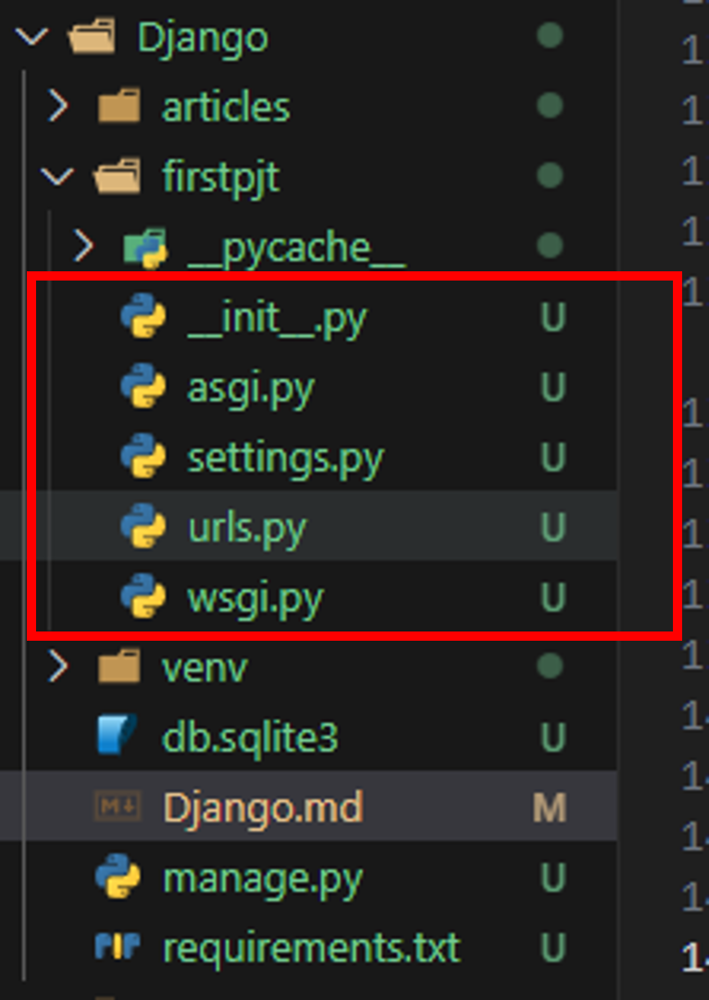
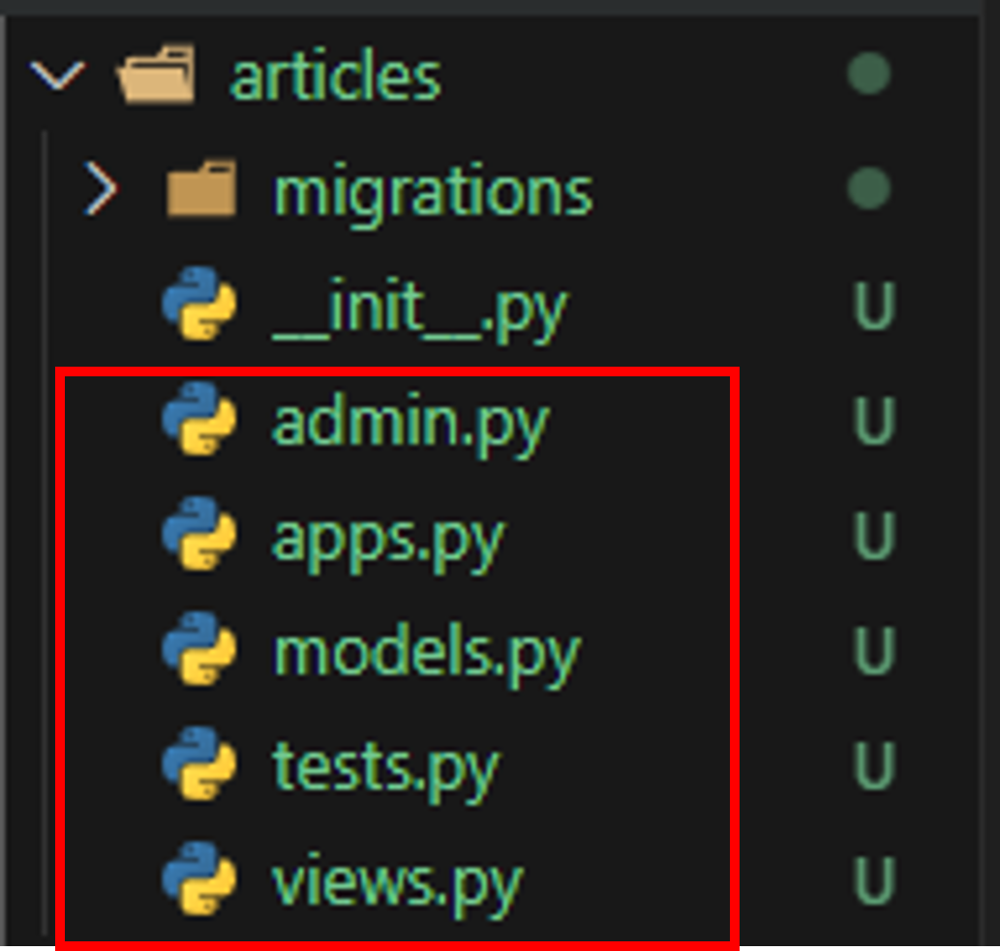
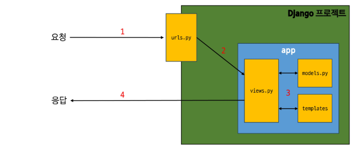
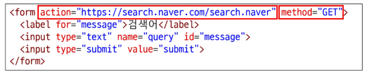
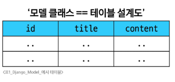
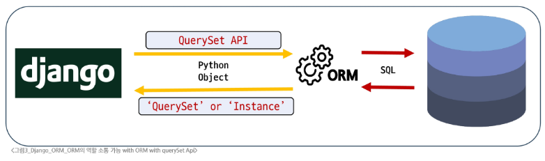
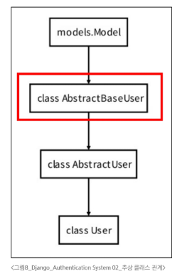
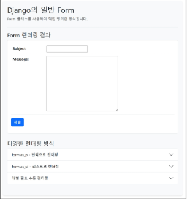
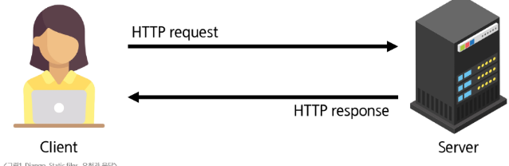
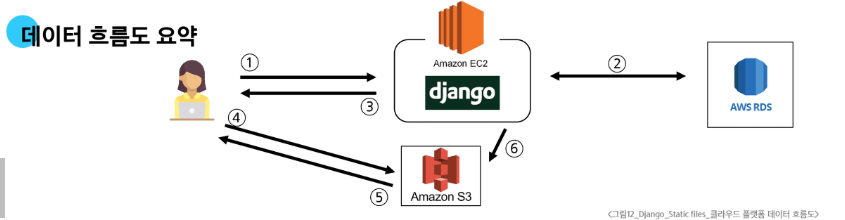

# 1. Web Application
## 1.1 클라이언트와 서버
- 웹의 동작 방식
  - 클라이언트: 서비스를 요청하는 주체
    - 사용자의 웹 브라우저, 모바일 앱
  - 서버: 클라이언트의 요청에 응답하는 주체
- 우리가 웹 페이지를 보게 되는 과정
  - 웹 브라우저(클라이언트)가 google.com 을 주소창에 입력하고 Enter
  - 문자열 주소를 DNS가 ip주소, 포트 번호로 바꿔 특정 서버에 request. header, body에 내 정보 담아 구글 서버에 특정 html을 달라고 요청
  - 구글 서버가 해당하는 html 파일을 응답
  - 클라이언트인 브라우저가 전달받은 html파일을 랜더링
## 1.2 Frontend & Backend
- 웹에서의 Frontend 와 Backend
  - Frontend
    - 사용자 인터페이스를 구성하고 사용자가 애플리케이션과 상호작용 할 수 있게 하는 sw개발을 하는 사람
    - HTML, CSS, JS 등을 담당.
  - Backend
    - 서버 측에서 동작하는, 클라이언트의 요청에 응답하는 SW개발을 하는 사람
    - 서버측 언어. node.js, java, python 등 백엔드 프레임워크, 데이터베이스 API 등등등 아무튼 많음.
# 2. Framework
## 2.1 Web Framework
- 웹 어플리케이션을 빠르게 개발 할 수 있도록 도와주는 도구
- 개발에 필요한 기본 구조와 규칙, 라이브러리들의 묶음
  - 로그인, 로그아웃, 회원관리 등 웹 페이지에 기본적으로 요구되는 기본 구조까지 제공
## 2.2 Django Framework
- 파이썬 기반의 대표적인 웹 프레임워크
- 장점
  - 다양성
    - 파이썬 기반으로 웹, 모바일 앱 백엔드, API서버 및 데이터 관리 등 광범위한 개발 적합
  - 
    - 대량의 데이터에 빠르고 유연한 대처 가능
  - 보안
    - 취약점으로부터 보호하는 보안 기능
  - 커뮤니티 지원
    - 개발자 지원, 업데이트, 문서 등 제공하는 활성화 커뮤니티

# 3. 가상 환경
- 하나의 컴퓨터 안에 또 다른 독립된 파이썬 환경
## 3.1 가상 환경 생성 및 활성화
- 3개 단계로 구성
  - 생성
    - 만들 위치에 가서 python -m venv venv(venv 이름의 가상환경을 생성하란 명령어. 뒤에꺼가 이름.)
    - 통상적으로 venv 라는 이름 씀 걍 이거 써
  - 활성화
    - 위치에 가서 source venv/Scripts/activate 입력
    - source: 리눅스 계열에서 스크립트 파일을 실행시키는 명령어
    - venv/Scripts/activate -> venv/Scripts 폴더의 activate 라는 스크립트 파일을 지정
    - 이건 윈도우 환경에서 venv 만들었을때 Scripts 폴더에 들어가는거고, 맥이나 유닉스 환경에선 bin으로 생성됨
  - 종료
    - deactivate 
## 3.2 의존성 패키지
- 의존성
  - 하나의 소프트웨어가 동작하기 위해 필요로 하는 다른 소프트웨어나 라이브러리
- 의존성 패키지
  - 프로젝트가 의존하는 "개별 라이브러리" 들을 가리키는 말
  - 프로젝트가 실행되기 위해 꼭 필요한 각각의 패키지
  - 1. 패키지 목록 확인
    - pip list
    - 현재 가상환경에 설치된 라이브러리 목록이 나옴
    - pip
      - python package installer 의 줄임말
      - 파이썬 패키지 관리하는 기본 도구인데 설치하면 같이 깔림.
  - 2. 의존성 기록
    - pip freeze > requirements.txt
    - 가상 환경에 설치된 모든 패키지를 버전과 함께 특정한 형식으로 출력
    - requirements.txt 도 묵시적 합의된 사항. 의존성 패키지 기록할땐 걍 저 이름 써야함.
## 3.3 의존성 패키지 기반 설치
- 다른 환경에서도 똑같이 패키지를 만들고 싶다면?
- 가상환경 만들기
```bash
$ pytion -m venv venv # 가상 환경 생성
$ source venv/Scripts/activate # 가상 환경 활성화
$ pip install -r requirements.txt -> # -r 저 텍스트 파일 읽어서 깔라는 명령어
# 이걸로 한방에 설치 가능 docker만들때도 사실상 이 과정을 자동화 해 주는거라고 보면 됨.
```
## 3.4 가상환경 주의사항
- 1. 가상 환경은 들어가고 나가고가 아니라 사용할 파이썬 환경을 on/off 하는 개념
  - 만약에 파이참으로 가상환경에 만든 프로젝트를 실행한다? 그 순간 실행되는 개념
  - 즉, 터미널 환경까지 완전히 독립된 영역으로 구성된다고 이해해야 함.
- 2. 프로젝트마다 별도의 가상 환경을 사용
  - 이제까진 그냥 글로벌에 패키지 설치해서 사용했지만 사실 현업이던 어디던 다 독립된 환경을 사용하는게 사실 당연함
- 3. 일반적으로 가상 환경 폴더 venv는 관련된 프로젝트와 동일한 경로에 위치시킴
- 4. venv는 .gitignore파일에 작성되어 원격 저장소에서 공유하지 않음
  - 가상 환경 덩치 생각보다 큼. 특히 의존성 관련 패키지들 깔리는 순간 수백메가, 기가 단위로 불어남
  - 따라서 requirement.txt로 가상 환경을 알아서 던짐
# 4. Django 프로젝트
## 4.1 프로젝트 생성 및 서버 실행
- pip install django
  - 버전 명시하지 않으면 최신판 깔림
- django-admin startproject firstpjt . 
  - firstpjt 라는 이름의 django 프로젝트가 생성됨
- python manage.py runserver
  - 파이썬으로 manage.py 을 실행.
  - 해당 파일 까보면 
```python
#!/usr/bin/env python
"""Django's command-line utility for administrative tasks."""
import os
import sys

def main():
    """Run administrative tasks."""
    os.environ.setdefault('DJANGO_SETTINGS_MODULE', 'firstpjt.settings')
    try:
        from django.core.management import execute_from_command_line
    except ImportError as exc:
        raise ImportError(
            "Couldn't import Django. Are you sure it's installed and "
            "available on your PYTHONPATH environment variable? Did you "
            "forget to activate a virtual environment?"
        ) from exc
    execute_from_command_line(sys.argv)

if __name__ == '__main__':
    main()
```
    - 이 있는데, 보면 실행하면 main 함수를 실행하게 되고
    - os.environ.setdefault('DJANGO_SETTINGS_MODULE', 'firstpjt.settings')
    - from django.core.management import execute_from_command_line
    - os.environ 에서 찍은 firtpjt.settings를 통해 연결된 장고 설정, 기동 파일에 접근
    - 장고가 설치된 경로 django/core/management/commands/의 디랙토리의 runserver.py를 찾아서 실행
# 5. Django Design Pattern
## 5.1 Design Pattern
- 소프트웨어 설계에서 반복적으로 발생하는 문제에 대한 검증되고 재사용 가능한 일반적인 해결책
  - 애플리캐에션의 구조는 이렇게 구성하자 <- 에 대한 모범 답안 또는 관행. 대표적인 디자인패턴은 MVC(Model, View, Controller)
- MVC 디자인 패턴
  - 대표적인 어플리케이션 구조화 패턴
  - Model
    - 데이터 및 비즈니스 로직을 처리
  - View
    - 사용자에게 보여지는 화면을 담당(api 등)
  - Controller
    - 사용자의 입력을 받아 model과 view를 제어 및 처리
  - 시각적 요소와 뒷쪽 로직을 분리해 독립적이고 쉽게 유지 보수 가능한 어플리케이션을 만들기 위함.
- MTV 디자인 패턴
  - Django 에서 이거 씀.
  - View -> Temlate
  - Controller -> View
  - 사실상 동일한 패턴이나 명칭이 좀 다름
## 5.2 프로젝트와 앱
- Django project
  - 어플리케이션의 집합
    - 프로젝트는 여러 어플리케이션의 집합으로 구성되는 개념
- Django Application
  - 독립적으로 작동하는 기능 단위 모듈
  - 각자 특정한 기능을 담당
  - 다른 앱들과 함께 하나의 프로젝트를 구성
- 예시. 온라인 커뮤니티를 만든다면?
  - 프로젝트 -> 온라인 커뮤니티
  - 앱 -> 게시글 등록, 댓글, 회원 관리 등
- 1. 앱 생성
  - python manage.py starapp articles
  - articles 라는 폴더와 함께 내부에 여러 파일이 새로 생성됨
  - 통상적으로 앱 이름은 복수형으로 권장
- 2. 앱 등록
  - 반드시 앱을 생성 한 후에 등록해야 함.
  - setting.py의 INTALLED_APPS 에 추가.
  - 반드시 생성 후 등록해야함. 등록 전 생성하면 존재하지 않는 앱 찾다가 실패하고 골아픔
## 5.3 프로젝트 및 앱 구조

- settings.py
  - 프로젝트의 모든 설정 관리
- urls.py
  - 요청 들어오는 url에 따라 이에 해당하는 views를 연결해줌
- __init.py__
  - 해당 폴더를 패키지로 인식하도록 설정하는 파일
- asgi.py
  - 비동기식 웹 서버와 연결 관련 설정
- wsgi
  - 웹 서버관련 설정
- manage.py
  - Django 프로젝트와 다양한 방법으로 상호 작용하는 커맨드라인 유틸리티


- admin.py
  - 관리자용 페이지 설정
- models.py
  - db와 관련된 model을 정의
  - MTV 패턴의 M
- views.py
  - HTTP 요청을 처리하고 해당 요청에 대한 응답을 반환
    - url, model, template과 연동
    - MTV 패턴의 V(컨트롤러에 해당)
- apps.py
  - 앱의 정보가 작성된 곳
- tests.py
  - 프로젝트 테스트 코드를 작성하는 곳
# 6. 요청과 응답

아까 만든 로켓 페이지에서 articles라는 요청에 수행하는걸 만들어 보자.
- 1. urls에 만약 127.0.0.1:8000/articles/ 라는 요청이 들어오면?
  - request객체를 views 모듈의 index view 함수에 전달하며 호출하도록 구성
```python
# ..firstpjt/urls.py
from django.contrib import admin
from django.urls import path
from articles import views # urls에 articles 모듈을 추가

urlpatterns = [
    path('admin/', admin.site.urls),
    path('articles/', views.index), # 경로 추가. 반드시 슬래쉬로 끝낼 것. views.index로 연결시킴
]
```
- 2. view 설정
  - 컨트롤러에 해당하는 view함수는 특정 경로에 있는 temlpate 과 request 객체를 결합해 응답 객체를 반환
```python
# ..articles/views.py
from django.shortcuts import render

# Create your views here.
def index(request):
    return render(request, 'articles/index.html')
# 위에서 urls.py에서 articles 패키지(우리가 만드는건 앱) 에서 views 라는 모듈을 추가했고
# path함수의 인자로 ('articles/') 라는 경로명, views.index라는 파이썬 모듈과 함수 이름을 찍은 것. 
# 지금 만든 파일에 방금 index 라는 함수를 만든거. 이제 우리 서버에 articles/라는 url 형태의 요청이 들어오면 articles 어플리케이션의 views.py의 index 함수에 의해 index.html 이 날라갈거임.
```
# 6.1 Django에서의 요청과 응답

# 1. Template System
## 1.1 Django Template system
- 파이썬 데이터를 HTML 문서와 결합하여 로직과 표현을 분리한 채 동적인 웹페이지를 생성하는 도구
- 빨간 상자의 내용을 변수에 따라 바뀌게 하기 위해선?
```python
# views.py
def index(request):
  context = {
    'name':'Jane'
  }
  return render(request, 'articles/index.html', context) #rander 함수에 이 3개 인자를 던지면
```
```html
<!-- articles/index.html-->
<body>
  <h1>Hello, {{name}}!</h1>
</body>
하게 되면 동적 웹을 처음으로 만들 수 있는 것
```
## 1.2 Django Template Language
Temlpate에서 조건, 반복, 변수 등의 프로그래밍적 기능을 제공하는 시스템
- DTL Syntax
  - Variable
  - Filters
  - Tags
  - Comments
- 1. Variable
  - Django Template 에서 변수 역할
  - render 함수의 세번째 인자로 딕셔너리 타입이 전달됨
  - 해당 딕셔너리 Key에 해당하는 문자열이 template에서 사용 가능한 변수명이 됨
  - dot.을 사용하여 변수 속성에 접근할 수 있음.
```html
{{value1}}<!-- 10 출력 -->
{{value2.value3}}  <!-- 20 출력 -->
```
```python
context = {
  'value1':10,
  'value2' : {
    'value3':20,
  },
}

```
- 2. Filters
  - 표시할 변수를 수정할 때 사용(변수 + '|' + 필터)
  - chained(연결)이 가능하며 일부 필터는 인자를 받기도 함
  - 약 60개의 built-in template filters 를 제공
```html
{{variable | filter}}
{{name|truncatewords:30}}
``` 
- 3. Tags
  - 반복 또는 논리를 수행하여 제어 흐름을 만듬
  - 일부 태그는 시작과 종료가 필요
  - 약 24개의 built-in template tags를 제공
```html

 
```
```python
# if 예시
context1 = {
  'login': False
}
# for 예시
context2 = {
  'nums' : [1, 2, 3]
}
```

```html

  <h1>로그인 성공</h1>

  <h1>로그인 하세요</h1>
<% endif %>
```

- 4.comments 주석
- inline <h1>{# name #}</h1> #으로 주석 처리
- multiline
- 
- """"
- 
# 2. 템플릿 상속
- 기본 템플릿 구조의 한계
  - 만약 모든 템플릿에 btstrap을 적용하려면?
  - 모든 템플릿에 cnd를 작성해야 하나?
- 템플릿 상속
  - 1. 페이지의 공통요소를 포함
  - 2. 하위 템플릿이 재정의 할 수 있는 공간을 정의
  - 여러 템플릿이 공통요소를 공유할 수 있게 해 주는 기능
- 상속 구조 만ㄷ르기
  - skeleton 역할을 하게 되는 상위 템플릿 (base.html)작성
    - 모든 템플릿이 공유했으면 좋겠는 공통요소를 작성
    - 템플릿 별로 재정의할 부분은 block 태그를 활용
```html
<!-- base.html -->
<body>
   <!-- 다른 템플릿에서 재정의 할 수 있게 해주는 공간-->
  
</body>
<!--dinner.html-->
{% extends "articles/base.html"}

    <h1>무차스 그라시아스{{name}}<h1>

```
이렇게 하면 base에 정의된 속성까지 다 가져올 수 있음. footer, navbar 같은거 한방에 들고오기 가능.
## 2.1 상속 관련 DTL 태그

- 자식 템플릿이 부모 템플릿을 확장한다는 것을 알림
- 반드시 자식 템플릿 최상단에 작성되어야 한다
  - 한번에 2개 이상 못씀. 하나만

    <h1>무차스 그라시아스{{name}}<h1>

- 하위 템플릿에서 재정의 할 수 있는 블록을 정의
- 상위 템플릿에서 작성하며 하위 템플릿이 작성할 수 있는 공간을 지정하는 것.
# 3. 요청과 응답
## 3.1 HTML form 
- 데이터를 보내고 가져오기
  - Sending and Retrieving form data
  - HTML form element를 통해 사용자와 애플리케이션 간의 상호작용 이해하기
- form element 요소
  - 사용자로부터 할당된 데이터를 서버로 전송하는 HTML 요소
  - 웹에서 사용자 정보를 입력하는 여러 방식
  - (text, password, checkbox 등) 여러 방법을 제공함
```HTML


<form action="https://search.naver.com/search.naver" method="GET">
<!-- 위에 처럼 form action 부분에 네이버 검색 쿼리 부분을 넣으면 됨./-->
    <label for="message">검색어</label>
    <input type="text" name="query" id="message">
    <input type="submit" value="submit">
</form>

```
위 코드 실행하면
https://search.naver.com/search.naver?query=검색어
라는 쿼리가 날아가게 됨.
- 위에서 input 2번줄에 있는 name -> 이게 중요. 이거 가지고 검색어 날아가게 됨.
- 검색 되는 이유는 네이버 저 url 요청에서 검색어에 해당하는 부분이 query 임. 
- 네이버 주소 원본을 검색해서 보면
- https://search.naver.com/search.naver?where=nexearch&sm=top_hty&fbm=0&ie=utf8&query=rkskek&ackey=3cmln11l
- 잘 보면 &로 key&value 쌍으로 엮여서 있게 됨. 그러면 우리도 똑같이 기본 주소 + 키값 찾아서 요청 날리면 똑같아짐.
# 4. HTML form 핵심 속성
- action & method 
  - 데이터를 어디(action)로 어떤 방식(method) 으로 요청할지

  - action
    - 입력 데이터가 어디로 갈지, 전송될 url을 지정(목적지)
    - action을 지정하지 않으면 데이터는 현재 페이지의 url로 설정됨
  - method
    - 데이터를 어떤 방식으로 보낼 것인지 정의
    - 데이터를 http request method(GET, POST)를 지정
  - input element
    - 사용자의 데이터를 입력받을 수 있는 html 요소
    - type 속성 값에 따라 다양한 유형의 입력 데이터를 받음
      - **핵심 속성: name**
```html
<input type="text" name = "query" id = "message"> 에서 name
```
  - input 요소의 핵심 속성
  - 사용자가 입력한 데이터에 붙이는 이름(key)
  - 데이터를 제출했을 때 서버는 name 속성에 설정된 값을 통해서만 사용자가 입력한 데이터에 접근할 수 있음.
- Query String Parameters
  - 사용자의 입력 데이터를 URL주소에 파라미터를 통해 서버로 보내는 방법
  - 문자열은 &로 연결된 key=value쌍으로 구성되며 기본 URL은 물음표로 구분됨
  - 예시
    - http:\\host:port\path?**key=value**&**key=value**
# 5. HTML form 활용
- 사용자에게 입력받아 출력하는 서버 만들기
- 1. throw 함수
- 2. catch 함수
```python
def throw(request):
    return render(request, 'articles/throw.html')

def catch(request):
    message = request.GET.get('message') # request 객체에 넘어온 get을 잡아온거
    context = {
        'message': message,
    }
    return render(request, 'articles/catch.html', context)
```
```html
<h1>Throw</h1>
<form action="/catch/" method="GET">
    <input type="text" id="message" name="message">
    <input type="submit">
</form>

```
- 아래 html에서 message : [form의 textbox에 있던 문자열] 의 딕셔너리 타입을 request 에 들어가게 됨. 
- 그러면 catch.py에선 request.GET <- 이게 딕셔너리임. 여기서 .get을 통해서 key값이 message 라는 키를 가진 값을 가져옴
# 6. Django 의 URL
- 요청과 응답에서 Django URLs의 역할은 요청에 따라 실행될 view 함수가 달라짐.
- URL dispatcher
  - URL 패턴을 정의하고 해당 패턴이 잋리하는 요청을 처리할 view 함수를 연결
# 7. Variable Routing
- 현재 URL 관리의 문제. 
  - 템플릿의 많은 부분이 중복, URL의 일부만 변경된다면?
```python
urlpatterns = [
  path('articles'/1/),
  path('articles'/2/),
  path('articles'/3/),
  path('articles'/4/),
  path('articles'/5/),
]

```
- Variable Routing
  - URL 일부에 변수를 포함시키는 것
    - 변수는 view 함수의 인자로 전달할 수 있음,
```python
urlpatterns = [
  path('articles'/<int:num>/),
]
```
<path_converter:variable_name>
- 요청 URL의 <int:num>, <str:num> 의 위치에 들어있는 값이 변수처럼 취급됨
  - 정수 num변수가 views.detail에, 문자열 name변수가 views.greeting 에 키워드 인자로 전달됨
  - 예) request url: /articles/**10**/ 일 때, views.deatil(request, num=10) 형태로 호출
- Path Converter
  - URL 변수의 타입을 지정
  - str, int 등 5개 타입 지원

# 8. App URL mapping
## 8.1 App URL mapping
- 각 앱에 URL을 정의하는 것
  - 프로젝트와 앱이 URL을 나누어 관리를 편하게 하기 위함
  - 현재는 앱이 1개지만, 앞으로 앱이 늘어나면 서로 다른 앱들의 URL들이 섞이지 않도록 나누어 관리하는 방법
  - 각각의 어플리케이션에 개별로 urls.py를 지정
  - 그리고 프로젝트 대표 urls에서 mapping
```python
# myfirstpjt/urls.py

from django.contrib import admin
from django.urls import path, include # include 메서드 추가

urlpatterns = [
    path('admin/', admin.site.urls),
    path('articles/', include('articles.urls')) # 이걸 통해서 매핑
]
```
  - 그리고 앱별 urls.py 파일 만들어 별도 관리

```python
# articles/urls.py

from django.urls import path
from . import views

urlpatterns = [
    path('<int:num>/', views.detail),
    path('dinner/', views.dinner),
    path('search/', views.search),
    path('throw/', views.throw),
    path('catch/', views.catch),
]
# 대신 주소는 무적권 articles/ 로 출발. 아까처럼 
# 메인 프로젝트에 직접 달아두면 8000/dinner 이였지만 이젠 articles/dinner 로 변경

```

# 9. URL 이름 지정
- URL 구조 변경에 따른 문제점.
  - 하이퍼링크를 달 때 주소 단위로 지정하면 뭐 바뀔때마다 하나 하나 다 봐야함.
  - 그럴땐 URL에 name 속성을 부여해서 관리하는게 가능.
```python
urlpatterns = [
  path('dinner/', views.dinner, name='dinner')
]

```
```html
<a href="/dinner/">dinner</a> 
<!-- 에서-->
<a href= "">dinner</a> 로 퉁치기 가능
```
# 1. Django Model
- 데이터베이스와 python 클래스(객체)로 추상화된 형태로 상호작용
  - Django의 강력한 기능: 개발자가 데이터베이스에 대한 깊은 지식 없이도 쉽게 데이터 관리 가능
  - 유지보수 및 확장성 증대: 데이터베이스 변경 시에도 코드 수정 최소화, 재사용 가능한 데이터 모델을 통해 개발 효율성 증대
- Model을 통한 DB관리
  - urls.py: 사용자 요청의 시작점
  - views.py: 요청을 처리하고, models.py를 통해 데이터를 다룸
  - models.py: 데이터베이스를 정의하고, 데이터베이스와 상호작용
  - templates: views.py 로 부터 받은 데이터를 사용자에게 보여줄 화면을 구성
## 1.1 Model Class
- Model Class는 데이터베이스 테이블의 구조를 설계하는 청사진 역할을 함.
- 어떤 데이터를 저장할지, 그 데이터의 형태는 어떠할지 등을 파이썬 코드로 명확히 정의
모델 클래스를 정의해보자
```python
from django.db import models

class Article(models.Model):
    title = models.CharField(max_length=10)
    content = models.TextField()
# 이 코드는 DB에 아래와 같은 테이블 구조를 만들게 됨
```

- 코드 뜯어보기
```python
class Article(models.Model): 
  # Django.db.models 모듈의 Model이라는 부모 클래스를 상속받음
  # 이걸 상속받음을 토대로 복잡한거 하나 할거 없이 그냥 바로 스키마 만들 수 있음.
  title = models.CharField(max_length=10)
  # 테이블 이름 = 컬럼타입(글자타입, 최대길이 10)
  content = models.TextField()
  # 테이블 이름 = 컬럼타입(문자열 필드)
"""
즉 이렇게 선언하면 
CREATE TABLE Article title char... 이거 안해도 됨
동시에 컬럼 맵핑도 되기 때문에 코딩 하면서 수동으로 매칭 안시켜도 됨.
"""
```
# 2. Model Field
- Model Field
  - DB 테이블의 필드(열) 정의
  - 데이터 타입 및 제약조건 명시
- 1. Field types(필드 유형)
  - title = models.**CharField**(max_length=10)
  - DB에 저장될 데이터의 종류를 정의
  - 주요 필드 유형
    - 문자: CharField, TextField 등등등
    - 숫자: IntegerField, FloatField
    - 날짜: DateField ...
    - 엄청많음. 찾아보면서 해야함
- 2. Field options(필드 옵션)
  - title = models.CharField(**max_length=10**)
  - 필드의 동작과 제약조건을 정의
  - 주요 필드 옵션
    - null, blank, default 등등등
# 3. Migrations
- model 클래스의 변경사항(필드 생성, 수정 삭제 등)을 DB에 반영하는 방법
- 모든 변경사항이 코드로 관리되어 협업 시 모델 변경 내역에 대한 추적과 공유가 쉽다.
- 모델 정의부터 마이그레이션 파일 생성가지
- 1. 모델 클래스 작성 및 수정
  - Django 에서는 Python 클래스로 정의
```python
# articles/models.py
class Article(models.Model):
    title = models.CharField(max_length=10)
    content = models.TextField()
```
- 2. 마이그레이션 파일 생성 명령어를 통해 마이그레이션 파일 만들기
```bash
$ python manage.py makemigrations

Migrations for 'articles':
  articles/migrations/001_initial.py
    + Create model Article
```
- 3. 생성된 최종 설계도(마이그레이션 파일)을 DB에 반영하기
  - 2단계에서 생성된 0001_inital.py 는 변경사항이 기록된 파이썬 코드
  - 이걸 bash 명령어를 통해 실행시켜 DB에 반영시켜야 한다.
```bash
$ python manage.py migrate
```
- Migration 핵?심 명령어
```bash
$ python manage.py makemigrations
$ python manage.py migrate
```
## 3.1 추가 Migrationss
- 이미 생성된 테이블에 추가해야 한다면? 
  - 마찬가지로 간단하게 추가 가능
1. models.py 파일 수정
```python
# articles/models.py
class Article(models.Model):
    title = models.CharField(max_length=10)
    content = models.TextField()
    # 새로운 컬럼 추가
    create_at = models.DateTimeField(auto_now_add=True)
    # 자동으로 현재 날짜 시간을 기본값으로 저장하는 데이터 필드를 추가(처음 생성될 때 만)
    update_at = models.DateTimeField(auto_now=True)
```
2. makemigrations 명령어 입력과 기존 필드 처리
```bash
$ python manage.py makemigrations
```
  - 문제는 지금 기존 데이터들. 저 필드 없을때 생성된 데이터들은 어쩔지를 물어볼거임
  It is impossible to add the field 'create_at' with 'auto_now_add = True' to article without providing a default. This is because the database needs something to pupulate existing rows.
  1) Provide a one-off default now which will be set on all existing rows
  // 우리가 알아서 대충 값 때려넣을까?
  2) Quit and manually define a default value in models.py
  // 수동으로 models.py에 너가 정의해줄래?
  Select an option: 
  1번 고르면 알아서 해줌. 그냥 지금 날짜값 밀어넣을듯.

3. 추가 모델 필드 작성
- migrations 과정 종류 후 두번쨰 migration 파일이 생성됨을 확인
- 이처럼 Django 는 설계도를 쌓아가면서 추후 문제가 생겼을 시 복구하거나 되돌릴 수 있도록 함.

# 4. Admin Site
- 추가 설정 없이 장고가 자동으로 제공하는 관리자 인터페이스
  - CRUD 작업 가능. 
  - 프로토타이핑 빠르게, 비개발자 데이터 관리, 내부 시스템 구축에 이상
만들어보기

1. 터미널에서 슈퍼유저 생성 명령어 입력 
   1. python manage.py createsuperuser
2. 정보 입력
   1. username: 아이디
   2. email address: 선택사항이라 엔터 쳐서 넘기기 가능
   3. pw: 비밀번호
3. 관리자 인터페이스 접근
   1. 서버 실행한 후 admin/으로 접근
4. 모델이 안보임 -> 넣어줘야 함.
```python
# firstpjt/articles/admin.py
from django.contrib import admin
from .models import Article # 아까 만든 모델인 Article 클래스를 import

admin.site.register(Article) # admin 클래스의 site.register 함수에 Article 이란 객체를 넘겨줌 이러면 등록됨
```
# 5. 참고
## 5.1 데이터베이스 초기화
## 5.2 Migration 관련
## 5.3 SQLite


# 1. ORM
- 객체 지향 프로그래밍 언어의 객체(Object)와 데이터베이스의 데이터를 Mapping 하는 기술
  - django에서 사용하는 파이썬 코드로 SQL문을 대신 만들고 실행하고 관리해줌
# 2. QuerySet API
- 데이터베이스의 복잡한 SQL쿼리문을 직관적인 파이썬 코드로 다룰 수 있게 하는 번역기
- QuerySet API와 ORM의 동작 방식
  - 1. Django -> DB: Django(QuerySet API) 에서 ORM을 통해 데이터베이스로 정보를 요청할 때
    - SQL 쿼리로 변환되어 데이터베이스로 전달됨
  - 2. DB -> Django: 데이터베이스가 요청에 대한 응답을 보낼 때
    - ORM은 이 SQL결과를 다시 파이썬이 이해할 수 있는 Python Object
    - QuerySet 또는 Instance형태로 변환하여 Django로 반환

- QuerySet API 구문 기본 구조
### Article.objects.all()
| Article                                | object                                               | all()                                      |
| -------------------------------------- | ---------------------------------------------------- | ------------------------------------------ |
| 모델 클래스                            | 매니저                                               | QuerySet API 메서드                        |
| 데이터베이스 테이블에 대한 Python 표현 | 데이터베이스 조회(Query)작업을 위한 기본 인터페이스. | 특정 데이터베이서에서 작업을 수행하는 명령 | 테이블의 스키마(필드, 데이터 타입)을 정의하며 Django ORM이 데이터베이스와 상호작용할때 기본적인 구조체 | 매니저를 통해 호출되는 메서드로 조건문에 해당하는 부분 |
- Query란?
  - 데이터베이스에 특정한 데이터에 대한 행동을 요구하는 요청
  - 쿼리문을 작성한다
    - 원하는 데이터를 얻기 위해 데이터베이스에 요청을 보낼 코드를 작성한다
  - Django 가 Query 처리하는 과정 정리
    - 파이썬 코드 -> ORM: 개발자의 QS API가 ORM으로 전달
    - ORM -> SQL 변환: ORM이 데이터베이스용 SQL 문으로 변환해 데이터베이스에 전달
    - DB 응답 -> ORM: 데이터베이스가 SQL쿼리를 처리하고 결과 데이터를 ORM에 반환
    - ORM -> QS API변환: ORM이 데이터베이스 결과를 QS(파이썬 객체)형태로 변환하여 전달
- QuerySet이란?
  - 데이터베이스에서 전달받은 객체 목록(데이터 모음)
  - 순회 가능한 데이터 객체로 1개 이상의 레코드가 저장되어 사용됨
  - Django ORM을 통해 만들어진 자료형
  - 단, 데이터베이스가 단일 객체를 반환할 때는 QS가 아닌 class의 인스턴스로 반환됨
  - 예를 들어 SELECT TOP 50 FROM TABLE 이란 쿼리문이 결과라면
    - 실제로 50개 레코드 받아와서 리스트에 50개 넣지 않고
    - FOR 같은 순회문 안에서 호출되어서야 실행함
      - 당연히 50개를 쪼개서 실행하지 않음. 
```python
# SELECT * FROM Article 이란 쿼리문
books = Article.objects.all() # 쿼리문만 만들어서 들고 있음.
for book in books: # 아직까지 데이터 없음. 쿼리문만 들고 있음
# 첫 번째 book에 대해서 요청하는 순간
# 저 쿼리문이 한방에 다 넘어감. SELECT * FROM Article
  print(book)# 처음으로 book이 호출될 때 해당하는 모든 객체가 books 에 저장됨.
```
# 3. QuerySet API 실습
# Django Shell
  - Django 프로젝트의 코드를 명령창에서 바로 실행하고 테스트 하는 환경
  - QuerySet API 명령어는 일반 파이썬 shell 에서 먹히지 않음.
## 3.1 Create
- 데이터를 만드는 3가지 방법
- 1. 빈 객체 생성 후 값 할당
```python
article = Article() # Article 이란 클래스의 인스턴스 article 을 생성
article.title = 'first' # 인스턴스 변수의 속성 title에 first 라는 값을 할당
article.content = 'django!' 
article.save() # 이걸 해야 DB에 저장됨. 안하면 그냥 파이썬에만 객체가 있고 db에 생기지 않음.
# 이렇게 하면 저장되고 아래는 저장 확인하는 코드
article.id # 1 
article.pk # 1 
Article.objects.all() # <QuerySet [Article: Article object (1)]
```
- 2. 초기 값과 함께 객체 생성 및 저장
```python
article_1 = Article(title="second", content='django!')
# 그냥 파이썬에만 article_1 이란 인스턴스만 생성된거. 대신 init 에 값을 넣어 던진만큼 객체에 값은 들어가있음.
article_1.save() # 이걸 해야 쿼리문 날라가서 db에도 저장
article_1 # <Article: Article object (2)>
# 즉 save 하고 난 후에 return 되는 값들은 쿼리의 결과임
```
- 3. create() 메서드로 한번에 생성 및 저장
```python
# 별도 인스턴스 할 것도 없이 object 라는 클래스 변수인데, 여기는 자동으로 Manager()라는 클래스의 인스턴스로 할당됨. manager.create메서드 호출해 바로 데이터 저장 및 갱신
Article.object.create(title="thrid", context="django")
# save 안해도 됨
```
## 3.2 Read
- 대표적인 조회 메서드
  - QuerySet반환 메서드
    - all()
      - 전체 데이터 조회
      - Article.objects.all()
      - SELECT * FROM Article
    - filter()
      - 이게 WHERE이랑 SELECT 에 해당하는 부분
      - QuerySet 객체를 반환함
        - 왜? 몇개일지 모름. 한개면 그냥 인스턴스 찍겠는데 이건 실행시켜봐야 넘어오는 레코드의 수를 알 수 있음.
```python
Article.objects.filter(content='django')
# SELECT * FROM Article WHERE content = "django"
Article.objects.filter(title="abc")
# SELECT * FROM Article WHERE title = "abc"
```
  - QuerySet을 반환하지 않는 메서드
    - get()
      - 주어진 매개변수와 일치하는 하나의 레코드를 찾아 **객체** 형태로 반환
```python
Article.objects.get(pk=1) 
# 이건 pk번호로 조회하는거라 하나가 걸려나옴 정상. 근데 만약 pk가 저거랑 다르면 조회 안됨. pk로 선택한 열의 값 기준으로 값을 잡아와야 함.
Article.objects.get(pk=100)
# 없는거라 DoseNotExis: Article matching query does not exist 에러
Article.objects.get(content='django')
# 한개가 아니면
# MultipleObjectsREturned: get() returned more than one Article -- it returned 2!
```
## 3.3 Update
- 인스턴스 변수를 변경 후 save 호출
```python
target_object = Article.object.get(pk = 1)
# target_object 에 pk 1번인거 불러옴
target_object.title = "test test test "
target_object.save()
```
## 3.4 Delete
- 삭제 대상인 레코드를 object 로 잡아와 삭제
```python

delete_target = Article.objects.get(pk=2)
# 꼭 객체로 안해도 됨
delete_targets = Article.object.filter(content = "Django")
delete_targets.delete()
```
# 4. ORM with view
- View 서 Query Set API 쓰기
  - html 만들 때 DB에 있는 값을 뽑아다가 뿌려서 만들 수 있음
  - 그냥 똑같음. 데이터 빼오는 객체 만들어서 데이터 빼오고, 그 객체를 views에서 return 으로 넘김
# 5. 참고
## 5.1 Field lookups
- like 검색
  - Article.objects.filter(title__startswith='second') startwith 가 like /*이런거랑 비슷한거
  - 여러가지 있음 공식 문서 찾아보면서 쓰면 됨.
## 5.2 ORM, QuerySet API를 사용하는 이유
1. 데이터베이스 추상화
   1. 데이터베이스 시스템에 종속되지 않고 일관된 방식으로 데이터를 다룰 수 있다는데 잘 모르겠음.
   2. 생산성 향상
      1. 테이블 이름이랑 수동 매칭 안하고 고민할게 없어지니 편하긴 해
   3. 객체 지향적 접근


# 1. Read
- 2 가지 Read 실습
1. 단일 게시글 조회`
```python
# articles/urls.py
from django.urls import path
from . import views
app_name = 'articles'
urlpatterns = [
    path('<int:pk>/', views.detail, name='detail'), # 이 부분 추가
    # int 형태의 pk 값을 인자로 사용해서 views.detail 에 던져라

# articles/views.py
def detail(request, pk):
  article = Article.objects.get(pk=pk) # orm 써서 데이터 빼와라. 이건 get이라 객체단위로 하나 잡아옴
  context = {
    'article':article,
  }
  return render(request, 'articles/detail.html', context)
]
```
```html


<h1>디테일</h1>
<h3> {{article.pk}} 번째 글 </h3>
<hr>
<p> 제목: {{article.title}} </p> <!-- context 로 던진 article 값이 여기서 돌아감.-->
<p> 내용: {{article.content}} </p>
<p> 작성일: {{article.create_at}} </p>
<p> 수정일: {{article.update_at}} </p>
<hr>
<a href="">[뒤로가기]</a>

```
전체 글 목록에서 단일 페이지로 이동하는 href 추가하기
```html


<h2>글 목록</h2>
<hr>

    <p>글 번호: {{paper.pk}}</p>
    <a href="">글 제목: {{ paper.title }}</a>
    <p>글 내용: {{paper.content}}</p>
    <hr>


```
# 2. Create
- create 로직을 구현하기 위한 순서는?
- 1. 사용자 입력을 받을 페이지를 주고(랜더링 해 주고)
- 2. 사용자가 입력한 요청 데이터를 받아서 db에 저장
  - 결론적으로 2개의 view 함수가 필요함
```python
# articles/urls.py
urlpatterns = [
  # 이거 추가
  path('create/', views.create, name='create'),
]
# articles/views.py
def create(request):
  # 아까 new form의 submit 의 action 의 결과를 create 함수 호출 형태로 구현할 것임.
  # 이 때, request 객체에 이전 new.html 페이지에 있던 form 의 데이터 값들이 request 에 담겨서 날라옴
  # 여기서 거기 안에 인자들 찾아서 create 동작 수
  title = request.GET.get('title')
  content = request.GET.get('content')
  Article.objects.create(title=title, content=content)
  return render(request, 'articles/create.html')
```
```html
<!-- articles/new.html-->
 <form action="" method="GET"> 
  <!-- form에 action 대상에 연결-->
```
# 3. HTTP request methods
## 3.1 HTTP
- 인터넷상에서 데이터(리소스)를 주고받기 위한 약속
- HTTP request methods란?
  - 데이터에 대해 수행을 원하는 작업(행동)을 나타내는 것
  - 대표적인 메서드
    - GET 
      - 리소스 조회
        - url에 데이터가 노출됨
        - 캐싱
    - POST
      - 데이터 생성/전송
        - 요청 본문에 데이터
        - 데이터 노출 없음
## 3.2 GET method
- GET Method: 서버로부터 데이터를 요청하고 받아오는데 사용(조회)
  - 주로 검색 쿼리 전송, 웹 페이지 요청, API에서 데이터를 조회하는 것과 같이 서버로부터 **데이터를 요청** 하고 받아오는데 사용됨
- GET Method 특징
  - 1. 데이터 전송
    - URL의 쿼리 문자열(Query String)을 통해 데이터를 전송
    - http://127.0.0.1:8000/articles/crate/?**title=제목&content=내용**
  - 2. 데이터 길이 제한
    - URL길이에 제한이 있어 대량의 데이터 전송에는 부적합 -> 
      - 이거 옛말이긴 함. base64로 인코딩해서 수천, 수만자 단위, 이미지 등등 던지는데 문제 없음.
  - 3. 브라우저 히스토리
    - 요청 URL이 브라우저 히스토리에 남음
  - 4. 캐싱
    - 브라우저는 GET 요청의 응답을 로컬에 저장할 수 있음
    - 동일한 URL로 다시 요청할 때, 서버에 접속하지 않고 저장된 결과를 사용
    - 페이지 로딩 시간을 크게 단축
## 3.3 POST method
- POST Method: 서버에 데이터를 제출하여 리소스를 변경(생성, 수정, 삭제)하는데 사용
  - POST는 주로 **로그인 정보 제출, 파일 업로드, 새 데이터 생성** 그리고 api에서 데이터 변경을 요청하는 것과 같이 클라이언트가 서버로 데이터를 전송하여 서버의 상태를 변경하고자 할 때 사용.
- POST Method 특징
  - 1. 데이터 전송
    - HTTP Body를 통해 데이터를 전송
  - 2. 데이터 제한
    - GET에 비해 많은 양 전송 가능
  - 3. 브라우저 히스토리
    - POST는 따로 안남음
  - 4. 캐싱
    - POST 요청은 기본적으로 캐시 할 수 없음
    - POST는 서버에 상태를 바꾸는건데 어케 캐싱함.
## 3.4 Post method 변경
- 아까 만든 Create 는 GET 보단 POST 가 맞는 행동임
  - new.html form 요청은 새로운 데이터 생성을 요청하는 동작인만큼 get보단 post 가 맞음.
```html
<!-- articles/new.html-->
 <form action="" method="POST"> 
  <!-- method GET->POST로 변경->
```
```python
def create(request):
    title = request.POST.get('title') # GET -> POST 로 변경
    content = request.POST.get('content') # GET -> POST 로 변경
    Article.objects.create(title=title, content=content)
    return render(request, 'articles/create.html')
```
이렇게 하면 Forbidden 에러남
# 4. HTTP response status code
- 403 Forbidden 응답의 의미
  - 서버에 요청이 전달되었지만 권한 때문에 거절되었다.
  - CSRF cookie not set 이란 내용이 나옴
# 4.1 CSRF
- cross-site-request-forgery 사이트간 요청 위조
  - 사용자가 자신의 의지와는 무관하게 공격자가 의도한 행동(글쓰기, 정보 수정 등)을 특정 웹사이트에 요청하게 만든 해킹 방식
  - CSRF(위조된 인감)
  - 1. 신뢰할 수 있는 관계(로그인)
      - 내가 특정 페이지에 로그인하면 서버에서 로그인세션을 열어서 세션아이디를 발급해줌.(인감도장 발행)
  - 2. 악성 위임장(악성 링크)
    - 피싱 링크를 통해 세션아이디를 탈취하고 이걸로 내 돈을 털어가는 요청을 만들어서 날림
  - 3. 은행이 바보라서 돈 날라감 
    - 왜? 맞는 세션 아이디잖아?
- CSRF 공격 방어법
  - Django는 이런 공격을 막기 위해 CSFR 토큰이란 안전장치를 사용함
  - 모든 중요한 요청에 대해 "내가 직접 보낸 요청이 맞다"는 의미의 일회용 비밀 코드를 함께 보냄
- 토큰 보내는걸로 보안이 되는 이유?
  - 토큰을 해당 HTML 파일에서 발행하도록 시켰기 때문.
  - 다른 HTML파일에서 세션아이디만 탈취해서 하면 이 토큰이 빠짐
  - 따라서 의도한 페이지(서버가 제공한)에서 발생한 요청에 대해서만 응답하게 하는 기본적인 구조를 만들 수 있음.
  - 그래서 동작을 구분해서 구현하는게 중요. GET으로도 아까 보듯 DB 조작이 가능함
  - 왜냐면 GET이란게 진짜 뭐가 있는게 아니라 단순 태그에 불과하기 때문.
# 5. Redirect
- 현재 문제 상황: 게시글 작성 후 응답 방식
  - 현재 서비스는 post 후 게시글이 성공적으로 작성되었단 메세지를 직접 반환함. 게시글 저장 후 페이지를 응답하는건 적절한 post 응답이 아님.
  - 이는 후속 행동(새로고침, 뒤로가기) 에서 예기치 않은 상황이 발생할 수 있음.
  - 그래서 적절한 기존 페이지로 보내야 함. 응답이 아니라 사용자가 알아서 다른 사이트로 get 요청을 서버에 던지게 해야한다는 것.
- redurect() 클라이언트가 인자에 작성된 주소로 다시 요청을 보내도록 하는 함수
```python
# articles/views.py
from django.shortcuts import render, redirect # 이거 추가한거

def create(request):
  ...
  return redirect('articles:detail', article.pk) # 
  # 기존에는 create.html로 응답하게 했는데 그냥 이젠 새로 작성한 페이지로 바로 리다이랙트 되도록 수정한거.
  # 그러면 render 로 구현하는거랑 차이가 뭐냐? 주체가 다름
  # render -> 서버가 특정 페이지를 로딩 하게 하는것. 
  # redirect -> 클라이언트에게 articles:detail, article.pk라는 요청을 서버에 보내라고 하는것.
  # 즉, 이 후속동작으로 클라이언트의 행동을 강제하는것. 

```
# 6. Delete
- 이것도 마찬가지로 POST로 구현
```python
# articles/urls.py
urlpatterns = [
  ...
  path('<int:pk>/delete', views.delete, name='delete'), # 이거 추가. 글 번호/delete 라는 요청 날라오면 views.delete 함수 실행하도록
# articles/views.py
def delete(request, pk):
  article = Article.objects.get(pk=pk)
  article.delete()
  return redirect('article:index') # 이거 실행하고 클라이언트는 인덱스페이지를 요청해라.
]
```
```html
<!-- articles/detail.html-->
<form action="" method="POST">

<input type="submit" value="DELETE">
</form>
<hr>
<a href="">[뒤로가기]</a>
```
# 7. Update
- 업데이트는 두개의 함수가 필요함
  - 1. 기존 데이터를 불러오고, 이걸 수정할 수 있는 페이지를 띄워주는 페이지를 만드는 함수
  - 2. 입력한 결과를 수정하는 함수
```python
# articles/urls.py
urlpatterns = [
...
  path('<int:pk>/edit/', views.edit, name='edit')
]
# 수정 요청에 대한 응답 주소 정의

# articles/views.py
def edit(request, pk):
  article = Article.objects.get(pk=pk)
  context = {
    'article':article
  }
  return render(request, 'articles/edit.html', context)
# 수정 요청에 대한 응답 함수. pk로 데이터를 찾아서 edit.html에 context 로 던져준다.
```
```html
<!-- articles/edit.html-->
 작성이랑 양식 똑같은데 context 넘어간 데이터에 article이란 객체가 있으니 이게 창에 띄워질 수 있도록 수정
 <input type="text" name="title" id="title" value="{{article.title}}">
 <textarea name="content" id="content">{{article.content}}</textarea>

<!-- articles/detail.html-->
# 수정하기 링크를 detail 페이지에 추가
<a href="">EDIT</a>
```
```python
# articles/urls.py
# 업데이트 요청에 대한 주소 신규 등록
urlpatterns = [
  path('<int:pk>/update/', views.update, name='update')# 이거 추가
]
# articles/views.py
def update(reuqest, pk):
  article = Article.objects.get(pk=pk)
  article.title = request.POST.get('title')
  article.content = request.POST.get('content')
  article.save()
  return redirect('articles:detail', article.pk)
  # ORM을 통해 DB 수정 요청을 날리고 수정된 페이지로 리다이랙트
```
# 8. 참고
## 8.1 GET & POST 비교
|                  | GET                                     | POST                |
| ---------------- | --------------------------------------- | ------------------- |
| 데이터 전송 방식 | URL의 Query string parameter            | HTTP Body           |
| 데이터 크기 제한 | 브라우저 제공 URL의 최대 길이 4kib 정도 | 제한 없음           |
| 사용 목적        | 데이터 검색 및 조회                     | 데이터 제출 및 변경 |

- GET 요청이 필요한 경우
  - 캐싱 및 성능
    - GET 요청은 캐시 될 수 있고, 이전에 요청한 정보를 새로 요청하지 않고 빠르게 사용할 수 있음
    - 특히 동일한 검색 결과를 여러번 요청하는 경우 GET요청은 캐시를 이용해 더 빠르게 응답 가능
  - 가시성 및 공유
    - GET 요청은 URL에 데이터가 노출되어 사용자가 URL을 북마크하거나 다른 사람과 공유하기 좋음
  - RESTfull API 설계
    - HTTP 메서드의 의미에 따라 동작되도록 디자인 된 API의 일관성을 유지할 수 있음.
- HTTP request methods를 활용한 효율적인 url 구성
  - 동일한 url 한개로 method에 따라 서버에 요구하는 행동을 다르게 함
  - HTTP Methods를 통해 웹 서버와 클라이언트 간의 통신에서 내가 무엇을 할 지 명시적으로 전달
  - URL이 같아도 사용되는 메서드(GET, POST)에 따라 서버의 동작이 달라짐
  - (GET) articles/1/ -> 1번 게시글 조회
  - (POST) articles/1/ -> 1번 게시즐 조작 요청
## 8.2 캐시(cache)
- 데이터나 정보를 임시로 저장하여 다시 요청할때 빠르게 대응


# 1. Django Form
- 지금까지 썼던 것은 HTML form. 문제는?
  - 악의적인, 비정상 요청 필터링이 없었음. 유효성 확인이 필요함.
- 유효성 검사
  - 수집한 데이터가 정확하고 유효한지 확인하는 과정
  - 그냥 내가 개발해도 되긴 하다만, 귀찮으니까 그냥 장고에서 제공하는거 써도 된다.
## 1.1 Form Class
- Django Form
  - 사용자 압력 데이터를 수집하고, 처리 및 유효성 검사를 수행하기 위한 도구
- form class 정의
```python
articles/forms.py
from django import forms

class ArticleForm(forms.Form):
  title = forms.CharField(max_length=10)
  content = forms.CharField()
```
view 함수 new변경
```python
# articles/views.py
from .forms import ArticleForm

def new(request):
  form = ArticleForm()
  context = {
    'form':form,
  }
  return render(request, 'articles/new.html', context)
```
```html


<h1>새로운 글 작성하기</h1>
<form action="" method="POST">
    
    {{ form }}
    <input type="submit">
</form>
<hr>
<a href="">[뒤로가기]</a>

```
## 1.2 Widgets
- HTML input element의 표현을 담당
  - Django Form 의 widgets은 각 필드가 HTML에서 어떻게 렌더링 될지를 결정
  - 예를 들어 Textinput, Select, checkboxInput 등 다양한 위젯 클래스를 사용해 입력 방식과 속성을 세부 조정 가능
```python
# articles/forms.py 
# widget 적용. 위젯은 단순히 input요소의 속성 및 출력되는 부분을 변경하는 것,
from django import forms

class ArticleForm(forms.Form):
  title = forms.CharField(max_length=10)
  content = forms.CharField(widget=forms.Textarea) # 표현 방식을 textarea
```
# 2. Django ModelForm
# Form vs ModelForm
- Form: 사용자가 입력한 것을 DB에 저장하지 않음(검색, 로그인)
- Model Form: 사용자 입력 데이터를 DB에 저장해야함.(게시글 작성, 회원가입)
- Model Form
  - 모델괴 연결된 Form을 자동으로 생성해주는 기능을 Django는 포함하고 있음.
- Model Form 만들어보기
```python
# articles/forms.py
from django import forms
from .model import Article

class ArticleForm(forms.ModelForm): # ModelForm 을 상속받음
  class Meta: # Meta라는 속성을 정의
    model = Article # 모델을 Article 클래스로
    fields = '__all__' # 필드는 Article 클래스가 가지고 있는 모든 것
```
## 2.1 Meta class
- Meta Class: ModelForm 의 정보를 작성하는 곳
  - Meta Class는 ModelForm 내부에서 어떤 모델과 연결할지, 어떤 필드를 사용할지 등을 정의하는 설정 공간
  - 폼의 동작 방식을 제어하는 핵심 역할을 수행
- fields 및 exclude 속성
  - exclude 속성을 사용해 모델에서 포함하지 않는 필드를 지정하기도 가능
```python
# articles/forms.py
class ArticleForm(forms.ModelForm):
  class Meta:
    model = Article
    fields = ('title',) # 타이틀만 지정
    exclude = ('title', ) # 타이틀은 제외
```
- Meta class 주의사항
  - Django에서 ModelForm에 대한 추가 정보나 속성을 작성하는 클래스 구조를 Meta 클래스로 작성했을 뿐이며 파이썬의 inner class와 같은 문법적인 관점으로 접근 하지 말 것.
## 2.2 ModelForm 적용
- ModelForm을 적용한 create로직
```python
# articles/views.py
from .forms import ArticleForm

def create(request):
  form = ArticleForm(request.POST) # forms.py에서 정의한 ArticleForm 을 할당해줌
  if form.is_valid(): # form 에 값이 정상이라면, 상태가 정상이라면 
    article = form.save() # db에 저장 작업
    return redirect('articles:detail', article.pk) # 해당 문서로 반환
  context = { # 아니라면 폼 요소 context 만들어서 html 파일 다시 로딩
  # 다시 로딩될 때 기존 form 에 입력되어 있던 값들도 같이 넘어감
    'form':form
  }
  return render(request, 'articles/new.html', context)
```
- ModelForm 을 활용한 edit 로직 사용
```python
# articles/views.py

def edit(request, pk):
  article = Article.objects.get(pk=pk)
  form = ArticleForm(instance=article)
  context = {
    'article':article
    'form':form
  }
  return render(request, 'articles/edit.html', context)
```
```html
<!-- articles/edit.html-->
<h1>Edit</h1>
<form action="" method="POST">
  
  {{form}}
  <input type="submit">
</form>
```
```python
# articles/views.py

def update(request, pk):
  article = Article.objects.get(pk=pk)
  form = ArticleForm(request.POSTm instance=article)
  if form.is_valid():
    form.save()
    return redirect('articles:detail', article.pk)
  context = {
    'article':article,
    'form': form,
  }
  return render(request, 'articles/edit.html', context)

```
## 2.3 Save method
- save(): 데이터베이스 객체를 만들고 저장하는 ModelForm의 인스턴스 메서드
  - 폼 데이터가 유효한 경우 save()메서드를 호출하면 모델 인스턴스를 생성하고 데이터베이스에 저장됩니다.
  - instance 인자를 통해 새 객체 생성과 기존 객체 수정도 구분 가능
  - 이 과정을 통해 코드 없이 DB연동 가능
```python
# Create
form = ArticleForm(request.POST)
form.save()
# Update
form = ArticleForm(request.POST, instance=article)
form.save()
```
- Django Form 정리
  - 사용자로부터 데이터를 수집하고 처리하기 위한 강력하고 유연한 도구
  - HTML form의 생성, 데이터 유효성 검사 및 처리를 쉽게 할 수 있도록 도움을 준다.
# 3. HTTP 요청 다루기
view 함수 구조 변화
## 3.1 View 함수 구조 변화
- new & create view 함수간 공통점과 차이점
- 공통점: 데이터 생성을 구현
- 차이점: new는 GET method요청을, create 는 POST method 요청만을 처리
- view 함수 구조화의 목적
  - HTTP request method 차이점을 활용해 동일한 목적을 가지는 2개의 view 함수를 하나로 구조화
## 3.2 New&Create 함수 결합
```python
# 기존코드
def new(request):
  form = ArticleForm()
  context = {
    'form':form
  }
  return render(request, 'articles/new.html', context)

def create(request):
  form = ArticleForm(request.POST)
  if form.is_valid():
    article = form.save()
    return redirect('articles:detail', article.pk)
  context = {
    'form':form,
  }
  return render(request, 'articles/new.html', context)

# 위 두개 함수를 합친 새로운 함수 만들기


def create(request):
  if request.method == "POST": # POST 요청이면(update 요청이라면)
    form = ArticleForm(request.POST)
    if form.is_vaild():
      article = form.save()
      return redirect('articles:detail', article.pk)
  else:
    form = ArticleForm()
  context = {
    'form':form
  }
  return render(request, 'articles/new.html', context)

```
- 이번 수정을 통해 변경된 것
  - articles/create/(POST) -> 게시글 생성해 줘
  - articles/create/(GET) -> 새로운 게시글 생성페이지를 줘
- 같은 주소지만 HTTP 요청에 따른 동작 구분을 가능하게 함.
## 3.3 edit & update 함수 결합
새로운 update view 함수
```python
# articles/views.py

def update(request, pk):
  article = Article.objects.get(pk=pk)
  if request.method == "POST":
    form = ArticleForm(request.POST, instance=article)
    if form.is_valid():
      form.save()
      return redirect('articles:detail', article.pk)
  else:
    form = ArticleForm(instance=article)
  context = {
    'article':article,
    'form':form
  }
  return render(request, 'articles/update.html', context)


```
# 4. 참고
## 4.1 ModelForm의 키워드 인자 구성
- ModelForm 키워드 인자 data와 instance살펴보기
  - data는 첫번째에 위치한 키워드 인자이기 때문에 생략 가능
  - instance는 9번 인자라 생략 불가
```python
# ModelForm의 상위 클래스인 BaseModelForm의 생성자 함수
class BaseModelForm(BaseForm):
  def __init__(self, data=None, files=None, ... , instance=None)
```
## 4.2 Widgets 응용
```python
# articles/forms.py

class ArticleForm(forms.ModelForm):
  title = forms.CharField(
    lable = "제목",
    widget = forms.TextInput(
      attrs = {
        'class':'my-title',
        'placeholder':'Enter the title',
      }
    )
  )
  content = forms.CharField(
    label = "내용",
    widget = forms.Textarea(
      attrs = {
        'class': 'my-content',
        'placeholder ':'Enter the content',
        'rows' : 5,
        'cols': 50,
      }
    )
    error_messages = {'required': '내용입력 하세요'}
  )
  class Meta:
    model = Article
    fidles = '__all__'

```

# 1. Cookie & Session
## 1.1 HTTP
- HTML문서와 같은 리소스들을 가져올 수 있도록 해 주는 규약(웹에서 발생하는 모든 데이터 교환의 기초)
  - HTTP는 웹 브라우저와 서버가 서로 대화화기 위해 사용하는 공통 언어 또는 약속
  - 브라우저가 **이 페이지 보여줘** 라고 요청(Request)를 보내면
  - 서버는 그에 맞는 HTML, 이미지 등을 Response 으로 내보내는 방식으로 동작
- HTTP 의 특징
  - 비 연결 지향(connectionless)
    - 서버는 요청에 대한 응답을 보낸 후 연결을 끊음
    - 클라이언트와 서버는 서로 연결된 상태가 아님
  - 왜 이렇게 설계?
    - 연결 <-> 이란 것은 결국 지속적으로 특정 신호를 주고 받는 상태를 말하는데, 굳이 그럴 필요가 없음. 메모리 대역폭 낭비임.
  - 무상태(stateless)
    - 연결을 끊는 순간 클라이언트와 서버 간의통신이 끝나며 서버 상태 정보가 유지되지 않음
    - 무 상태의 의미
      - 장바구니에 담은 상품들을 유지할 수 없음
      - 로그인 상태를 유지할 수 없음
## 1.2 쿠키
- 서버가 사용자의 웹브라우저에 던지는 작은 데이터 조각
  - 여기에 나는 이전에 이 사이트에 방문했다, 나는 누구다 등과 같은 사용자 정보를 기록.
  - 이 쿠키정보를 이용해 로그인 상태를 유지하거나, 장바구니 상품정보 등을 여기에 담기도.
- 쿠키 특징
  - 서버가 사용자의 웹브라우저에 던지는 작은 데이터 조각
  - 사용자 인증, 추적, 상태 유지 등에 사용되는 데이터 저장 방식
  - Key-valye 형식의 데이터
- 쿠키 사용 예시
  - 로그인 유지(세션 관리)
  - 장바구니
  - 언어, 테마 등 사용자 설정 기억
- 쿠키 동작 예시 1
  - 1. 브라우저가 웹 서버에 웹 페이지를 요청
  - 2. 서버는 요청된 페이지와 함꼐 쿠키를 포함한 응답을 던짐
  - 3. 브라우저는 쿠키를 별도 저장하고, 쿠키의 속성(만료시간, 도메인, 주소 등)도 함께 저장
  - 4. 이후에 클라이언트가 서버에 웹 페이지 요청할때, 저장된 쿠키 중 해당 요청에 적용 가능한 쿠키를 포함해 요청 던짐
  - 5. 웹 서버는 요청과 함께 같이 온 쿠키 정보를 확인하고 필요에 따라 사용자 식별, 세션 관리 등을 수행
  - 6. 웹 서버는 요청에 대한 응답을 보내며, 필요한 경우 새로운 쿠키를 설정하거나 기존 쿠키를 수정하기도 함.
- 쿠키 동작 예시 2
  - 1. 장바구니에 상품 담기 동작
  - 2. 서버는 응답과 함게 Set-Cookie 응답 헤더를 브라우저에 전송(클라이언트 브라우저 보고 해당 상품 코드같은걸 쿠키에 추가하라는 명령어)
  - 3. 쿠키에 key-value 형식의 데이터를 추가
    - 단순히 값만 저장하는 것이 아니라 여러가지 속성을 제어할 수 있음.
    - 하나의 웹사이트에서 많은 수의 쿠키를 동시에 활용
    - Request Cookies & Response Cookies 탭을 보면 양방향 통신 특징을 볼 수 있음.
  - 4. 메인으로 가도 장바구니는 그대로 유지됨
  - 5. 개발자 도구에서 Cookies 를 클리어시키면 장바구니가 비어버림
- 쿠키의 작동 원리와 활용
  - 1. 쿠키 저장 방식
    - 부라우저(클라이언트)는 쿠키를 KEY-VALUE의 데이터 형식으로 저장
    - 쿠키에는 이름, 값 외에도 만료 시간, 도메인, 경로 등의 추가 속성이 포함됨
  - 2. 쿠키 전송 과정
    - 서버는 HTTP응답 헤더의 Set-Cookie 필드를 통해 클라이언트에 쿠키를 전송
    - 브라우저는 받은 쿠키를 저장해두었다, 동일한 서버에 재요청시 HTTP요청 Header의 Cookie필드에 저장된 쿠키를 함께 전송
  - 3. 쿠키의 주요 용도
    - 두 요청이 동일한 브라우저에서 들어온건지 아닌건지 판단할때 주로 사용
    - 이를 이용해 사용자의 로그인 상태를 유지할 수 있음
    - 상태가 없는(stateless)HTTP프로토콜에서 상태 정보를 기억시켜 주는 역할
    - 서버에게 나는 로그인된 사용자야! 라는 인증 정보가 담긴 쿠키를 매 요청마다 계속 보내는 것.
- 쿠키의 사용 목적(최종)
  - 1. 세션 관리(Session Management)
    - 로그인, 아이디 자동완성, 공지 하루 안보기, 팝업 체크, 장바구니 등의 정보 관리
  - 2. 개인화(Personalization)
    - 사용자 선오 설정(언어, 테마 등) 저장
  - 3. 추적, 수집(Tracking)
    - 사용자 행동을 기록 및 분석
## 1.3 세션
 - 서버 측에서 생성되어 클라이언트와 서버 간의 상태를 유지, 상태 정보를 저장하는 데이터 저장 방식
   - 세선은 서버쪽에서 저장하고 유지하는 기술
   - 서버는 각 사용자를 구분키 위해 SessionID를 발급하고, 이 ID만 쿠키에 담아 클라이언트에게 전달. 
   - 이후 동일한 세션 아이디가 오가는지를 통해 사용자가 직접 요청한건지 확인
 - 세션의 작동 원리
   - 1. 클라이언트가 로그인 요청 후 인정에 성공하면 서버가 session데이터를 생성 후 저장
   - 2. 생성된 session 데이터에 인증할 수 있는 session id를 발급
   - 3. 발급한 session id 를 클라이언트에게 응답(데이터는 서버에 저장, 열쇠만 주는 것)\
   - 4. 클라이언트는 응답 받은 session id를 쿠키에 저장
   - 5. 클라이언트가 다시 동일한 서버에 요청을 보낼때 쿠키를 같이 주는데, 이때 session id 가 같이 감
   - 6. 서버는 요청과 함께 온 session을 확인해 로그인 되어있다는 것을 확인해서 응답
 - 세션의 특징
   - 서버 측에서 생성되어 클라이언트와 서버 간의 상태를 유지
     - 서버의 메모리나 DB에 저장됨으로 서버 리소스를 활용(효율적 관리 필요)
   - 상태 정보를 저장하는 데이터 저장 방식
   - 쿠키에 세션 데이터를 저장하여 매 요청시마다 세션 데이터를 함께 보냄
   - 세션은 영구적으로 유지되지 않음
   - 중요한 데이터를 저장함. 보안 신경 필요. 이거 탈취하면 위장해 요청 보내는거 가능  
- 세션 정리
  - 1. 서버측에서 세션 데이터를 생성 후 저장하고, 이 데이터에 접근할 수 있는 세션ID를 생성
  - 2. 이 ID를 클라이언트측에 던지고, 클라이언트는 ID를 쿠키에 저장
  - 3. 클라이언트 요청마다 쿠키에 세션아이디가 담겨서 요청이 전달됨
    - 로그인 상태를 입증하는 데이터를 매 요청마다 계속 보내는 것.
  - 쿠키와 세션의 목적
    - 클라이언트와 서버 간의 상태 정보를 유지하고 사용자를 식별하기 위해 사용
# 2. Django Authentication System
- 인증의 필요성
  - 클라이언트와 서버 간의 상태 정보를 유지하기 위해서 쿠키와 세션을 사용
  - 클라이언트와 서버는 각기 다른 사용자를 식별해야 하는 상태
  - 크래서 사용자를 식별하기 위해 필요한 과정이 바로 인증(Authentication)
  - 다양한 인증 방식이 존재
    - 아이디, 비밀번호
    - 소셜 로그인(OAuth)
    - 생체 인증
  - Django에서는 사용자 인증과 관련된 기본적인 뼈대를 제공
    - Django Authentication System
- Django Authentication System
  - Django 에서 사용자 인증과 관련된 기능을 모아놓은 시스템
  - 인증에 중요한 기본적인 기능을 제공
    - User Model: 사용자 인증 후 연결될 User Model 관리
    - Session 관리: 로그인 상태를 유지하고 서버에 저장하는 방식을 관리
    - 기본 인증(id/pw): 로그인/로그아웃 등 다양한 기능을 제공
- 기본 User Model의 한계
  - 인증 후 사용되는 User Model은 별도의 User Class 정의 없이 내장된 auth 앱에 작성된 User클래스를 사용했음.
  - 하지만 Django의 기본 User 모델은 username, password 등 제공되는 필드가 매우 제한적
  - 추가적인 사용자 정보(생년월일, 주소, 나이 등) 가 필요하면 이를 위해 기본 User Model을 변경하기 어려움
- 내장된 Auth앱
  - 기본적으로 username, password, email 등의 필드를 가진 User 모델을 제공
  - 단순히 로그인 여부만 확인하는 것을 넘어, 사용자별, 그룹별 특정 행동에 대한 권한 부여도 가능
- User Model 대체의 필요성
  - 프로젝트의 특정 요구사항에 맞추어 사용자 모델을 확장할 수 있음.
  - 예를 들어
    - email 을 username 으로 사용하거나 다른 추가 필드를 포함시킬 수 있음.
    - 기본 User 모델의 First_name, last_name 과 같이 우리 프로젝트에 필요없는 필드를 제거해 DB 모델을 더 간결하게 사용 가능
# 3. Custom User model
- 사전 준비
  - 두 번째 app accounts 생성 및 등록
  - auth와 관련된 경로나 키워드들을 django 내부적으로 accounts라는 이름으로 사용하고 있기 때문에 되도록 accounts로 지정하는 것을 권장
```python
# accounts/urls.py
from django.urls import path
from . import views

app_name = 'accounts'
urlpatterns = []

# crud/urls.py
urlpatterns = [
  ... ,
  path('accounts/', include('accounts.urls')),
]
```
- AbstractUser 클래스를 상속받는 커스텀 User 클래스 작성
  - 기존 User 클래스도 AbstarctUser를 상속받기 때문에 커스텀 User클래스도 기존 User 클래스와 완전히 같은 모습을 가지게 됨
```python
from django.contrib.auth.models import AbstarctUser

class User(AbstarctUser):
  pass
```
- django 프로젝트에서 사용하는 기본 User모델을 우리가 작성한 User 모델로 사용할 수 있도록
- **AUTH_USER_MODE**을 변경
  - 수정 전 값은 auth.User
- accounts 앱에 작성한 User모델을 기본 모델로 설정
```python
# settings.py
AUTH_USER_MODEL = "accounts.User" # 이걸로 변경 원래는 auth.User

# admin site 에 User Model 등록
# accounts/admin.py

from django.contrib import admin
from django.contrib.auth.admin import UserAdmin
from .models import User

admin.site.register(User, UserAdmin)
```
- 통상적으로 프로젝트 시작과 동시에 User 모델 대체를 권장
  - 커스텀 유저 모델을 시작할때 만들어 둬야 나중에 변경하기 좋음.
  - 특히 유저 모델은 기본적으로 관계가 묶이는 경우가 많기 때문에 이거 뒤집어 엎는건 귀찮고 짜증나는 일.
# 4. Login
- 클라이언트와 서버간의 상태 정보를 유지하기 위해서 쿠키와 세션을 사용
- 클라이언트와 서버는 각기 다른 사용자를 식별해야 하는 상태
- 서버에 "나"임을 인증하는 과정이 Login
- 결국 로그인은 인증(id/pw)를 완료하고 Session을 만들고 클라이언트와 연결 하는 것.
- 로그인 구현해보기
```python
# accounts/urls.py
app_name = 'accounts'
urlpatterns = [
  path('login/', views.login, name="login")
]
# accounts/views.py
# form 도 기본 폼 사용 AuthenticationForm 

from django,contrib.auth.forms import AuthenticationForm
# 로그인 인증에 쓰는 기본 form
# 관련된 Model Form 을 상속받는게 아니라 일반 Form을 상속받음
  # 일반 Form이기 때문에 사용자를 생성하거나 수정하는 용도가 아니라 인증만 수행하게 됨. 

def login(request):
  if request.method == "POST":
    pass
  else:
    form = AuthenticationForm()
  context = {
    'form':form,
  }
  return render(request, 'accounts/login.html', context)
```
- 로그인 페이지 작성
  - POST방식, CSFR 토큰 사용하는 form 만들기

```html
<!-- accounts/login.html-->
<h1>로그인</h1>
<form action="" method ="POST">
  
  {{ form }}
  <input type="submit">
</form>
```
- 아까 만들던 views.py에서 POST 동작 부분 수정

```python
from Django.contrib.auth import login as auth_login # login이란 모듈 이름이 흔하니까 auth_login이란 별칭으로 관리
def login(request):
  if request.method == "POST":
    form = AuthenticationForm(request, request.POST) # request: 현재 사용자 세션정보때매 인자로, form.get_user() 어떤 사용자 정보인지 기록하기 위해 사용
    if form.is_valid():
      auth_login(request, form.get_user())
      return redirect('articles:index')
```
# 5. Template with Authentication data
- Template with Authentication data
  - 템플릿에서 인증 관련 데이터를 출력하는 방법
- 현재 로그인 되어 있는 유저 정보 출력하기
  - 그냥 html에서 {{user.username}} 하면 나옴
  - 왜? 장고에서 기본 준비해준 context데이터가 있음.
```python
# settings.py
TEMPLATES = [
  ...m
  "OPTIONS": {
    "context_processors": [ 이 단락 자체가 템플릿 렌더링 될 때 호출 가능한 컨텍스트 데이터 목록
      "django.contrib.auth.context_processors.auth", < 이게 인증 관련 
    ]
  }
]


```
# 6. 참고
## 6.1 쿠키의 수명
- Session Cookie
  - 현재 세션이 종료되면 삭제됨.
  - 브라우저 종료와 함께 삭제
- Persistent cookies
  - Expires 속성에 지적된 날짜, 혹은 Max-Age 속성에 지정된 시간이 지나면 삭제됨
## 6.2 쿠키와 보안
1. 제한된 정보
   1. 쿠키에는 중요한거 안넣음
2. 암호화
   1. 중요한 정보는 서버에 암호화해서 저장
3. 만료 시간
   1. 쿠키에는 만료 시간을 설정. 시간이 지나면 자동으로 삭제
4. 도메인 제한
   1. 쿠키는 특정 웹사이트서만 사용할 수 있도록 설정 가능
## 6.3 Django 에서의 세션 관리
- django에서는 database-backend sessions 저장 방식을 기본 값으로 사용
- session 정보는 DB의 django_session 테이블에 저장
- django 는 요청안에 session id 를 포함하는쿠키를 사용해서 각각의 브라우저와 사이트가 연결된 session 데이터를 알아냄
- Django는 session 메커니즘에 대한 생각 안해도 대부분 돌아가게 도와줌
## 6.4 Authentication Form 내부 코드
## 6.5 User 모델 대체하기 Tip


# 1. Logout
- 로그아웃은 Session을 지우는 과정
- 서버의 세션데이터를 비우고, 클라이언트의 세션 쿠키를 삭제
  - DB에서 현재 요청에 대한 Session Data를 삭제
  - 클라이언트 쿠키에서도 Session ID를 삭제
```python
# accouts/urls.py
urlpatterns = [
  ...,
  path('logout/', views.logout, name='logout')
]

# accounts/views.py
from django.contrib.auth import logout as auth_logout # 이 라이브러리 및 모듈 사용

def logout(request):
  auth_logout(request)
  return redirect('articles:index')
```
# 2. AbstractUser class 추상화된 유저 클래스
- Abstract base classes(추상 기본 클래스)
  - 몇 가지 공통 정보를 여러 다른 모델에 넣을 때 사용하는 클래스
  - 데이터베이스 테이블을 만드는데 사용되지 않으며, 대산 다른 모델의 기본 클래스로 사용되는 경우 해당 필드가 하위 클래스의 필드에 추가됨
  - 인증에 필요한 최소한의 기능만 제공
- AbstractUser Class
  - 관리자 권한과 함께 완전한 기능을 가진 User model 을 구현하는 추상 기본 클래스
  - 기본 User 모델이 가진 모든 필드가 이미 구현됨


| 구분 | AbstarctBaseUser | AbstarctUser |
| --- | --- | --- |
| 제공 필드 | 최소한의 인증 필드(비밀번호, last_login 등) | **기본 User 모델의 모든 필드** username, email 등|
| 장점 | 최대의 유연성과 자유도 | 개발 속도가 빠르고 편리함 |
| 사용 케이스 | 이메일이 아닌 전화번호 등으로 로그인 하는 등, 완전히 새로운 인증체계를 만들 때 | 기존 인증 방식은 유지하면스 프로필 사진, 닉네임 등 필드만 추가하고 싶을때(대부분의 경우) |
| 예시 | 기본 피자 도우 | 토핑이 올라가있는 피자 |
# 3. 회원 가입
- User 객체를 Create 하는 과정
- 사용자로부터 아이디 비밀번호 등의 정보를 입력받아 DB에 새로운 USER 객체를 생성하고 저장
```python
# 회원 가입 url 생성
# accounts/urls.py
...
path('signup/' views.signup, name="signup")
# views에서 함수 추가
# accoutns/views.py

from django.contrib.auth.forms import UserCreationForm # 폼을 반환하는 라이브러리로

def signup(request):
  if request.method == "POST":
    # POST일때 할 동작 
  else:
    form = UserCreationForm()
  context = {
    'form':form
  }
  return render(request, 'accounts/signup.html', context)
# 이후 signup.html 파일 추가
```
- UserCreationForm()
  - 회원 가입시 사용자 데이터 입력받게 해 주는 빌트인 모듈 폼
  - 유효성 검사, 비밀번호 암호화 등 구현하기 거지같은 기능들 이미 다 내장되어 있어 최고
- 근데 위 대로 해 보면 에러남 왜?
  - UserCreationForm()의 model 연결이 기본 User클래스에 붙어있음. 내가 새로 만든 커스텀 유저 모델에 연결해야 함.
- 커스텀 유저 모델 사용을 위해 Form 부분 일부 수정
  - 상속 부분만 일부 수정
```python
from django.contrib.auth import get_user_model # 현재 프로젝트에서 활성화 된 사용자 모델을 반환하는 함수
from django.contrib.auth.forms import UserCreationForm

class CustomUserCreationForm(UserCreationForm):
    class Meta(UserCreationForm.Meta):
        model = get_user_model()
```
- get_user_model()
  - 현재 프로젝트에서 활성화된 사용자 모델 객체를 반환하는함수
  - 이거 쓰면 모델이 바뀌어도 코드 수정 안해도 됨.
- signup 함수에서 POST일때 동작 추가
```python
from .forms import CustomUserCreationForm
def signup(request):
  if request.method == "POST":
    form = CustomUserCreationForm(request.POST)
    if form.is_vaild():
      form.save()
      return redirect('accounts:inedx')
  else:
    form = CustomUserCreationForm()
  context = {
    'form':form
  }
  return render(request, 'accounts/signup.html', context)
```
# 4. 회원 탈퇴
- User 객체를 지우는 과정
- request.user.delete()를 활용해 유저 삭제
  - 실제로는 그냥 계정 비활성화 처리하는 경우가 더 많음
```python
# urls 추가
# accounts/urls.py
path('delete_account/', views.delete_account, name="delete_account")
# 계정 지우기
# accounts/views.py
def delete_account(request):
  request.user.delete() # 기본적으로 reqeust는 user객체를 들고다녀서 이렇게 삭제 가능
  return redirect('articles:index')
```
# 5. 인증된 사용자에 대한 접근 제한
## 5.1 is_authenticated 속성
- 사용자가 인증 되어있는지 여부를 알 수 있는 User model의 읽기 전용 속성
- 인증 사용자에겐 항상 True를 반환
- 사용예
  - 사용자의 로그인 상태에 따라 다른 메뉴를 보여줄 때
  - view 함수 내에서 특정 기능을 로그인한 사용자에게만 허용하고 싶을 때
  - 
```html
<!-- articles/index.html-->

<!-- 로그인 된 사용자에게 보여줄 내용 -->

<!-- 아직 안한 유저에게 보여줄 내용 -->

```
- views 메서드 관리
```python
def login(request):
  if request.user.is_authenticated: # 이미 로그인 된 사용자라면 그냥 로그인 창 자체 접근을 막기도 가능
    return redirect('articles:index')
```
## 5.2 login_required 데코레이터
- login_required 속성
  - 인증된 사용자에 대해서만 view 함수를 실행시키는 데코레이터
    - 데코레이터: 기존의 함수를 감싸 특별한 기능을 추가하는 함수
  - 비인증 사용자에게면 /accounts/login/ 주소로 redirect시킴
  - 사용되는 경우
    - 게시글 작성, 댓글 달기 등
- 적용해보기
```python
# accounts.views.py
from django.contrib.auth.decorators import login_required
# 로그인 된 사용자만 가능하게 데코레이터 사용
@login_required
def create(request):
  pass
@login_required
def delete(request, article_pk):
  pass
```

# 6. 참고
- is_authenticated 는 메서드가 아니라 속성값임.
- 회원 가입 후 자동 로그인?
```python
# accounts/views.py

def signup(request):
  if request.method == "POST":
    form = CustomUserCreationForm(request.POST)
    if form.is_valid():
      user = form.save()
      auth_login(request, user) # 여기에 auth_login함수를 넣어서 수행
```

# 1. 회원정보 수정
- User 객체를 업데이트하는 과정
- 수정할 대상 User객체를 가져오고, 입력받은 새로운 정보로 기존 내용을 갱신
- 실습
```python
# accounts/urls.py
urlpatterns = [
  ...,
  path = ('update/', views.update, name='update')

# 회원 정보 수정 가능한 폼을 넣기 위해 forms.py를 수정
# accounts/forms.py

# 기존
from django.contrib.auth.forms import UserCreationForm
from django.contrib.auth import get_user_model
# 변경
from django.contrib.auth import get_user_model
from django.contrib.auth.forms import UserChangeForm # 이걸로 바꿈

class CustomUserForm(UserChangeForm):
  class Meta(UserChangeForm):
    model = get_user_model()

# accounts/views.py 에 update 추가
from .forms import CustomUserForm

def update(request):
  if request.method == "POST":
    form = CustomUserForm(request.POST, instance=request.user)
    if form.is_valid():
      form.save()
      return redirect('accounts:index')
  else:
    form = CustomUserForm(instance=request.user)
  context = {
    'form':form
  }
  return render(request, 'accounts/update.html', context)
```
- 위 과정 다 따라 가면 수정 페이지는 나옴
- 문제점은? 보여지면 안되는 부분까지 다 나온다. 막기 위해선? form을 수정해야 한다.
```python
# accounts/forms.py

class CustomUserForm(UserChangeForm):
  class Meta(USerChangeForm.Meta):
    model = get_user_model()
    fields = ('first_name', 'last_name', 'email') # 여기서 노출할 목록만 추가
```
# 2. 비밀번호 변경
- 인증된 사용자의 Session 데이터를 update 하는 과정
- 기존 비밀번호를 통해 사용자를 인증하고, 새로운 비밀번호를 암호화하여 갱신
- 해보기
1. 회원정보 수정페이지 수정해서 비밀번호 변경 링크 별도로 만들기
2. 비밀번호 변경 URL 만들기(프레임워크 가이드 맞춰서 수행)
```python
# accounts/urls.py
urlpatterns = [
  ...,
  path('password/', views.password, name="password")
]
```
3. 얘도 기본 폼 있음. 그대로 활용해도 됨.
```python
accounts/views.py

from django.contrib.auth.forms import PasswordChangeForm

def password(request):
  if request.method == "POST":
    form = PasswordChangeForm(request.user, request.POST)
    if form.is_valid():
      user = form.save()
      return redirect('accounts:index')
  else:
    form = PasswordChangeForm(request.user)
  context = {
    'form':form
  }
  return render(request, 'accounts/password.html', context)
```
4. html 페이지 만들기
  
- 암호 변경 시 세션 무효화 됨
  - 비밀번호 변경되면 기존 세션과의 인증 정보가 일치하지 않아 로그인 상태가 풀림
  - 무효화를 막는 방법은?
- 암호 변경 시 세션 무효화를 막아주는 함수 - update_session_auth_hash
  - 암호가 바뀌면 Password의 session data로 기존 session을 자동 갱신
```python
from django.contrib.auth import update_session_auth_hash

def password(request):
  if request.method == "POST":
    form = PasswordChangeForm(request.user, request.POST)
    if form.is_valid():
      user = form.save()
      update_session_auth_hash(request, user)
      return redirect('accounts:index')
```
# 3. 비밀번호 암호화
- 우리가 사용하는 비밀번호는 어찌 저장되는가
  - 인코딩해서? 복호화 키만 찾으면 다털리잖아 x
  - 복원 불가능한 고정된 길이의 문자열로 변환 후 저장 -> 최고
- 이를 해시라고 함.
- 해시(Hash)
  - 임의의 크기를 가진 데이터를 고정된 크기의 고유값으로 변환하는 것.
- 해시 함수(Hash Function)
  - 임의 길이 데이터를 입력받아 고정 길이로 전환해주는 함수
  - django는 SHA-256으로 해싱
- 해싱 vs 인코딩
  - 복원 불가능하면 해싱.
  - 인코딩한 데이터는 온몸비틀기 하면 찾아지는데 해싱은 못함
- 레인보우 테이블
  - 공격자가 자주 사용되는 비밀번호를 해싱해서 해쉬 값 나열해두고
  - 비밀번호 테이블 훔친거랑 맞춰서 비밀번호 맞추기
- 이걸 막는 법은? 
  - 임의의 문자열 하나만 붙여두면 완전히 다른 해쉬값을 가짐.
  - 따라서 임의의 문자열을 비밀번호에 붙여서 해시 암호화를 저장
  - 임의의 문자열을 바로 **Salt**
- Salt(솔트)
  - 솔트 적용 전
| username | 비밀번호 | 해쉬 값 |
| ----- | ----- | ----- |
| user_A | qwer1234 | 5e44446...|
| user_B | qwer1234 | 5e44446...|
  - 솔트 적용
| username | 비밀번호 | salt | 해쉬 값 |
| ----- | ----- | ----- | ----- |
| user_A | qwer1234 | !@#$ | dasfdsfa2134...|
| user_B | qwer1234 | @$!^ | edfadfdsfads...|
- Salt로 레인보우 테이블이 막혔으니 괜찮아요?
  - 아뇨 요즘 컴 성능이 좋아져서 비밀번호 엄청 대입해서 넣어볼 수 있음.
  - 무차별 대입 공격 Brute-force-Attack
  - 쉽게 말해서 DB가 탈취당해서 암호가 털렸다면
    - 해당 해쉬값 나올때까지 임의 값을 해싱해서 맞을때까지 반복. 
    - 할려면 한다. 효율이 좀 떨어져도 맘먹으면 못할거 없음
  - 그럼 어케 막음? 연산 속도를 늦춰서 하기 더 어렵게 하는게 방법
- Key Stretching
  - Salt 가 적용된 해시 함수를 수만 ~ 수십만번 반복해 연산 시간을 의도적으로 늘림
    - 해시값에 다시 솔트 넣고 해시하고... 수만번
    - Django는 PBKDF2 라는 알고리즘을 기본으로, 최근엔 Argon2, bcrypt 도 지원
- 성능 검증
| 구분 | 키 스트레칭 없이 1회 해싱 | 키 스트레칭 39만번 |
| ---- | ---- | ---- |
| 1개 검증 시간 | 0.0000001초 | 0.1초 |
| 10억개 | 11.5일 | 3170년 |

근데 보다시피 그냥 때려맞추려면 못할 이유가 없음. 개당 0.1초면 그냥 하루 걸어두면 수만건 그냥 나옴. 
- 비밀번호 암호화 정리
  - 암호화 과정을 이해한 후 검증된 프레임워크의 보안 기능을 신뢰하고 사용하기
  - 어려운 분야. Django 공식에서도 그냥 라이브러리 쓰라고. 커스텀 하지 않는걸 권장
- 단순 코드 복붙이 아니라 왜인지 이해하는게 중요. 기본적인 책임, 직업윤리
# 4. 참고
## 4.1 비밀번호 초기화
- 비번 잊어먹은 사용자가 이메일을 활용해 비번을 다시 설정하는 과정
- 과정
  - 1. 비밀번호를 찾으려고 하는 이메일 입력
  - 2. 이메일로 재설정 링크 보내기
  - 3. 재설정 페이지에서 새로운 비번 설정
  - 4. 초기화. 다시 로그인
  - 킹고는 이것조차 만들어 준다.
```python
# accounts/urls.py
urlpatterns = [
  path('accounts/', include('django.contrib.auth.urls')) # 이걸 넣으면 관련 매뉴들 죄다 추가됨
]

# settings.py
EMAIL_BACKEND = 'django.core.mail.backends.console.EmailBackend' # 와 이거 한줄에 이걸 해준다고
```
# 1. AbstractUser
```python
# accounts/models.py
from django.contrib.auth.models import AbstractUser
class User(AbstractUser):
  pass
```
Django의 기본 User model과 동일한 모습으로 대체만 했음
- 기본 필드로 쓰는 이유
  - 상속을 받아서 쓰고, 필요한것만 추가하면 되기 때문에 저거 사용.
  - 커스터마이징 예시
```python
from django.contrib.auth.models. import AbstarctUser

class User(AbstractUser):
  # 기존 필드는 상속받음 추가할거만 아래에 추가
  nickname = models.CharField(max_length=30)
```
# 2. Model Fields 심화
## 2.1 choices 속성
- 모델 필드에 **미리 정해진 선택지**를 부여하는 속성
- 데이터베이스에 실제 값을 저장할때 선택할 드롭다운을 만들어 줄 수 있음. 
- 미리 정해진 선택지만 들어가도록 하는 속성, 동시에 드롭다운도 제공
```python
todos/models.py
class Todo(models.Model):
  STATUS_CHOICES = [
    ('TODO', '할일'),
    ('DOING', '진행 중'),
  ]
  status = models.CharField(
    max_length = 5,
    choices = STATUS_CHOICES,
    default = 'TODO'
  )
```
- choices 동작 원리
  - Django에서는 choices속성이 지정된 필드를 발견하면 ModelForm이나 관리자 페이지에서 자동으로 기본 텍스트 입력 창 대신 드롭다운으로 렌더링 해 줌,
  - 원래는 widget 에서 셀렉션으로 설정 바꿔서 해도 되는데 그냥 여기서 해줌
  - 만약 저기서 진행 중 고르면 DB에는 DOING 들어감
- choices 변수명 정하는 법
  - 기본적으로 대문자 쓰는것이 관례
  - 왜 대문자?
    - 파이썬의 공식 스타일 가이드 PEP8에서 정한 상수 명명 규칙 따르는 것.
    - 한번 정하면 안바뀌는것을 상수라고 함.
    - 코드 작성자들은 다른 개발자들에게 이건 고정된거니까 수정하지 마쇼! 라고 하는게 바로 대문자 명명
    - 다른 언어들은? const 로 아예 상수로 찍어버릴수 있는데 여긴 그런거 없음.

## 2.2 choices 속성 실습
- 사전 준비
  - 마이그레이션 진행
  - 관리자 계정 생성
- STATUS_CHOICES 리스트 정의
  - DB에는 TODO, DOING, DONE 이 저장됨
  - Admin site 나 Django Form 에서는 할일, 진행중, 완료로 표현되도록
```python
# todos/models.py
# 1) CharField + choices

STATUS_CHOICES = [
  ('TODO', '할 일'),
  ('DOING', '진행 중'),
  ('DONE', '완료'),
]
```
- 필드 정의
  - choices: 미리 정의된 값들만 선택될 수 있도록 제한
  - default: 사용자가 값을 입력하지 않았을 떄 자동으로 할당되는 기본 값
  - help_text: Admin이나 Form에서 해당 필드 옆에 간단하게 뜨는 안내문
  - vervose_name: Admin이나 Form에서 필드의 라벨로 표시될 텍스트
```python
# todos/models.py
status = models.CharField(
  max_length = 5,
  choices = STATUS_CHOICES,
  default = 'TODO',
  help_text = '현재 직업 상태를 선택하세요',
  verbose_name = '상태',
)
```
## 2.3 IntegerField와 choices
1. PRIORITY_CHOICES 리스트 정의
   1. DB에는 정의 1,2,3 이 저장
   2. Admin site나 Django Form 에는 '낮음', '보통', '높음'으로 표시
```python
# todos/models.py
# 2) IntegerField + choices
PRIOROTY_CHOICES = [
  (1, '낮음'),
  (2, '보통'),
  (3, '높음'),
]

priority = models.PositiveIntegerField(
  choices=PRIOROTY_CHOICES,
  default=2,
  help_text="우선순위",
  verbose_name = "우선순위",
)
```
- choices 속성 정리
  - choices는 자판기의 상품 코드
  - 개발자(자판기 주인)은 관리 편하게 하기 위해 간결하게 규칙적인 코드 사용(item_1, 2)
  - 사용자는 쉽게 볼 수 있도록 이름을 사용(콜라, 사이다)
  - choices는 이처럼 **데이터베이스에서는 정해진 값(코드)를 저장해 데이터 일관성을 유지**
  - 사용자 화면엔 레이블로 표기해 알아듣기 쉽게 함.
## 2.3 PositiveIntegerField
- 0을 포함한 양의 정수만 저장할 수 있도록 강제하는 Django 모델 필드
- DB에서는 일반 정수 타입으로 생성되지만, django유효성 감사를 통해 음수값이 저장되려고 하면 오류를 발생시켜 무결성을 보장
- 사례
  - 수량: 재고 수량, 주문 개수
  - 수치: 나이, 조회수, 좋아요 수
  - 포인트 및 금액: 포인트, 가격, 예산
  - 음수가 포함될 수 없는 모든 숫자 데이터에 사용하는게 적합
```python
# todos/models.py
priority = models.PositiveIntergerField(
  choices = PRIORITY_CHOICES,
  defalut = 2,
  help_text = '우선순위를 선택해주쇼',
  verbose_name = '우선순위'
)
```
## 2.4 Blank vs Null
- 둘 다 비어있지만 다름. **동작 레벨** 에서 차이가 있음.
- Form에서 빈 값 허용(blank=True)은 DB의 Null과 직접 대응하지 않음
- DB컬럼을 NULL 허용(null=True)해도 폼 입력에선 여전히 필수 값일 수 있음.
| 속성 | 적용 레벨 | 역할 | 주 사용 대상 |
| ---- | ---- | ---- | ---- |
| blank=True | Form validation | form레벨에서 해당 필드를 필수 입력이 아님으로 처리. | 문자열 필드(CharField, TextField) | 
| null=True | DB | DB레벨에서 null허용 | 문자열 외 필드(integerField, DatetimeField) 등| 
- 문자열 필드에 null=True를 권장하지 않음
- 이유: 두 종류의 **'빈 값'**
  - 빈 문자열 ""과 Null
  - 이거 구분하면 골때림. 그냥 default = ""로 쓰는게 속편함

# 3. Django 심화
- 다양한 모델 필드를 정의했지만, 입력 받으려면 결국 Form이 필요함.
- Django 쓰면 이걸 다 대충 해줌. 잦동 검증과 편의성, 필요하다면 ModelForm을 통해 DB랑 통합도 쉬움
## 3.1 다양한 Form 살펴보기
- 사전 준비
```python
# formsapp/models.py
class Product(models.Model):
  name = models.CharField(max_length=100)
  price = models.DecimalField(max_digit=8, decimal_place=2, default=0.00)
  created_at = models.DateTimeField(auto_now_add=True)
  CATEGORY_CHOICES = [
    ('ELEC', 'Electronics'),
    ('BOOK', 'Books'),
    ('FASH', 'Fashion'),
  ] 
  category = models.CharField(
    max_length=20,
    choices=CATEGORY_CHOICES
  )
```
- 기본 Form 과 Model Form 비교
```python
# formsapp/forms.py 기본 form 예
class ContactForm(forms.Form):
  subject = forms.CharField(max_length=100)
  message = forms.CharField(wiget=forms.Textarea)
```

```python 
# formsapp/forms.py ModelForm 추가
class ProductForm(forms.ModelForm):
  class Meta:
    mode = Product
    fields = ['name', 'price', 'catagory']
```
## 3.2 MultipleChoiceField
- Form에서 여러개의 선택지를 동시에 선택 가능하게 해 주는 필드
- 파이썬에서 List로 처리
- HTML 랜더링
  - 기본적으로 여러 줄 선택이 가능한 <select multiple> 태그로 랜더링이지만 widget옵션을 통해 CheckBox형태로 변경 가능
```python
class MyForm(forms.Form):
  FAVORITE_COLORS = [
    ('red', 'Red'),
    ('green', 'Green'),
    ('blue', 'Blue'),
  ]
  colors = forms.MultipleChoiceField(
    choices = FAVORITE_COLORS,
    widget = forms.CheckbosSelectMultiple,
  )
```
- Product Model 수정
```python
# formsapp/models.py
class Product(models.Model):
  category = models.CharField(
    max_length=500,
    help_text='콤마로 구분된 카테고리 필드',
    blank=True,
    verbose_name='카테고리'
  )
# formsapp/forms.py 
class ProductForm(forms.ModelForm):
  CATEGORY_CHOICES = [
    ('ELEC', 'Electronics'),
    ('BOOK', 'Books'),
    ('FASH', 'Fashion'),
  ] 
  category = forms.MultipleChoiceField(
    choices = CATEGORY_CHOICES,
    required = False,
    help_text = '하나 이상의 카테고리 선택',
  )
# formsapp/views.py

def form2(request):
  if request.method == "POST":
    form = ProductForm(request.POST)
    if form.is_vaild():
      product = form.save(commit=False)
      print(f"cleand_data: {form.cleaned_data}") # cleaned_data 확인
      category_values = form.cleaned_data.get('category', [])
      category_string = ','.join(category_values)
      product.category = category_string
      product.save()
      messages.success(
        request,
        f"제품 '{product.name}'이 성공적으로 저장되었습니다. "
      ) 
      return redirect('formsapp:form2')
```
## 3.4 cleaned_data
- Django Form에서 유효성 검사를 통과한 깨끗한 데이터를 담고 있는 파이썬 딕셔너리
- 반드시 form.is_valid()가 True를 반환한 이후에만 접근 가능
- cleaned_data 는 각 필드에 맞는 올바른 파이썬 타입으로 변환됨. 


# 1. static files
- 서버 측에서 변경되지 않고 고정적으로 제공되는 파일
  - css, js, 이미지, 폰트 등. 서버가 클라이언트에 제공하는 파일
## 1.1 웹 서버와 정적 파일
- 요청받은 주소에 해당하는 자원을 찾아서 응답해주는 것
  - 도서관에서 A-3의 3번째 책 줘 라 요청하면 사서가 찾아주는것과 같음
  - url -> resource
- 정적 파일과 URL의 관계
  - 웹 서버가 제공하는 가장 기본적인 자원이 바로 정적 파일(Static Files)
  - 정적 파일 제공
    - 웹 서버는 요청받은 URL을 보고, 서버 컴퓨터의 특정 폴더에 저장된 CSS, JS, 이미지 등의 정적 파일을 찾아서 제공
  - URL의 필요성
    - 결국 정적 파일을 전달하기 위해서는 그 파일에 대한 고유 주소가 필요하다는 의미

- 처리 과정 요약
  - 1. 사용자: 브라우저에 http://example.com/images/logo.png라는 주소로 이미지를 요청
  - 2. 웹 서버: images/logo.png 라는 url을 확인하고 서버에 미리 약속된 폴더에서 logo.png를 찾아서 응답
  - 3. 브라우저가 응답 받은 이미지 파일을 화면에 보여줌
- 파일을 두는 2가지 방법
  - 기본 경로
  - 추가 경로
## 1.2 static files 기본 경로
- app폴더/static/
- 기본 경로 CSS스타일 제공하기
  - articles/static/styleshees/ 경로에 css 파일 배치하기
  - 메인 페이지에서 css파일 불러오기
  - static files 경로는 DTL의 static tag를 사용해야 함
  - built-in-tag가 아니기 떄문에 load tag를 사용해 import 후 사용 가능
```html
<!--articles/index.html-->

<link rel="stylesheet" href="">
```
- 
  - 특정 라이브러리의 태그와 필터를 현재 템플릿에서 사용할 수 있또록 불러오는 역할
  - 은 태그를 사용하기 위해 Django 템플릿 시스템에 이제부터 static 관련 태그를 사용하겠다 알려주는 선언문
- 
  - settings.py 의 STATIC_URL 값을 기준으로 해당 정적 파일의 전체 URL 경로를 계산하여 생성
  - 예를 들어 STATIC_URL = 'static/' 이고, CSS파일이 static/css/style.css 에 위치한다면 경로가 필요한 위치에
    - 로 작성
- STATIC_URL 이란?
  - 웹 페이지에서 정적 파일에 접근할때 사용할 URL의 시작 부분(접두사)를 지정하는 설정
  - 이는 서버 컴퓨터에 저장된 실제 파일 경로가 아니라, 오직 웹 브라우저에서만 사용되는 주소
  - 마치 서버의 정적 폴더에 'static/'이란 웹 주소 별명을 붙여주는 것과 같음. 브라우저가 이 별명으로 파일을 요정하는 Django는 약속된 실제 폴더에서 파일을 찾아 응답해줌
  - 기본 값: 'static/'
  - 정적 파일 URL의 기본 구조
    - URL + STATIC_URL + 정적 파일 경로
    - http:\\127.0.0.1:8000/static/images/sample-1.png
- 기본 경로 이미지 파일 제공해보기
  - articles/static/images/경로에 이미지 파일 배치
  - DTL의 static tag를 사용해 이미지 경로 작성하기
```html
<!-- articles/index.html-->

```
## 1.3 static files 추가 경로
- STATICFILES_DIRS
  - 기본 경로 외에 추가적으로 탐색할 경로의 목록을 지정하는 리스트
```python
# settings.py
STATICFILES_DIRS = [
  BASE_DIR / 'static'
]
```
  - 위처럼 설정하면 Django는 기본 경로인 각 앱의 static/폴더를 모두 확인한 후, 프로젝트 최상위 폴더의 static 폴더도 추가 탐색하게 됨
- 정적 파일의 핵심 원리: 주소(URL)가 있어야 찾아갈 수 있다.
| 구분 | 개념 | 비유 |
| --- | --- | --- | 
| 서버(내 컴) | 실제 파일 경로 | 내 방 책상 위 서랍 3째칸 |
| 웹(인터넷) | URL(웹 주소) | 서울시 강남구 테헤란로 888 | 

# 2. Media files
- 사용자가 웹사이트를 통해 직접 업로드 하는 파일
## 2.1 이미지 업로드
- ImageField()
  - 이미지 파일을 업로드 하기 위해 사용되는 Django 모델 필드
  - 데이터베이스 저장 방식
    - 데이터베이스에 이미지가 진짜 들어가는게 아님. DB는 이거 저장 못함
    - 그냥 upload_to 경로를 기준으로 경로(문자열)만 저장하고 실제 파일은 서버의 특정 폴더에 저장
```python
# models.py
class Article(models.Model):
  # 이미지는 MEDIA_ROOT경로/images/경로에 저장
  # DB에는 images/sample.png 와 같은 경로 문자열만 저장됨
  image = models.ImageField(upload_to='images/')
```
- 미디어 파일을 제공하기 전 준비사항
  - 1. settings.py에 MEDIA_ROOT, MEDIA_URL 설정
  - 2. 작성한 MEDIA_ROOT와 MEDIA_URL에 대한 URL 지정
- MEDIA_ROOT란?
  - 미디어 파일의 실제 창고 주소
  - 서버 컴퓨터 어디에 저장될지 지정하는 **절대 경로**
  - 서버 내부에서만 사용할 **물리적인 폴더 주소**로 Django는 파일을 저장하거나 읽어올 때 이 경로를 사용함
```python
# 프로젝트 폴더(BASE_DIR)안에 media라는 폴더를 실제 저장소로 사용
MEDIA_ROOT = BASE_DIR / 'media' # 파일을 저장할 서버의 실제 주소
MEDIA_URL = 'media/' # 그 파일을 웹에서 보여주기 위한 가상의 주소

# articles/urls.py

from django.conf import settings
from django.conf.urls.static import static 
#
urlpatterns = [
  path('admin/', admin.site.urls),
  path('articles/', include('articles.urls'))
] + static(settings.MEDIA_URL, document_root=settings.MEDIA_ROOT)
# settings.MEDIA_URL: "media/"로 시작하는 URL 요청이 오면
# document_root=settings.MEDIA_ROOT: MEDIA_ROOT 에 지정된 실제 폴더에서 파일을 찾아라
```
- 이미지 업로드 구현
  - Article 모델 클래스에 image 필드 수정
  - blank=True 속성을 통해 빈 문자열이 저장될 수 있도록 제약 조건 설정
```python
# articles/models.py
class Article(models.Model):
  ..., 
  image = models.ImageField(upload_to='images/', blank=True) # 빈 칸을 허용해야 이미지 없이도 글 작성 가능
  ...

# 그냥은 못씀. pillow 라이브러리 필요하니 가상환경에 pip install pillow 해야함. 이후 마이그레이션 진행
```
  - form 요소에 enctype 속성 추가
    - enctype: form데이터가 서버로 제출될 때 해당 데이터가 어떤 데이터 형식으로 인코딩 될지 지정하는 속성
```html
<!--articles/create.html-->
<form action="" method="POST" enctype="multipart/form-data">
  ...,
```
  - ModelForm의 2번째 인자로 요청 받은 파일 데이터 작성
```python
# articles/views.py

def create(request):
  if request.method == "POST":
    form = ArticleForm(request.POST, request.FILES) # request.FILES 부분이 추가된거
```
## 2.2 업로드 이미지 제공
- ImageField 의 .url 속성
- ImageField나 FileField에 저장된 파일 객체에서 .url 속성을 사용하면 해당 파일을 웹에서 접근할 수 있는 전체 URL주소를 얻을 수 있음.
```html
<!-- articles/deatil.html -->
 
 
 

```
## 2.3 업로드 이미지 수정
- 수정 페이지 form 요서에 enctype 속성 추가
```html
<!--articles/update.html-->
<form action="" method="POST" enctype="multipart/form-data">
  ...,
```
- update view 함수에서 업로드 파일에 대한 코드 추가
```python
# articles/views.py
def update(request, pk):
  article = Article.objects.get(pk=pk)
  if request.method == "POST":
    form = ArticleForm(request.POST, request.FILES, instance=article)

```
# 3. 참고
## 3.1 upload_to 활용
- 단순한 문자열 경로 외에도 업로드 경로를 동적으로 생성하는 두 가지 유용한 방법을 제공함
  - 1. 날짜를 이용한 경로 구성
  - 2. 함수를 이용한 동적 경로 생성
- 1. 날짜를 이용한 경로 생성
  - strftime()의 형식 코드를 사용해 파일이 업로드된 날짜를 기준으로 폴더를 자동 생성 가능
    - %Y: 4자리 연도
    - %m: 2자리 월
    - %d: 2자리 일
```python
# appNames/models.py
class Photo(models.Model):
  # 2100 1 1에 업로드하면 2100/01/01 폴더에 저장됨
  image = models.ImageField(blank=True, upload_to="%Y/%m/%d")
```
- 2. 함수를 이용해 복잡한 동적 경로 만들기
  - 더 복잡한 경로 로직이 필요하면 upload_to에 함수를 전달 가능
  - 함수는 2개 인자를 요구
    - instance: 파일이 첨부된 모델의 인스턴스(해당 게시글 객체)
    - filename: 업로드된 파일의 원본 이름
```python
def article_image_path(instance, filename):
  # instance.user.username 을 통해 게시글 작성자의 이름 등을 받아옴
  # 예: image/ssafy_user/my_photo.jpg와 같은 경로를 반환
  return f"images/{instance.user.username}/{filename}"

class Article(models.Model):
  user = ... ,
  image = models.ImageField(blank=True, upload_to = articles_image_path)
```
## 3.2 AWS 인프라 이해하기
- AWS(Amazon Web Service)
  - 아마존이 제공하는 클라우드 컴퓨팅 플랫폼
  - 서버, 스토리지, DB와 같은 IT 인프라를 빌려줌
  - 핵심 서비스 3개
| 서비스 | 역할 | 설명 | 
| ---- | ---- | ---- |
| EC2 | 가상 서버 | 클라우드에 생성하는 컴퓨터 임대 서비스 |
| S3 | 파일 저장소 | 이미지, 동영상 등 모든 파일을 보관하는 객체 스토리지 | 
| RDS | 데이터베이스 | 데이터를 체계적으로 관리하는 관계형 DB | 
- AWS로 웹 서비스를 구축해본다면?

1. 사용자 -> EC2(HTTP Request)
   1. 사용자가 브라우저를 통해 웹 사이트에 접속(요청)
2. EC2 <-> RDS(DB Query)
   1. EC2의 Django 애플리케이션은 요청을 처리하기 위해 필요한 데이터를 RDS에 조회하거나 새로운 데이터 저장
3. EC2 -> 사용자(HTTP Response)
   1. EC2는 디비에서 가져온 정보와 HTML 탬플릿을 조합해 완전한 웹 페이지를 만들어 사용자에게 응답
   2. 이 HTML페이지 안에는 이미지, CSS, JS 등의 주소가 S3를 가리키도록(src="https://...s3...")구성
4. 사용자 -> S3(File Request)
   1. HTML을 완전히 랜더링 하기 위해 HTML에 있는 S3 주소로 직접 이미지나 파일을 요청
5. S3 -> 사용자(File Response)
   1. S3는 요청받은걸 사용자에게 응답
6. 파일 업로드 시 사용자 -> EC2 -> S3
- 클라우드 컴퓨팅 플랫폼을 사용하는 이유
  - 비용? 절?감?
    - 잘 모르겠음. 단순히 성능대비 가격만 따지면 비쌈. 꽤 비쌈. 절때 저렴한 비용 아님. 
    - 가성비가 나오는 순간은 확장이 필요할 때. 예를 들어, 60만원 주고 맞춘 써버 -> 갑자기 성능 더 좋은게 **잠깐** 필요할 때.
    - 잠깐만 성능이 필요한데, 서버 자체를 업그레이드 하면 그때만 서버 제대로 쓰고 나머지는 그냥 놀고 먹음. 이럴바엔 서버 필요할때만 업그레이드 해서 쓰면 됨
    - 돈도 돈인데 새로 서버 세팅도 매우 골아픈데 얘는 그런거 없이 쓱싹 가능
  - 유연성과 확장성
    - 필요에 따라 유연하게 확장 및 축소 가능
  - 글로벌 서비스와 보안
    - 디도스 대신 맞아줌 개꿀
## 3.3 BaseModelForm
