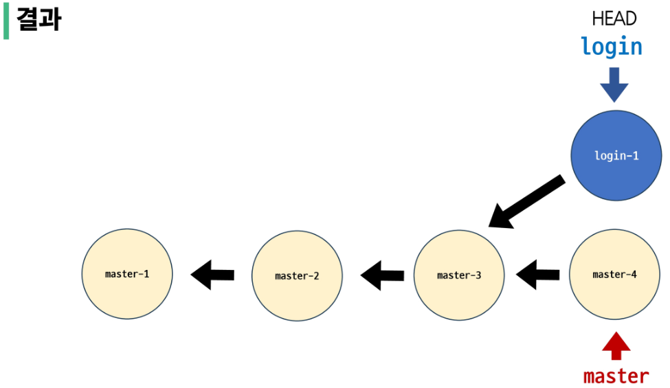
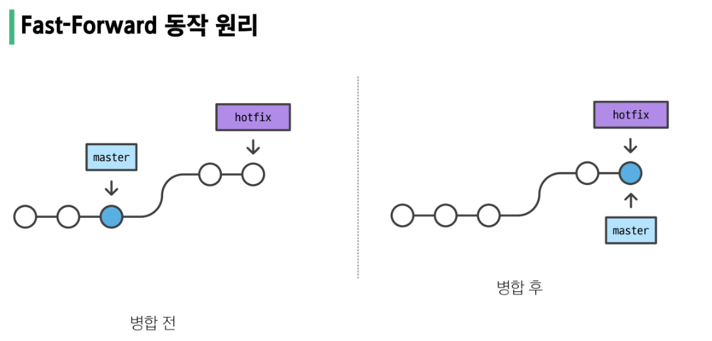

# Git  
    최종 수정일자: 2025-07-18 10:55
---
## 1. git 이란 무엇인가? 
git 은 리눅스 개발자가 만든 버전 관리 시스템
    - Git -> 내 컴퓨터에서 분산관리 할 수 있도록 해 주는 소프트웨어
    - GitHub, GitLab -> git을 온라인상에서 관리할 수 있게 해 주는거.
## 2. 분산 개념
분산 관리 -> 원본을 서버에서 저장하고, 각 로컬 PC에 클론을 배치.  
작업자는 클론 기반으로 작업 및 수정  
## 3. PUSH, PULL  
클론을 기반으로 동작해서 로컬에 원본을 가져오고 올리는 작업  
PUSH: 로컬의 내용을 서버에 밀어올린다  
PULL: 서버에 있는 내용을 가져온다.  
## 4. git 의 영역
### 4.1 Working Directory 
- 실제로 내가 수정하고 있는 코드/파일들이 있는 공간(로컬)
- 물리적으로도 저장된 실제 파일
```bash
git status
```
### 4.2 Staging Area(idx)
- git add 하면 커밋할 후보 목록이 올라가는 대기 공간. add 했을때 스테이징 되는 공간(이름처럼)
- index라고도 부르나봄
### 4.3 Repository(.git 디렉토리)
- git commit 했을때 Staging Area의 내용이 저장되는 공간
- 모든 커밋의 변경이력이 저장됨.
- 진짜 버전관리 DB

## 5.Git 사용해보기
- vsc -> 터미널 기본설정을 **git bash** 로 바꿔주기
- 왜 바꾸나요? bash 가 리눅스 명령어 기반. 리눅스에서 쓰던, 윈도우에서 쓰던, 맥에서 쓰던 bash 쓰면 리눅스 명령어로 작업 가능
- vsc에서 내가 작업 할(git으로 관리 할) 프로젝트 폴더를 만들고, 열기
- 폴더 연 상태로 터미널에서
```bash
git init
```
- 그러면 터미널에 나오는 주소 끝에 master 라는게 나오면 성공(git에서 관리중이라는 뜻?)
### 5.1 Staging Area로 보내보기
- 앞서 말했듯, Add 동작을 해서 예비 저장소 개념인 Staging 공간으로 보내보자.
- GUI를 이용하던, CLI를 쓰던 새롭게 파일을 하나 만들어본다. 
```bash
touch Readme.md
```
- 내용 추가를 하던, 없어도 상관없다. 
```bash
git add Readme.md
```
- 이렇게 Staging Area에 새롭게 생성된 Readme.md파일을 보낸다

#### 질문. 진짜 엄격하게 파일이 복사된건가? 아니면 그냥 idx만 남긴건가? 
#### GPT한테 들은 답: blob(블롭)으로 저장한다.
- blob 이 뭐야? 
- blob 은 SHA-1 해시값.
- git add 파일명 -> 하게 될 경우 .git/object 에 저렇게 압축해서 때려박아두고
- Staging Area(.git/index)에는 걍 이 파일이 .git/objec 에 저장되어 있는 저 blob을 가리킨다는 참조만 기록(메타데이터만)
- SHA-1 Hash -> 파일 내용을 기반으로 만든 16진법, 40자짜리 해쉬키. 복원은 불가능. 다만 내용이 한글짜라도 바뀌면 hash값이 완전히 바뀌기 때문에 변경관리에 아주 큰 장점이 있음. 이 성격 이용하기 위해서 SHA-1 사용
### 5.2 Commit 을 해 보자
- git commit -m "commit [name]" 를 하면 처음엔 안됨. 
- git 관리자 설정이 된게 아니기 때문 config 설정 필요
```bash
git config --global user.email [메일주소@.com]
git config --global user.name [username]
```
- 을 해 줘야 한다. 저기서 global, local 로 설정` 가능
- global 을 하면 pc 전체, 어디서든 git을 썼을때 config 가 저 값으로 나감. 다시 설정할 필요 x 사용자 홈 디텍로리 기준으로 gitconfig 가 저장됨
- local로 하면 현재 git 으로 잡아둔 master 설정된 영역 내에서만 config 값으로 동작. 
### 5.3 commit 을 수정해보자.
- commit 된 내용도 수정 가능. 단 그냥 -m으로 지정한 메시지 정도 수정 가능. 
- 변경되면 hash 값도 바뀜. 이거 확인 할 것. -m으로 들어간 메시지도 해싱하는 범위내라는 뜻.
### 5.5 GitHub와 연결과 push
- GitHub에 먼저 가입. Repository 생성하고 url 따서 연결
- SSH연결은 캠퍼스내 SSH 권한 안줘서 못함 https 주소 따서
```bash
git remote add origin [URL]
```
- 연결했으니 push
```bash
git push origin master
git push [원격저장소 이름] [branch 이름]
```
 - origin -> 내가 github에서 repository 를 만들면 기본적으로 지정되는 이름
    - 원격 저장소 이름. origin = my_url의 개념이라고 이해하면 편함. 
    - git push origin 대신 -> github_url 넣어도 동작함
    ```bash
    git push https://github.com/HaaaBird/TIL.git master
    ```
 - master -> Branch 이름. 
    - branch -> 나뭇가지. 메인 프로젝트에서 뻗어나갈 갈래를 말함
    - 왜 근데 master라고 입력? -> 이것도 내가 정한거. 그냥 기본 root 를 master로 정한것.
    - 기능별로 branch 를 나눠 사용하는것도 가능.
### 5.6 GitHub 에서 가져오기 (pull)
- 프로젝트 가져올땐 마찬가지로
```bash
git clone [url]
```
- 로 가져오는 것. public 은 그냥 가져 올 수 있음. private 는 별도 인증 필요
- 연결 후에 update는
```bash
git pull origin master
git pull [name] [branch]
```
### 5.7 gitignore
- 프로젝트 내 모든 내용을 공유하면 안됨
- 예를 들어서 api 인증키, 프로젝트 설정파일 등은 공유하면 위험하거나 필요가 없음.
- 그래서 이것들을 예외처리 해 주는 것이 gitignore
- 설정법은 간단. 프로젝트 root 에 .gitignore 파일 만들고 공유하지 않을 파일 넣으면 됨
- [gitignore](www.gitignore.io) 라는 곳에서 기본 제거할 파일 목록 제공


### 5.8 하다보니 궁금한거
- git remote add 와 git clone 의 차이는?
    - git remote add 는 내가 하는거. 내가 프로젝트 시작할때 파일과 repository 만들고 연결하는거
    - git clone 은 가져오는거. git 에 있는걸 땡겨오는거. 
    - 즉 원본이 나로 부터 출발하는거냐, 원본이 github로부터 오는것이냐의 차이.
## 6. Commit 된 것들을 수정하는 방법
- 기본사항
    - push한걸 수정하는건, 같이 일하는 동료들에게 큰 엿을 먹일 수 있는 행위다!
    - 상당히 잘못된 행동. 기술적으로 가능하나, 같이 일하는 코드라면 이게 참 골치 아파질 수 있는 일임을 인지하고 해야 한다.
    - 잘못이 있다면 그냥 새로운 commit 을 만들어라. 이걸 수정할 이유는 잘 없다. 

### 6.1 Git revert
- commit을 제거하는건 아님. 
- 1 -> 2 -> 3 -> 4 -> 5 순서대로 commit이 생겼는데, 2번 내용이 10줄을 지우고 8줄을 추가한건데 원복한다면
- 6번을 새로 만들고, 이 6번의 내용이 2번 내용을 복구하는 식으로 하는 것. 
- **재설정 개념**. 단일 commit 을 실행 취소하는 것 처럼 보이게 하는 행동.
```bash
git revert [commit 의 hash값]
```
- Vim이 뜨고, 그걸 걍 :wq 해서 저장하고 엔터치면 완료
- 하게 된 결과는
    ```bash
    SSAFY@2□□PC166 MINGW64 ~/Desktop/reset-revert-practice/revert (master)
    $ git log --oneline
    eba39d1 (HEAD -> master) Revert "second"
    d7c8501 third
    91cbd74 second
    f7b3a3d first
    ```
    - 이처럼 새롭게 commit 이 생김
- 정리하면 순방향 실행 취소 작업
```bash
git revert [hash] 
```
- 하면 바로 Staging -> Repositoy 까지 모두 수정인데
```bash
git revert --no--commit [hash]
```
- 하면 Staging Area까지만 반영하고 commit은 하지 않음. 

#### 6.1.2 revert가 문제가 없는 기능인가?
- 아님. 양립할 수 없는 2개 사건이 생겨버리면 복원이 안됨.
- 1.txt 에 a, b, c 를 입력하고 commit (**update1**)
- 1.txt 내용을 수정하고 또 commit (**update2**)
- 근데 다시 **update1** 로 돌아간다면? 
- error 발생 왜?
    - revert 는 파일 단위로 복원을 하는게 아님.
    - update 1로 돌아가라는 말은 1.txt에 적었던 a, b, c를 지우라는 말
    - 근데 update2 commit 에는 이미 a, b, c가 없음. 그러면 얘 입장에선 뭘 지워야 하는건지 모름.
    - 그래서 Vim 편집기 띄워주고 그냥 니 알아서 복구 하세요. 라고 하는거
    - 그렇기 때매 걍 revert 도 하지 마라. 그냥 commit 하거나 pull로 복원하쇼

### 6.2 Git reset
- revert 는 새로운 commit 을 만듬. 순방향
- git reset 은 역방향. 그 때로 돌아감. 매우 무서운 기능
    - a -> b -> c -> d -> e 일때, c로 돌아간다면? 
    - d, e 는 없는 일로 됨. **삭제됨** 걍 현재가
    - 절때 push 후 reset 하려고 하지 말자. 일단 github에서 거절한다. git에는 이미 다 commit 이력이 남아있기 때문.'
    ```bash
    git revert [option] <commit id>
    ```
    - revert 에는 없던 option이 왜 생겼나?
        - reset 은 과거로 돌아가는 일이기 일부 행위가 때문에 없었던 일이 되는것. 
        - 예를 들어 a -> b -> c 인 상태에서 a로 돌아간다면? b, c는 어찌할거냐?
        - 저 없어질 두개 commit 대해서 어찌할지에 대해 option을 통해서 조정함
    - reset의 3개 옵션
        - --soft
            - 파일이 남음. commit 은 없어지나, 파일은 살아있게 됨.
            - b, c가 Staging Area에는 존재한다는 뜻.다음 commit 하면 들어감.
        - --mixed(기본옵션, option에 공란 하면 이걸로함.)
            - 파일이 남음. commit 이력도 없어짐
            - 동시에 Staging Area 에서도 없어짐. Add 된게 아니기 때매 다시 commit 하면 파일이 추가되지 않음.

        - --hard
            - 파일이 날라감. 이력 사라지는건 당연하고, 파일도 날라가버림.
            - 마찬가지로 Staging Area에서도 다 지워짐. 파일도 이력도 다 지워지는것. 

### untracted(add 되지 않은)건 뭘 하던 상관없음
### 아무튼 이거 둘 다 하면 좋을게 없다. 되도록 하지 말자. 가능하다면 그냥 commit을 새로 만드는게 맞다. 
    - 근데 왜 하냐? commit 을 많이 남기는게 좋지 않기 때문에 보통 그냥 사소한 수정은 commit을 안하는 경우도 많음. 결국 commit 은 버전이니까.
    - 그냥 왜 변경하는지 간단하게 이력을 남겨서 수정하는게 좋다.

## 7. 파일 내용을 되돌려보가
### 7.1 Git restor (Working Directory 상황에서 복원)
- 쓸때없는 내용을 했다 치자. 근데 이걸 다시 원복을 시키고 싶다면?
```bash
git restore [파일명]
```
- 마지막 commit 에 있는 내용으로 다시 돌아간다. 
### 7.2 Add된 내용을(Staging Area까지 갔다면) 복구하는 방법
```bash
git restore --staged [파일명]
```


# 1. Branch
- Git Branch
  - 나뭇가지처럼 여러 갈래로 작업 공간을 나누어 독립적으로 작업할 수 있도록 도와주는 Git의 도구
- Branch 장점
  - 독립된 개발 환경을 형성하기 때문에 원본(master)에 대해 안전
  - 하나의 작업으 하나의 브랜치로 나누어 진행됨으로 체계적으로 협업과 개발이 가능
  - 손쉽게 브랜치를 생성하고 브랜치 사이를 이동할 수 있음
- 꼭 Branch를 사용해야 할까?
  - 만약 상용 중인 서비스에 발생한 에러를 해결하려면?
    - 브랜치를 통해 별도의 작업 공간을 만든다
    - 브랜치에서 에러가 발생한 버전을 이전 버전으로 되돌리거나 삭제한다
    - 브랜치는 완전하게 독립되어있어 작업 내용이 master 브랜치에 아무런 영향을 끼치지 못한다
    - 이후 해결되었다면? 그 내용을 master브랜치에 반영할 수 있다.
- Master(main)브랜치의 의미와 역할
  - 기본 브랜치(Default Branch)
    - 저장소의 초기 상태를 나태내며 일반적으로 프로젝트의 가장 최신 버전 또는 배포 가능한 안정적인 코드
  - 기준점
    - 다른 브랜치가 파생되는 기준점으로 사용
  - 변경사항 통합
    - 다른 브랜치에서 작업 가능한 기능이나 버그 수정을 완료한 후 코드 리뷰와 테스트를 거쳐 master에 병합
## 1.1 Branch Command
- git branch
  - 브랜치 조회, 생성, 삭제 등 브랜치와 관련된 명령어
| 명령어 | 기능 |
| ---- | ---- | 
| git branch | 브랜치 목록 확인 |
| git branch -r | 원격 저장소의 브랜치 목록 확인 |
| git branch <브랜치 이름> | 새로운 브랜치 생성 |
| git branch -d <브랜치 이름> | 브랜치 삭제(병합된 브랜치만 삭제 가능) |
| git branch -D <브랜치 이름> | 브랜치 삭제(강제 삭제) | 
| git switch <다른 브랜치 이름> | 다른 브랜치로 전환 |
| git switch -c <브랜치 이름> | 새 브랜치 생성 후 전환 |
| git switch -c <브랜치 이름> <commit ID> | 특정 커밋에서 새 브랜치 생성 후 전환 |

- HEAD
  - 현재 브랜치나 commit을 가리키는 포인터(현재 내가 바라보는 위치)
- git switch 주의사항
  - git switch 하기 전에 Working Directory 파일이 모두 버전 관리가 되고 있는지 반드시 확인해야 한다.
  - 상황 예시
    - 1. master 브랜치와 feature브랜치가 존재
    - 2. feature 브랜치에서 'article.txt'를 생성
    - 3. git add 하지 않고 git switch master를 실행
  - 상황 결과   
    - feature 브랜치에서 생성한 article.txt가 master 브랜치에도 존재하게 됨
  - 주의사항 정리
    - 1. Git branch는 독립적인 작업공간을 가지지만 git이 관리하는 파일 트리에 제한됨
    - 2. git add를 하지 않았던, 즉 Staging area에 한번도 올라가지 않은 새 파일은 git의 버전관리를 받고 있지 않기 때문에 브랜치가 바뀌더라도 계속 유지
    - 3. 그렇기 때문에 git switch 를 하기 전 working directory의 모든 파일이 버전 관리중인지 확인 필요
# 2. Branch Scenario
- 무작정 따라해보기
  - 1. git-branch-practice 폴더 생성
  - 2. 생성한 폴더로 이동
  - 3. vscode 실행
  - 4. git 저장소 생성
```bash
$ mkdir git-branch-practice
$ cd git-branch-practice
$ code .
$ git init
```
  - article.txt 생성
  - 각각 master-1, master-2, master-3 이라는 내용 순서대로 입력하며 commit 3개 생성
```bash
$ touch article.txt

# article.txt에 master-1 작성
$ git add.
$ git commit -m "master-1"

# article.txt에 master-2 작성
$ git add.
$ git commit -m "master-2"

# article.txt에 master-3 작성
$ git add.
$ git commit -m "master-3"
```
  - master 브랜치의 commit 목록 확인
```bash
$ git log --oneline
2040379 (HEAD -> master) master-3
31b833e master-2
846fc87 master-1
```

- commit 진행 방향과 화살표 방향이 다른 이유
  - commit은 이전 commit 이후에 변경사항만을 기록한 것
  - 즉, 이전 commit 에 종속되어 생성됨
  - 일반적으로 화살표 방향을 이전 commit을 가리키도록 표기
## 2.1 Branch 생성 및 조회
- 현재 위치(master 브랜치의 최신 commit)에서 login 브랜치를 생성
- login 브랜치 생성 확인
```bash
$ gir branch login
$ git branch
  login
* master
```
- commit 기준으로 master와 login브랜치가 위치한 것을 확인
```bash
$ git log --oneline 
2040379 (HEAD -> master, login) master-3
31b833e master-2
846fc87 master-1
```
- master 브랜치에서 commit 을 하나 더 작성
- 현재 브랜치와 commit 상태 확인
```bash
$ git add .
$ git commit -m "master-4"

$ git log --oneline 
915d060 (HEAD -> master) master-4
2040379 (login) master-3
31b833e master-2
846fc87 master-1
```

## 2.2 Branch 이동
- 현재 브랜치와 commit상태 확인
  - 이때 login브랜치로 이동하면 article.txt가 변할까?
```bash
$ git switch login
Switched to branch 'login'
# article.txt 내용이 이전 버전으로 바뀜
```
- master branch는 잘 살아 있음
- 단지 head 가 login으로 변경된것 뿐
## 2.3 Branch에서 commit 생성
- login branch 에서 article.txt 아래에 login-1 내용 추가
- 추가로 test_login.txx 도 생성하고 login-1 내용 추가
- commit 생성
- log 에 --graph 명렁어 써서 commit 목록 확인
```bash
$ git log --oneline --graph --all
* 87dd56c (HEAD -> login) login-1
| * 915d060 (master) master-4
|/
* 2040379 master-3
* 31b833e master-2
* 846fc87 master-1
```
- master 브랜치와 login 브랜치가 다른 갈래로 갈라진걸 확인

- git branch 정리
  - 브랜치의 이동은 HEAD가 특정 브랜치를 가리킨다는 것
  - 브랜치는 가장 최신 commit 을 가리킴으로 HEAD가 해당 브랜치의 최산 commit을 가리킴
  - 즉, working directory의 내용도 HEAD가 가리키는 브랜치의 최신 COMMIT 상태로 변화하는 것
# 3. Git Merge
- 두 개의 브랜치를 하나로 병합(결합)
- git merge <병합 브랜치 이름>
- 병합 전 확인 및 주의사항
  - 1. 수신 브랜치(병합 브랜치를 가져오고자 하는 브랜치)확인
    - git branch 명령어를 통해 HEAD가 올바른 수신 브랜치를 가리키는지 확인
    - 병합 진행 위치는 반드시 수신 브랜치에서 진행되어야 함
  - 2. 최신 commit 상태 확인
    - 수신 브랜치와 병합 브랜치 모두 최신상태인지 확인
- Marge 종류
  - 1. Fast-Forward Merge
  - 2. 3-way Merge
## 3.1 Fast-Forward Merge
- 브랜치를 "실제로" 병합하는 대신 현재 브랜치 상태를 대상 브랜치 상태로 이동시키는 작업(빨리 감기)
  - Merge 과정 없이 단순히 브랜치 포인터가 앞으로 이동

- 1. fast-forward-practice 폴더 생성
- 2. 생성한 폴더로 이동
- 3. vsc 실행
- 4. git 저장소 생성
```bash
$ mkdir fast-forward-practice
$ cd fast-forward-practice
$ code .
$ git init
```
## 3.2 3-Way Merge
## 3.3 Merge Conflict

# 4. Git Workflow
## 4.1 Feature Branch Workflow
## 4.2 Git Flow
## 4.3 Forking Workflow
