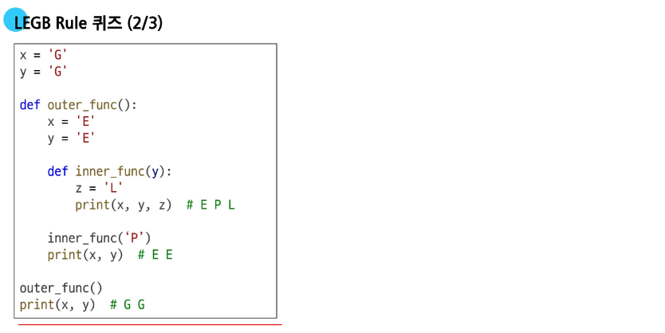

# Python 문법 1일차

## 0. 프로그래밍이란?
- 프로그램
문제를 해결하기 위한 명령어의 집합
우리 집에 오는 방법 -> xx 정류장에 내려 두블럭 직진 후 우회전 처럼 순서를 가진 지시사항을 주는 것.

- 프로그래밍 
새 연산을 정의하고 조합해 유용한 작업을 수행하는것. 즉 위에 프로그램을 만드는 과정.

### 0.1 프로그래밍 언어
컴퓨터에게 작업을 지시 하고 문제를 해결하는 도구. 말을 바로 알아듣지 못하기 때문에 약속한 언어를 내가 배워서 전달해야함. 

### 0.2 Python을 왜 배우냐
- 쉽고 간결한 문법
- 커뮤니티 지원
- 광범위한 응용 분야
### 인공지능에 기본 언어가 Python이다.
Pytorch(Meta), TensorFlow(Google)이 만든 라이브러리가 파이썬으로 제공됨

## 1. 이론
### 1.1 표현식(Expression)
- 하나의 값으로 평가될 수 있는 모든 코드
- 예시
    - 3 + 5
    - x > 5
    - 5 x 4

### 1.2 값(value)
- 표현식이 평가 된 결과
- 더 이상 계산되거나 평가될 수 없는 프로그램의 가장 기본적인 데이터 조각
- 예시
    - 숫자 값: 103.5
    - 문자열 값: "hello
    - 불리언: True, False

### 1.3 변수와 메모리
- 변수(Variable)
값을 나중에 **다시 사용**하기 위해, 그 값에 붙여주는 고유한 이름
- 변수 할당(Variable Assignment)
표현식이 만들어 낸 값에 이름을 붙이는 **과정**
- 할당문 (Assignment Statement)
어떤 값 3.6을 변수 d 에 할당한다.
```python
d = 3.6
git 
d: 변수 이름
= 할당 **연산자**. 오른쪽 표현식의 결과 값을 왼쪽에 저장
변수명은 우리가 외우기 힘든 메모리 주소를 외우기 싫어서 사람을 위해 지정하는것. 
3.6: 표현식
```
- 변수명 규칙
    - 알파벳, 언더스코어, 숫자
    - 숫자로 시작x
    - 대소문자 구분함
    - 내부 예약어와 중복 허용 x
### 1.4 변수, 값 그리고 메모리
컴퓨터에는 메모리가 존재함.  
메모리 모든 위치에는 당연히 주소가 존재
- 객체의 구성
    - 고유한 ID(메모리 주소)
    - 타입
    - 값
    - 값 + 타입 + 주소정보를 묶은것을 객체라고 부름  
    
결국 이 객체를 가리키는 이름표가 바로 **변수**
**변수**는 메모리 주소를 가지지 않는다.
### 1.5 재할당
- 변수는 특정 값을 기억하거나 가리키는 이름일 뿐
- 재할당은 이 변수가 가리키는 대상을 새로운 값으로 변경하는 행위
- 재할당이 이루어지면, 변수는 이전 값을 완전히 잊고 새로운 값만 기억
```python
num = 10
double = 2 * 10
print(double)

num = 5
print(double)
-> 하면 20 출력됨.
```

## 2. Data Type
### 2.1 타입
- 변수나 값이 가질 수 있는 데이터의 종류를 의미
### 2.2 타입의 구성 요소
- 연산자(+,- 등의 연산기호) + 피연산자(숫자, 문자 등)로 구성
### 2.3 Data Type
- 값의 종류와 그 값으로 할 수 있는 데이터의 종류
- 필요한 이유
    - 각 타입에 따라 가능한 연산이 다르기 때문.
        - 숫자는 더하기
        - 문자는 결합
        - 숫자와 문자는 못더함
    이러한 내용들을 명시적으로 적기 위해 Data Type이 필요함.
### 2.4 데이터 타입의 5가지 분류
- Numeric Type
프로그래밍에서 값을 계산하는 등 가장 기본
    - int 정수: 소숫점이 없는 숫자 (양수, 음수, 0)
    - float 실수: 소숫점이 있는 더 정밀한 숫자
    - 지수 표현법 - 아주 크거나 작은 실수를 간결하게 표현하는 방법
        - e 또는 E를 사용
        ```python
        # 1,230,000,000
        big_number = 1.23e9
        # 0.00314(3.14 * 10^-3)
        # small_number = 3.14e-3
        ```
### 2.5 숫자형의 '행동': 산술 연산
- 숫자형의 행동은 계산이 목표
- 이 행동을 지시하는게 산술 연산자
- 연산자 우선순위
    - 지수연산이 항상 우선
    - 음수부호
    - 곱, 나눗, 정수, 나머지
    - 덧뺄셈
    - 햇갈릴 수 있으니 소괄호 적극적으로 쓰면 편함.
    ```python
    print(-2 ** 4) # -16 지수연산자가 우선순위라서 2 ** 4가 먼저 계산된 후에 음수부호 붙음
    print(-(2 ** 4)) # -16
    print((-2) ** 4) # 16
    ```
## 3 Sequence Type
- 여러 개의 값들을 순서대로 나열하여 저장하는 자료형
- Sequense: 여러 데이터가 정해진 순서대로 일렬로 늘어선 자료 구조
- 대표적인 시퀀스: str, list, tuple, range
- index: 자료형에서 각 값의 위치를 식별키 위해 부여된 고유번호
### 3.1 Sequence Type의 5가지 공통특징
1. Order
2. indexing
3. slicing
4. length
5. iteration  
```python
my_data = 'Hello'
```
| 특징 | 사용 예시 | 결과 |
|-------|-------|-------|
| 인덱싱 | my_data[1] | 'e' |
| 슬라이싱 | my_data[1:4] | 'ell' |
| 길이 | len(my_data) | 5 |
| 반복 | for i in my_data | H, e, l, l, o가 순서대로 출력 |

### 3.2 문자열(string)
- 문자들의 순서가 있는, 변경 불가능한 시퀸스 자료형
#### 3.2.1 문자열을 만들고 표현하는 법
- 작은따옴표(')나 큰따옴표(")로 감싸서 사용
```python
# Hello world
print('Hello world')
# 아무튼 항상 통일성있게 "" 던 ''를 하나로 사용할 것.
```
만약 문자열 안에 ', "를 넣고 싶다면?
- 이스케이프 시퀀스를 사용해서 문자열 만들기
```python
print('He\'s a boy') # -> He's a boy 로 출력
```
| 예약 문자 | 기능 |
|-------|-------|
| \n | 줄바꿈 |
| \t | 탭 |
| \t | 백슬래쉬 |
| \\' | 작은 따옴표 |
| \\" | 큰 따옴표 |

- f-string 을 이용한 문자열 만들기
```python
names = [홍길동, 차두리, 정성룡, 기성용]
age =[1,4,2,5]

for i in range(len(names)):
    print(f"내 이름은{name[i]} 이고, 나이는 {age[i]}살이다")
```
- f-string 은 이외에 다양한 기능 제공하니 추가로 심화학습법 til 해봐라.
#### 3.2.2 시퀀스로서의 문자열 활용

| 특징 | 사용 예시 | 결과 | 설명 |
|-------|-------|-------|-------|
| **인덱싱** | my_data[1] | 'e' | 1번 위치의 글자 선택 |
| 슬라이싱 | my_data[1:4] | 'ell' | 1,4번 앞까지 부분 추출 |
| 길이 | len(my_data) | 5 | 문자열의 전체길이 |
| 반복 | for i in my_data | H, e, l, l, o가 순서대로 출력 | 각 문자를 순서대로 처리 |

- 인덱스는 왜 항상 0부터?
    - 컴퓨터 과학에서 거리 개념으로 시작해서 그럼. 인덱스는 결국 메모리 가장 앞 인덱스 주소가 해당 시퀀스 변수의 참조값으로 사용되는 경우가 대부분인데, 그 자체를 바로 호출하려면 0으로 호출
- 파이썬은 음수 인덱싱을 지원함

| | h | e | l | l | o |
|-------|-------|-------|-------|-------|-------|
| + | 0 | 1 | 2 | 3 | 4 |
| - | -5 | -4 | -3 | -2 | -1 |

- 슬라이싱
시퀀스의 일부를 잘라내 새로운 시퀀스를 만드는 작업

```python
sequence[start:stop:step]
# start: 슬라이싱을 시작할 인덱스(포함)
# stop: 끝낼 인덱스(불포함)
# step: 간격

# 슬라이싱 예시
word = "hello"
for i in word:
    print(i) # h, e, l, l, o 가 순서대로 나옴.
# 기본사용
my_str = word[2:4] # -> ll 만 값에 저장됨.
# start를 생략
my_str = word[:3] #-> [0:3]과 같은 의미 hel
# end stop 생략
my_str = word[3:] #-> lo 가 저장
# step만
my_str = word[::2] # ->0, 2, 4만 저장 hlo
# 음수 인덱싱을 이용한 역방향 출력
my_str = word[::-1] # olleh
```
#### 3.2.4 문자열의 불변성
- 문자들의 순서가 있는, 변경 불가능한 시퀀스 자료형(immutabllity)
- 한번 생성된 문자열 객체는 그 내용을 절대 수정할 수 없다.
```python
my_str = "Hello"
my_str[1] = "a"

# 하면 Type 에러가 발생함
# 'str' object does not support item assignment
# 불변하기 때매 저런 에러가 발생.

# 그럼 바꾸려면?
new_str = my_str[0] + "a" + my_str[2:]
print(new_str)
```
- 근데 my_str = "hallo" 해도 되는거 아님? 
    - 아님. 이건 재할당임. 변경과 재할당은 다름.
## 4 정리
### 4.1 정수형의 진법 표현
- 코드 내에서 진법 표현하기

| 진법 | 접두사 | 사용하는 숫/문자|
|-----|-----|-----|
| binary | 0b | 0 1 |
| octal | 0o | 0~7 |
| hexadecimal | 0x | 0~9, a~f |

### 4.2 부동소숫점 오차
- 실수는 계산 결과가 이상하다.
```python
result = 0.1 + 0.2
print(result == 0.3) # -> False 가 나옴. 왜?
print(result) # -> 0.30000000000000004
```
- 컴퓨터는 2진법을 사용해 부동소숫점을 표현한다.
- 이 과정에서 무한소수가 발생할 수 있고, 이를 근사값으로 저장한다.
- 우리가 쓰는 10진수 중 소수 일부(예로 0.1)가 2진수로 바꾸면 무한소수가 된다.
- 그러면 이런 수를 계산하면 메모리 공간이 무한하지 않기 때매 적당히 잘라버리기 때문에 저런 문제가 발생.

```python
a = 3.2 - 3.1
b - 1.2 - 1.1
print(a) # 0.10000000000000009
print(b) # 0.09999999999999987
print(a==b) # False

from decimal import Decimal

a = Decimal('3.2') - Decimal('3.1')
a = Decimal('3.2') - Decimal('3.1')
# 이렇게 적으면 돌아감
```

### 4.3 표현식과 문장
- 문장(Statement): 특정 동작을 지시하는 실행가능한 최소 단위의 코드
    - 할당문, 반복문, 조건문 등 문장이라는 의미를 가짐 하나의 명령 단위
- 표현식 vs 문장 이 햇가린다면? 
    - "이 코드를 실행하면 그래서 **'하나의 값'** 이 남음?
    - 값이 남으면 -> 표현식
        - 10 + 20 -> 값 30이 남음
        - len("hello") -> 값 5가 남음
    - 값이 안남으면? -> 문장

### 4.4 Style Guide
- 코드 가독성과 일관성을 향상시키기 위한 규칙과 권장 사항들
- PEP8 이란 가이드를 따라서 코드를 작성하는게 좋음
- 대표적인 내용
    -  변수명은 무엇을 위한 변수인지 직관적이도록
        - n=0 보단 number_of_student = 0
    - 공백은 4칸, 그냥 탭 써
    - 한 줄의 길이는 79자. 길어지면 줄바꿈
    - 문자와 밑줄(_) 을 써서 함수, 변수, 속성 이름 작성
    - 함수 정의나 클래스 정의 등의 블록 사이에는 빈 줄을 넣어라
### 4.5 주석
- 프로그램 내 설명 넣는거. 프로그램 실행에 아무런 영향을 안줌.
- 단축키
    - ctrl + / 하면 됨.
### python tutor
- 파이썬 코드가 한 줄씩 어떻게 실행되는지 눈으로 보여주는 도구  
[python tutor](https://pythontutor.com)


# 파이썬 문법 2일차
작성일자: 2025-07-22
## 1. List
- 여러 개의 값을 순서대로 저장하는, 변경 가능한(muatble)시퀀스 자료형
- 리스트의 표현
    - 대괄호 [] 안에 값들을 쉼표로 구분
    - 파이썬에서 제공하는 모든 데이터 타입 추가 가능
    - 값을 추가 수정, 삭제 등 자유로움
```python
my_list0 = [] # 빈 리스트, 데이터가 없는
my_list1 = [1, 'a', 3, 6, 'asdf'] # 데이터 섞어서 넣기도 가능
my_list2 = [1,2,3, "python" ["hello",3,4]] # 리스트 안에 리스트도 가능
```
    - 이 때 my_list2 의 길이(len)은 얼마인가? -> 5개. 리스트도 그냥 한개임. 서브리스트
### 1.1 시퀀스로서의 리스트
- 리스트는 시퀀스이므로 문자열처럼 인덱싱, 슬라이싱, 길이 확인, 반복 등 공통 기능 모두 사용 가능
```python
my_list = [1,'a',3,'b',5]
# 인덱싱
print(my_list[1]) #a
```
### 1.2 중첩 리스트
- Nested List. 다른 리스트를 값으로 가진 리스트
- 중첩 리스트 값 접근하기
    - 인덱스를 연달아 사용해서 안쪽 값에 접근 가능
    1. 먼저 밖의 리스트의 인덱스로 안쪽 리스트틀 선택
    ```python
    my_list[4] # -> ['hello','world','!!!']]
    ```
    2. 선택된 안쪽 리스트에서 다시 한번 인덱스를 사용
    ```python
    print(my_list[4][-1])  # !!!
    ```
    3. 전체 실습 예시
```python
my_list = [1,2,3,'python',['hello','world','!!!']]
print(my_list(len(my_list)))  # 5
print(my_list[4][-1])  # !!!
print(my_list[-1][1][0])  # w
```
    - 문자열도 시퀀스임을 까먹지 말것.
### 1.3 리스트의 가변성
- 여러 개의 값을 순서대로 저장하는, mutable 시퀀스 자료형임. 변경가능함.
    - 변경 가능하다는 것은 수정, 추가, 삭제 가능하다는 뜻. 문자열의 immutable 과는 반대

### 1.3.1 인덱싱으로 값 수정하기
```python
my_list = [1,2,3,4,5]
my_list[1] = "two"
print(my_list) # [1, "two", 3,4,5]
```
### 1.3.2 슬라이싱으로 여러 값 한번에 수정하기.
```python
my_list = [1,2,3,4,5]
my_list[2:4] = ['three', 'four']
print(my_list)  # [1, 2, 'three', 'four', 5]

# 자른 영역보다 큰 거 넣어도 들어감
my_list = [1,2,3,4,5]
my_list[2:4] = ['three', 'four', 'five']
print(my_list)  # [1, 2, 'three', 'four', 'five', 5] -> 리스트 길이가 6으로 늘어남. 그냥 구간에 우겨넣는거.
```
## 2. Tuple
- 여러 개의 값을 순서대로 저장하는 변경 불가능한 시퀀스 자료형(immutable)
- 튜플 표현
    - 소괄호() 쉼표로 구분
    - 모든 종류의 데이터를 담을 수 있음.
    - 리스트랑 거의 비슷하지만, 불변임.
```python
my_tuple = ()
my_tuple2 = (1,) # 요소가 하나일때, 마지막에 쉼표 넣어야함. 후행쉼표. Trailing comma
my_tuple3 = (1,'a',3,'b',5)
my_tuple4 = 1,'hello',3.14159, False # 괄호 안넣어도 생성 가능.
```
### 2.1 시퀀스로서의 튜플
- 튜플 역시 시퀀스이므로, 슬라이싱, 인덱싱, 길이 확인, 반복 가
### 2.2 튜플의 불변성
- 튜플 변경 시도하기
    - 한번 생성된 튜플은 그 내용을 절대 수정, 추가, 삭제 할 수 없음
- 어디에 쓰일까? 왜 불변인가?
    - 개발자가 직접적으로 활용하는 데이터 타입이 아님.
    - 파이썬 내부 동작을 실행할때 사용하는 경우
    - 다중할당, 값 교환 함수 다중 반환 값 등에서 사용. 
```python
#다중 할당
x, y = 10, 20 # 다중할당할때, 내가 하는게 아니라 내부에서 저걸 묶어줌.
# 실제 내부 동작
(x,y) = (10, 20)  # 튜플로 묶여서 할당됨
# -------------------------------
# 값 교환
x,y = 1, 2
x, y = y, x

# 실제 내부 동작
temp = (y,x) # 튜플 생성
x,y = temp # 튜플 언패킹
print(my_tuple[3:])  # (2,1)
```
    - 튜플은 **안전성과 무결성** 을 보장해서 우리가 잘 쓰지는 않지만 내부동작에 사용
        - 리스트는 왜 안씀? 바뀔 수 있기 때문에 내부동작에서 쓰기 무서움.
## 3. range
- **연속된 정수** 시퀀스를 생성하는, immutable 자료형
    - 주로 **반복문**과 함께 사용되어 특정 횟수만큼 코드를 반복할때 매우 유용하게 사용
    - 실제로 모든 숫자를 메모리에 저장하는 대신, 시작 값, 끝 값, 간격이라는 '규칙' 만 기억하여 메모리를 매우 효율적으로 사용하게 됨. 
### 3.1 range기본 구문
- range()는 매개변수를 1,2,3개를 가질 수 있음
    - 매개변수는 함수를 정의할 때, 함수가 받는 값을 나타내는 변수
    - 인자는 함수를 호출할때 실제로 전달되는 값.
```python
    range(start, stop, step)
```
- ranage 매개변수별 특징
    - range(stop) # range(0, **in_stop**, 1)
        - 매개변수가 1개면 stop로 인식
        - starts는 0, step는 1로 인식
        - range(5) -> 0, 1, 2, 3, 4
```python
my_range_1 = range(5)
print(my_range_1) -> # range(0,5)가 나오지 0,1,2,3,4 가 나오지 않음
# casting 을 이용해서 리스트로 변환 가능
print(list(my_range_1) # [0, 1, 2, 3, 4]
```
    - range(strat, stop) # range(1, 10)
        - 매개변수가 두개면 strat, stop로 인식, step는 1
        - range(2,5) -> 2, 3, 4
```python
my_range_2 = range(1,10)
print(my_range_2)  # range(1, 10)
print(list(my_range_2))  # [1, 2, 3, 4, 5, 6, 7, 8, 9]
```
    - range(2, 10, 2)
        - 모든 매개변수를 직접 지정
        - range(2, 10, 2) -> 2, 4, 6, 8
```python
my_range_3 = range(2, 10, 2)
print(my_range_3)  # range(2, 10, 2)
print(list(my_range_2))  # [2,4,6,8]
```
### 3.2 range의 규칙
#### 3.2.1 값의 범위 규칙
- stop 값은 생성되는 시퀀스에 절때 포함되지 않음.
    - range(1,5)는 1부터 5**전** 까지 숫자를 의미함으로 1,2,3,4가 생성
- 증가/감소 값(step) 규칙
    - step 값은 숫자 시퀀스의 간격과 방향을 결정함
    - 에러가 발생하진 않음.
```python
# step이 양수일 때 (기본값 1)
# 시작 값이 끝 값보다 작은 경우 (정상)
print(list(range(1, 5)))  # [1, 2, 3, 4]
# 시작 값이 끝 값보다 큰 경우
print(list(range(5, 1)))  # []
-----------------------
# step이 음수일 때
# 시작 값이 끝 값보다 큰 경우 (정상)
print(list(range(5, 1, -1)))  # [5, 4, 3, 2]
# 시작 값이 끝 값보다 작은 경우
print(list(range(1, 5, -1)))  # []
```
- range 활용 예시
    - 주로 반복문 많이 사용
```python
for i in range(1,10):
    print(i) # 1,2,3,4,5,6,7,8,9
for k in range(1,10,2):
    print(i) # 1,3,5,7,9
```
## 4. dict
- key - value쌍으로 이루어진 **순서와 중복**이 없는 변경 가능한 자료형(시퀀스 자료형이 아님, 인덱스가 없음)
- 딕셔너리 표현
    - 중괄호{} 안에 값들이 쉼표로 구분
    - 값 1개는 키와 쌍으로 이루어져 있음
        - key: 값을 식별하기 위한 고유 이름표 **('중복 불가')**
        - value: 키에 해당하는 실제 데이터
        - 인덱스 없음.
```python
my_dict1 = {}
my_dict2 = {"key":"value"}
my_dict3 = {"apple":12, "list":[1,2,3]}
```
    - 딕셔너리는 여전히 순서가 없는 자료형이긴 한데, 파이썬 버전 3.7 이상에서는 입력한 순서는 출력 시 그대로 유지됨. 그래도 핵심은 **순서가 없으며 key를 통한 접근**임. 예전에는 보장안했음.
### 4.1 딕셔너리 규칙
- key의 규칙
    - 고유해야 함. 키는 중복될 수 없음
- immutable 자료형만 가능
    - 가능: str, int, float, tuple
    - 불가능: list, dict
- value 의 규칙
    - 어떤 자료형이던 자유롭게 사용가능
### 4.2 딕셔너리 값 접근
- Key를 사용해 Value를 꺼내 올 수 있음.
- Key에 접근 시 대괄호[]를 사용.
```python
my_dict = {"name":"홍길동", "age":25}
print(my_dict['name']) # 홍길동
print(my_dict['test']) # KeyError 'test'
```
- 딕셔너리 값의 추가 및 변경
```python
my_dict = {"apple":12, "list":[1,2,3]}
# 추가
my_dict['banana'] = 50
print(my_dict) # {"apple":12, "list":[1,2,3], 'banana': 50}
# 변경
my_dict['apple'] = 100
print(my_dict) # {"apple":100, "list":[1,2,3], 'banana': 50}
```
- 딕셔너리를 언제 사용하나?
    - 데이터에 순서가 필요없고, 각 데이터에 의미있는 이름을 붙여서 관리하고 싶을때 사용함
    - 사람의 인적 정보, 게임 캐릭터의 능력치 등
## 5. set
- 순서와 중복이 없는 변경 가능한 자료형
- 세트 표현
    - 중괄호{} 안에 값들을 쉼표로 구분하여 만듬
    - 수학에서의 집합과 동일한 연산 처리 가능
```python
my_set1 = set() # 딕셔너리 빈거 만들땐 중괄호인데, 얘는 소괄호로 빈세트 만듬
my_set2 = {1,2,3}
my_set3 = {1,1,1}
print(my_set1) # set()
print(my_set2) # {1,2,3} # 순서 없음.
print(my_set3) # {1,1,1} 로 초기화 했으나 그냥 하나만 남음. 중복 허용 안함
```
- 세트의 두가지 핵심 특징
    - **중복**을 허용하지 않음
        - 똑같은 값은 단 하나만 사용 가능
    - 순서가 없음
        - 인덱싱이나 슬라이싱을 사용할 수 없음
- 세트도 튜플과 마찬가지로, 개발자가 잘 사용하진 않음. 내부에선 많이 사용.
    - 중복이 없다는 특징을 활용해 집합연산을 사용할 수 있음.
### 5.1 세트 집합 연산
- 수학의 집합개념을 그대로 가져와 두 데이터 그룹간 관례 파악하는데 매우 효과적
```python
my_set_1 = {1,2,3}
my_set_2 = {3,6,9}
# 합집합
print(my_set_1 | my_set_2) # {1,2,3,6,9}
# 차집합
print(my_set_1 - my_sey_2) # {1,2}
# 교집합
print(my_set_! & my_set_2) # {3}
```
- 이런 특성때문에 알고리즘 구현하거나 할때 가끔 씀. 튜플보단 많이 사용함.
## 6. Other Typ
### 6.1 None
- 파이썬에서 데이터 값이 없음을 표현하는 특별한 데이터 타입
    - 빈 상자와 비슷한 개념
    - 숫자 0이나 "" 와는 다른, 값이 없음, 정해지지 않음이란 상태를 나타내기 위해 사용
    - 함수에서 반환 값이 없는데 할당하면 None 뱉음.
```python
# my_varialbe 에 빈 값을 할당하고 싶음
my_variable = None
print(my_variable) # None
```
### 6.2 Boolean
- 참과 거짓 단 두가지 값만 가지는 데이터 타입
    - on/off 스위치처럼 프로그램 흐름을 제어하는 조건문에서 맞다, 틀리다 판단하는 역할
    - 조건문이나 반복문에 같이 활용되는 경우 많음.
```python
is_active = True
is_logged_in = False

print(is_active) # True
print(is_logged_in) # False
print(10>5) # True
print(10==5) # False
```
## 7. Collcetion
- 여러 개의 값을 하나로 묶어서 관리하는 자료형들을 통칭하는 말
- str, list, tuple, range, set, dict 모두 Collection에 분류


| 컬랙션명 | 변경 가능 여부 | 순서 존재 여부 | 시퀀스/비시퀀스 |
|---------|--------------|-------------|------------|
|  str  | X | O | 시퀀스 |
| list | O | O | 시퀀스 |
| tuple | X | O | 시퀀스 |
| dict | O | X | 비시퀀스 |
| set | O | X | 비시퀀스 |

## 8. 불변과 가변
- 불변 vs 가변
    - 컬랙션 타입은 생성 후 변경할 수 있는지와 없는지에 따라 불변과 가변으로 나뉨

| 구분 | immutable | mutable |
|---------|--------------|--------------|
|  특징  | 변경 불가, 안정성, 예측 가능 | 변경 가능, 유연성, 효율성 |
| 종류 | str, tuple, range | list, dict, set |

- 가변 불변 메모리 동작 예
    - 가변예시. list1 = [1,2,3]을 선언하면
        - list1 은 [1,2,3]의 가장 맨 앞 값의 주소를 할당받는다.
        - 그러면 1의 주소를 가지는게 아니라, 인덱스 0번째 주소를 가진다
        - 인덱스 0번째 주소값을 찾아가면 거기에 int type 1이 있다.
    - 불변예시 tuple1 = (1,2)
        - 

```python
# 불변
my_str = "hello"
my_str[0] = "f"
# Type Error: 'str' object does not support item assignment 
# 불변타입이라 변경 못함

# 가변
my_list = [1,2,3]
my_list[0] = 100
print(my_list) # [100,2,3]
```
## 9. 형변환
- Type Conversion. 한 데이터를 다른 데이터타입으로 변환하는 과정
    - 예를 들어 문자열 100을 숫자 100으로 바꾸거나 숫자 3.14를 정수 3으로 바꾸는 등 필요한 형태로 바꿔야 하는 경우에 사용하는 것.
- 두 가지 형변환
    - 암시적 형변환: 파이썬이 알이서
    - 묵시적 형변환: 우리가 하는 것. 개발자가 지시
- 암시적 형변환 Implicit Conversion.
    - 파이썬이 연산 중 자동으로 데이터 타입을 변환하는 것.
    - 데이터 손실을 막기 위해 더 정밀한 타입으로 자동 변환해줌
    - 정수와 실수를 합칠때, 정수도 실수로 변환시켜버림.
```python
print(3 + 5.0) # 8.0 실수로 바꿈
print(True + 3) # 4 True 를 1 로 바꿔 연산
print(True + False) # 1 -> 0 + 1
```
- 명시적 형변환  Explicit Conversion
    - 개발자가 직접 함수로 지정하여 변환하는 것.

| 함수 | 설명 | 예시 | 결과 |
|-----|-----|-----|-----|
| int() | 정수로 변환 | int("123") | 123 |
| float() | 실수로 변환 | float("3.14") | 3.14 |
| str() | 문자열로 변환 | str("123") | "123" |
| list() | 리스트로 변환 | list("123") | ['a','b','c'] |
| tuple() | 튜플로 변환 | tuple([1,2]) | (1,2) |
| set() | 세트로 변환 | set([1,2,2]) | {1,2} |

- 형변환은 형식에 맞는 숫자만 가능
```python
# str -> int 형식에 맞는거만 가능
print(int('1')) # -> 1
print(int('3.5')) # ValueError invalid literal for int() with base 10: '3.5'
print(int(3.5)) # -> 3
print(float('3.5')) # -> 3.5
# int -> str
print(str(1) + '등') # 1등
```
- 컬랙션간 형변환 부딛히면서 몸으로 익힐 필요 있음. 

## 10. 연산자
### 10.1 산술 연산자
| 기호 | 연산자 |
|----|------------|
| -  | 음수 부호 |
| +  | 덧셈 |
| *  | 뺄셈 |
| /  | 곱셈 |
| // | 나눗셈 |
| %  | 정수 나눗셈(몫만)|
| ** | 나머지 |
|    | 지수(거듭제곱)|

### 10.2 복합 연산자
- 연산과 할당이 함께 이루어짐

| 기호 | 예시 | 의미 |
|-----|-----|-----|
| += | a += b | a = a + b |
| -= | a -= b | a = a - b |
| *= | a *= b | a = a * b |
| /= | a /= b | a = a / b |
| //= | a //= b | a = a // b |
| %= | a %= b | a = a % b |
| **= | a **= b | a = a ** b |
```python
y = 10
y -= 4
print(y) # 6
```
### 10.3 비교 연산자
- 두 값을 비교해 결과를 boolen 값으로 return

| 기호 | 예시 |
|-----|-----|
| < | 미만 |
| <= | 이하 |
| > | 초과 |
| >= | 이상 |
| == | 같음 |
| != | 같지 않음 |
| is | 같음 |
| is | not |

- is, == 차이점
- == 연산자(equality)
    - 값이 같은지를 비교
    - 1 == True의 경우 파이썬이 내부적으로 1을 True로 간주해서 True가 나옴
```python
print(2 == 2.0) # True
print(2 != 2) # False
print("Hi" == "hi") # False
print(True == 1) # True. 암시적 형변환을 함.
```
- is 연산자(identity)
    - 객체 자체가 같은지 즉 메모리 주소가 같은지를 물어봄.
    -   객체: 값, 주소가 합쳐진 요소
```python
print(1 == True) # 1이 True와 각은 객체인지를 질문한거라 False나옴.
print(2 is 2.0) # 두 객체의 값과 주소가 같은지 물어보는거라 False

# SyntexWarning "is" with a literal Did you mean ==?
# 너 is 표현식 썼는데 이거 맞냐는 워닝이 뜸.
```
- is 대신 ==를 사용하는 이유
    - 결론: is는 '정체성'을, == 는 가치를 비교하기 때문
    - 두 연산자는 '같다'를 확인하는 목적이 근본적으로 다름
        - is(identity Operation)
            - 두 변수가 완전히 동일한 메모리 주소 객체를 가리키는지, 정체성이 같은지를 확인
        - == (Equality Operation)
            - 두 변수가 가리키는 객체의 내용, 즉 값이 같은지를 확인
    - 대부분의 경우 is를 사용하는 이유가 잘 없음.
- is를 언제 사용하나?
    - singleton 객체를 사용하는 경우에 사용
    - singleton이란 단 하나의 객체만 생성되어 재사용되는 특별한 개체
    - 여러 변수가 이 값을 가져도 모두 미리 만들어둔 하나의 객체를 함께 가리킴
    - 대표적인 싱글톤 객체: None, True, False
    - 여기에 is 쓰면 좋음
```python
x = None
# 권장
if x is None:
    print('x는 None이다')
# 비권장
if x == None:
    print('x는 None이다')
# 비권장 써도 경고 뜨는건 아님. 

x = True
y = True

print(x is y) # True
print(True is True) # True
print(False is False) # True
print(None is None) # True
```
- 추가 예시: 리스트나 객체 비교시 주의 사항
    - 리스트 또는 다른 가변 객체를 비교할때 값이 같은지 확인하려면 ==
    - 두 변수가 동일한 객체를 가리키는지 확인하려면 is 사용
```python
a = [1,2,3]
b = [1,2,3]

print(a == b) # True
print(a is b) # False 

# b 가 a를 그대로 참조하는 경우?
b = a # b에 a의 메모리 주소를 할당한 것. 이거 복사 관련 내용이니 주의해서 생각해야함. 
print(a is b) # True 
```
- is 를 사용하면 골치아파짐. 권장 상황이 아니라면 Equality 쓰는게 편하다.
- == 와 is 장ㄹ;
    - 값 비교에선 ==을 사용하고, 객체 비교에는 is를 쓰는게 원칙
    - 숫자나 문자열 불리언 값 등 동등성 비교에서는 is를 쓰면 의도치 않은 결과가 나올 수 있음.
    - 싱글톤 객체 비교에서 is 사용
### 10.4 논리 연산자
- 여러 개의 조건을 조합하거나 True/False 값을 반대로 뒤집을 때 사용(and, or, not대표적)
```python
# 논리 연산자
print(True and False)  # False
print(True or False)  # True
print(not True)  # False
print(not 0)  # True


# 논리 연산자 & 비교 연산자와 같이 사용
num = 15
result = (num > 10) and (num % 2 == 0)
print(result)  # False

name = 'Alice'
age = 25
result = (name == 'Alice') or (age == 30)
print(result)  # True
```
### 10.5 단축 평가
- 논리 연산에서 두번째 피연산자를 평가하지 않고 결과를 결정하는 동작
- 파이썬의 True, False 에 대한 새로운 시각
    - 단축 평가를 이해하려면 파이썬이 어떤 값을 참, 거짓으로 보는지 알아야 한다.
- 거짓으로 취급되는 값들 
    - False, 숫자0, 빈 문자열"", 빈 리스트[], None 등 비어있거나 없다 느낌의 값들
- 참으로 취급되는 값들
    - True, 그리고 거짓이 아닌 모든 값

- 단축 평가 동작 정리
    - and 연산자
        - 하나라도 거짓이면 바로 거짓
        - and 연산은 왼쪽에서 오른쪽으로 진행하다 처음 만나는 거짓 값을 바로 반환
        - 끝까지 가서 다 참이면 참을 반환
    - or 연산자
        - 하나라도 참이면 바로 참
        - 왼 -> 오 하다 참 만나면 바로 참 반환
        - 끝까지 가서 없으면 거짓 반환
```python
# 1
# 준비물 1: 내용이 있는 문자열
item1 = '지도'
# 준비물 2: 내용이 있는 문자열
item2 = '나침반'
result = item1 and item2
print(f'최종적으로 챙긴 물건: {result}') 
# >> 최종적으로 챙긴 물건: 나침반. 가장 오른쪽에것이 할당됨

# 2
item1 = '지도'
# 준비물 2: 내용이 없는 빈 문자열
item2 = ''
result = item1 and item2
print(f'최종적으로 챙긴 물건: "{result}"')
# >> 최종적으로 챙긴 물건: '' 가 False라서 ''들어감


# 3
# 준비물 1: 내용이 없는 빈 문자열
item1 = ''
item2 = '나침반'
result = item1 and item2
print(f'최종적으로 챙긴 물건: "{result}"')
# >> 최종적으로 챙긴 물건: ''를 먼저 봐서 '' 가 들어감. item2는 보지도 않음.
```
- 단축 평가를 하는 이유
    - 코드 실행 최적화, 불필요한 연산 피함
    - 단순히 False/True연산을 넘어 이처럼 코드 흐름을 제어하고 오류 방지, 간결한 코드 작성에 매우 유용
### 10.6 멤버쉽 연산자
- 특정 값이 시퀀스나 다른 컬렉션 안에 포함되어 있는지 확인하는 연산자
| 기호 | 내용 |
|-----|-----|
| in | 왼쪽 피연산자가 오른쪽 피연산자 시퀀스에 속하는지 확인 | 
| not in | 왼쪽 피연산자가 오른쪽 피연산자 시퀀스에 속하지 않는지 확인 |
```python
word = 'hello'
numbers = [1, 2, 3, 4, 5]

print('h' in word)  # True
print('z' in word)  # False

print(4 not in numbers)  # False
print(6 not in numbers)  # True
```
### 10.7 시퀀스형 연산자
- 시퀀스 자료형(문자열, 리스트, 튜플)에 특별한 의미로 사용되는 연산자
    - + 는 시퀀스 연결을, * 는 시퀀스를 반복하는 기능

| 연산자 | 내용 |
|-----|-----|
| + | 결합 연산자 | 
| * | 반 연산자 |

```python
print('Gildong' + ' Hong')  # Gildong Hong
print('hi' * 5)  # hihihihihi

print([1, 2] + ['a', 'b'])  # [1, 2, 'a', 'b']
print([1, 2] * 2)  # [1, 2, 1, 2]
```
### 10.8 연산자 우선순위
| 우선순위 | 연산자                     | 내용             |
|----------|----------------------------|------------------|
| 높음     | ()                         | 소괄호 grouping |
|          | []                         | 인덱싱, 슬라이싱 |
|          | **                         | 거듭제곱         |
|          | +, -                       | 단항 연산자 양수/음수 |
|          | *, /, //, %                | 산술 연산자     |
|          | +, -                       | 산술 연산자     |
|          | <, <=, >, >=, ==, !=       | 비교 연산자     |
|          | is, is not                 | 객체 비교       |
|          | in, not in                 | 멤버십 연산자   |
|          | not                        | 논리 부정       |
|          | and                        | 논리 AND        |
| 낮음     | or                         | 논리 OR         |

## 11. 참고자료
### 11.1 Trailing Comma
- 일반적으로 선택사항
- 단 하나의 요소로 구성된 tuple은 필수
```python
# 튜플에선 강제
x = 1 # 정수
x = (1)# 정수
x = 1, # 튜플
x = (1,) # 튜플

# 딕셔너리에서도 많이 사용
items = [
    'item1',
    'item2',
    'item3',
]

config = {
    'host': 'localhost', 
    'port':8080, 
}
# 통상적으로 줄바꿈을 요구함
items = ['items', 'items2',] # <- bad
```
- Trailing Comma 의 장점
    - 가독성 향상
        - 각 줄이 동일 패턴
        - 코드 리뷰 용의
    - 유지보수 용의성
         - 항목 추가 제거 간단
         - 실수로 인한 구문 오류 방지
# 파이썬 문법 3일차
작성일자: 2025-07-23
## 1. 함수
- 어떠한 작업을 수행하기 위한 **재사용 가능한 코드 묶음**
- 함수를 사용하는 이유
    - 재사용성이 높아지고, 코드의 가독성과 유지보수성 향상됨
```python
num1 = 5
num2 = 3
sum_result = num1 + num2
print(sum_result)

def get_sum():
    pass

if __name__ == "__main__":
    num1 = 5
    num2 = 3
    sum_result = get_sum(num1,num2)
    rint(sum_result)
```
- 함수 호출(Function Call)
    - 함수를 실행하기 위해 함수의 이름을 사용하여 해당 함수의 코드 블록을 실행하는 것.
### 1.1 함수 구조
```python
def make_sum(num1, num2):
    # 이건 두 수의 합을 받아 반환하는 함수입니다.
    result = num1 + num2
    return result
---------
input x -> [  # parameter
    
    Docstring(설명서 선택사항)
    function Body

] -> output f(x) # return value
```
- 함수 정의와 호출
- 함수 정의
    - 함수 정의는 def 키워드로 시작
    - def 키워드 이후 함수 이름 작성
    - 괄호 안에 매개변수를 정의할 수 있음
    - 매개변수(parameter)는 함수에 전달되는 값
- 함수 body
    - 콜론(:) 다음에 들여쓰기 된 코드블록
    - 함수가 실행될 때 수행되는 코드를 정의
- Docstring
    - 함수 body 앞에 선택적으로 작성 가능한 함수 설명서
- 반환값
    - 함수는 필요한 경우 결과를 반환할 수 있음
    - return 키워드 이후에 반환할 값을 명시
    - return 문은 함수의 실행을 종료하고 결과를 호출 부분으로 변환
    - 함수 내에 return 이 없으면 None 반환됨
- 함수 호출
    - 함수를 사용하기 위해서는 호출이 필요
    - 함수의 이름과 소괄호를 활용해 호출
    - 필요한 경우 인자(Argument)를 전달해야함
    - 호출 부분에서 전달된 인자는 함수 정의시 작성한 매개변수에 대입됨
### 1.2 함수와 반환값
- print()함수는 반환 값이 없음
    - **print()함수는 화면에 값을 출력하기만 할 뿐 return값이 없음**
    - 파이썬에서 반환 값이 없는 함수는 기본적으로 None을 반환한다고 간주
    - 출력을 담당하는 함수는 return 하지 않음으로 내부적으로 아무 값도 반환하지 않는 함수와 마찬가지로 None이 나옴
```python
return_test1 = print(1)
print(return_test) # None

def my_function():
    print("Hello")

return_test2 = my_function()
print(return_test2) # None
```
## 2. 매개변수와 인자
- 매개변수(Parameter): 함수를 정의할 때 함수가 받을 값을 나타내는 변수
- 인자(Argument): 함수를 호출할 때 실제로 전달되는 값
```python
def add_number(x, y): # x, y는 매개변수(Parameter)
    result = x + y
    return result 
a = 2
b = 3
sum_result = add_numbers(a,b) # a,b 가 인자(Argument)로 사용된거
```
### 2.1 다양한 인자 종류
### 2.1.1 Positional Arguments(위치 인자)
- 함수 호출 시 인자의 위치에 따라 전달되는 인자
- 위치 인자는 함수 호출 시 반드시 값을 전달해야 함
```python
def greet(name, age):
    print(f"안녕하세요. {name}님, {age}살이시군요!")

 greet("Alice", 25) # "안녕하세요. Alice님, 25살이시군요!"
 greet("25", "Alice") # "안녕하세요. 25님, Alice살이시군요!"
 greet("민수") # TypeError : greet(), missing 1 required positional argument : 'age'
```
### 2.1.2 Default Argument Values(기본 인자 값)
- 함수 정의에서 매개변수에 기본 값을 할당하는 것
- 함수 호출 시 인자를 전달하지 않으면, 기본값이 매개변수에 할당됨
```python
def greet(name, age=30):
    print(f"안녕하세요{name}님, {age}살이시군요.")

greet('Bob') # 안녕하세요 bob님, 30살이시군요.
greet('Seo', 43) # 안녕하세요 Seo님, 43살이시군요.
```
### 2.1.3 Keyword Arguments(키워드 인자)
- 함수 호출 시 인자의 이름과 함게 값을 전달하는 인자
- 매개변수와 인자를 일치시키지 않고 특정 매개변수에 값을 할당할 수 있음.
- 인자의 순서는 중요치 않으며 인자의 이름을 명시해서 전달
- **단, 호출 시 키워드 인자는 위치 인자 뒤에 위치해야함.**
```python
def greet(name, age=30):
    print(f"안녕하세요{name}님, {age}살이시군요.")

greet(name="Dave", age=132) # 안녕하세요 Dave님, 132살이시군요.
greet(age=13, 'Dave') # 에러남. 키워드 인자 쓸꺼면 다 쓰고, 아니면 아닌거.
greet(name="Seo") # 안녕하세요 Seo님, 30살이시군요
```
### 2.1.4 Arbitrary Argument List(임의의 인자 목록)
- 정해지지 않은 개수의 인자를 처리하는 인자
- 인자가 정해지지 않음. 몇 개를, 얼마나 넣을지 모름. 0개 이상의 인자.
- 몇개인지 모르는데 어떻게 처리함? Packing. 묶어서 처리.
- 함수 정의 시 매개변수 앞에 *을 붙여서 사용
- 여러 개의 인자를 **tuple로** 처리
```python
def caculate_sum(*args):
    print(args) # (1, 100, 5000, 30)
    print(type(args)) # <class 'tuple'>

caculate_sum(1, 100, 5000, 30)
```
### 2.1.5  Arbirtary Keyword Argument Lists(임의의 키워드 인자 목록)
- 키워드가 들어간 정해지지 않은 개수의 키워드 인자를 처리하는 인
- 함수 정의 시 매개변수 앞에 ** 를 붙여 사용
- 여러 개의 인자를 dictionary 로 묶어서 처리
```python
def print_info(**kwargs):
    print(kwargs)
print_info(name="Alice", age=30)  # {'name': 'Alice', 'age': 30}
```
- 함수 인자 권장 작성 순서
    - 위치 -> 기본 -> 가변 -> 가변 키워드
    - 호출 시 인자를 전달하는 과정에서 혼란을 줄일 수 있도록 함
    - 모든 상황에서 적용되는 절대적인 규칙은 아님
```python
def func (pos1, pos2, default1=0, *args, **kwargs):
```
- 인자의 모든 종류를 적용한 예시
```python
def ArgumentFunction(pos1, pos2, default_arg = 'default', *args, **kwargs):
    print('pos1:', pos1)
    print('pos2:', pos2)
    print('default_arg:', default_arg)
    print('args:', args)
    print('kwargs:', kwargs)
ArgumentFunction(1, 2, 3, 4, 5, key1='value1', key2='value2')
# pos1: 1
# pos2: 2
# defalut_arg: 3
# args: (4,5,6)
# kwargs: {'key1': 'value1', 'key2': 'value2'}
```
## 3. 재귀 함수
- 함수 내부에서 자기 자신을 호출하는 함수
- factorial함수는 자기 자신을 재귀적으로 호출하여 입력된 숫자 n의 팩토리얼을 계산
- 재귀 호출은 n이 0이 될 때까지 반복하며, 종료 조건을 설정하여 재귀 호출이 멈추도록 함
- 재귀 호출의 결과를 이용하여 문제를 작은 단위로 분할하고, 분할된 문제들의 결과를 조합하여 최종 결과를 도출
```python
def factorial(n):
    # 종료 조건: n이 0이면 1을 반환
    if n == 0:
        return 1
    else:
        # 재귀 호출. n-1의 값이 1이 될 때 까지 계속해서
        return n * factorial(n-1)
```
- 재귀 함수의 특징
    - 특정 알고리즘 식을 표현할 때 변수의 사용이 줄어들며, 코드의 가독성이 높아짐.
    - 1개 이상의 base case(종료되는 상황)이 존재하고, 수렴하도록 작성
- 재귀 함수 활용 시 기억해야 할 것.
    - 종료 조건을 명확하게 할 것
    - 반복되는 호출이 종료 조건을 향하도록 할 것
    - 재귀 함수는 메모리 사용량이 많고 느릴 수 있음. (함수 콜을 계속해서 중첩해 함)
    - 종료 조건이 잘못되면 스택 오버플로우가 발생할 수 있음.
        - 스택 오버플로우: 작업 공간에 일이 너무 많이 쌓여 프로그램이 멈추는 오류
    - 복잡한 재귀 함수는 오히려 코드의 가속성을 저하시킬 수 있다.
- 재귀 함수를 사용해야 하는 이유
    - 문제의 자연스러운 표현
        - 복잡한 문제를 간결/직관적으로 표현 가능
    - 코드 간결성
        - 상황에 따라 반복문보다 알고리듬 코드가 더 간결하고 명확해 질 수 있음.
    - 수학적 문제 해결
        - 수학적 정의가 재귀적으로 표현되는 경우, 직접적으로 구현 가능
    
## 4. 내장 함수(Built-in Function)
- 파이썬이 기본적으로 제공하는 함수. 별도의 import 없이 바로 사용 가능함
    - 내장함수는 편리하지만, 다른 언어에서는 이름이 같은 언어가 다른 형태로 동작할 수 있으니 주의해야 함
    - 단순히 함수를 사용하는것에 그치지 않고 **내부 동작 원리** 를 이해하면 문제 해결에 더 효과적
- 자주 사용되는 내장 함수 예시
```python
numbers = [1,2,3,4,5,6,7]
print(numbers)
print(len(numbers))
print(max(numbers))
print(sum(numbers))
print(sorted(numvers, reverse = True))
```
## 5. 함수와 Scope
- 함수는 코드 내부에 local Scope 를 생성하며, 그 외의 공간인 global scope로 구분
- 범위와 관계
    - scope
        - global scope: 코드 어디에서든 참조 가능한 공간
        - local scope: 함수가 만든 scope(함수 내부에서만 사용 가능)
    - variable
        - global variable: global scope에 정의된 변수
        - local variable: local scope에 정의된 변수
- scope 예시
    - num은 local scope에 존재하기 때문에 global scope에서 사용할 수 없음
    - 이는 변수의 **수명주기**와 연관이 있음.
```python
def func():
    num = 20
    print("local", num) # local 20
if __name__ == "__main__":
    print("global", num) # NameError: name 'num' is not defined
```
- 변수의 수명주기(lifecycle)
    - 변수의 수명주기는 변수가 선언되는 위치와 scope에 따라 결정됨
        - built in scope: 파이썬이 실행된 이후부터 영원히 유지됨
        - global scope: 호출된 시점 이후 혹은 인터프린터가 끝날때 까지 유지
        - local scope: 함수가 호출될 때 함수가 종료될때 까지 유지
- 이름 검색 규칙(Name Resolution)
    - 파이썬에서 사용되는 이름(식별자)들은 특정한 이름 공간 안에 저장되어 있음
    - 아래와 같은 순서대로 이름을 찾아나가며, LEGB Rule이라고 함
        1. Local Scpoe: 지역 범위(현재 작업 중인 범위)
        2. Enclosed Scope: 지역 범위 한 단계 위(함수와 함수간)
        3. Global Scope: 최상단에 위치
        4. Built in Scope: 모든것을 담고 있는 범위(정의하지 않고 사용하는 모든 것)
-----Built-in-----
  ----Global----
   --Enclosed--
     -Local-
- 함수 내에서는 바깥 Scope에 접근 가능하나, 수정은 할 수 없음
- LEGB Rule 예시
    - sum이라는 이름을 global scope에서 사용함으로써, Built-in scope에 있던 내장함수 sum을 사용할 수 없게 됨.
```python
print(sum) # <built-in Function sum> 니가 호출한 sum이란 건 bulit-in function sum 이란 거를 말해줌.
print(sum(range(3))

sum = 5

print(sum) # 5 # 여기서 내장함수 sum은 최상단에 있다보니, LEGB중에 G에 선언된 sum을 먼저 찾았다보니 5가 나옴
print(sum(range(3))) # TypeError: 'int'object is no callable

```
  


## 5.1 global 키워드
- 변수의 스코프를 정겨 범위로 지정하기 위해 사용
- 일반적으로 함수 내에서 전역 변수를 주성하려는 경우에 사용
```python
num = 0
def increment():
    global num
    num += 1
print(num) # 0
increment()
print(num) # 1
```
- global 주의사항
    - global 키워드 선언 전에 참조 불가, 매개변수에는 global 키워드 사용 x
```python
num = 0
def increment():
    print(num)
    # SyntexError: name 'num' is used
    # prior to global declaration
    global num
    num += 1
```
## 6. 함수 스타일 가이드
### 6.1 함수 이름 작성 규칙
- 기본 규칙
    - 소문자와 언더스코어(_) 사용
    - 동사로 시작하여 함수의 동작 설명
    - 약어 사용 지양
```python
# Good
def calculate_total_price(price, tax):
    return price + (price * tax)

# Bad
def calc_price(p,t)
    return p + (p + t)
```
- 함수 이름 구성 요소
    - 동사 + 명사
        - save_user()
    - 동사 + 형용사 +명사
        - calculate_total_price()
    - get/set 접두사
        - get_username(), set_username()
    - 이름만 가지고 알 수 있도록
        - T/F 를 반환한다면 is, has로 시작
        - 프로젝트 전체에 일관성을 가지도록
### 6.2 단일 책임 원칙(Sigle Responsibility Principle)
- 모든 객체는 하나의 명확한 목적과 책임만을 가져야 함
- 함수 설계 원칙
    1. 명확한 목적
        - 함수는 한 가지 작업만 수행
        - 함수 이름으로 목적을 명확하게 표현
    2. 책임 분리
        - 데이터 검증, 처리, 저장 등을 별도 함수로 분리
        - 각 함수는 독립적으로 동작 가능하도록 설계
    3. 유지보수성
        - 작은 단위로 나누어 관리
        - 코드 수정 시 영향 범위를 최소화
- 잘못된 예
```python
def process_user_data(user_data):
    # 책임 1: 데이터 유효성 검사
    if len(user_data['password']) < 8:
        raise ValueError("비밀번호는 8자 이상이여야 합니다")
    # 책임 2: 비밀번호 암호화
    user_data['password'] hash_password(user_data['password'])
    db.user.insert(user_data)
    # 책임 3: 이메일 발송
    send_email(user_data['email'], "가입을 환영!")
# 한개 함수에 너무 많은 책임이 섞여있음.

def  
```
## 7. Packing & Unpacking
### 7.1 Packing
- 여러 개의 데이터를 하나의 컬렉션으로 모아 담는 과정
- 기본 원리
    - 여러 개의 값으 하나의 튜블로 묶는 파이썬의 기본 동작
    - 한 변수에 콤마로 구본된 값을 넣으면 자동으로 튜플로 처리
```python
packed_values = 1,2,3,4,5
print(packed_values) # (1,2,3,4,5)
```
- *을 활용한 패킹(함수 매개변수 작성 시)
    - 남는 위치 인자들을 튜플로 묶기
    *을 붙인 매개변수가 남는 위치 인자들을 모아 하나의 튜플로 만듬
```python
def my_func(*args): 
    # args 말고 다른 이름으로 파라미터 설정해도 됨. 근데 그냥 암묵적으로 합의된게 임의의 매개변수args임. 
    print(args) # (1,2,3,4,5)
    print(type(args)) # <class 'tuple'>

my_func(1,2,3,4,5)
```
- print 함수의 패킹 예시
    - print 함수에서 임의의 가변 인자를 작성 할 수 있었던 이유
```python
print(*objects, =sep=' ', end='\n'...)
# 프린트라는 내장험수 구성은 첫 인자가 *를 쓴 임의인자.
# end 에 들어간 기본값이 \n이기 때문에 자동으로 줄바꿈
# sep가 있기 때문에 다량의 값이 들어가면 " " 로 구분해서 출력
# 줄바꿈 하기 싫으면 
print(12,end="") # 이렇게 해도 됨
```
### 7.2 Unpacking
- 컬랙션에 담겨있는 개별 데이터들을 개별 요소들로 펼쳐 놓는 과정
- 기본 원리
    - 튜플이나 리스트 등의 객체의 요소들을 개별 변수에 할당
    - 시퀀스 언패킹 또는, 다중 할당이라고 부름
``` python
pakage_values = 1,2,3,4,5
# (1,2,3,4,5)튜플의 각 요소들이
# a,b,c,d,e 변수에 순서대로 언패킹 되어 할당됨

a,b,c,d,e = pakage_values
print(a,b,c,d,e) # 1 2 3 4 5


```
| 구분 | 상황 | * 연산자 | ** 연산자 |
|------|------|------|------|
| 패킹 | 함수 정의 시 | 여러 위치 인자를 하나의 튜플로 받음 | 여려 키워드 인자를 하나의 딕셔너리로 받음 |
| 언패킹 | 함수 호출 시 | 리스트/튜플을 개별 위치 인자로 전달 | 딕셔너리 개별 키워 인자로 전달
|

## 8. 참고
- 함수의 return, 반환의 원칙
    - 파이썬 함수는 언제나 단 하나의 값만 반환할 수 있음
    - 여러 값을 반환하는 경우에도 하나의 튜플로 패킹해서 반환
- 람다 표현식(lambda expression)
    - 익명 함수를 만드는데 사용되는 표현식
    - 한 줄로 간단하게 함수를 정의
- 표현식 구조
    - lambda 키워드
    - 매개변수
    - 표현식
```python
def addition(x,y):
    return x + y
# 를 아래처럼
lambda x, y: x + y
```

- 람다 표현식 활용(map 함수와 함께)
```python
numbers = [1,2,3,4,5]
def square(x):
    return x**2
# lambda 미사용
square1 = list(map(sqare, numbers))
print(square1) # [1,4,9,16,25]
# lambda 사용
square2 = list(map(lambda x: x**2, numbers))
print(sqare2) # [1,4,9,16,25]
```


# 파이썬 문법 4일차
작성일자: 2025-07-24
## 1. 모듈
- 한 파일로 묶인 변수와 함수의 모음. 특정한 기능을 하는 코드가 작성된 파이썬 파일
- 다른 프로그래머가 만들어 둔 변수나 함수들의 모음을 '모듈' 이라고도 함
### 1.1 모듈 활용
- 모듈 예시
    - math 내장 모듈. 파이썬이 미리 정해 둔 수학 관련 변수와 함수가 작성된 모듈
```python
# import 문 사용 예시
import math
print(math.pi) # 3.14159...
print(math.sqrt(4)) # 2.0

# from 문 사용 예시
from math import pi, sqrt
print(pi)
print(sqrt(4)) 
```
- from 사용의 장단
  - 장점
    - 코드가 짧고 간단해짐
  - 단점
    - 정의된 모듈의 위치를 알기 어려워져 명시적이지 않을 수 있음
    - 사용자가 선언한 변수 또는 함수와 겹치게 되어 모듈에서 정의한 값이나 동작이 이루어지지 않을 수 있음.
```python
from math import sqrt
math_result = sqrt(16) # float 4.0
def sqrt(x):
    return str(x**0.5)
my_result = sqrt(16) # str 4.0
```
- from 절 사용시 주의사항
  - 서로 다른 모듈에서 import 된 변수나 함수의 이름이 같은 경우 충돌 발생
  - 여러 모듈 사용하는 환경이라면 가급적 from쓰기보단 전체 경로 하는게 나을수도.
  - 모든 요소를 한번에 import 하는 *는 비추천함
- import 위치에 따라서 무엇이 호출될지는 달라짐.
- 'as' 키워드
  - as 키워드를 사용하여 별칭(alias)를 부여
  - 두 개 이상의 모듈에서 동일한 이름의 변수, 함수 클래스 등을 가져올 때 이름 충돌을 해결
```python
from math import sqrt
from my_math import sqrt as my_sqrt
sqrt(4)
my_sqrt(4)

#############
import pandas as pd
import matplotlib.pyplot as plt
# 별칭을 부여하지 않으면
df = pandas.DataFrame()
matplotlib.pyplot.plot(x,y)

# 별칭 쓰면
df = pd.DataFrame()
plt.plot(x,y)
```
### 1.2 사용자 정의 모듈
- 직접 정의한 모듈 생성하기
```python
# my_math.py 
def add(x,y):
    return x + y
# sample.py
import my_math
print(my_math.add(10,20)) # 30
```
## 2. 파이썬 표준 라이브러리
### 2.1 패키지
- 연관된 모듈들을 하나의 디렉토리에 모아둔 것,
  - 누가 미리 만들어둔 하나의 코드 꾸러미. 
- 패키지 만들어보기
```python
# my_package/math/my_math.py
def add(x,y):
    return x + y
# my_package/statistics/tools.py
def mod(x,y):
    return x % y
# main.py
from my_package.math import my_math.py
# my_package/math/my_math.py 경로 / 대신 . 파일만 import
from my_package.statistics import tools.py

print(my_math.add(1,2)) # 3
print(tools.mod(1,2)) # 1
```
- 패키지의 종류
  - PSL(Python Standard Library) 내부 패키지
    - 파이썬을 설치하면 자동으로 사용 가능한 패키지
    - 다양한 기능이 있음. 기본적인 기능들
    - os, sys, random, math 등
    - 설치 따로 필요없이 import 하면 됨
  - 외부 패키지
    - 필요한 기능을 사용하기 위해 직접 설치하는 패키지
    - 종류는 많고 다양함
      - 엑셀 조작, ODBC 연결, 웹 데이터 가져오기 등
    - pip install [module name]
- 라이브러리는 패키지 상위개념. 다양한 패키
## 3. 제어문
- 코드의 실행 흐름을 제어하는데 사용되는 구문
- 조건에 따라 코드 블록을 실행하거나 반복적으로 코드를 실행
```python
# 조건문
if score >= 90:
    message = "축하합니다! 최고입니다!
elif score >= 70:
    print("멋져요! 잘 하셨어요!")
else:
    print("조금 더 노력하세요!")
```
## 4. 조건문
- 주어진 조건식을 평가하여 해당 조건이 참(True)인 경우에만 코드 블록을 실행하거나 건너 뜀
- if / elif / else
  - 파이썬 조건문에서 사용되는 키워드
  - 
### 4.1 if statement

## 5. 반복문
  - 주어진 코드블록을 여러번 반복해서 실행하는 구문
### 5.1 for statement
  - iterable 요소를 하나씩 반환할 수 있는 모든 객체
  - for문 동작 원리
    - 리스트 내 첫 항목이 변수에 할당되고 코드블록이 실행
    - 다음으로 반복 변수에 리스트 2번째 항목이 할당되고 코드블록이 다시 실행
    - --- 마지막으로 반복 변수에 리스트 마지막 요소가 할당되고 코드부ㅡㄹ록이 실행
    - 더 이상 반복변수에 할당할 값이 없으면 반복 종료
```python
item_list = ['apple', 'banana', 'coconut']
for item in item_list:
    print(item)
### 출력
apple
banana
coconut
```
- range 순회
  - 특정 숫자범위만큼 반복 하고 싶을때 range사용
```python
for i in range(5):
    print(i)
```
- 딕셔너리 순회
  - dict 자료형은 비시퀀스 자료형으로 순서가 보장된건 아님.
```python
my_dict = {'x':10, 'y':20}
for key in my_dict:
    print(key)
    print(my_dict[key])
```
- 인덱스로 리스트 순회
  - 리스트의 요소가 아닌 인덱스로 접근
  - 인덱스를 사용하면 리스트의 원하는 위치에 있는 값을 읽거나 변경 가능
```python
numbers = [1,2,3,4,5]
for i in range(len(numbers)):
    numbers[i] = numbers[i] * 2
print(numbers) # [2,4,6,8,10]
```
- 중첩된 반복문
```python
outers = ['A', 'B']
inners = ['c', 'd']

for outer in outers:
    for inner in inners:
        print(outer, inner)
# 출력
"""
A c
A d
B c
B d
"""
```
- 중첩 리스트 순회
  - 안쪽 요소에 접근하려면 바깥 리스트를 순회하면서 중첩 반복문을 사용해 안쪽 반복을 순회
```python
elements = [['A', 'B'], ['C','D']]
for elem in elements:
    for item in elem:
        print(item)
"""
A
B
C
D
"""
```
### 5.2 while statement
- 주어진 조건식이 참인동안 코드를 반복해서 실행. 조건이 거짓이 될때까지 반복 실행
- while 반복문의 원리
  - 조건식이 참이면 코드 블록 실행, 거짓이면 종료
  - **코드블록 실행이 마무리되면 다시 조건식 확인**\
```python
a = 0
while a < 3:
    print(a)
    a += 1
print("End")

"""
0
1
2
끝
"""
```
- 사용자 입력에 따른 반복
  - while문을 사용한 특정 입력 값에 대한 종료조건 활용
```python 
number = int(input('양의 정수를 입력해라'))

while number <= 0:
    if number < 0:
        print("음수인데")
    else:
        print("0은 양의 정수가 아닙니다.")
    number = int(input('양의 정수를 입력해라'))
print("bb")
```
- while 문은 반드시 종료 조건이 필요. 무한루프 위험
- 반복문의 비교
  - for 
    - iterable 요소를 하나씩 순회하며 반복
    - 반복 횟수가 명확하게 정해져 있는 경우 유용
      - 리스트, 튜플, 문자열같은 시퀀스, 딕셔너리같은 비시퀀스도 처리 가능
    - range()함수를 이용해 일정 횟수 만큼 반복 작업 수행 가능
  - while
    - 주어진 조건이 True일때 동작
    - 반복 횟수가 불명확하거나 조건에 따라 반복을 종료해야 할 때 유용
      - 사용자의 입력을 받아서 특정 조건이 충족될때까지 반복하는 경우
      - 반복 횟수가 미리 정해져 있지 않고, 조건 만족이 반드시 필요한 경우
### 5.3 반복 제어
- for, while 은 매 반복마다 본문 내 모든 코드를 실행하지만 때때로 일부만 실행해야 하는 것이 필요할 때가 있음.
- 반복 제어 키워드
  - break 
    - 해당 키워드를 만나게 되면 남은 코드 무시하고 반복 즉시 종료
    - 반복을 끝내야 할 명확한 조건이 있을때 사용
```python
for i in range(10):
    if i == 5:
        break
    print(i) # 0 1 2 3 4
for i in range(10):
    if i % 2 == 0: # 2가 되면 다음 코드는 무시하고 처음으로 들어감
        conitnue 
    print(i) # 1 3 5 7 9
```
  - 반복 제어문은 반드시 반복문 내에서 사용
  - 중첩 반복의 경우, 전체를 다 끊고 나오는게 아니라 작성된 코드 블록의 반복 흐름만 제어
- 빈 코드 블록 키워드
  - pass
    - 아무 동작도 하지 않음을 명시적으로 표현
    - 반복 제어가 아닌 코드의 틀을 유지하거나 나중에 내용을 채우기 위한 용도
    - 코드를 비워두면 오류가 발생하기 때매 pass 사용
```python
while True:
    if condition1:
        break
    elif condition2:
        pass # 빈 코드 나중에 채울수도
    else:
        print("pass")
```
### 6. 유용한 내장 함수 map & zip
- map 함수
  - map(function, iterable)
  - 반복 가능한 데이터구조의 모든 요소에 function을 적용하고, 그 결과값들을 map object 로 묶어서 반환
  - 결과를 하나씩 꺼내서 쓸 수 있는 반복가능한 객체 자료형.
  - 결과를 확인하고 싶으면 list 나 tuple 로 변환해야 함.
```python
numbers = [1,2,3]
result = map(str, numbers)
print(result) # <map object at 0.000000ddcd>
print(list(result)) # ['1','2','3']
```
- map 함수의 활용
  - 코테 문제 풀때 input 처럼 문자열 1 2 3 이 있을때 활용
```python
numbers1 = input().split()
print(numbers1) # ['1','2','3']

numbers2 = list(map(int, input().split()))
print(numbers2) # [1,2,3]
"""
int 라는 내장 함수를 쓰고, input.().split()한 객체(str로 잡아온 사용자 입력)을 매개변수로
"""
```
- zip(*iterables)
  - 여러 개의 반복 가능한 데이터 구조를 묶어서, 같은 위치에 있는 값들을 하나의 tuple 로 만든 뒤, 그것을 모아 zip object 로 반환하는 함수
```python
girls = ['jane', 'ashley']
boys = ['peter', 'jay']
pair = zip(girls, boys)

print(pair) # <zip object at 0x0000>
print(list(pair)) # [('jane', 'peter'), ('ashley', 'jay')]
```
- zip 함수 활용
  - 여러 개의 리스트를 동시에 조회할 때
```python
kr_scores = [10,20,30,50]
math_scores = [20,40,50,70]
en_scores = [40,20,30,50]

for stuedn_scores in zip(kr_scores, math_scores, en_scores ):\
    print(stuedn_scores)
"""
0~3번까지 인덱스 값을 튜플로 묶어서 반환한걸 print 했다.
(10,20,40)
(20,40,20)
(30,50,30)
(50,70,50)
"""
```
- 2차원 리스트의 컬럼(열) 요소를 동시에 조회할때 실행 결과가 전치행렬과 똑같음
```python
scores = [
    [10,20,30],
    [40,50,39],
    [20,40,50],
]
for score in zip(*scroes):
    print(score)
"""
(10, 40, 20)
(20, 50, 40)
(30, 39, 50)
"""
```
## 7. 참고
### 7.1 모듈 내부 살펴보기
### 7.2 for-else
- for 루프가 break 를 만나 중단되지 않고, 끝까지 갔을때 else 블록이 실행됨
```python
for i in range(5):
    if i == 3:
        break
else:
    print("와 끝까지 갔다")
```
### 7.3 enumerate
- iterable 객체의 각 요소에 대해 인덱스와 값을 함께 반환해줌.
```python
movies = ['a', 'b', 'c']
for idx, title in enumerate(movies, start = 1):
    print(f"{idx}위: {title}")
```