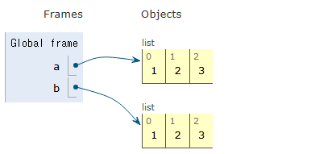
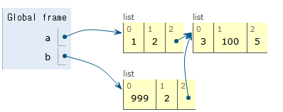
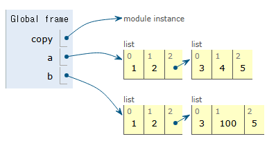
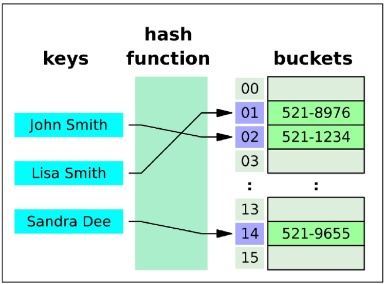
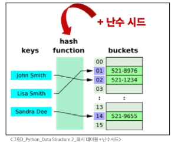

# Python 이론 2주차

## 1. Data Stucture
- 데이터 구조
  - 여러 데이터를 효과적으로 사용, 관리하기 위한 구조(list, str, dict, tuple, set, etc)
- 자료구조
  - 컴공에서는 이를 자료구조라고 함
    - 각 데이터를 효율적인 저장, 관리를 위한 구조로 나누어놓은 것
    - 단순히 데이터를 묶는 것을 넘어, 프로그램의 성능과 효율성, 유지보수성에 큰 영향을 미치는 핵심적인 개념
### 1.1 메서드
- 메서드
  - 문자열, 리스트, 딕셔너리 등 각데이터 구저의 메서드를 호출하여 다양한 기능을 활용하기
  - 메서드는 객체에 속한 함수를 말함
    - 프로그래밍에서 메서드는 객체가 특정 작업을 수행하도록 정의도니 함수
  - 메서드는 class내부에 정의도는 함수
  - 클래스는 파이썬에서 데이터 타입을 표현하는 방법이며, 이미 은연중에 사용해왔음
  - 예를 들어 help 함수를 통해 str을 호출해보면 class 였다는 것을 확인 가능
```python
print(help(str))
"""
Help on class str in module builtins:
class str(object)
str (object = "") -> str
str(bytes_or_buffer[, encoding[, error]]) -> str

Create a new string object from the given object. If encoding or error is specified, then the obhect must expose a data buffer
"""
```
- 지금 시점에 알아야 할 것
  - 메서드는 어딘가(클래스)에 속해 있는 함수이며, 각 데이터 타입별로 다양한 기능을 가진 메서드가 존재함.
  - 메서드 호출 방법
    - 데이터 타입 객체.**메서드**()
    - hello.capitalize()
  - 우리가 만든 객체(데이터)에 원하는 명령(메서드)를 내리는 방법
- 메서드 호출 예시: 데이터 타입 객체.메서드()
```python
# 문자열 메서드 예시
print('hello'.capitalize()) # Hello
# 리스트 메서드 예시
numbers = [1,2,3]
numbers.append(4)
print(numbers) # [1,2,3,4]

```
## 2. 시퀸스 데이터
### 2.1 문자열
| 메서드 | 설명 |
| ----- | --- |
| s.find(x) | x의 첫 번쨰 위치를 반환. 없으면 -1을 반환 |
| s.index(x) | x의 첫 번쨰 위치를 반환. 없으면 오류 발생 | 
| s.isupper() | 문자열 내의 모든 문자가 대문자인지 확인 | 
| s.islower() | 문자열 내의 모든 문자가 소문자인지 확인 |
| s.isalpha() | 문자열 내의 모든 문자가 알파벳인지 확인. 단순 알파뱃이 아니라 유니코드상 letter(한국어도 포함) |

- 문자열 조회/탐색 및 검증 메서드
  - **.find(x)**
  - x의 첫 번쨰 위치를 반환. 없으면 -1을 반환
```python
print('banana'.find('a')) # 1
print('banana'.find('z')) # -1
```

- 문자열 조회/탐색 및 검증 메서드
  - **.index(x)**
  - x의 첫 번쨰 위치를 반환. 없으면 오류 발생
```python
print('banana'.index('a')) # 1
print('banana'.index('z')) # ValueError: substring not found
```

- 문자열 조회/탐색 및 검증 메서드
  - **.isupper(x), .islower(x),**
  - 문자열 내의 모든 문자가 대/소문자인지 확인
```python
string1 = "HELLO"
string2 = "Hello"
print(string1.isupper()) # True
print(string2.isupper()) # False
print(string1.islower()) # False
print(string1.islower()) # False
```

- 문자열 조회/탐색 및 검증 메서드
  - **.isalpha(x)**
  - 문자열 내의 모든 문자가 알파벳인지 확인. 단순 알파뱃이 아니라 유니코드상 letter(한국어도 포함)
```python
string1 = "Hello"
string2 = "123heerfds987546ssh"
print(string1.isalpha()) # True
print(string2.isalpha()) # False
```
- 문자열 조작 메서드

| 메서드 | 설명 |
| ----- | --- |
| s.replace(old, new[, count]) | 바꿀 대상 글자를 새로운 글자로 바꾸어서 반환 |
| s.strip([chars]) | 공백이나 특정 문자를 제거 | 
| s.split(sep=None, maxsplit=1) | sep를 구분자 문자열로 사용하여문자열에 있는 단어들의 리스트르 반환 |
| 'separator'.join(iterable) | 구분자로 iterable의 문자열을 연결한 문자열을 반환 |
| s.capialize() | 가장 첫 번째 글자를 대문자로 변경 |
| s.title() | 문자열 내 띄어쓰기 기준으로 각 단어의 첫 글자는 대문자, 나머지는 소문자로 | 
| s.upper() | 모두 대문자로 | 
| s.lower() | 모두 소문자로 |
| s.swapcase() | 대 <-> 소문자를 서로 변경 |
  
- 문자열 조작 메서드
  - **.s.replace(old, new[, count])**
  - 바꿀 대상 글자를 새로운 글자로 바꾸어서 반환
```python
text = "Hello, world! world world"
new_text1 = text.replace('world', 'Python')
new_text2 = text.replace('world', 'Python', 1) # count 값이 들어가서 1개만
print(new_text1) # Hello Python! Python Python 
print(new_text2) # Hello Python! world world
```
- 문자열 조작 메서드
  - **.s.strip([chars])**
  - 공백이나 특정 문자를 제거
```python
text = "             Hello, world!       '
new_text = text.strip()
print(new_text) # Hello world!
```

- 문자열 조작 메서드
  - **.s.split(sep=None, maxsplit=1)**
  - sep를 구분자 문자열로 사용하여문자열에 있는 단어들의 리스트르 반환
```python
text = "Hello, world!'
words1 = text.split(',')
words2 = text.split()
print(words1) # ['Hello', 'world!']
print(words1) # ['Hello,', 'world!']
```
- 문자열 조작 메서드
  - **separator'.join(iterable)**
  - 구분자로 iterable의 문자열을 연결한 문자열을 반환
```python
words = ['Hello', 'world!']
text = '-'.join(words)
print(text) # Hello-world!
```
### 2.2 리스트
- 리스트 값 추가 및 삭제 메서드(여기선 원본에 조작한다, 반환값이 없다)

| 메서드 | 설명 |
| ----- | --- |
| L.append(x) | 리스트 마지막에 항목 x를 추가 |
| L.extend(m) | iterable m의 모든 항목들을 리스트 끝에 추가(+=과 같은 기능) |
| L.insert(i,x) | 리스트 인덱스 i 에 항목 x 를 삽입 | 
| L.remove(x) | 리스트 가장 왼쪽에 있는 항목(첫 번쨰) x를 제거. 항목이 없으면 ValueError |
| L.pop() | 리스트의 가장 오른쪽에 있는 항목(마지막)을 반환 후 제거 | 
| L.pop(i) | 리스트 인덱스 i에 있는 항목을 반환 후 제거 |
| L.clear() | 리스트의 모든 항목 삭제 |

- .append(x) 
  - 리스트 마지막에 항목 x를 추가
```python
a = [1,2,3]
a.append(4)
print(a) # [1,2,3,4]
```
- .extend(iterable)
  - 리스트에 다른 반복 가능한 객체의 모든 항목을 추가
```python
my_list = [1,2,3]
my_list.extend([4,5,6])
print(my_list) # [1,2,3,4,5,6]
```
  - append와의 비교
```python
my_list.append([5,6,7]) 
print(my_list) # [1,2,3,4,5,6,[5,6,7]]
```
  - 반복 가능한 객체가 아니면 추가 불가
```python
my_list.append(13) 
# TypeError: 'int' object is not iterable
```
- .insert(i, x)
  - 리스트의 지정한 인덱스 i 위치에 항목 x를 삽입
```python
my_list = [1,2,3]
my_list.insert(1,5)
print(my_list) # [1, 5, 2, 3]
```

- .remove(x)
  - 리스트에서 첫 번째로 일치하는 항목을 삭제
```python
my_list = [1,2,3,4,2,2,2]
my_list.remove(2)
print(my_list) # [1,3,4,2,2,2]
```

- .pop(x)
  - 리스트에서 지정한 인덱스의 항목을 제거하고 반환. 작성하지 않으면 마지막 항목 제거
```python
my_list = [1,2,3,4,5]
pop_a = my_list.pop()
print(my_list) # [1,2,3,4]
pop_b = my_list(0) 
print(my_list) # [2,3,4]

print(pop_a) # 5
print(pop_b) # 1
```

- .clear()
  - 리스트의 모든 항목을 제거
```python
my_list = [1,2,3,4,5]
my_list.clear()
print(my_list) # []
```

- 리스트 탐색 및 정렬 메서드

| 메서드 | 설명 |
| ----- | --- |
| L.index(x) | 리스트에서 첫 번째로 일치하는 항목 x의 인덱스를 반환 |
| L.count(x) | 리스트에서 항목 x의 개수를 반환 |
| L.reverse() | 리스트의 순서를 역순으로 변경(정렬x) | 
| L.sort() | 리스트를 정렬(매개변수 이용 가능) |

- .index(x)
  - 리스트에서 첫 번째로 일치하는 항목 x의 인덱스를 반환
```python
my_list = [1,2,3,4,5]
idx = my_list.index(2)
print(idx) # 1
```

- .count(x)
  - 리스트에서 항목 x의 개수를 반환
```python
my_list = [1,2,2,3,3,3]
count = my_list.index(3)
print(count) # 3
```

- .reverse()
  - 리스트의 순서를 역순으로 변경(정렬x)
```python
my_list = [1,2,3,4,5]
my_list.reverse()
print(my_list) # [5,4,3,2,1]
```

- .sort()
  - 리스트를 정렬(매개변수 이용 가능)
```python
my_list = [3,1,5,122]
my_list.sort()
print(my_list) # [1,3,5,122]

# 내림차순
my_list.sort(reverse=True)
print(my_list) # [122, 5, 3, 1]
```
## 3. 복사
### 3.1 객체와 참조
- 가변/불변 객체의 개념
  - 객체 복사의 핵심을 알기 위해선, 파이썬 자료구조의 가변과 불변 두 가지 종류를 알아야 함.
- Mutable 객체
  - 생성 후 내용을 변경 간으
    - list, dict, set
- immutable 객체
  - 생성 후 내용을 변경할 수 없음
    - int, float, str, tuple
- 변수 할당의 의미
  - 파이썬에서 변수 할당은 객체에 대한 참조를 생성하는 과정
    - 변수는 객체의 메모리 주소를 가리키는 label 역할을 하며
    - = 연산자를 사용해 변수에 값을 할당
    - 할당 시 새로운 객체가 생성되거나 기존 객체에 대한 참조가 생성됨
      - 새로운 객체 생성 후 참조
        - 할당되는 값이 새로운 값일 경우, 파이썬은 먼저 해당 객체를 메모리에 만들고, 변수가 그 메모리 위치를 가리키도록 함
      - 기존 객체에 대한 참조
        - 이미 메모리에 존재하는 객체를 변수에 할당하면, 새로운 객체를 만들지 않고 해당 객체에 대한 참조만 생성함
- 가변 객체의 예
  - 생성 후 내용을 변경할 수 있는 객체
```python
a = [1,2,3,4,5]b
b = a
b[0] = 100

print(a) # [100,2,3,4,5]
print(b) # [100,2,3,4,5]
print(a is b) # True
```

- 불변 객체 예시
  - 생성 후 변경 불가능한 객체
```python
a = 20
b = a
b = 10

print(a) # 20
print(b) # 10
print(a is b) # False
```

- id()함수를 이용한 메모리 주소 확인
  - id() 함수를 사용해 객체의 메모리 주소를 확인 가능
  - is 연산자를 ㅎ통해 두 변수가 같은 객체를 참조하는지 확인 가능
```python
x = [1,2,3]
y = x
z = [1,2,3]
print(f"{x의 id: {id(x)}}") # x의 id: 111111
print(f"{y의 id: {id(y)}}") # x의 id: 111111
print(f"{z의 id: {id(z)}}") # x의 id: 111222

print("x와 y는 같은 객체?", (x is y)) # x와 y는 같은 객체? True
print("x와 z는 같은 객체?", (x is z)) # x와 z는 같은 객체? False

### 같은 참조변수라 해도 값이 바뀌면 메모리 위치가 바뀜
a = 10
print(id(a)) # 140713702683720
a = 30
print(id(a)) # 140713702684360
```

- 가변/불변 메모리 관리 방식
  - 가변 객체
    - 생성 후에도 그 내용을 수정할 수 있음
    - 객체의 내용이 변경되어도 같은 메모리 주소를 유지
  - 불변 객체
    - 생성 후 그 값을 변경할 수 없음
    - 새로운 값을 할당하면 새로운 객체가 생성되고 변수는 새 객체를 참조하게 됨\
- 왜 이렇게 만들었을까?
  - 성능 최적화
    - 불변 객체: 변경이 불가능해 여러 변수가 동일한 객체를 안전하게 공유 가능
    - 가변 객체: 내용 수정이 빈번할 때 새로운 객체를 생성하는 대신 기존 객체를 직접 수정 가능. 이로 인해 객체 생성 및 삭제에 드는 비용 절감, 성능 향상
  - 메모리 효율성
    - 불변 객체: 동일한 값을 가진 여러 변수가 같은 객체를 참조할 수 있어 메모리 사용을 최소화 할 수 있음.
    - 가변 객체: 크기가 큰 데이터를 효율적으로 수정할 수 있음
### 3.2 얕은 복사(Shallow Copy)
- 객체의 최상위 요소만 새로운 메모리에 복사하는 방법. 내부에 중첩된 객체가 있다면, 그 객체의 참조만 복사됨
- Shallow copy 구현 방법
  - 리스트 슬라이싱
  - copy() 메서드
  - list() 메서드
```python
a = [1,2,3]
b = a[:]
c = a.copy()
d = list(a)

print(a) # [1,2,3]
print(b) # [1,2,3]
print(c) # [1,2,3]
print(d) # [1,2,3]
```

- Shallow copy의 한계
  - 2차원 리스트와 같이 변경 가능한 객체 안에 변경 가능한 객체가 있는 경우
```python
a = [1,2,[3,4,5]]
b = a[:]

b[0] = 999
print(a) # [1,2,[3,4,5]]
print(b) # [999,2,[3,4,5]]


b[2][1] = 100
print(a) # [1,2,[3,100,5]]
print(b) # [999,2,[3,100,5]]

print(a[2] is b[2] # True
```


- 1차원 리스트와 다차원 리스트에서의 차이점
  - 1차원 리스트: 얕은 복사로 충분히 독립적인 복사본 생성 가능
  - 2차원 리스트: 최상위 리스트만 복사됨.
### 3.3 깊은 복사
- 객체의 모든 수준의 요소를 새로운 메모리에 복사하는 방법. 중첩된 객체까지 모두 새로운 객체로 생성
```python
import copy
a = [1,2,[3,4,5]]
b = copy.deepcopy(a)
b[2][1] = 100

print(a) # [1,2,[3,4,5]]
print(b) # [1,2,[3,100,5]]
print(a[2] is b[2]) # False
```

## 참고
### list comperhension
- 간결하고 효율적인 리스트 생성 방법
```python
[expression for 변수 in iterable]
list[expression for Variable in iterable]

[expression for 변수 in iterable if 조건식]
list[expression for Variable in iterable if 조건식]
```
List Comprehension 구조 비교
```python
# 사용 전
numbers = [1,2,3,4,5]
squared_numbers = []

for num in numbers:
    squared_numbers.append(num**2)
print(squared_numbers) # [1,4,9,16,25]

# 사용 후 
numbers = [1,2,3,4,5]
squared_numbers = [num**2 for num in numbers]
print(squared_numbers) # [1,4,9,16,25]
# 2차원 배열 생성 예시 2가지
data1 = [[0]*5 for _ in range(5)]
# 또는
data2 = [[0 for _ in range(5)] for _ in range(5)]
# 결과
[[0,0,0,0,0],
[0,0,0,0,0],
[0,0,0,0,0],
[0,0,0,0,0],
[0,0,0,0,0]]
```
- 다만 난발하지 말 것.
- 팁. 컴프리핸션 쓰는게 빠름? for 문 돌리는게 빠름? 
  - 상황에 따라 다름. 단, 일반적인 상황에서

    1. list comprehension
        - 가장 'Pythonic'하고 대부분의 경우 우수한 성능을 보임
    2. map
        - 특정 상황(int, str 등 내장 함수와 함께 사용할 때)에서 가장 빠름
        - 사용자가 직접 만든 함수나 lambda와 함께 사용될 때는 list comprehension과 성능이 비슷하거나 약간 느릴 수 있음
    3. for loop
        - 일반적으로 가장 느리다고 알려져 있지만, python 버전이 올라가면서 다른 방식과 비슷하거나 때로는 더 나은 결과를 보이기도 함
        - 하지만, 여러 줄에 걸친 복잡한 조건문이나 예외 처리 등이 필요할 때는 유일한 선택지이며, 그 자체로 매우 유용함

### 메서드 체이닝
- 여러 메서드를 연속해서 호출하는 방식
```python
text = 'heLLo, woRld!'
new_text = text.swapcase().replace('l','z')
print(new_text) # HEzzO, WOrLD!
# 코드 실행 순서
## 1. text.swapcase() 대소문자 반전 -> HEllo, WOrLD!
## 2. .replace('l','z') 소문자 l을 z로 변경 -> HEzzo, WorLD!
```
- 메서드 체이닝 예시 2번
```python
numbers = [3,1,4,1,5,9,2]
result = numbers.copy().sort()
print(numbers) # [3,1,4,1,5,9,2] 원본은 그대로
print(result) # None (sort 메서드는 None를 반환하기 때문)

# 올바른 체이닝
sorted_numbers = sorted(numbers.copy())
print(sorted_numbers) # [1,1,2,3,4,5,9]
```
- 메서드 체이닝 주의사항
  - 모든 메서드가 체이닝을 지원하는건 아님
  - 메서드가 객체를 반환할때만 가능
- None을 반환하는 메서드는 메서드 체이닝이 불가능
  - ex) 리스트의 append(), sort()
- 메서드 체이닝을 사용할 때는 각 메서드의 반환 값을 잘 이해하고 있어야 함.
### 문자 유형 판별 메서드
- 문자열에 포함된 문자들의 유형을 판별하는 메서드
  - isdecimal(): 문자열이 모두 숫자(0~9)로만 이루어져 있어야 True
  - isdigit(): isdecimal과 비슷하지만 유니코드 숫자도 인식((1)도 숫자로)
  - isnumberic(): isdigit()과 유사하지만, 몇 가지 추가적인 유니코드 문자들도 인식
    - 분수, 지수, 루트, 기호도 인식
# Data Structure 2일차
## 1. 비시퀀스 데이터 구조
### 1.1 딕셔너리
- key와 value을 짝지어 저장하는 자료구조
  - 내부적으로 해시테이블을 사용하여 key-value를 관리
  - 키를 통한 값의 삽입, 삭제 검색이 데이터 크기와 관계없이 매우 빠름
  - 키는 hashable 한 고유 값이여야 하지만, 값은 중복이 가능하고 어떠한 자료형도 저장 가능

| 메서드 | 설명 |
| ---- | ---- |
| D.get(k) | 키 k에 연결된 값을 반환(키가 없으면 None을 반환) |
| D.get(k, v) | 키 k에 연결된 값을 반환하거나 키가 없으면 기본 값으로 v를 반환 | 
| D.keys() | 딕셔너리에서 키(key)를 모은 객체를 반환 |
| D.values() | 딕셔너리에서 값(value)를 모은 객체를 반환|
| D.items() | 딕셔너리 키/값 쌍을 모은 객체를 반환 |
| D.pop(k,v) | 키를 제거하고 연결됐던 값을 반환(없으면 에러나 default) |
| D.clear() | 딕셔너리의 모든 키/값 쌍을 제거 |
| D.setdefault(k, v) | 키와 연결된 값을 반환, 키가 없다면 default와 연결한 키를 딕셔너리에 추가하고 default를 반환 |
| D.update(other) | other가 제공하는 키/값 쌍으로 딕셔너리를 갱신, 기존 키 값은 덮어쓰기 |

- .get(key[,default])
  - 키 연결된 값을 반환하거나 키가 없으면 None 혹은 기본 값을 반환
```python
person = {'name': 'Alice', 'age': 25}
print(person.get('name')) # Alice
print(person.get('country')) # None
print(person.get('country', 'Unknown')) # Unknown
print(person.get['country']) # KeyError 'country'

# 왜 get을 쓰냐? 그냥 person['name'] 을 쓰지? -> get 써서 value 뽑아오면 없을때 에러가 발생하지 않음. None을 반환함.
```
- .keys()
  - 딕셔너리에서 키를 모은 객체를 반환
  - keys 객체는 실시간 동기화 되는 객체임
    - 키 값이 추가되거나 바뀌면 변경됨. 
```python
person = {'name': 'Alice', 'age': 25}
print(person.keys()) # dict_keys(['name', 'age'])
my_ = person.keys() # 여기에 들어간건 name, age지만
my_['country'] = 'Korea' # 이렇게 추가하면 

print("a", my_[0])  # 리스트 스럽진 않지만 TypeError: 'dict_keys' object is not subscriptable
print("a", type(my_)) # dict_keys 타입이 옴.

for key in my_: # iterable 한 객체라 for 문 돌리는건 가능
    print(key) # 여기선 country 도 들어감
# 동적객체임
```
- .values()
  - 딕셔너리에서 값를 모은 객체를 반환
  - 값 객체는 실시간 동기화 되는 객체임
    - 값 추가되거나 바뀌면 변경됨. 
```python
person = {'name': 'Alice', 'age': 25}
print(person.values()) # dict_values(['Alice', 25])
my_ = person.values() # 여기에 들어간건 name, age지만
my_['country'] = 'Korea' # 이렇게 추가하면 

print("a", my_[0])  # 리스트스럽지만 TypeError: 'dict_values' object is not subscriptable
print("a", type(my_)) # dict_values 타입이 옴.

for value in my_: # iterable 한 객체라 for 문 돌리는건 가능
    print(value) # 여기선 Korea 도 들어감
# 동적객체임
```
- .items()
  - 딕셔너리 키/값 쌍을 모은 객체를 반환
```python
person = {'name': 'Alice', 'age': 25}
print(person.items()) # dict_items ([('name', 'age'), ('Alice', 25)]) # 튜플로 묶인 객체. 마찬가지로 []s는 장식이라서 인덱스 넣어도 제대로 동작하진 않음.

for key, value in person.items():
  print(key, value)
```

- .pop(key[, defalut])
  - 키를 제거하고 연결됐던 값을 반환(없으면 에러나 default) 
```python
person = {'name': 'Alice', 'age': 25}
print(person.pop('age')) # 25
print(person) # {'name': 'Alice'}
print(person.pop('counrty', None)) # None -> default없으면 KeyError
```
- .setdefault(key[,defalut])
  - 키와 연결된 값을 반환하는데, 키가 없으면 default값을 딕셔너리에 추가하고 반환
  - 알고 있으면 조금 더 편하게 쓸 수 있음. 
```python
person = {'name': 'Alice', 'age': 25}
print(person.setdefault('counrty', 'KOREA')) # KOREA
print(person) # {'name': 'Alice', 'age': 25, 'country' : 'KOREA'}
```
- .update([other])
  - other가 제공하는 키/값 쌍으로 딕셔너리를 갱신, 기존 키 값은 덮어쓰기
```python
person = {'name' :'Alice', 'age' :25}
other_person = {'name' :'손흥민', 'country' : '한국'}

person.update(other_person) # {'name' :'손흥민', 'age' :25, 'country' : '한국'}
person.update(age=100, address='Seoul') # {'name' :'손흥민', 'age' :100, 'country' : '한국', 'address' : seoul}
```
### 1.2 세트
- 고유한 항목들의 정렬되지 않은 컬렉션
  - Set은 내부적으로 해시 테이블을 사용하여 데이터를 저장함.
  - 항목의 고유성을 효율적으로 보장, 항목의 추가, 삭제, 존재 여부 확인(in연산)이 데이터 크기와 관계없이 매우 빠름
  - 합,교,차/집합 등 수학적인 집합연산을 간편하게 수행 가능
- 리스트 중복 제거 쉽게 하기 위해서 list -> set -> list 하는데 주의해야할건
  - 요구조건에 순서를 지키느냐를 물어봐야함. 형 변환 할때마다 순서가 다 깨짐.

| 메서드 | 설명 |
| ---- | ---- |
| s.add(x) | 세트 s에 항목 x를 추가. 없으면 변화 x |
| s.update(iterable) | 세트 s에 다른 iterable 요소를 추가 |
| s.clear() | 세트 s의 모든 항목 제거 |
| s.remove(x) | 세트 s에서 항목 x를 제거. 항목 x가 없을 경우 Key Error |
| s.pop() | 세트 s에서 임의의 항목을 반환하고 해당 항목을 제거 |
| s.discard(x) | 세트 s에서 항목 x를 제거 |

- .add(x)
  - 세트 s에 항목 x를 추가. 없으면 변화 x
```python
my_set = {'a', 'b', 'c', 1, 2, 3}
my_set.add(4)
print(my_set) # {1, 2, 3, 4, 'a', 'c', 'b'}

my_set.add(4) # 같은 값을 다시 추가해도
print(my_set) # 결과는 똑같음. set은 중복을 허용하지 않음. {1, 2, 3, 4, 'a', 'c', 'b'}
```
- s.update(iterable)
  - 세트 s에 다른 iterable 요소를 추가
```python
my_set = {'a', 'b', 'c', 1, 2, 3}
my_set.update([1,4,5])
print(my_set) # {'a', 'b', 'c', 1, 2, 3, 4, 5}
```

- s.remove(x)
  - 세트에서 항목 x를 제거. 항목 x가 없을 경우 KeyError
```python
my_set = {'a', 'b', 'c', 1, 2, 3}
my_set.remove(2)
print(my_set) # {'a', 'b', 'c', 1, 3}

my_set.remove(10) # 없는걸 제거하면? 에러가 뜸. KeyError
```

- s.pop()
  - 세트에서 임의의 요소를 제거하고 반환
  - 임의 라고 하지만, random은 아님. 무작위는 아님. 
```python
my_set = {'a', 'b', 'c', 1, 2, 3}
pop_result = my_set.pop()
print(my_set) # {'a', 'b', 'c', 1, 3} # 뭔가 없어짐
print(pop_result) # 뭔가가 pop_result에 할당됨
```

- s.discard(x)
  - 세트 s에서 항목 x를 제거. remove와 달리 에러 없음
```python
my_set = {'a', 'b', 'c', 1, 2, 3}
my_set.discard(2)
print(my_set) # {'a', 'b', 'c', 1, 3} # 2가 없어짐
my_set.discard(10) # 해도 에러 안남.
```
- 세트의 집합 메서드들

| 메서드                    | 설명                                                                 | 연산자           |
|--------------------------|----------------------------------------------------------------------|------------------|
| `set1.difference(set2)`  | set1에는 들어있지만 set2에는 없는 항목으로 세트를 생성 후 반환       | `set1 - set2`    |
| `set1.intersection(set2)`| set1과 set2 모두 들어있는 항목으로 세트를 생성 후 반환               | `set1 & set2`    |
| `set1.issubset(set2)`    | set1의 항목이 모두 set2에 들어있으면 True를 반환                     | `set1 <= set2`   |
| `set1.issuperset(set2)`  | set1이 set2의 항목을 모두 포함하면 True를 반환                       | `set1 >= set2`   |
| `set1.union(set2)`       | set1 또는 set2(혹은 둘 다) 들어있는 항목으로 세트를 생성 후 반환     | set1 (작대기) set2|

```python
# 집합 메서드
set1 = {0, 1, 2, 3, 4}
set2 = {1, 3, 5, 7, 9}
set3 = {0, 1}

print(set1.difference(set2))  # 차잡합 {0, 2, 4}
print(set1.intersection(set2))  # 교집합 {1, 3}
print(set1.issubset(set2))  # set1 이 set 2의 서브set인가? (set2가 set1을 품을 수 있는가?) False
print(set3.issubset(set1))  # set3 이 set 3의 서브set인가? (set2가 set1을 품을 수 있는가?) True
print(set1.issuperset(set2))  # False
print(set1.union(set2))  #  합집합 {0, 1, 2, 3, 4, 5, 7, 9}
```
## 2 참고
### 2.1 해시 테이블
- 해시 테이블은 키와 값을 짝지어 저장하는 자료 구조
  - 키를 해시 함수를 통해 해시 값으로 변환
  - 변환된 해시 값을 인덱스 삼아 데이터를 저장하거나 찾음
  - 이로 인해 검색, 삽입, 삭제를 매우 빠르게 진행

위 이미지 처럼, 딕셔너리나 셋에서 키(예: 문자열)는 해시 함수를 통해 정수값(해시값)으로 변환되고, 이 해시값은 내부 해시 테이블의 인덱스를 계산하는 데 사용되어, 매우 빠르게 (거의 O(1) 시간에) 해당 값에 접근할 수 있게 해준다.
- 해시(hash)
  - 임의의 크기를 가진 데이터를 고정된 크기의 고유한 값으로 변환한 것
    - 생성된 해시 값(고유한 정수)은 해당 데이터를 식별하는 '지문' 역할을 함
    - 파이썬에서는 이 해시 값을 이용해 해시 테이블에 데이터를 저장
    - 이 변환을 수행하는 것이 해시 함수
- 해시 함수(Hash Function)
  - 임의 길이 데이터를 입력받아 고정 길이로 변환해주는 함수. 이 변환된 정수가 해시 값
  - 주로 해시테이블을 구현할 때 매우 빠른 검색 및 데이터 저장 위치 결정을 위해 활용
  - 해시 알고리즘이라고 부르기도 함.
- set의 요소 & dict 의 키와 해시 테이블 관계
  - set
    - 각 요소를 해시 함수로 변환해 나온 해시 값에 맞추어 해시테이블 내부 버킷에 위치시킴
    - 그래서 순서라기보다, 버킷 위치(인덱스)가 요소의 위치를 결정
    - 따라서 set은 순서를 보장하지 않음
  - dict
    - key -> 해시 함수 -> 해시 값 -> 해시 테이블에 저장
    - 단, set와 달리 삽입 순서는 유지한다는 것이 언어 사양에 따라 보장(3.7버전부터)
      - 즉, 키를 추가한 순서대로 반복문 순회할 때 나오게 됨
      - 사용자에게 보여지는 키 순서는 삽입 순서가 유지되도록 설계된 것. 
  
- hash 의 특징
  - 정수가 hash함수를 통과한다 -> 결과도 어차피 정수기 때매 해시 값이 자기 자신과 동일하거나 단순 계산으로 고정
```python
# 정수
my_set = {3, 2, 1, 9, 100, 4, 87, 39, 10, 52}
print(my_set.pop())
print(my_set.pop())
print(my_set.pop())
print(my_set.pop())
print(my_set.pop())
print(my_set.pop())
print(my_set.pop())
print(my_set.pop())
print(my_set.pop())
print(my_set.pop())
print(my_set)
# 항상 이 결과는 똑같음
```
- 문자열은 해시 계산시 파이썬의 난수화가 적용되며, 실행마다 순서가 다 바뀜.
```python
my_str_set = {'a', 'b', 'c', 'd', 'e', 'f', 'g', 'h', 'i', 'j'}
print(my_str_set.pop())
print(my_str_set.pop())
print(my_str_set.pop())
print(my_str_set.pop())
print(my_str_set.pop())
```
- 파이썬에서의 해시 함수
  - 정수
    - 같은 정수는 항상 같은 해시 값을 가짐
    - 예) hash(1)은 여러번 호출해도 결과가 동일
  - 문자열
    - 문자열 해시 시 파이썬 인터프린터 시작 때 설정되는 난수 seed가 달라질 수 있음
    - 보안상 이유로 해시 난수화 도입
    - 각 실행마다 달라질 수 있어 'a'의 해시값도 매번 바뀜
```python
print(hash(1))
print(hash(1)) # 항상 결과 동일
print(hash('a'))
print(hash('a')) # 매번바뀜
```
- hash randomization 과 난수 시드
  - 파이썬 프로세스가 새로 시작될때마다 해시를 계산할 때 사용하는 난수 시드가 달라짐
    - 해시 함수가 매번 바뀌는게 아니라 해시 계산에 쓰이는 시드값이 실행때마다 달라짐.
    - 이로 인해 동일한 데이터라도 매번 해시 값이 달라져 결과적으로 버킷 배치가 달라짐
- set의 요소 & dict의 키와 해시테이블의 관계
  - set pop()은 "임의의 요소"를 제거하고 반환
    - 실행될 때마다 다른 요소를 얻는다는 의미에서 무작위 가 아니라
    - 임의 라는 의미에서 무작위
  - 내부적으로 해시 테이블(버킷)을 참조하기 때문에, 실행 때마다 다른 요소가 먼저 나올 수 있음
    - 해시 난수화로 인해 문자열 같은 해시값이 실행마다 달라질 수 있고 따라서 set 내부 요소의 배치가 달라질 수 있음
    - 정수는 해시 값이 항상 동일하기 때문에, 파이썬을 동일 프로세스에서 연속 실행할 때는 결과가 어느 정도 일정해 보이기도 하지만, 여전히 set은 순서가 없음으로 pop되는 순서는 예측 불가능
- hashable
  - hash() 함수에 넣어 해시 값을 구할 수 있는 객체를 의미
  - 대부분의 불변 타입은 해시 가능
    - int, float, str, tuple(단, 내부에 불변만 있는 경우)
  - 가변형 객체는 기본적으로 hash불가(list, dict, set)
    - 값이 변하면 해시값도 바뀔 수 있어서 해시 테이블 무결성이 깨진다.
```python

print(hash(1))
print(hash(1.0))
print(hash('1'))
print(hash((1, 2, 3)))

print(hash((1, 2, [3, 4]))) # TypeError: unhashable type: 'list'
```
- hashable과 불변성 간의 관계
  - 해시 테이블(set, dict의 key)에는 hashable 만 저장 가능
  - 불변 객체는 생성 후 값 변경이 불가능해 항상 같은 hash값을 유지
  - 다만 hash가능 != 불변이다 는 절대적이진 않지만 일반적으로 내장 자료형 기준에서는 불변이어야 해시 가능
- 가변 객체는 왜 안됨?
  - 해시 값은 불변성이 중요한데, list와 같은 가변 객체가 키가 된다면?
  - 그 키 값이 바뀌면(리스트를 수정하면) hash값도 같이 바뀌고
    - 데이터를 저장한 인덱스와 변경 후 찾으려는 인덱스간 불일치가 발생
```python
# TypeError: unhashable type: 'list'
print(hash([1, 2, 3]))
# TypeError: unhashable type: 'list'
my_set = {[1, 2, 3], 1, 2, 3, 4, 5}
# TypeError: unhashable type: 'set'
my_dict = {{3, 2}: 'a'}
```
  
- hashable 객체가 필요한 이유
1. 해시 테이블 기반 자료 구조 사용
   1. set의 요소, dict의 키
   2. 중복 방지 & 빠른 검색, 조회
2. 불변성을 통한 일관된 해시 값
   1. 한번 해시 값이 정해지면 바뀌지 않아야 해서 해시 테이블 무결성이 유지
3. 안정성과 예측 가능성 유지
   1. 동일한 데이터는 항상 동일한 해시 값을 반환 -> 로직을 단순화
- 해시 테이블 정리
  - 해시 테이블은 해시 값을 인덱스로 삼아 데이터를 저장, 검색
  - 파이썬의 set은 순서가 없고 pop()시 어떤 요소가 반환될 지 정해져 있찌 않음
  - dict은 파이썬 3.7 버전부터 삽입 순서가 보장되지만, 내부 구현은 여전히 해시테이블
  - 해시 함수는 정수/문자열 등 타입에 따라 다르게 동작하며 문자열 해시 시 난수화로 실행마다 달라질 수 있음
  - hashable(해시가 가능한 객체) 객체만 set과 dict키로 사용 가능하며 일반적으로 불변 타입이 이에 해당.
### 2.2 파이썬 문법 규격
