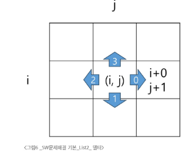
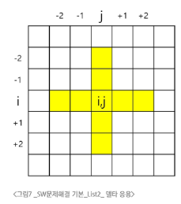
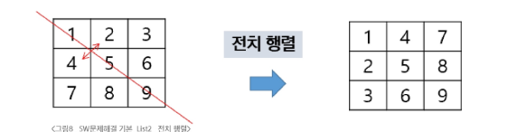
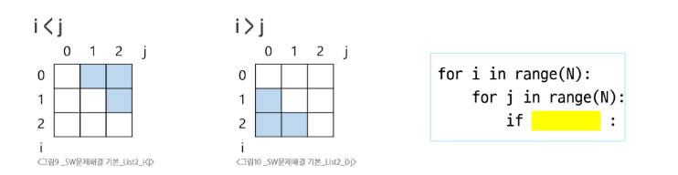
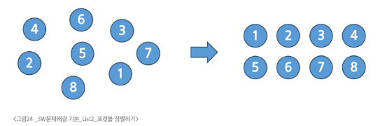

# 1. 알고리즘
- APS(Algorithm Problem Solving) 기본 학습
  - 기초 자료 구조 이해 중심
  - 입출력을 제외한 내장함수를 사용하지 않습니다.
  - 기본적인 내장함수의 **동작원리**를 이해합니다.
- Algorithm
  - 문제를 해결하기 위한 절차나 방법
- 의사코드
  - 컴퓨터 분야에서 알고리즘을 표현하는 방법
- 알고리즘의 성능: 보다 좋은 알고리즘을 이해하고 활용하기
  - 좋은 알고리즘이란?
    - 정확성: 얼마나 정확하게 동작하는가?
    - 작업량: 얼마나 적은 연산으로 원하는 결과를 얻어내는가?
    - 메모리 사용량: 얼마나 적은 메모리를 사용하는가?
    - 단순성: 얼마나 단순한가?
    - 최적성: 더 이상 개선할 여지 없이 최적화 되었는가?
  - 알고리즘의 성능
    - 주어진 문제를 해결하기 위해 여러 개의 다양한 알고리즘이 가능
    - 알고리즘의 성능 분석 필요
  - 알고리즘의 시간 복잡도
    - 알고리즘의 작업량을 표현할 때 시간복잡도로 표현합니다.
    - 시간 복잡도(Time Complexity)
  - 시간 복잡도의 표기
    - Big-O Noatation을 언급하는 경우가 많음
    - 시간복잡도 함수 중에서 가장 큰 영향역을 주는 n에 대한 항만을 표시
    - 계수는 생략해 표시
    - O(3n +2) = O(3n) = O(n)
# 2. List
- 배열
    - 일정한 자료형의 변수들을 하나의 이름으로 열거하여 사용하는 자료 구조
- 배열의 필요성
    - 프로그램 내에서 여러 개의 변수가 필요할 때
    - 일일이 다른 변수명을 이용해 접근하는건 비효율적
    - .append()는 약간 문제가 있음. 얘는 크기가 정해지지 않은 배열에서 동작하는것.
    - 크기가 정해진 배열을 선언해서 사용하는게 좋음. pop()도 마찬가지
    - 문법은 어차피 사용자 함수 만들고 그런것만 하면 되긴 한데 문법공부 하는게 좋음. 
    - while, 다중 for 문 사용 잘 하는거. elif 등
  - 배열 원소의 합 구하는 코드 예시를 보자
    - 0~100까지 합을 구하는 코드를 만든다면?
```python
def sum_all(in_arr, n):
  result = 0
  for i in range(N):
    result += arr[i]
  return result

if __name__ == "__main__:
  arr = [2,7,5,3,1,4]
  N = 6
  sum_all(arr, N)
```
  - 여기서 간단한 팁
    - range(len(arr)) 이렇게 하는 경우 많은데, 그냥 N 써라. 이거 연산 잡아먹는거 아니냐.
  - 배열 원소 중 최대값 구하기
```python
def get_max(in_arr, n):
  max_v = in_arr[0]
  for i in range(1,n):
    if max_v < arr[i]:
      max_v = arr[i] # arr[i]가 더 크면 max_v 갱신
if __name__ == "__main__:
  arr = [2,7,5,3,1,4]
  N = 6
  print(get_max(arr, N))
```
  - 배열 원소 중 최대값의 index 구하기
```python
def get_max_idx(in_arr, n):
  max_idx = 0
  for i in range(1,n):
    if arr[max_idx] < arr[i]:
      max_idx = i # 더 큰 값을 만나면 max_idx 갱신. 굳이 max_val 따로 할 필요 없음.
if __name__ == "__main__:
  arr = [2,7,5,3,1,4]
  N = 6
  print(get_max_idx(arr, N))
```
  - 최댓값이 여러 개인 경우? 가장 마지막(오른쪽) 혹은 왼쪽을 찾는다고 하면?
    - 왼쪽(처음)을 찾는다면? 신경쓸거 없음 킵 고잉. 어차피 더 큰걸 찾는거니까
    - 만약 마지막(오른쪽)이라면?
```python
max_idx = 0
for i in range(1, N):
  if arr[max_idx] <= arr[i]: # 크거나 같으면으로 해결
    max_idx = i
```
  - 같은 값을 찾는 코드
```python
idx = -1
for i in range(N):
  if arr[i] == V:
    idx = i
    break
```
- 연습 문제
- 버블 정렬
  - 정렬: 2개 이상의 자료를 키(기준)에 의해 작은값부터 큰 값, 혹은 그 반대 순서로 재배열 하는 알고리즘
  - 버블 정렬: 인접한 두 개의 원소를 비교하며 자리를 계속 교환하는 방식
    - 첫 번째 원소부터 인접한 원소끼리 계속 자리를 교환하면서 맨 마지막 자리까지 이동한다
    - 한 단계가 끝나면 가장 큰 원소가 마지막 자리로 졍렬된다
  - 시간복잡도 O(n^2)
```python
def bubble_sort(in_arr, N):
  for i in range(N-1, 0, -1):
    for j in range(i):
      if arr[j] > arr[j+1]:
        arr[j], a[j+i] = a[j+i], arr[j]
# 코드 아이디어는 2중 for 문을 똑똑하게 쓰는것. 
# 1회차 정렬이 끝나면 마지막 원소(가장 큰 값)이 고정되는거고, 그 다음 회차에 한칸씩 뒤로 가면서 값이 결정된다. 
# 따라서 제일 외곽 for문은 반복문을 거꾸로 써서 하나씩 범위를 줄여가며 수행할 수 있도록 하게 한다.
```
- 카운팅 정렬
  - 항목들의 순서를 결정하기 위해 집합에 각 항목들이 몇개 씩 있는지 세는 작업을 하여 선형 시간에 정렬하는 효율적인 방식
  - 한계
    - 정수나 정수로 표현 가능한 자료만 가능
    - 카운트들을 위한 충분한 공간을 할당하려면 집합 내의 가장 큰 정수를 알아야 함
  - 시간복잡도 O(n+k): n은 리스트 길이, k는 정수의 최댓값
  - 카운팅 정렬의 순서
    - 각 항목들의 발생횟수를 카운팅
    - 횟수 + 직전 횟수를 더해서 해당 수가 차지하는 공간(마지막 인덱스 공간)을 구함
    - 이후 원본 배열을 순차적으로 탐색하며 인덱스를 하니씩 줄여가며 원소들을 배치
```python
arr = [0,4,1,3,1,2,4,1] # 초기 배열
idx_arr = [0] * (max(arr) + 1) # 카운팅 배열. 가장 큰 값 + 1
result_arr = [0] * len(arr) # 초기 배열과 동일한 크기의 배열이 필요

for val in arr: # 카운팅 정렬에 원소들을 세서 넣음
    idx_arr[val] += 1

for idx in range(1, len(idx_arr)): # 배열 보정. 인덱스 위치에 마지막 원소가 들어가도록 보정
    idx_arr[idx] = idx_arr[idx] + idx_arr[idx-1]

for val in reversed(arr): # 출력 리스트 생성. 뒤에서부터 접근해 최종 출력 리스트 생성
  # 왜 뒤에서 부터? 정렬 안정성 
  # 이게 서로 완전히 동일한 숫자를 정렬하면 상관없는데, 객체를 선언해서 숫자로 정렬하면 이게 꼬이면 귀찮아짐.
  # 예를 들어서 좌표, x,y 1,2로 되어 있는데 y는 정렬되어 있다면 만약 앞에서 부터 접근하면 다 뒤집힘. 그니까 그냥 뒤에서 해도 됨.
    idx_arr[val] -= 1
    result_arr[idx_arr[val]] = val

print(result_arr)
```
- 완전 검색
  - 예시 문제: Baby gin Game
    - 0~9사이 숫자 카드에서 임의 6장 뽑았을 때. 3장의 카드가 연속적인 경우 run이라 하고, 3장 카드가 동일한 번호를 가지면 triplet이라고 한다. 
    - 그리고 6장의 카드가 triplet과 run으로만 구성된 경우 baby-gin으로 부른다. 
    - 이 프로그램을 만들어 본다면? 완전검색
  - 완전 검색의 필요성
    - 모든 경우의 수를 생성하고 테스트 하기 때문에 수행 속도는 느리지만 해답을 못 찾아낼 확률이 낮다
    - 자격검정평다 등에서 문제 풀때 완전탐색 하고 최적화 하는게 바람직
  - baby gain 접근
    - 6개로 만들 수 있는 모든 숫자 나열(중복 포함)
    - 앞 뒤로 3개씩 잘라 run, triplet 확인해 baby_gin 판단
  - 순열
    - 서로 다른 것들 중 몇 개를 뽑아서 한 줄로 나열하는 것
    - nPr(서로 다른 n개중 r개를 택하는 순열)
      - nPr = n * (n-1) * (n-2) * ... * (n-r+1)
    - nPn = n! 이라 표기하며 Factorial 이라 부릅니다.
      - n! = = n * (n-1) * (n-2) * ... * 2 * 1
  - 단순하게 순열을 생성하는 방법
    - 1,2,3을 포함하는 모든 순열을 생성하는 함수
      - 동일한 숫자가 포함되지 않았을 때, 각 자리수 별로 loop을 이용해 아래와 같이 구현 가능
```python
for i1 in range(1,4):
  for i2 in range(1,4):
    if i2 != i1:
      for i3 in range(1,4):
        if i3 != i1 and i3 != i2::
          print(i1, i2, i3)


```
- 탐욕 알고리즘
  - 여러 경우 중 하나를 결정해야 할 때 마다 그 순간에 최적이라고 생각되는 것을 선택해 나가는 방식으로 진행하여 최종적인 해답에 도달하는 방식
  - 특징
    - 최적해를 구하는 데 사용되는 근시안적인 방법
    - 각 선택의 시점에서 이루어지는 결정은 지역적으로는 최적이지만, 그 선택들을 계속 수집하여 최종적인 해답을 만들었다 해도, 그것이 최적이라는 보장은 없음
    - 일반적으로 머릿속에 떠오르는거 검증 없이 구현하면 그리디임
  - 탐욕 알고리즘 과정
    - 해 선택: 현재 상태에서 부분 문제의 최적 해를 구한 뒤 이를 부분 집합 해에 추가
    - 실행 가능성 검사: 새로운 부분 해 집합이 실행 가능한지 확인. 곧 문제의 제약조건을 위반하지 않는지 검사
    - 해 검사: 새로운 부분 해 집합이 문제의 해가 되는지 확인. 아직 전체 문제의 해가 완성이 아니라면 1번부터 다시 시작
  - 거스럼돈 줄이기: 어케 하면 손님에게 주는 지폐랑 동전의 수를 최소한으로 줄일 수 있나?
    - 1단계: 멀리 내다 볼 것 없이 가장 좋은 해를 선택
      - 단위가 큰 동전으로만 거스럼돈을 주면 동전의 수가 줄어들아 현재 고를 수 있는 가장 큰 단위 동전을 하나 골라 거스럼돈에 준다
    - 2단계: 실행 가능성 검사
      - 거스럼돈이 손놈에게 줘야 할 돈을 초과하는기 점산
      - 초과한다면 마지막 추가 동전을 빼고, 1로 돌아가 한 단계 작은 동정르 추가
    - 3단계 해 선택
      - 돈이 일치하는지 확인. 모자라면 1로 돌아가 동전을 고름.
# 3. List2
## 3.1 2차원 List
- 2차원 배열의 선언
  - 1차원 list를 묶어놓은 list
  - 2차원 이상의 다차원 list는 차원에 따라 idx를 선언
  - 2차원 list의 선언: 세로 길이(행의 개수), 가로 길이(열의 개수)를 필요로 함
  - Python 에서는 데이터 초기화를 통해 변수선언과 초기화가 가능함
### 3.1.1 2차원 배열
| arr | 0 | 1 | 2 | 열 |
| --- | --- | --- | --- | --- |
| 0 | 0 | 1 | 2 | 3 |
| 1 | 4 | 5 | 6 | 7 |
| 행 | | | | |

```python
N = int(input())
arr = [list (map(int,input().split())) for _ in range(N)]
```

```python
# 지그재그 순회
for i in range(n):
  for j in range(m):
    f(arr[i][j + (m-1-2*j) * (i%2)])  #짝수일땐 j, 홀수일땐 i
    # 뒤에 (i&2) 의 결과가 홀수일땐 1, 짝수일땐 0이 나옴
    # 그래서 홀수일땐 (m-1-2*j) 가 살아남고, 짝수일땐 없어짐)
    # 따라서 홀수일땐 역순으로, 짝수일땐 정상순서로 이동하게 로직이 구성됨
```

### 3.1.2 델타
- 델타를 활용한 2차원 배열 탐색
  - 2차원 배열의 한 좌표에서 4방향의 인접 배열 요소를 탐색하는 방법
  - 인덱스 i, j인 칸 상하좌우 nj, ni



```python
# 방향 별로 더할 값의 순서를 배열로 선언 위 이미지처럼 오른쪽에서 시계방향으로 순회한다고 하면 더할 값.
di = [0,1,0,-1] 
dj = [1,0,-1,0]

for k : 0 -> 3
  ni = i + di[k]
  nj = j + dj[k]
```
- 델타 배열 예제 코드
```python
arr[0...N-1][0...N-1] # N X N 배열
di = [0,1,0,-1] 
dj = [1,0,-1,0]

for i in range(0, N-1):
  for j in range(0, N-1):
    for d in range(4):
      ni = i + di[d]
      nj = j + dj[d]
      if 0 <= ni < N and 0 <= nj < N:
        print(arr[ni][nj]) # 오른쪽부터 시계방향으로 회전하며 4개의 주변 좌표의 값을 출력

# 파이썬식 간략한 표현

for i in range(N):
  for j in range(N):
    for di, dj in [[0,1],[1,0],[0,-1],[-1,0]]:
      ni, nj = i + di, j + dj
```
- 델타 배열의 응용 
  - NxN 배열에서 각 원소를 중심으로, 상하좌우 k칸의 합계 중 최대값 

```python
max_v = 0
k = 2 # 중심에서 2개 떨어진곳 까지 간다
for i in range(N):
  for j in range(N):
    s = arr[i][j] # 중심
    for di, dj in [[0,1],[1,0],[0,-1],[-1,0]]: # 빙향정보 순회
      for c in range(1,k+1): # 떨어진 거리 k까지 반복. 이 코드에선 1,2
        ni, nj = i+(di*c), j+(dj*c) # 현재위치(델타값 * 떨어진 위치)
        if 0 <= ni < N and 0 <= nj < N: # 초과 조건
          s += arr[ni][nj]
    if max_v < s:
      max_v = s
```
- 전치 행렬
  - 서로 좌표값 위치 바꾼 행렬(1,0)-> (0,1)
```python
# i 행의 좌표 len(arr)
# j 열의 좌표 len(arr[0])

arr = [[1,2,3],[4,5,6],[7,8,9]] # 3x3 행렬

for i in range(3):
  for j in range(3):
    if i < j:
      arr[i][j], arr[j][i] = arr[j][i], arr[i][j]
```

- i, j 크기에 따라 접근하는 원소 비교(N x N)

```python
# 2,3,6 출력하는 코드
for i in range(N):
  for j in range(N):
    if i < 5:
      print(arr[i][j]) 
# 대각행렬 접근하는 코드
for i in range(N):
  print(arr[i][i])
# 대각행렬 거꾸로
for i in range(N):
  print(arr[i][N-1-i])
```
### 3.1.3 연습문제
### 3.1.4 부분집합
- 부분 집합 합 문제
  - 유한 개의 정수로 이루어진 집합이 있을 떄, 이 집합의 부분집합 중 조건에 맞는 경우를 찾는 문제
  - 예) 그 집합 원소를 모두 더한 값이 0이 되는 경우가 있는지를 알아내는 문제
    - [-7, -3, -, 5, 8] 라는 집합이 있을 때, [-3, -2, 5]는 이 집합의 부분집합 이며
    - (-3) + (-2) + 5 = 0 임으로 이 경우는 답이 참이 된다.
- 부분집합을 어떻게 만드는가? 
  - 완전검색을 통해서 계산해보기
    - 모든 경우를 다 생성한 후(모든 부분집합을 생성한 후) 각 부분집합의 합을 계산
  - 주어진 집합의 부분집합을 생성하는 방법 생각해보기
- 부분집합의 수
  - 집합의 원소가 n개일때 공집합을 포함한 부분집합의 수는 2^n개
  - 이는 각 원소를 부분집ㅎ바에 포함시키거나 포함시키지 않는 2가지 경우를 모든 원소에 적용한 소와 같음
    - {1,2,3,4} -> 2 x 2 x 2 x 2 = 16가지 경우의 수
- 비트를 이용한 부분집합의 원소를 표현하는 방법
  - arr[i]원소가 부분집합에 포함되면 bit[i]==1
  - arr[i]원소가 부분집합에 포함되지 않으면 bit[i]==0  

| arr | 1 | 2 | 3 | 빈칸 | 1 | 2 | 3 | 
| --- | -- | -- | -- | -- |  -- | -- | -- |
| 부분집합 | [ | |     ]| | 0 | 0 | 0 |
|  | [ | | 3]| | 0 | 0 | 1 |
|  | [ | 2| ]| | 0 | 1 | 0 |
|  | [| 2| 3]| | 0 | 1 | 1 |
|  | [ 1| | ]| | 1 | 0 | 0 |
|  | [ 1| | 3]| | 1 | 0 | 1 |
|  | [ 1| 2| ]| | 1 | 1 | 0 |
|  | [ 1| 2| 3]| | 1 | 1 | 1 |
- 비트 배열을 만들어보자
```python
bit = [0, 0, 0, 0]
for i in range(2):
  bit[0] = i
  for j in range(2):
    bit[1] = j
    for k in range(2):
      bit[2] = k
      for l in range(2):
        bit[3] = l
        print_subset(bit)
```
- 이걸 실전에서 쓰냐? 아님
  - 고정된 길이에서 연습할 때 쓰는 거. 원리 이해를 위한 코드
- 비트 연산자 예제
  - &: 비트 단위로 AND 연산
  - |: 비트 단위로 OR 연산
  - <<: 피연산자의 비트 열을 왼쪽으로 이동 
  - >>: 피연산자의 비트 열을 오른쪽으로 이동
- << 연산자 활용
  - 1 << n : 2^n즉, 원소가 n 개일 경우 모든 부분집합의 수를 의미
- & 연산자 활용
  - i & (1<<j): i의 j번째 비트가 1인지 아닌지를 검사
```python
arr = [3,7,7,1,5,4]
n = len(arr)

for i in range(1<<n): # 64, 혹은 2**len(n) 으로 안쓰고 비트 연산 형태로 쓰는 이유는 
    # 비트를 이용한 부분집합 찾겠다는 묵시적인 표현. 컴하하하들 은 알아먹는다고
    for j in range(n):
        if i & (1<<j): 
            # 일반적인 AND 연산처럼 값을 결합하는 게 아니라,
            # i의 j번째 비트가 켜져 있는지를 검사하겠다는 뜻.
            # 예를 들어 i = 3 (10진수) → 이진수로 011
            # j = 2이면 (1 << 2) → 100 (2진수)
            # 즉, i의 2번째 비트(세 번째 자리)가 1인지 확인하는 것.
            # 이 경우 i & (1 << 2) = 011 & 100 = 000 → 결과는 0(False)
            print(arr[j], end=", ") # 해당하는 bit 가 켜져 있으면 arr[j]를 print, 
    print()
print()
"""
정리하면, 원소가 6(n)개인 리스트가 가질 수 있는 부분집합의 수는? 
2^6(n)개의 경우를 가지니까

가장 외곽  for 문에 for i in range(1<<n): 으로 해서 64개 경우의 수를 가지게 하고
0~63을 2진수로 나타내는 비트 자체가 그냥 부분집합에 해당하니까
for j in range(n):부분에서 원소를 하나씩 꺼내고 j를 64개 bit 에 다 bit에

"""
```
## 3.2 검색과 정렬
### 3.2.1 순차 검색
- 저장되어 있는 자료 중에서 원하는 항목을 찾는 작업. 목적하는 탐색 키를 가진 항목을 찾는 것.
- 탐색 키: 자료를 구별하여 인식할 수 있는 키
- 순차 검색
  - 일렬로 되어있는 자료를 순서대로 검색하는 방법
- 정렬 여부에 따라 방식이 달라짐
  - 정렬되어 있지 않은 경우 순차 검색
    - 첫 원소부터 순서대로 검색 대상과 키 값이 같은지 비교하며 서치
    - 키 값이 동일하면 인덱스를 반환
    - 끝까지 못찾으면 실패
```python
def sequential_search(arr, key)
  for i in range(len(arr)):
    if key == arr[i]:
      return i
  return -1
arr = [4, 9, 11, 23, 2, 19, 7]
key = 11
result = sequential_search(arr,key)
```
- 순차 검색 대상이 정렬되어 있지 않은 경우
  - 찾고자 하는 원소의 순서에 따라 비교횟수가 결정됨
  - 시간복잡도는 O(n)
- 순차 검색 대상이 정렬되어 있는 경우
  - 자료가 오름차순이라면? 
  - 순차적으로 검색하며 키 값을 비교하다 원소의 키 값이 검색 대상보다 크면 없다는 것 임으로 검색 종료
```python
def sequential_search(arr, key)
  for i in range(len(arr)):
    if key == arr[i]:
      return i
    elif key < arr[i]:
      return -1
  return -1
arr_1= [2, 4, 7, 9, 11, 19, 23]
key_1 = 11
result = sequential_search(arr_1,key_1) # 11이 있으니 검색 성공

key_2 = 10
result = sequential_search(arr_1,key_2) # 10은 없어서 11에 도달하면 함수 깨고 -1 을 return 
```
- 찾고자 하는 원소의 순서에 따라 비교횟수가 결정됨
- 평균 비교횟수가 반으로 줄어듬 (n+1)/2
- 시간복잡도는 그대로 O(n)
### 3.2.2 이진 검색(Binary search)
- 자료의 가운데에 있는 항목의 키 값과 비교해 다음 검색 위치를 결정하고 검색을 계속 진행하는 방법
  - 목적 키를 찾을 때 까지 이진 검색을 순환적으로 반복 수행함으로 검색 범위를 반으로 줄여가며 빠르게 검색
  - 이진 검색을 하기 위해서는 자료가 **정렬된 상태** 여야 함
- 검색 과정
- 1. 자료의 중앙에 있는 원소를 고른다
- 2. 중앙 원소와 찾고자 하는 값을 비교한다
- 3. 목표 값이 중앙값보다 작으면 왼쪽 절반에 대해서 새로 검색을 수행, 크면 오른쪽
- 4. 찾을때까지 뺑뺑이 돈다.
```python
def binary_search(a, N, Key):
  start = 0
  end = N - 1
  while start <= end :
    middle = (start + end) // 2
    if a[middle] == key # 검색 성공
      return middle
    elif a[middle] > key : # 찾는 값보다 크면
      end = middle - 1 # 왼쪽 구간
    else: # 찾는 값보다 작으면
      start = middle + 1
  return -1 # 검색 실패
```
- 정렬 알고리즘을 재귀로 해 보자
  - 왜 재귀로 하느냐? 재귀 개념에 아주 적절한 예시라서
  - 재귀는 문제를 작은 단위로 나누는 사고 방식이고, b_search는 이거의 대표다
```python
def binary_search_2(a, low, high, key):
  if low > high : 정렬 실패
    return False
  else:
    middle = (low + high) // 2
    if key == a[middle]: # 성공
      return middle
    elif key < a[middle]:
      return binary_search_2(a, low, middle-1, key) # 가운데보다 하나 작은 값을 high 값으로 return
    elif key a[middle] < key:
      return binary_search_2(a,middle + 1, high, key)
```
- 이진탐색을 잘 쓰는 이유. 인덱스
  - 인덱스는 DB에서 유래했으며 테이블에 대한 동작속도를 높여주는 자료 구조
  - DB아닌 외 분야에서는 lookup table 이라고도 함
  - 인덱스를 저장하는데 필요한 공간은 테이블을 저장하는데 필요한 디스크 공간보다 작음
  - 인덱스는 키-필드 만 가지고 다른 세부사항은 없음. 
  - 원본 데이터와 별개로, 배열 인덱스를 사용하면 편하다

**TB 1**
| array idx | name | original idx |
| --- | --- | --- |
| 0 | Bara | 1 |
| 1 | Florence | 2 | 
| 2 | mel | 0 |
| 3 | shara | 3 |

**TB2**
| array idx | id | original idx | 
| --- | --- | --- |
| 0 | 1041 | 0 |
| 1 | 7334 | 2 | 
| 2 | 19467 | 1 |
| 3 | 27500 | 3 |

**TB1 & TB2 JOIN**  

| arr_idx | id | name |
| --- | --- | --- |
| 0 | 1041 | mel |
| 1 | 19467 | Bara |
| 2 | 7334 | Florence |
| 3 | 27500 | shara |
### 3.2.3 선택 정렬(Selection sort) 
- 흩어진 당구공을 그림처럼 정렬하려면 어케하지?

- 당구공 숫자 가져와서 작은거부터 나열하겠지. 이게 순차 정렬임.
- 선택 정렬(selection sort)
  - 주어진 자료들 중 가장 작은 값의 원소부터 차례대로 선택해 위치를 교환하는 방식
- 정렬 과정
  - 주어진 리스트서 최소값 찾기
  - 최소값을 맨 앞과 교환
  - 맨 처음 위치 제외 나머지 리스트를 대상으로 위의 과정을 반복
  - 시간복잡도 O(n^2)
```python
def selection_sort(arr, N):
  for i in range(N-1):
    min_idx = i
    for j in range(i+1, N):
      if arr[min_idx] > a[j]:
        min_idx = j # 최소값 갱신
    a[i], a[min_idx] = a[min_idx], a[i] # 구간 최솟값을 구간의 맨 앞으로

if __name__ == "__main__":
  arr = [1,4,2,6,7]
  N = 5
  selection_sort(arr)
  print(arr) # 1,2,4,6,7
```
### 3.2.4 셀렉션 알고리즘(Selection Algorithm)
- 저장되어 있는 자료로부터 k번째로 큰, 혹은 작은 원소를 찾는 방법을 셀렉션 알고리즘이라고 한다.
  - 최대/소 혹은 중간값을 찾는 알고리즘을 의미하기도
- 선택 과정
  - 정렬 알고리즘을 이용해 자료 정렬
  - 원하는 순서에 있는 원소 가져오기
- k번째로 작은 원소 가져오는 알고리즘
- 1번부터 k번째까지 작은 원소들을 찾아 배열의 앞으로 이동시키고 배열의 k번째를 반환한다.
- k가 비교적 작을 때 유용하고, O(kn)의 수행시간을 필요로 한다.
```python
def selection(arr, k):
  for i in range(0, k):
    min_idx = i
    for j in range(i+1, len(arr)):
      if arr[min_idx] > arr[j]:
        min_idx = j
    arr[i], arr[min_idx] = arr[min_idx], arr[i]
  return arr[k-1]
"""
selection sort 가 전체를 대상으로 수행했다면
이 코드는 k까지만 arr를 정렬한 후 값을 return
""
```
### 알고리즘 종합

| 알고리즘     | 평균 수행시간 | 최악 수행시간 | 알고리즘 기법   | 비고 |
|--------------|----------------|----------------|------------------|------|
| 버블 정렬    | O(n²)           | O(n²)           | 비교와 교환       | 코딩이 쉽고, 이미 정렬된 경우 O(n) |
| 카운팅 정렬  | O(n + k)        | O(n + k)        | 비교환 방식       | 정수형 배열에 적합. 값 범위(k)가 작을 때만 유리 |
| 선택 정렬    | O(n²)           | O(n²)           | 비교와 교환       | 교환 횟수가 버블, 삽입보다 작다 |
| 퀵 정렬      | O(n log n)      | O(n²)           | 분할 정복         | 평균적으로 가장 빠르지만 pivot 전략에 따라 다름 |
| 삽입 정렬    | O(n²)           | O(n²)           | 비교와 교환       | 거의 정렬된 배열엔 O(n)으로 빠르다 |
| 병합 정렬    | O(n log n)      | O(n log n)      | 분할 정복         | 연결 리스트에서 매우 효율적이며 안정 정렬이다 |
