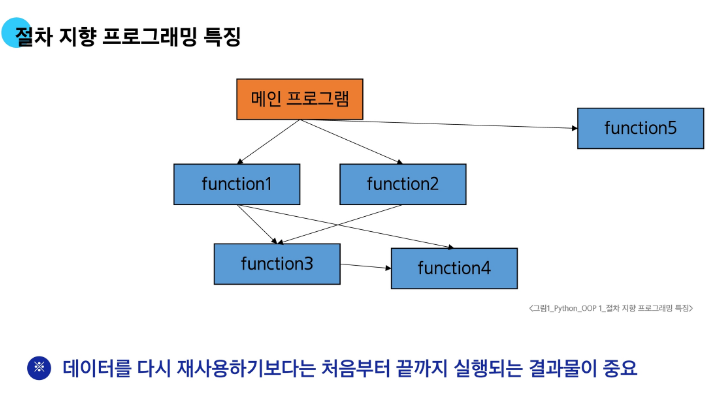
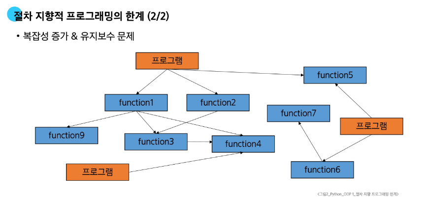
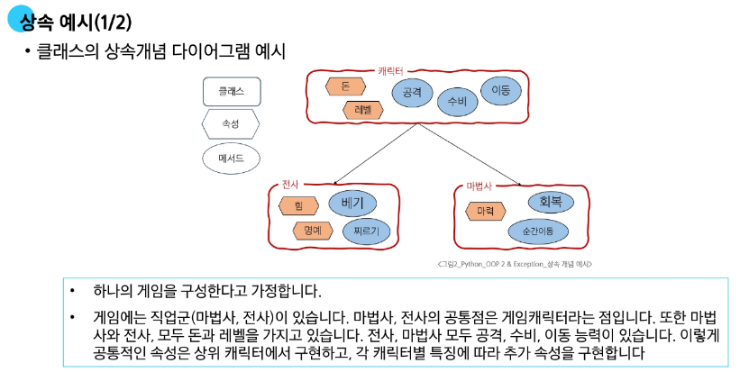
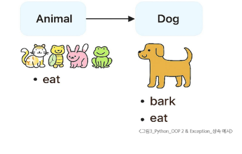

# Python OOP

## 1. 프로그래밍 패러다임
### 1.1 절차 지향과 객체 지향
- 절차 지향 프로그래밍 (Procedural Programing)
  -  함수와 로직 중심 작성, 데이터를 순차적으로 처리
```python
name = 'Alice'
age = 25

def introduce(name, age):
    print(f"안녕 {name} {age}")

introduce(name,age)
```
- 절차 지향 프로그래밍 특징
  - 입력을 받고, 처리하고, 결과를 내는 과정이 위에서 아래로 순차적으로 흐르는 형태
  - 순차적인 명령어 실행
  - 데이터와 함수 분리
  - 함수 호출의 흐름이 중요

- 절차 지향의 한계
  - 1. 복잡성 증가
    - 프로그램 규모가 커질수록 데이터 관리와 함수 관리가 어려움
    - 전역 변수 증가로 인한 관리 어려움
  - 2. 유지보수 문제
    - 코드 수정 시 영향 범위 파악이 어려움

- 객체 지향 프로그래밍(Object Oriented Programing)
  - 클래스는 설계도, 인스턴스는 실제 물건
- 객체 지향 사고 예시
```python
class Person:
    def __init__(self, name, age):
        self.name = name
        self.age = age
    def introduce(self):
        print(f"안녕하세요. {self.name} {self.age}")
if __name__ == "__main__":
    alice = Person("Alice", 25)
    alice.introduce() # "안녕하세요. Alice 25")
```
- 객체 지향 프로그래밍의 특징
  - 프로그램을 데이터와 데이터 처리하는 함수를 하나의 단위(객체)로 묶어서 조직적으로 관리
  - 데이터와 메서드의 결합

- 절차지향과 객체지향의 비교

| 절차 지향 | 객체 지향 |
| -------- | -------- |
| 데이터와 해당 데이터를 처리하는 함수가 분리 | 데이터와 해당 데이터를 처리하는 메서드를 하나의 객체로 묶음 |
| 함수 호출 흐름이 중요 | 객체 간 상호작용과 메세지 전달이 중요 |
| 어떤 순서로 처리할까? | 어떤 객체가 이 문제를 해결할까? 이 객체는 어떤 속성과 기능을 지닐까? | 

- 객체지향 - 데이터에 기능이 더해지다
  - 객체 지향은 수동적인 데이터가 능동적인 객체로 변화한 것
  - 절차 지향에서는 데이터가 함수의 매개변수로 전달되어 처리되는 수동적인 동작이였지만, 객체지향에서는 데이터와 해당 데이터를 처리하는 메서드가 하나의 객체로 통합되어 스스로 기능을 수행하는 능동적인 존재가 됨.
  - 이는 코드의 구조화와 재사용성을 높이는 동시에 실제 세계의 모델링 방식과 더 유사한 프로그래밍을 가능하게 함.
- 주의사항
  - **절차 지향과 객체 지향은 대조되는 개념이 아님!** 
    - 객체 지향은 기존 절차 지향을 기반으로 두고 보완하기 위해 객체라는 개념을 도입해 상속, 코드 재사용성, 유지보수성 등의 이점을 가지는 패러다임임.
### 1.2 객체와 클래스
  - 객체(Object) 실제 존재하는 사물을 추상화 한 것. 속성과 동작을 가짐. 
  - 클래스(Class): 객체를 만들기 위한 설계도. 데이터와 기능을 함께 묶는 방법을 제공. 파이썬에서 데이터를 표현하는 방법.
- 객체의 특징
  - Attribute
    - 객체의 상태/데이터
  - Method
    - 객체의 행동/기능
  - 고유성
    - 각 객체는 고유한 특성을 가짐.
## 2. 클래스 기초
### 2.1 클래스
- Class(클래스)
  - 클래스는 하나의 구조 안에 데이터(변수)와 기능(함수)를 함께 정의하는 도구
- 클래스의 정의
  - class 키워드
  - 클래스 이름으 파스칼(Pascal Case) 케이스로 작성
```python
class MyClass:
    def __init__ (self, name, age): # 메서드 생성자
        self.name = name # 인스턴스 속성
        self.age = age # 인스턴스 속성
    def introduce(self):
        print(f"{self.name} {self.age}")
```
### 2.2 인스턴스
- 인스턴스
  - 클래스를 통해 생성된 객체
- 인스턴스 예시
  - 클래스가 설계도라면, 인스턴스는 그걸 통해 만들어진 물건. 
  - Person("Alice", 25) 라고 하면 Person이라는 설계도로부터 Alice이고, 25인 **"사람 객체"** 가 탄생한 것임
```python
p1 = Person("Alice", 25)
p1.introduce() # Alice 25
p2 = Person("Bella", 44)
p2.introduce() # Bella 44
```
### 2.3 클래스와 인스턴스
- 클래스와 인스턴스
  - 클래스를 정의한다는 것은 공통된 특성과 기능을 가진 틀을 만드는 것
  - 실제 활동하는 개별 객체들은 이 틀에서 생성된 instance
  - 공통된 특성과 기능을 가진 틀을 만드는 것은 곧 새로운 타입을 만드는 행위
    - 아이유는 인스턴스다. 라는 표현이 모호한 이유 마찬가지.
    - 무슨 타입의 인스턴스인지 알 수 없기 때문
```python
class Singer:
    pass

iu = Singer()
print(type(iu)) # <class '__main__.Singer'> 인스턴스가 생성된 위치. 파일에 종속된 클래스 .Singer
```
- str 예시로 보는 클래스
  - 변수 name의 타입은 str이다 
  - 변수 name은 str 클래스의 인스턴스이다
  - 우리가 사용했던 데이터타입은 사실 모드 클래스였다.
```python
name = "Alice"
print(type(name)) # <class 'str'>
```
- 하나의 객체는 특정 클래스의 인스턴스이다. 
### 2.4 클래스 구성요소
- 생성자 메서드
  - 인스턴스 생성시 자동 호출되는 메서드
  - __init__ 이라는 이름의 메서드로 정의
  - 인스턴스 변수의 초기화 담당
```python
class Circle:
    def __init__ (self, redius):
        self.redius = redius

c1 = Circle(1)
c2 = Circle(2)
```
- 인스턴스 변수(속성)
  - 각 인스턴스 별 고유한 속성
  - self.변수명 형태로 정의
  - 인스턴스마다 독립적인 값 유지
```python
self.redius = redius
```
- 클래스 변수
  - 모든 인스턴스가 공유하는 속성
  - 클래스 내부에서 직접 정의
```python
class Circle:
    pi = 3.14 # <- 얘가 클래스 속성.
    def __init__(self, radius):
        self.radius = radius
```
### 2.5 클래스 변수와 인스턴스 변수
- 클래스 변수와 인스턴스 변수
  - 클래스 변수와 동일한 이름으로 인스턴스 변수 생성 시 클래스 변수가 아닌 인스턴스 변수에 먼저 참조하게 된다
```python
class Circle:
    pi = 3.14
    def __init__(self, radius):
        self.redius = radius
c1 = Circle(5) # c1인스턴스 생성, radius에 5 할당
c2 = Circle(10) # 비교대상 c2

c1.pi = 100 # c1에 새로운 인스턴스 변수를 오버라이딩 해 버림

print(c1.pi) # 100
print(c2.pi) # 3.14 
```
## 3. 메서드
- 클래스 내부에 정의된 함수로 해당 객체가 어떻게 동작할지를 정의함
- 메서드 종류
  - 인스턴스 메서드
  - 클래스 메서드
  - 스태틱 메서드
### 3.1 인스턴스 메서드
- 인스턴스 상태를 조작하거나 동작을 수행하는 메서드
- 인스턴스 메서드의 구조
  - 클래스 내부에 정의되는 메서드는 기본
  - 반드시 첫 번째 인자로 인스턴스 자신(self)을 받음
  - 인스턴스의 속성에 접근하거나 변경 가능
```python

class MyClass:
    def intance_method(self, arg1):
        pass
# 사실 self 안써도 됨. 근데 그냥 self 쓰는걸 거의 반 강제 비슷하게 강력하게 권장함
```
- self 동작 원리
  - upper 메서드들 이용해 문자열 hello를 대문자로 변경하기
```python
'hello'.upper() # 로 우리가 적지만
str.upper('hello') 가 실제 동작임
```
  - str 클래스가 upper 메서드를 호출했고, 그 첫번째 인자로 문자열 인스턴스가 들어간 것
  - 인스턴스 메서드의 첫 번째 인자가 반드시 자기 자신인 이유
  - 'hello'.upper() 는 str.upper('hello')를 객체 지향 방식의 메서드로 호출하는 표현임
  - 'hello' 라는 문자열 객체가 단순히 어딘가의 함수의 인자로 들어가는 것이 아닌 객체 스스로의 메서드를 호출해 동작하는 객체 지향적인 표현인 것.
- 인스턴스 메서드 활용
```python
class Counter:
    def __init__(self):
        self.count = 0
    def increment(self):
        self.count += 1
if __name__ == "__main__":
    c = Counter() # 객체를 생성하고
    c.increment() # 객체의 increment 를 호출하면 자기 인스턴스 변수인 count를 1 증분시킨다
    print(c.count) # 1
```
- 생성자 메서드(constructor method)
  - 인스턴스 객체가 생성될 때 자동으로 호출되는 메서드. 인스턴스 변수들의 초기값을 설정
```python
class Person:
    def __init__(self, name):
        self.name = name
        print("인스턴스 생성!!!")
    def greeting(self):
        print(f"{self.name} 안녕!")

person1 = Person("지성") # 인스턴스 생성됨!!!
person1.greeting() # 지성 안녕!
```
### 3.2 클래스 메서드
- 클래스 변수를 조작하거나 클래스 레벨의 동작을 수행합니다.
- 클래스 메서드 구조
  - @classmethod 데코레이터를 사용하여 정의
  - 호출 시 첫번째 인자로 해당 메서드를 호출하는 cls가 전달됨
  - 클래스를 인자로 받아 클래스 속성을 변경하거나 읽는데 사용
```python
class MyClass:
    population = 0
    def __init__(self, name):
        self.name = name
        Person.increase_population()
    @classmethod
    def increase_population(cls):
        cls.population += 1 
```
클래스 단위의 데이터를 조작하기 위한 메서드가 classmethod
### 3.3 스태틱 메서드
- 클래스, 인스턴스와 상관없이 독립적으로 동작하는 메서드
- 호출 시 자동으로 전달받는 인자가 없음(cls, self)
- 스태틱 메서드 구조
  - @staticmethod 데코레이터를 사용하여 정의
  - 호출 시 자동으로 전달받는 인자가 없음(self, cls를 받지 않음)
  - 인스턴스나 클래스 속성에 직접 접근하지 않는, 도우미 함수와 비슷한 역할
```python
class MyClass:
    @staticmethod
    def add(a, b):
        return a + b
print(MyClass.add(3,5)) # 8

# java에서 static void string() 이렇게 쓰던거랑 동일한 거. 
```
### 3.4 메서드 활용
```python
class BankAccount:
    interest_rate = 0.02 # 기본 이자율. 클래스 변수

    def __init__(self, owner, balance):
        self.owner = owner # 계좌 소유자
        self.balance = balance # 계좌 잔고
        # 입금
    
    def deposit(self, amount):
        self.balance += amount
    
    def withdraw(self, amount):
        if self.balance >= amount:
            self.balance -= amount
        else:
            print("돈이 부족해!")
    
    @classmethod # 클래스 변수를 직접 수정함. 이건 앞으로 생기는, 이전에 생긴 모든 클래스에 영향을 줌. interest_rate 변수는 프로그램 전체에 단 하나만 존재함.
    def set_interest_rate(cls, rate):
        cls.interest_rate = rate

    @staticmethod
    def is_positive(amount):
        return amount > 0


if __name__ == "__main__":
    # 개좌 계설
    alice_acc = BankAccount("Alice", 1000)

    # 입금 및 출금(인스턴스 메서드 호출)
    alice_acc.deposit(500) # 500원 입금. 1500
    alice_acc.withdraw(200) # 출금 1300

    # 잔액 확인
    print(alice_acc.balance) # 1300

    # 이자율 변경
    BankAccount.set_interest_rate(0.05)
    print(BankAccount.interest_rate) # 0.03

    # 잔액이 양수인지 확인(static method)
    print(BankAccount.is_positive(alice_acc.balance)) # True
```
### 3.5 메서드 정리
- 인스턴스 메서드
  - 인스턴스의 상태를 변경하거나, 해당 인스턴스의 특정 동작을 수행
- 클래스 메서드
  - 인스턴스의 상태에 의존하지 않는 기능을 정으
  - 클래스 변수를 조작하거나 클래스 레벨의 동작을 수행
- 스태틱 메서드
  - 클래스 및 인스턴스와 관련이 없는 일반적인 기능을 수행
- 클래스가 사용해야 할 것
  - 클래스 메서드
  - 스태틱 메서드
- 인스턴스가 사용해야 할 것
  - 인스턴스 메서드
- 정리 다시
  - 공통설정값을 바꾸거나 유틸리티성 처리를 할 땐 클래스/스태틱
  - 개별 객체 상태값을 다룰 땐 반드시 인스턴스 메서드
  - 무엇을 바꾸는가? 가 메서드 선택의 기준임.
- 누가 어떤 메서드를 사용해야 하는가?
  - 예시 클래스로 클래스와 인스턴스가 각각 모든 메서드를 호출해보기
```python
class MyClass:
    def instance_method(self):
        return "Instance method", self
    @classmethod
    def class_method(cls):
        return "class method", cls
    @staticmethod
    def static_method():
        return "Static method"
```
- 클래스가 할 수 있는 것
  - 클래스는 모든 메서드를 호출 할 수 있음
  - 하지만 클래스는 클래스 메서드와 스태틱 메서드만 사용
  - 당연한거긴 함. 클래스가 선언되면 이 클래스 선언 객체가 생긴거고, 그 객체가 클래스 메서드를 호출하고, static 메서드 호출하는것도 당연한거임. 근데 인스턴스 메서드 호출은 좀 이상하긴 한데 호출은 가능함
    - 이상한 이유. self 없는데 뭐할껀데 얘가
```python
instance = MyClass()
print(
    Myclass.istance_method(istance)
    # instance method __main__.MyClass object
)
```
- 인스턴스 메서드가 할 수 있는 것
  - 인스턴스도 마찬가지로 모든 메서드를 다 호출하는게 가능함. 
- 결론은 **할 수 있다 != 써도 된다** 임. 클래스는 클래스, 스태틱 메서드 쓰고, 인스턴스는 인스턴스 메서드 써야함.
## 4. 참고
### 4.1 클래스와 인스턴스 간 이름 공간
  - 클래스를 정의하면 클래스와 해당하는 이름 공간 생성
  - 인스턴스를 만들면 인스턴스 객체가 생성되고 독립적인 이름 공간 생성
  - 인스턴스에서 특정 속성에 접근하면 인스턴스 -> 클래스 순으로 탐색함
- 독립적인 이름공간을 가지는 이점
  - 각 인스턴스는 독립적인 메모리 공간을 가지며, 클래스와 다른 인스턴스 간에는 서로의 데이터나 상대에 직접적인 접근이 불가능함. 
  - 객체 지향 프로그래밍의 중요한 특성 중 하나로 클래스와 인스턴스를 모듈화하고 각각의 객체가 독립적으로 동작하도록 보장
  - 이를 통해 틀래스와 인스턴스는 다른 객체들과의 상호작용에서 서로 충돌이나 영향을 주지 않으면서 독립적으로 동작 할 수 있음.
  - 코드 가독성, 유지보수, 재사용성 높아짐.
### 4.2 매직 메서드
- Double underscore("__")가 있는 메서드는 특수 동작을 위해 만들어진 메서드
- 인스턴스 메서드
- 특정 상황에서 자동호출
- 스페셜, 혹은 매직 메서드라고 함.
```python
__str__(self), __len__(self)__, __it__(self, other), etc

```
    
### 4.3 데코레이터
- 다른 함수들의 코드를 유지한 채로 수정하거나 확장하기 위해 사용되는 함수
```python


```
# OOP2
## 1. 상속
- 한 클래스의 속성과 메서드를 다른 클래스가 물려받는 것
### 1.1 상속 기본 개념
1. 코드 재사용
   1. 상속을 통해 기존 클래스의 속성과 메서드를 재사용 할 수 있음
   2. 기존 클래스를 수정하지 않고도 기능을 확장할 수 있음
2. 계층 구조
   1. 상속을 통해 클래스들 간 계층 구조를 형성할 수 있음
   2. 부모 클래스와 자식 클래스간 관계를 표현하고 더 구체적인 클래스를 만들 수 있음.
3. 유지 보수 용의
   1. 상속을 통해 기존 클래스의 수정이 필요한 경우, 해당 클래스만 수정하면 됨으로 유지보수가 쉬워짐
   2. 코드의 일관성을 유지하고 수정이 필요한 범위를 최소화 할 수 있음
- 상속 예시
  - 클래스의 상속개념 다이어그램 예시


```python
class Animal:
  def eat(self):
    print("먹는 중")
class Dog(Animal):
  def bark(self):
    print("멍멍")
my_dog = Dog()
my_dog.bark() # 멍멍

my_dog.eat() # 먹는 중
```

### 1.2 부모 클래스와 자식 클래스
- 상속 없이 구현하는 경우를 생각해보자.
  - 학생과 교수정보를 하나의 구현하는 상황 예시
  - 제대로 구분가지 않는다. 고유 속성이 있을텐데
```python
class Person:
  def __init__(self, name, age):
    self.name = name
    self.age = age
  
  def talk(self):
    print(f"반갑 내 이름은 {self.name}")
s1 = Person("김학생",23)
s1.talk() #반갑 내 이름은 김학생

p1 - Person("김교수", 55)
p1.talk() # 반갑 내 이름은 김교수
```
  - 이 문제를 해결하기 위해 학생, 교수를 별도 클래스로 구현하는 방법도 있음
  - 근데 이러면 메서드랑 어트리뷰트가 중복으로 구현되는 경우가 생김
```python
class Student:
  def __init__(self, name, age, gpa):
    self.name = name
    self.age = age
    self.gpa = gpa
  
  def talk(self):
    print(f"반갑습니다. {self.name}입니다.")

class Professor:
  def __init__(self, name, age, department):
    self.name = name # 위랑 같은 속성
    self.age = age # 위랑 같은 속성
    self.department = department

  def talk(self): # 중복기능
    print(f"반갑습니다. {self.name}입니다.")
```

  - 이걸 상속을 이용해 한다면?
```python
class Person:
  def __init__(self, name, age):
    self.name = name
    self.age = age
  
  def talk(self):
    print(f"내 이름은: {self.name}")

class Professor(Person):
  def __init__(self, name, age, department):
    self.name = name
    self.age = age
    self.department = department

class Student(Person):
  def __init__(self, name, age, gpa):
    self.name = name
    self.age = age
    self.gpa = gpa

if __name__ == "__main__":
  p1 = Professor('박교수', 44, '컴공')
  s1 = Student('김학생', 23, '산공')

  p1.talk() # 반갑 박교수
  s1.talk() # 반갑 김학생
```
### 1.3 메서드 오버라이딩
- 부모 클래스의 메서드를 같은 이름, 같은 파라미터 구조로 재정의하는 것
  - 자식 클래스에서 메서드를 다시 정의하면 부모 클래스 대신 자식 클래스의 메서드가 실행됨
  - 오버라이딩은 동일한 이름과 매개변수를 사용하지만 내부 동작은 원하는 대로 변경
  - 부모 클래스의 기능을 유지하면서 일부 동작을 맞춤형으로
- 메서드 오버라이딩 예시
  - 자식 클래스가 부모 클래스의 메서드를 덮어씌워서 새로운 동작을 구현하는게 가능
  - Animal class를 상속받은 Dog class에서 eat 메서드를 다시 정의
```python
class Animal:
  def eat(self):
    print("Animal이 먹는 중")

class Dog(Animal):
  def eat(self):
    print("Dog가 먹는중")
my_dog = Dog()
my_dog.eat() #Dog가 먹는중
```
- 참고 오버로딩이란?
  - 같은 이름, 다른 파라미터를 가진 여러 메서드를 정의하는 것. 파이썬은 지원하지 않음
  - 파이썬은 실제로 하나의 메서드만 인식하며, 인자의 형태가 다르다는 이유로 여러개 구분해 불러주지 않음
  - 마지막 선언된 메서드만 인식
```python
class Example:
  def do_something(self, x):
    print("첫 번째 do_something", x)
  def do_something(self, x, y):
    print("두 번째 do_something", x, y)
example = Example()
example.do_something(10) # TypeError do_somethint() missing 1 required positional argumnet 'y'
# y가 없어. 인자 하나 더 넣으란 뜻. 아래꺼를 인식한거임.
```
### 1.4 다중 상속
- 둘 이상의 상위 크래스로부터 여러 행동(함수, 메서드) 나 특징(어트리뷰트)를 상속받을 수 있다.
- 상속받은 모든 클래스의 요소를 활용 가능
- 중복된 속성이나 메서드가 있으면 상속 순서에 의해 결정
- 다중 상속 예시
```python
class Person:
  def __init__(self, name):
    self.name = name
  def greeting(self):
    return f"안녕 내 이름은{self.name}"

class Mom(Person):
  gene = "xx"
  def swim(self):
    return "엄마가 수영한다"
  
class Dad(Person):
  gene = "xy"
  def walk(self):
    return "아부지 걸어가신다"


class FirstChild(Dad, Mom):
  def swim(self): # Mom class 에 있던 Mom.swim()메서드를 오버로딩
    return "자식이 수영한다"
  def cry(self):
    return "첫째가 응애한다"

baby1 = FirstChild("아기")
print(baby1.cry()) # 첫째가 응애
print(baby1.swim()) # 자식이 수영한다
print(baby1.walk()) # 아빠가 걸어간다 <- 이건 Dad 상속받은거 그대로 남아있음
print(baby1.gene) # Dad를 먼저 상속받아서 XY가 나옴.
```
- 이론: 다이아몬드 ㅇ문제
  - 두 클래스 B와 C가 A에서 상속되고
  - 클래스 D가 B와 C 모두에서 상속될 때 발생하는 모호함
  - B와 C가 재정의한 메서드가 A에 있고 D가 이를 재정의 하지 않은 경우라면
  - **D는 B의 메서드 중 어느 버전을 상속하는가? 아니면 C의 메서드 버전을 상속하는가?**

- 파이썬에서의 해결책
  - MRO(Method Resolution Order) 알고리즘을 써서 클래스 목록을 생성
  - 부모 클래스로부터 상속된 속성을 정해진 내부 알고리즘에 따라 검색
  - 이 순서는 기본적으로 왼쪽에서 오른쪽으로 진행되며 계층 구조에서는 중복되는 클래스는 한 번만 확인
  - 그래서, 이 속성이 D에서 발견되지 않으면 B에서 찾고, 거기에서도 발견되지 않으면 C에서 찾고 이런 식으로 진해오딤.
### 1.5 Super()메서드
- MRO에 따라 현재 클래스의  부모 클래스의 메서드나 속성에 접근할 수 있게 해 주는 내장 함수
- super()의 특징
  - 단순히 부모 클래스의 메서드 호출 하기 위한 용도 뿐 아니라 다중 상속이 있을때도 올바른 순서(MRO)에 따라 상위 클래스의 메서드를 찾아 실행하기 위해 super()사용
- super()의 2가지 사용 사례
  1. 단일 상속 구조
  2. 다중 상속 구조
- super() 사용 예시(단일 상속)
  - 명시적으로 부모 클래스 이름을 적지 않아도 부모 메서드를 안전하게 호출할 수 있음
- super()사용 전
```python
# super()사용 전
class Person:
  def __init__(self, name, age, number, email):
    self.name = name
    self.age = age
    self.number = number
    self.email = email
class Student(Person):
  def __init__(self, name, age, number, email, student_id):
    self.name = name
    self.age = age
    self.number = number
    self.emil = email
    self.student_id = student_id 

```
- super()사용 후
```python
class Person:
  def __init__(self, name, age, number, email):
    self.name = name
    self.age = age
    self.number = number
    self.email = email

class Student(Person):
  def __init__(self, name, age, number, email, student_id):
    super().__init__(name, age, number, email)
    self.student_id = student_id 
```
- Student의 __init__ 에서 super().__init__()를 호출하면 부모 클래스의 __init__에 접근해 속성 초기화 가능. 
- 이 때 Person클래스를 직접 명시하지 않고 super()를 사용함으로 나중에 클래스 이름이 바뀌거나 상속 구조가 변경되어도 super()호출 부분을 그대로 사용할 수 있어 유지보수성이 향상
- 단일 상속 구조에서 super함수
  - 부모 클래스의 생성자(또는 메서드)를 호출하기 위해 사용
  - 명시적으로 이름을 지정하지 않고 부모 클래스를 참조 할 수 있음으로 코드 관리를 더 유지 관리하기 쉬워짐
  - 클래스 이름이 변경되거나 부모 클래스가 교체되어도 super()를 사용하면 코드 수정이 더 적게 필요
```python
class ParentA:
  def __init__(self):
    self.value_a = 'ParentA'
  def show_value(self):
    print(f"Value From ParentA:{self.value_a}")

class ParentB:
  def __init__(self):
    self.value_b = 'ParentB'
  def show_value(self):
    print(f"Value From ParentB:{self.value_b}")

class Child(ParentA, ParentB):
  def __init__(self):
    super().__init__(): # ParentA 의 init 메서드 호출
    self.value_c = "Child"
  def show_value(self):
    super().show_value() # ParentA의 show_value 메서드 호출
    print(f"Value From Child:{self.value_c}")

if __name__ == "__main__:
  child = Child()
  child.show_value() # f"Value From ParentA:ParentA" 출력 후 (f"Value From Child:Child") 출력

  print(child.value_c) # Child # 이건 얘의 인스턴스 변수
  print(child.value_a) # ParentA # 이건 init 할 때 super 가 가장 먼저 선언된 ParentA 의 init도 같이 실행했기 때매 남아있음.
  # print(child.value_b) # 에러뜸 선언된 적 없는 변수
```
만약 child.value_b 도 남기고 싶으면?
```python
class ParentA:
  def __init__(self):
    super().__init__() # <- 이걸 추가하면  된다
    self.value_a = 'ParentA'
```
- 그냥 저 코드 선언 상황에서 ParentA의 super가 누구인가? -> 아직 모름
- 근데 Child 클래스 실행 시점에선 child -> A -> B 로 MRO 순서가 결정되는거고
- 그러면 이 시점에선 A에서의 super가 B로 결정됨
  - super는 부모 클래스를 호출하는게 아님. **MRO 순서에 따른 클래스를 호출하는 것임**
  - 부모를 호출한다고 이해하는 이유는 단일 클래스 때문임. super는 MRO 순서에 따라 상속한다는것을 인지 할 것.
- 다중 상속 구조에서 super 함수
  - MRO(메서드 해석 순서)에 따라 각 클래스의 메서드를 찾아가기 때문에 단순히 직계 부모만이 아니라 다중 상속 관계에서도 적절한 상위 클래스 메서드를 안전하게 호출할 수 있음
  - 이를 통해 복잡한 상속 구조에서도 코드를 유연하고 깔끔하게 유지할 수 있음
- super() 정리
  - super()를 사용할 때는 MRO를 잘 이해하고 있어야 함.
  - ClassName.__mro__ 또는 ClassName.mro()를 확인해 MRO 순서를 파악한 뒤 적절히 활용하는 연습을 하면 보다 복잡한 상속 구조에서도 코드를 잘 관리할 수 있음.
- mro(), __mro__ 사용 예시
```python
class A:
  def __init__(self):
    print("A")

class B(A):
  def __init__(self):
    super().__init__():
    print("B")
class C(A):
  def __init__(self):
    super().__init__()
    print('C')


```
- MRO가 필요한 이유 
  - 부모 클래스들이 여러번 엑세스 되지 않도록
  - 각 부모 클래스에서 지정된 왼쪽에서 오른쪽으로 가는 순서를 보존하고
  - 각 부모를 오직 한 번만 호출하고
  - 부모들의 우선순위에 영향을 주지 않으면서 서브 클래스를 만드는 단조적인 구조 형성
## 2. 에러와 예외
### 2.1 디버깅
- 버그
  - 소프트웨어에서 발생하는 오류 또는 결함. 프로그램이 예상된 동작과 실제 동작 사이 불일치
- 디버깅
  - 소프트웨어에어 발생하는 버그를 찾아내고 수정하는 과정
  - 프로그램의 오작동 원인을 식별해 수정하는 작업
- 디버깅 방법
  - print 함수 활용
    - 특정 함수 결과, 반복/조건 결과 등 나눠서 생각.코드를 bisection으로 나눠서 생각
  - 개발 환경(text editor, IDE) 등에서 제공하는 기능 활용
    - breakpoion, 변수 조회
  - python tutor 활용 (단순 코드의 경우)
  - 뇌 컴파일, 눈디버깅 등
### 2.2 에러
- 프로그램 실행 중에 발생하는 예외 상황
- 에러 유형
  - 문법 에러와 예외
    - 문법에러(Syntax Error): 프로그램의 구문이 올바르지 않은 경우 발생(오타, 괄호 및 콜론 누락 등 문법적 오류)
    - 예외(Exception): 프로그램 실행 중에 감지되는 에러
  - 문법 에러 예시
```python
while # SyntaxError: invalid syntax
5 = 3 # SyntaxError: cannot assign to literal here. Maybe you meant '==' instead of = ? 
print('hell # SyntaxError: unterminated string literal (detected at lint 1) 
```
### 2.3 예외
- Exception. 프로그램 실행 중에 감지되는 에러
- Built-in Exception(내장 예외) 예외 상황을 나타내는 클래스들
```python
10/0 # ZeroDivisionError: division by zero /나누기 또는 모듈로 연산의 두 번째 인자가 0일때
print(name1) # NameError: name 'name1' is not defined / 지역 또는 전역 이름을 못 찾음
'2' + 2 # TypeError: can only concatenate str (not 'int') to str / 타입 불일치
sum() # TypeError: sum() takes at least 1 positional argument (0 given)

etc
```
## 3. 예외 처리
- 예외가 발생했을 때 프로그램이 비정상적으로 종료되지 않고 적절하게 처리할 수 있도록 하는 방법
- try: 예외가 발생할 수 있는 코드 작성
- except: 예외가 발생했을 때 실행할 코드 작성
- else: 예외가 발생하지 않았을 때 실행할 코드 작성
- finally: 예외 발생 여부와 상관없이 항상 실행할 코드 작성
```python
try:
  x = int(input('숫자를 입력하세요: '))
  y = 10 / x
except ZeroDivisionError:
  print("0으로 나눌 수 없다")
except ValueError:
  print("유효한 숫자가 아님")
else:
  print(f"결과: {y}")
finally:
  print("프로그램 종료")
```
### 3.1 try & except
```python
try:
  # 예외가 발생할 수 있는 코드
except 예외조건:
  # 예외 처리 코드
```
- 예외 처리 예시
```python
try:
  result = 10 / 0
except ZeroDivisionError:
  print("0으로 나눌 수 없습니다")
```
```python
try:
  num = int(input('숫자입력:'))
except ValueError:
  print("숫자가 아닙니다")
"""
숫자입력: a
숫자가 아닙니다.
"""
```
### 3.2 복수 예외 처리
- 100을 사용자가 입력한 값으로 나누고 출력하는 코드
  - 먼저 발생 가능한 에러가 무엇인지 예상해보기
```python
num = int(input('100으로 나눌 값을 입력하세요: '))
print(100 / num)
# 문자를 입력했을 때 나는 에러 ValueError
# 숫자 0을 입력했을 때 발생할 수 있는 에러 ZeroDivisionError
# 이하 수정코드 @@@@@@@@@@# 
try:
  num = int(input('100으로 나눌 값을 입력하세요: '))
except (ValueError, ZeroDivisionError):
  print("마 똑띠 입력 해라")
### 혹은
try:
  num = int(input('100으로 나눌 값을 입력하세요: '))
except ValueError:
  print("숫자를 입력해요")
except ZeroDivisionError:
  print("0으로 나눌 수 없슴")
except:
  print("나도 잘 모르겠는 에러가 나옴")
```
### 3.3 else&finally
- else 블록은 예외가 발생하지 않았을 때 추가 작업을 진행
- finally 블록은 예외 발생 여부와 상관없이 항상 실행할 코드를 작성
```python
try:
  x = int(input('숫자 입력'))
  y = 10 / x
except ZeroDivisionError:
  print('0으로 나눌 수 없다')
except ValueError:
  print('유효한 숫자가 아님')
else:
  print(f"결과: {y}")
finally:
  print("프로그램 종료됨")
```
## 4. 참고
### 4.1 예외 처리 주의사항
- 내장 예외의 상속 계층구조 조의
  - 아래와 같이 예외를 작성하면 코드는 2번째 except 절에 이후로 도달하지 못함
```python
try:
  num = int(input('100으로 나눌 값을 입력: '))
  print(100 / num)
except Exception: # Exception은 모든 예외처리의 최상위 부모 클래스임. 모든 에러 다 먹어치움
  print("숫자를 넣으세요")
### 위에 except Exception가 모든 예외를 가로채 아래쪽엔 도달이 절때 불가. 범용적 예외는 항상 가장 밑에
except ZeroDivisionError:
  print('0으로 나눌 수 없다')
except:
  print("알 수 없는 에러")
```
- 내장 예외 클래스는 상속 계층구조를 가짐
  - except 절로 분기 시 반드시 하위 클래스를 먼저 확인할 수 있도록 작성해야 함
  - 가장 구체적인 예외부터 처리하고 마지막에 범용 예외 처리하도록.
```python
try:
  num = int(input('100으로 나눌 값을 입력: '))
  print(100 / num)
# 구체적인 예외부터
except ZeroDivisionError:
  print('0으로 나눌 수 없다')
except ValueError:
  print("숫자를 넣어주세요")

# 가장 마지막에 광범위한 에러처리를
except Exception:
  print("숫자를 넣으세요")
```
### 4.2 예외 객체 다루기
- as 키워드
  - 예외객체: 예외가 발생했을 때 예외에 대한 정보를 담고 있는 객체
  - except 블록에서 예외 객체를 받아 상세한 예외 정보를 활용 가능
```python
my_list = []
try:
  number = my_list[1]
except IndexError as error:
  print(f"{error} 가 발생")

# list index out of range가 발생
```
- try-except 와 if-else
  - try-except 와 if-else를 함께 사용할 수 있음
```python
try:
  x = int(input('숫자를 입력하세요: '))
  if x < 0:
    print("음수는 허용 안됨")
  else:
    print('입력한 숫자는: ', x)
except ValueError:
  print("오류!!!")
```
### 4.3 EAFP & LBYL
- EAFP(Easier to Ask for Frogiveness than Permission)허락보단 용서를 구하는게 쉽다
  - 예외 처리를 중심으로 코드를 작성하는 접근 방식(try - except)
- LBY(Look Before You Leap) 
  - 값 검사를 중심으로 코드를 작성하는 접근 방식(if-else)
- EAFP
```python
try:
  result = my_dict['key']
  print(result)
except KeyError:
  print("키가 없다")
```
- LBYL
```python
if 'key' in my_dict:
  result = my_dict['key']
  print(result)
else:
  print("키가 없다")
```
| EAFP | LBYL |
| ---- | ---- |
| 일단 실행 후 예외 처리 | 실행하기 전 조건 검사 |
| 코드를 실행하고 예외가 발생하면 예외 처리 수행 | 코드 실행 전 조건문을 이용해 예외 상황을 미리 검사하고 예외 상황을 피함 |
|코드에서 예외가 발생할 수 있는 부분을 미리 예측해 대비하는게 아니라 예외가 발생한 후에 예외 처리 | 코드가 좀 더 예측 가능한 동작을 하지만 코드가 지루하고 현학적이게 됨 |
| 예외 상황을 예측하기 어려운 경우에 사용  | 예외 상황을 미리 방지하고 싶을때 사용 |

### 4.4 클래스의 의미와 활용
- 왜 클래스를 배우는가?
  - 클래스를 사용하면 관련된 데이터와 기능을 묶어 한 덩어리로 구조를 명확하게 하는 것이 가능
  - 작성 코드가 더 깔끔해지고, 나중에 수정이나 기능 추가가 더 쉽고 안전해짐