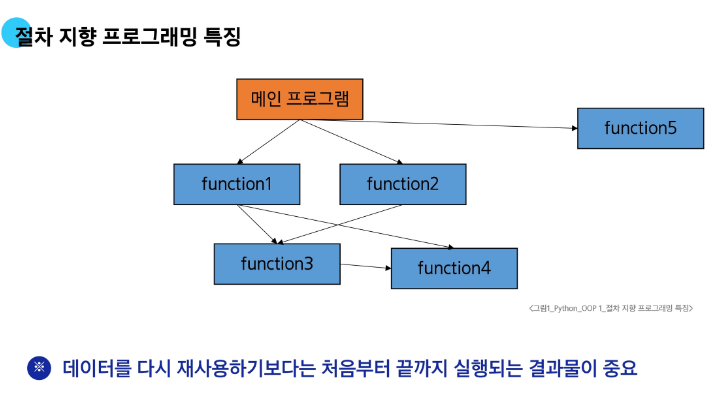
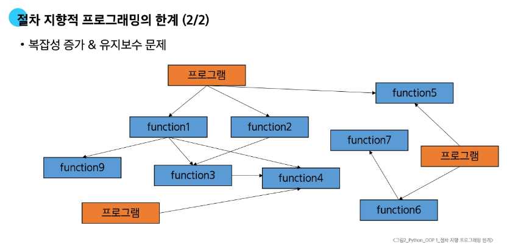

# Python OOP

## 1. 프로그래밍 패러다임
### 1.1 절차 지향과 객체 지향
- 절차 지향 프로그래밍 (Procedural Programing)
  -  함수와 로직 중심 작성, 데이터를 순차적으로 처리
```python
name = 'Alice'
age = 25

def introduce(name, age):
    print(f"안녕 {name} {age}")

introduce(name,age)
```
- 절차 지향 프로그래밍 특징
  - 입력을 받고, 처리하고, 결과를 내는 과정이 위에서 아래로 순차적으로 흐르는 형태
  - 순차적인 명령어 실행
  - 데이터와 함수 분리
  - 함수 호출의 흐름이 중요

- 절차 지향의 한계
  - 1. 복잡성 증가
    - 프로그램 규모가 커질수록 데이터 관리와 함수 관리가 어려움
    - 전역 변수 증가로 인한 관리 어려움
  - 2. 유지보수 문제
    - 코드 수정 시 영향 범위 파악이 어려움

- 객체 지향 프로그래밍(Object Oriented Programing)
  - 클래스는 설계도, 인스턴스는 실제 물건
- 객체 지향 사고 예시
```python
class Person:
    def __init__(self, name, age):
        self.name = name
        self.age = age
    def introduce(self):
        print(f"안녕하세요. {self.name} {self.age}")
if __name__ == "__main__":
    alice = Person("Alice", 25)
    alice.introduce() # "안녕하세요. Alice 25")
```
- 객체 지향 프로그래밍의 특징
  - 프로그램을 데이터와 데이터 처리하는 함수를 하나의 단위(객체)로 묶어서 조직적으로 관리
  - 데이터와 메서드의 결합

- 절차지향과 객체지향의 비교

| 절차 지향 | 객체 지향 |
| -------- | -------- |
| 데이터와 해당 데이터를 처리하는 함수가 분리 | 데이터와 해당 데이터를 처리하는 메서드를 하나의 객체로 묶음 |
| 함수 호출 흐름이 중요 | 객체 간 상호작용과 메세지 전달이 중요 |
| 어떤 순서로 처리할까? | 어떤 객체가 이 문제를 해결할까? 이 객체는 어떤 속성과 기능을 지닐까? | 

- 객체지향 - 데이터에 기능이 더해지다
  - 객체 지향은 수동적인 데이터가 능동적인 객체로 변화한 것
  - 절차 지향에서는 데이터가 함수의 매개변수로 전달되어 처리되는 수동적인 동작이였지만, 객체지향에서는 데이터와 해당 데이터를 처리하는 메서드가 하나의 객체로 통합되어 스스로 기능을 수행하는 능동적인 존재가 됨.
  - 이는 코드의 구조화와 재사용성을 높이는 동시에 실제 세계의 모델링 방식과 더 유사한 프로그래밍을 가능하게 함.
- 주의사항
  - **절차 지향과 객체 지향은 대조되는 개념이 아님!** 
    - 객체 지향은 기존 절차 지향을 기반으로 두고 보완하기 위해 객체라는 개념을 도입해 상속, 코드 재사용성, 유지보수성 등의 이점을 가지는 패러다임임.
### 1.2 객체와 클래스
  - 객체(Object) 실제 존재하는 사물을 추상화 한 것. 속성과 동작을 가짐. 
  - 클래스(Class): 객체를 만들기 위한 설계도. 데이터와 기능을 함께 묶는 방법을 제공. 파이썬에서 데이터를 표현하는 방법.
- 객체의 특징
  - Attribute
    - 객체의 상태/데이터
  - Method
    - 객체의 행동/기능
  - 고유성
    - 각 객체는 고유한 특성을 가짐.
## 2. 클래스 기초
### 2.1 클래스
- Class(클래스)
  - 클래스는 하나의 구조 안에 데이터(변수)와 기능(함수)를 함께 정의하는 도구
- 클래스의 정의
  - class 키워드
  - 클래스 이름으 파스칼(Pascal Case) 케이스로 작성
```python
class MyClass:
    def __init__ (self, name, age): # 메서드 생성자
        self.name = name # 인스턴스 속성
        self.age = age # 인스턴스 속성
    def introduce(self):
        print(f"{self.name} {self.age}")
```
### 2.2 인스턴스
- 인스턴스
  - 클래스를 통해 생성된 객체
- 인스턴스 예시
  - 클래스가 설계도라면, 인스턴스는 그걸 통해 만들어진 물건. 
  - Person("Alice", 25) 라고 하면 Person이라는 설계도로부터 Alice이고, 25인 **"사람 객체"** 가 탄생한 것임
```python
p1 = Person("Alice", 25)
p1.introduce() # Alice 25
p2 = Person("Bella", 44)
p2.introduce() # Bella 44
```
### 2.3 클래스와 인스턴스
- 클래스와 인스턴스
  - 클래스를 정의한다는 것은 공통된 특성과 기능을 가진 틀을 만드는 것
  - 실제 활동하는 개별 객체들은 이 틀에서 생성된 instance
  - 공통된 특성과 기능을 가진 틀을 만드는 것은 곧 새로운 타입을 만드는 행위
    - 아이유는 인스턴스다. 라는 표현이 모호한 이유 마찬가지.
    - 무슨 타입의 인스턴스인지 알 수 없기 때문
```python
class Singer:
    pass

iu = Singer()
print(type(iu)) # <class '__main__.Singer'> 인스턴스가 생성된 위치. 파일에 종속된 클래스 .Singer
```
- str 예시로 보는 클래스
  - 변수 name의 타입은 str이다 
  - 변수 name은 str 클래스의 인스턴스이다
  - 우리가 사용했던 데이터타입은 사실 모드 클래스였다.
```python
name = "Alice"
print(type(name)) # <class 'str'>
```
- 하나의 객체는 특정 클래스의 인스턴스이다. 
### 2.4 클래스 구성요소
- 생성자 메서드
  - 인스턴스 생성시 자동 호출되는 메서드
  - __init__ 이라는 이름의 메서드로 정의
  - 인스턴스 변수의 초기화 담당
```python
class Circle:
    def __init__ (self, redius):
        self.redius = redius

c1 = Circle(1)
c2 = Circle(2)
```
- 인스턴스 변수(속성)
  - 각 인스턴스 별 고유한 속성
  - self.변수명 형태로 정의
  - 인스턴스마다 독립적인 값 유지
```python
self.redius = redius
```
- 클래스 변수
  - 모든 인스턴스가 공유하는 속성
  - 클래스 내부에서 직접 정의
```python
class Circle:
    pi = 3.14 # <- 얘가 클래스 속성.
    def __init__(self, radius):
        self.radius = radius
```
### 2.5 클래스 변수와 인스턴스 변수
- 클래스 변수와 인스턴스 변수
  - 클래스 변수와 동일한 이름으로 인스턴스 변수 생성 시 클래스 변수가 아닌 인스턴스 변수에 먼저 참조하게 된다
```python
class Circle:
    pi = 3.14
    def __init__(self, radius):
        self.redius = radius
c1 = Circle(5) # c1인스턴스 생성, radius에 5 할당
c2 = Circle(10) # 비교대상 c2

c1.pi = 100 # c1에 새로운 인스턴스 변수를 오버라이딩 해 버림

print(c1.pi) # 100
print(c2.pi) # 3.14 
```
## 3. 메서드
- 클래스 내부에 정의된 함수로 해당 객체가 어떻게 동작할지를 정의함
- 메서드 종류
  - 인스턴스 메서드
  - 클래스 메서드
  - 스태틱 메서드
### 3.1 인스턴스 메서드
- 인스턴스 상태를 조작하거나 동작을 수행하는 메서드
- 인스턴스 메서드의 구조
  - 클래스 내부에 정의되는 메서드는 기본
  - 반드시 첫 번째 인자로 인스턴스 자신(self)을 받음
  - 인스턴스의 속성에 접근하거나 변경 가능
```python

class MyClass:
    def intance_method(self, arg1):
        pass
# 사실 self 안써도 됨. 근데 그냥 self 쓰는걸 거의 반 강제 비슷하게 강력하게 권장함
```
- self 동작 원리
  - upper 메서드들 이용해 문자열 hello를 대문자로 변경하기
```python
'hello'.upper() # 로 우리가 적지만
str.upper('hello') 가 실제 동작임
```
  - str 클래스가 upper 메서드를 호출했고, 그 첫번째 인자로 문자열 인스턴스가 들어간 것
  - 인스턴스 메서드의 첫 번째 인자가 반드시 자기 자신인 이유
  - 'hello'.upper() 는 str.upper('hello')를 객체 지향 방식의 메서드로 호출하는 표현임
  - 'hello' 라는 문자열 객체가 단순히 어딘가의 함수의 인자로 들어가는 것이 아닌 객체 스스로의 메서드를 호출해 동작하는 객체 지향적인 표현인 것.
- 인스턴스 메서드 활용
```python
class Counter:
    def __init__(self):
        self.count = 0
    def increment(self):
        self.count += 1
if __name__ == "__main__":
    c = Counter() # 객체를 생성하고
    c.increment() # 객체의 increment 를 호출하면 자기 인스턴스 변수인 count를 1 증분시킨다
    print(c.count) # 1
```
- 생성자 메서드(constructor method)
  - 인스턴스 객체가 생성될 때 자동으로 호출되는 메서드. 인스턴스 변수들의 초기값을 설정
```python
class Person:
    def __init__(self, name):
        self.name = name
        print("인스턴스 생성!!!")
    def greeting(self):
        print(f"{self.name} 안녕!")

person1 = Person("지성") # 인스턴스 생성됨!!!
person1.greeting() # 지성 안녕!
```
### 3.2 클래스 메서드
- 클래스 변수를 조작하거나 클래스 레벨의 동작을 수행합니다.
- 클래스 메서드 구조
  - @classmethod 데코레이터를 사용하여 정의
  - 호출 시 첫번째 인자로 해당 메서드를 호출하는 cls가 전달됨
  - 클래스를 인자로 받아 클래스 속성을 변경하거나 읽는데 사용
```python
class MyClass:
    population = 0
    def __init__(self, name):
        self.name = name
        Person.increase_population()
    @classmethod
    def increase_population(cls):
        cls.population += 1 
```
클래스 단위의 데이터를 조작하기 위한 메서드가 classmethod
### 3.3 스태틱 메서드
- 클래스, 인스턴스와 상관없이 독립적으로 동작하는 메서드
- 호출 시 자동으로 전달받는 인자가 없음(cls, self)
- 스태틱 메서드 구조
  - @staticmethod 데코레이터를 사용하여 정의
  - 호출 시 자동으로 전달받는 인자가 없음(self, cls를 받지 않음)
  - 인스턴스나 클래스 속성에 직접 접근하지 않는, 도우미 함수와 비슷한 역할
```python
class MyClass:
    @staticmethod
    def add(a, b):
        return a + b
print(MyClass.add(3,5)) # 8

# java에서 static void string() 이렇게 쓰던거랑 동일한 거. 
```
### 3.4 메서드 활용
```python
class BankAccount:
    interest_rate = 0.02 # 기본 이자율. 클래스 변수

    def __init__(self, owner, balance):
        self.owner = owner # 계좌 소유자
        self.balance = balance # 계좌 잔고
        # 입금
    
    def deposit(self, amount):
        self.balance += amount
    
    def withdraw(self, amount):
        if self.balance >= amount:
            self.balance -= amount
        else:
            print("돈이 부족해!")
    
    @classmethod # 클래스 변수를 직접 수정함. 이건 앞으로 생기는, 이전에 생긴 모든 클래스에 영향을 줌. interest_rate 변수는 프로그램 전체에 단 하나만 존재함.
    def set_interest_rate(cls, rate):
        cls.interest_rate = rate

    @staticmethod
    def is_positive(amount):
        return amount > 0


if __name__ == "__main__":
    # 개좌 계설
    alice_acc = BankAccount("Alice", 1000)

    # 입금 및 출금(인스턴스 메서드 호출)
    alice_acc.deposit(500) # 500원 입금. 1500
    alice_acc.withdraw(200) # 출금 1300

    # 잔액 확인
    print(alice_acc.balance) # 1300

    # 이자율 변경
    BankAccount.set_interest_rate(0.05)
    print(BankAccount.interest_rate) # 0.03

    # 잔액이 양수인지 확인(static method)
    print(BankAccount.is_positive(alice_acc.balance)) # True
```
### 3.5 메서드 정리
- 인스턴스 메서드
  - 인스턴스의 상태를 변경하거나, 해당 인스턴스의 특정 동작을 수행
- 클래스 메서드
  - 인스턴스의 상태에 의존하지 않는 기능을 정으
  - 클래스 변수를 조작하거나 클래스 레벨의 동작을 수행
- 스태틱 메서드
  - 클래스 및 인스턴스와 관련이 없는 일반적인 기능을 수행
- 클래스가 사용해야 할 것
  - 클래스 메서드
  - 스태틱 메서드
- 인스턴스가 사용해야 할 것
  - 인스턴스 메서드
- 정리 다시
  - 공통설정값을 바꾸거나 유틸리티성 처리를 할 땐 클래스/스태틱
  - 개별 객체 상태값을 다룰 땐 반드시 인스턴스 메서드
  - 무엇을 바꾸는가? 가 메서드 선택의 기준임.
- 누가 어떤 메서드를 사용해야 하는가?
  - 예시 클래스로 클래스와 인스턴스가 각각 모든 메서드를 호출해보기
```python
class MyClass:
    def instance_method(self):
        return "Instance method", self
    @classmethod
    def class_method(cls):
        return "class method", cls
    @staticmethod
    def static_method():
        return "Static method"
```
- 클래스가 할 수 있는 것
  - 클래스는 모든 메서드를 호출 할 수 있음
  - 하지만 클래스는 클래스 메서드와 스태틱 메서드만 사용
  - 당연한거긴 함. 클래스가 선언되면 이 클래스 선언 객체가 생긴거고, 그 객체가 클래스 메서드를 호출하고, static 메서드 호출하는것도 당연한거임. 근데 인스턴스 메서드 호출은 좀 이상하긴 한데 호출은 가능함
    - 이상한 이유. self 없는데 뭐할껀데 얘가
```python
instance = MyClass()
print(
    Myclass.istance_method(istance)
    # instance method __main__.MyClass object
)
```
- 인스턴스 메서드가 할 수 있는 것
  - 인스턴스도 마찬가지로 모든 메서드를 다 호출하는게 가능함. 
- 결론은 **할 수 있다 != 써도 된다** 임. 클래스는 클래스, 스태틱 메서드 쓰고, 인스턴스는 인스턴스 메서드 써야함.
## 4. 참고
### 4.1 클래스와 인스턴스 간 이름 공간
  - 클래스를 정의하면 클래스와 해당하는 이름 공간 생성
  - 인스턴스를 만들면 인스턴스 객체가 생성되고 독립적인 이름 공간 생성
  - 인스턴스에서 특정 속성에 접근하면 인스턴스 -> 클래스 순으로 탐색함
- 독립적인 이름공간을 가지는 이점
  - 각 인스턴스는 독립적인 메모리 공간을 가지며, 클래스와 다른 인스턴스 간에는 서로의 데이터나 상대에 직접적인 접근이 불가능함. 
  - 객체 지향 프로그래밍의 중요한 특성 중 하나로 클래스와 인스턴스를 모듈화하고 각각의 객체가 독립적으로 동작하도록 보장
  - 이를 통해 틀래스와 인스턴스는 다른 객체들과의 상호작용에서 서로 충돌이나 영향을 주지 않으면서 독립적으로 동작 할 수 있음.
  - 코드 가독성, 유지보수, 재사용성 높아짐.
### 4.2 매직 메서드
- Double underscore("__")가 있는 메서드는 특수 동작을 위해 만들어진 메서드
- 인스턴스 메서드
- 특정 상황에서 자동호출
- 스페셜, 혹은 매직 메서드라고 함.
```python


```
    
### 4.3 데코레이터
- 다른 함수들의 코드를 유지한 채로 수정하거나 확장하기 위해 사용되는 함수
```python


```
