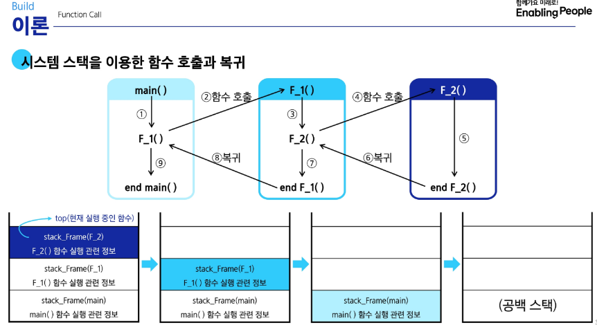

# Stack

## 1. Stack 자료구조의 이해
- 물건을 쌓아 올리듯 자료를 쌓아 올린 형태의 자료 구조
  - 선형구조를 가지는 자료.
  - 후입선출: 가장 마지막에 넣은 자료가 가장 먼저 나오는 것
### 1.1 Stack 의 기본 연산
- 배열을 사용해 구현할 수 있음. 
  - 파이썬에서는 리스트를 사용해 구현할 수 있음
- 저장소 자체를 스텍이라 부르기도 함
  - 용도에 따라 메모리 일부를 스택으로 부름
- 스택에서 마지막 삽입된 원소의 위치
  - 스택 포인터. top으로 부르며 데이터를 넣거나 뺼 때 기준이 되는 위치
- 스택의 연산
  - push. 삽입
    - 저장소에 자료를 저장하는 연산으로, 보통 push라고 부름
  - 삭제. pop
    - 저장소에서 삽입한 자료의 역순으로 꺼내는 연산으로 보통 pop이라 부름
  - 스택이 공백인지 확인하는 연산 isEmpty
    - 비어있으면 True, 아니면 False
  - 스택의 Top에 있는 item(원소)를 반환 Peek
    - 삭제는 안하고 맨 앞에 있는걸 출력
### 1.2 Stack 구현 실습
```python
def my_push(item):
    s.append(item)
def my_push(item, size):
    global top
    top += 1
    if top == size:
        print("overflow")
    else:
        stack[top] = item

## pop연산 실습
def my_pop():
    if len(s) == 0:
        print("underflow")
        return
    else:
        return s.pop() # 리스트 s의 마지막 요소 삭제

# 인덱스 연산을 이용한 pop연산
# 크기가 정해진 리스트와 인덱스 활용

def my_pop():
    global top
    if top == -1: 
        print("underflow")
        return 0
    else:
        top -= 1
        return stack[top+1]
```
- 스택 구현시 고려 사항
  - 1차원 배열을 사용하여 구현할 경우
    - 장점: 구현이 용의함
    - 단점: 스택의 크기를 변경하기 어려움,
  - 해결 방법: 저장소를 동적으로 할당하여 스택을 구현(동적 연결 리스트)
    - 장점: 메모리를 효율적으로 사용함
    - 단점: 구현이 복잡함
## 2. Stack 응용
### 2.1 괄호 검사
- 괄호의 종류: 대괄호([]), 중괄호 ({}), 소괄호(())
- 조건
  - 왼쪽 괄호의 수와 오른쪽 괄호의 수가 같아야 한다
  - 같은 괄호에서 왼쪽 괄호는 오른쪽 괄호보다 먼저 나와야 한다.
  - 괄호 사이에는 포함 관계만 존재한다.
```python
class My_Stack:
    def __init__(self, size=1000):
        self.data_list = [0] * size
        self.top = -1
        self.size = size

    def push(self, item):
        self.top += 1
        if self.top == self.size:
            print("overFlow")
            self.top -= 1
        else:
            self.data_list[self.top] = item

    def pop(self):
        if self.top == -1:
            print("underflow")
            return 0
        else:
            self.top -= 1
            return self.data_list[self.top + 1]
    
    def isEmpty(self):
        if self.top == -1:
            return True
        return False

check_word = "if((i==0) && (j==0)))"
stack = My_Stack()
for i in range(len(check_word)):
    if check_word[i] == "(":
        stack.push(check_word[i])
    elif check_word[i] == ")":
        if stack.isEmpty():
            print("오류. ( <- 이게 없음")
            break
        else:
            stack.pop()
if not stack.isEmpty():
    print("오류: )가 남음")
```
- 내가 만든 stack vs 내장함수 리스트 활용
  - 당연히 리스트가 더 빠름. 애초에 내껏도 결국 리스트로 만든거
### 2.2 Function Call
- 프로그램에서 함수의 호출과 복귀에 따른 수행 순서를 관리
  - 재귀에서 return 값을 어떻게 돌려줄 것인가? -> stack형태로 관리  



## 3. Stack 기반 문제 해결 기법
### 3.1 재귀호출
- 함수가 자신과 같은 작업을 반복해야 할 때, 자신을 다시 호출하는 구조.
- 대표적인 재귀 팩토리얼과 피보나치 수열
```python
def factorial(num):
    if num == 0:
        return 1
    else:
        return num * factorial(num - 1)
  
def fibo(num):
    if num < 2:
        return num
    else:
        return fibo(num-1) + fibo(num-2)
```
### 3.2 Memoization
- 컴퓨터 프로그램을 실행할 때 이전에 계산한 값을 메모리에 저장해서 매번 다시 계산하지 않도록 해 전체적인 실행 속도를 빠르게 함.
- Memoization 을 활용한 피보나치 수열
```python
def fibo1(n):
  if n >= 2 and memo[n] == 0:
    memo[n] = fibo1(n-1) + fibo1(n-2)
  return meno[n]
n = 1000
memo = [0] * (n+1) # fibo1 하기 전에 구할 크기만큼 memo를 0으로 초기화
memo[0] = 0
memo[1] = 1 # 위 두개는 기본값으로 깔고 간다.

```
- 파이썬은 재귀호출 최대 조건이 있다. 알고리즘 문제에서 저게 뜨면 잘못 푼거다. 설정 바꿀 순 있다.
- 
### 3.3 DP
- 입력 크기가 작은 부분 문제들을 먼저 해결한 뒤, 그 결과로 더 큰 부분 문제를 순차적으로 해결해 나아가며 최종적으로 전체 문제의 해답을 도출하는 알고리즘
- 피보나치 수열 문제
  - 문제의 최적 해가 그 하위 문제의 최적 해로부터 쉽게 구성될 수 있는 최적 부분 구저여야 한다.
  - 동일한 하위 문제가 여러 번 반복되어 나타나는 중복 부분 문제여야 합니다.
- 함수의 중복 호출 제거
  
|테이블 인덱스| 저장된 값 |
| --- | --- |
| [0] | 0 |
| [1] | 1 |
| [2] | 1 |
| [3] | 2 |
| [4] | 3 |
| ... | ... |
| [n] | fibo(n) |
- DP로 구현한 피보나치 수열 문제
```python
def fibo2(n):
  f = [0] * (n + 1)
  f[0] = 0
  f[1] = 1
  for i in range(2, n + 1):
    f[i] = f[i-1] + f[i-2]
  return f[n]
```
- DP의 구현 방식
  - Recursive 방식 : fib1()메모이제이션 쓴 코드
  - iterative 방식 : fib2() 
- 재귀 구조에서 Memoization 을 사용하는 것 보다 반복적인 구조로 DP쓰는 것이 더 효율적. 
  - 재귀 쓰면 오버헤드가 발생함.
### 3.4 DFS
- 깊이 우선 탐색. Depth First Search
  - 한 방향으로 가능한 깊게 탐색, 없으면 돌아가 다른 방향을 탐색
  - 간 곳을 stack 과 visits 에 넣고
  - 자식 노드가 visits 에 없으면 일단 감. 가면서 stack과 visits 에 진입
  - 자식 노드가 더 없으면 stack을 pop()해서 거기로 돌아감
```python
def DFS(arr, target, start, tree):
  # 자료구조 모양이 1 : [2,3] 형태라면
  visits = []
  stack = [start]
  while len(stack) != 0:
    now = stack.pop()
    if now not in visits:
      visits.append(now)
      child = tree.get(now, []) # 자식 노드 목록을 tree에서 get. 없으면 빈 리스트
      for i in range(len(child)-1, -1, -1): #역순으로. 왜냐면 stack 에 미리 자식들 몰아넣어두고 pop 할 것이기 때매
        # 예를 들어, 자식 목록이 2,3 이면 3,2 순으로 append 해야 맨 위에서 now = stack.pop() 할 때 2가 먼저 나옴.
        if child[i] not in visits:
          stack.append(child[i])
  return visits
```