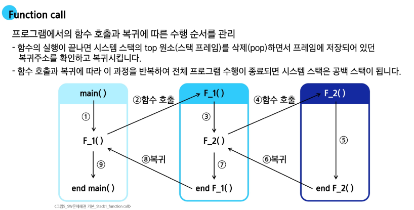
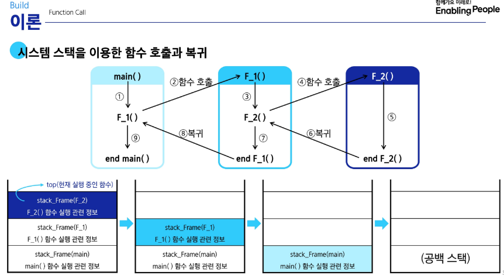
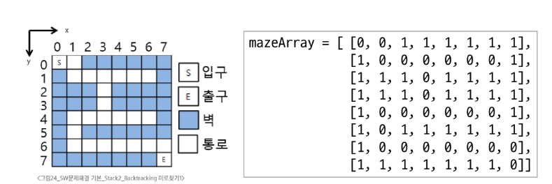
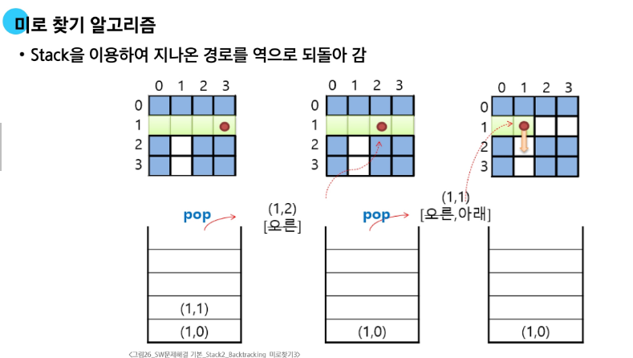
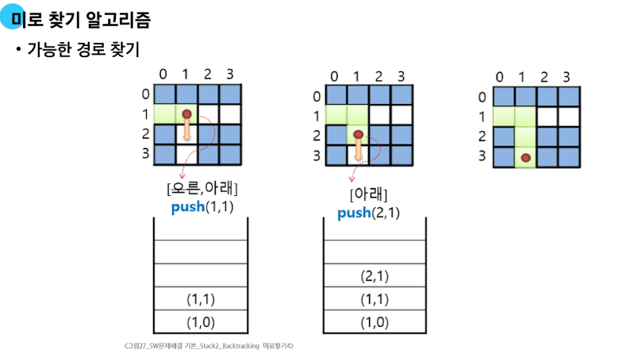

# Stack

## 1. Stack 자료구조의 이해
- 물건을 쌓아 올리듯 자료를 쌓아 올린 형태의 자료 구조
  - 선형구조를 가지는 자료.
  - 후입선출: 가장 마지막에 넣은 자료가 가장 먼저 나오는 것
### 1.1 Stack 의 기본 연산
- 배열을 사용해 구현할 수 있음. 
  - 파이썬에서는 리스트를 사용해 구현할 수 있음
- 저장소 자체를 스텍이라 부르기도 함
  - 용도에 따라 메모리 일부를 스택으로 부름
- 스택에서 마지막 삽입된 원소의 위치
  - 스택 포인터. top으로 부르며 데이터를 넣거나 뺼 때 기준이 되는 위치
- 스택의 연산
  - push. 삽입
    - 저장소에 자료를 저장하는 연산으로, 보통 push라고 부름
  - 삭제. pop
    - 저장소에서 삽입한 자료의 역순으로 꺼내는 연산으로 보통 pop이라 부름
  - 스택이 공백인지 확인하는 연산 isEmpty
    - 비어있으면 True, 아니면 False
  - 스택의 Top에 있는 item(원소)를 반환 Peek
    - 삭제는 안하고 맨 앞에 있는걸 출력
### 1.2 Stack 구현 실습
```python
def my_push(item):
    s.append(item)
def my_push(item, size):
    global top
    top += 1
    if top == size:
        print("overflow")
    else:
        stack[top] = item

## pop연산 실습
def my_pop():
    if len(s) == 0:
        print("underflow")
        return
    else:
        return s.pop() # 리스트 s의 마지막 요소 삭제

# 인덱스 연산을 이용한 pop연산
# 크기가 정해진 리스트와 인덱스 활용

def my_pop():
    global top
    if top == -1: 
        print("underflow")
        return 0
    else:
        top -= 1
        return stack[top+1]
```
- 스택 구현시 고려 사항
  - 1차원 배열을 사용하여 구현할 경우
    - 장점: 구현이 용의함
    - 단점: 스택의 크기를 변경하기 어려움,
  - 해결 방법: 저장소를 동적으로 할당하여 스택을 구현(동적 연결 리스트)
    - 장점: 메모리를 효율적으로 사용함
    - 단점: 구현이 복잡함
## 2. Stack 응용
### 2.1 괄호 검사
- 괄호의 종류: 대괄호([]), 중괄호 ({}), 소괄호(())
- 조건
  - 왼쪽 괄호의 수와 오른쪽 괄호의 수가 같아야 한다
  - 같은 괄호에서 왼쪽 괄호는 오른쪽 괄호보다 먼저 나와야 한다.
  - 괄호 사이에는 포함 관계만 존재한다.
```python
class My_Stack:
    def __init__(self, size=1000):
        self.data_list = [0] * size
        self.top = -1
        self.size = size

    def push(self, item):
        self.top += 1
        if self.top == self.size:
            print("overFlow")
            self.top -= 1
        else:
            self.data_list[self.top] = item

    def pop(self):
        if self.top == -1:
            print("underflow")
            return 0
        else:
            self.top -= 1
            return self.data_list[self.top + 1]
    
    def isEmpty(self):
        if self.top == -1:
            return True
        return False

check_word = "if((i==0) && (j==0)))"
stack = My_Stack()
for i in range(len(check_word)):
    if check_word[i] == "(":
        stack.push(check_word[i])
    elif check_word[i] == ")":
        if stack.isEmpty():
            print("오류. ( <- 이게 없음")
            break
        else:
            stack.pop()
if not stack.isEmpty():
    print("오류: )가 남음")
```
- 내가 만든 stack vs 내장함수 리스트 활용
  - 당연히 리스트가 더 빠름. 애초에 내껏도 결국 리스트로 만든거
### 2.2 Function Call
- 프로그램에서 함수의 호출과 복귀에 따른 수행 순서를 관리
  - 재귀에서 return 값을 어떻게 돌려줄 것인가? -> stack형태로 관리  



## 3. Stack 기반 문제 해결 기법
### 3.1 재귀호출
- 함수가 자신과 같은 작업을 반복해야 할 때, 자신을 다시 호출하는 구조.
- 대표적인 재귀 팩토리얼과 피보나치 수열
```python
def factorial(num):
    if num == 0:
        return 1
    else:
        return num * factorial(num - 1)
  
def fibo(num):
    if num < 2:
        return num
    else:
        return fibo(num-1) + fibo(num-2)
```
### 3.2 Memoization
- 컴퓨터 프로그램을 실행할 때 이전에 계산한 값을 메모리에 저장해서 매번 다시 계산하지 않도록 해 전체적인 실행 속도를 빠르게 함.
- Memoization 을 활용한 피보나치 수열
```python
def fibo1(n):
  if n >= 2 and memo[n] == 0:
    memo[n] = fibo1(n-1) + fibo1(n-2)
  return meno[n]
n = 1000
memo = [0] * (n+1) # fibo1 하기 전에 구할 크기만큼 memo를 0으로 초기화
memo[0] = 0
memo[1] = 1 # 위 두개는 기본값으로 깔고 간다.

```
- 파이썬은 재귀호출 최대 조건이 있다. 알고리즘 문제에서 저게 뜨면 잘못 푼거다. 설정 바꿀 순 있다.
- 
### 3.3 DP
- 입력 크기가 작은 부분 문제들을 먼저 해결한 뒤, 그 결과로 더 큰 부분 문제를 순차적으로 해결해 나아가며 최종적으로 전체 문제의 해답을 도출하는 알고리즘
- 피보나치 수열 문제
  - 문제의 최적 해가 그 하위 문제의 최적 해로부터 쉽게 구성될 수 있는 최적 부분 구저여야 한다.
  - 동일한 하위 문제가 여러 번 반복되어 나타나는 중복 부분 문제여야 합니다.
- 함수의 중복 호출 제거
  
|테이블 인덱스| 저장된 값 |
| --- | --- |
| [0] | 0 |
| [1] | 1 |
| [2] | 1 |
| [3] | 2 |
| [4] | 3 |
| ... | ... |
| [n] | fibo(n) |
- DP로 구현한 피보나치 수열 문제
```python
def fibo2(n):
  f = [0] * (n + 1)
  f[0] = 0
  f[1] = 1
  for i in range(2, n + 1):
    f[i] = f[i-1] + f[i-2]
  return f[n]
```
- DP의 구현 방식
  - Recursive 방식 : fib1()메모이제이션 쓴 코드
  - iterative 방식 : fib2() 
- 재귀 구조에서 Memoization 을 사용하는 것 보다 반복적인 구조로 DP쓰는 것이 더 효율적. 
  - 재귀 쓰면 오버헤드가 발생함.
### 3.4 DFS
- 깊이 우선 탐색. Depth First Search
  - 한 방향으로 가능한 깊게 탐색, 없으면 돌아가 다른 방향을 탐색
  - 간 곳을 stack 과 visits 에 넣고
  - 자식 노드가 visits 에 없으면 일단 감. 가면서 stack과 visits 에 진입
  - 자식 노드가 더 없으면 stack을 pop()해서 거기로 돌아감
```python
def DFS(arr, target, start, tree):
  # 자료구조 모양이 1 : [2,3] 형태라면
  visits = []
  stack = [start]
  while len(stack) != 0:
    now = stack.pop()
    if now not in visits:
      visits.append(now)
      child = tree.get(now, []) # 자식 노드 목록을 tree에서 get. 없으면 빈 리스트
      for i in range(len(child)-1, -1, -1): #역순으로. 왜냐면 stack 에 미리 자식들 몰아넣어두고 pop 할 것이기 때매
        # 예를 들어, 자식 목록이 2,3 이면 3,2 순으로 append 해야 맨 위에서 now = stack.pop() 할 때 2가 먼저 나옴.
        if child[i] not in visits:
          stack.append(child[i])
  return visits
```

## 4. Stack 계산기
### 4.1 후위 표기법 변환
- 문자열로 된 계산식을 스택을 이용해 값을 계산할 수 있음
- 문자열 수식의 일반적인 표현
  - 중위 표기법: 연산자를 피연산자 가운데 표기함 A + B
  - 후위 표기법: 연산자를 피연산자 뒤에 표기 AB +
- 중위 표기법 변환
1. 수식의 각 연산자에 대해 우선순위에 따라 괄호를 사용해 다시 표현한다.
2. 각 연산자를 그에 대응하는 오른쪽 괄호의 뒤로 이동시킨다
3. 괄호를 제거한다.
```markdown
예를 들어,A * B - C / D를 중위 표기에서 후위 표기로 바꾸는 방법은 아래와 같다.
1단계 : ((A*B) - (C/D))
2단계 : ((A B)* (C D)/)-
3단계 : AB*CD/-
```
- Stack 을 이용한 후위 표기법 변환
  - 입력받은 중의 표기법에서 토큰을 읽는다
  - 토큰이 피연산자면 토큰을 출력한다
  - 토큰이 연산자면(괄호 포함)
    - 이 토큰의 스택이 top에 저장되어 있는 연산자보다 우선순위가 높으면 스택에 push
    - 그렇지 않다면 스택 top연산자의 우선순위가 코든의 우선순위보다 작을 때 까지 스택에서 pop 한 후 토큰의 연산자를 push 한다. 만약 top가 없다면 push
    - 토큰이 ) 이면, 스택 top에 왼쪽 괄호 ( 가 올 때 까지 pop을 수행하고 pop한 연산자를 출력한다. 왼쪽 괄호를 만나면 pop 하고 출력은 안한다
    - 중위 표기법에 더 읽을 것이 없다면 중지하고, 더 읽을 것이 있다면 1부터 반복한다
    - 스택에 남아있는 모든 연산자를 pop 하여 출력한다.
    - 스택 밖의 왼쪽 괄호는 우선 순위가 가장 높으며 안의 왼쪽 괄호는 우선순위가 가장 낮다.
### 4.2 후위 표기법 연산
- 후위 표기법 식을 stack을 이용하여 연산
  - 피연산자를 만나면 stack 에 push 한다
  - 연산자를 만나면 필요한 만큼의 피연산자를 pop 하여 연산결과를 다시 stack 에 push 한다
  - 수식이 끝나면, 마지막 stack 을 pop 하여 출력한다.
## 5. Stack 응용
### 5.1 Backtracking
- 백트래킹이란?
  - 후보 해를 구성해 나가다, 더 이상 해가 될 수 없다고 판단되면 되돌아가서 다른 경로를 시도하는 방법
  - 문제 해결을 위한 탐색 알고리즘 중 하나
    - 가능성이 없는 경로는 더 이상 탐색하지 않고 되돌아가며 해결
    - 최적화, 결정 문제에 적용
  - 적용 예시
    - N-Queens 문제
    - 미로 찾기
    - 순열/조합 생성
    - 부분집합 탐색
    - 스도쿠 등
- Backtracking 과 DFS와의 차이
  - Prunning 유무(가지치기)
    - Backtracking 은 어떤 node 에서 출발하는 경로가 해결책으로 이어질 것 같지 않으면 더 이상 그 경로를 따라가지 않고 시도를 줄임
    - 조기 경로 차단
      - DFS는 모든 경로를 추적하지만, Backtracking은 불필요한 경로를 조기에 차단
    - 경우의 수가 많은 경우
      -  N!인 경우의 수를 가진 문제를 DFS 쓰면 안풀림
      -  Backitracking을 적용하면 일반적으로 경우의 수가 줄어들지만, 최악의 경우, 지수함수 시간을 요청함으로 처리가 불가능
- 모든 후보를 검사하나? No
  - 어떤 노드의 유망성을 보고 유망하지 않으면 그 부모노드로 돌아감.
  - 어떤 노드를 방문했을 때, **그 노드를 포함한 경로가 해답이 될 수 없으면 그 노드는 유망하지 않다** 고 판단하고, 해답의 가능성이 있으면 유망하다고 함.
  - 가지치기: Pruning: 유망하지 않은 노드를 포함한 경로는 고려하지 않음.
- 백트래깅의 진행 절차
| 상태 공간 트리의 DFS 실시 |
| 각 node 가 유망한가 점검 |
| 만일 그 노드가 유망하지 않으면 부모 노드로 돌아감 |
| 돌아간 node 에서 검색을 계속 |

- 미로 찾기 문제
  - 그림과 같이 입출구가 정해진 미로에서 입구 -> 출구까지 경로를 찾는 문제. 이동 방향은 4방향



- 일반 백트래킹 알고리듬
```python
def check_node(v):
  if promising(v):
    if there is a 
```
### 5.2 부분집합
- 어떤 집합의 공집합과 자기 자신을 포함한 모든 부분
  - 구하고자 하는 어떤 집합의 원소 개수가 n개일때 부분집합의 수는 2^n이다.
- backtracking 방법으로 powerset 만ㄷ르기
  - 앞에서 설명한 일반적인 Backtracking 접근 방법을 이용
  - n개의 원소가 들어있는 집합의 2^n개 부분집합을 만들기
    - True 또는 False값을 가지는 항목들로 구성된 n개의 배열을 만드는 방법을 이용
    - 여기서 배열의 i번째 항목은 i번째의 원소가 부분집합의 값인지 아닌지를 나타내는 값.
- 기본 코드
```python
bit = [0,0,0,0]
for i in range(2): 
  bit[0] = i # 0번 원소
  for j in range(2):
    bit[1] = j # 1번 원소
    for k in range(2):
      bit[2] = k # 2번 원소
      for l in range(2):
        bit[3] = l # 3번 원소
        print(bit) # 생성된 부분집합
```
- 백트래킹으로 구현하면?
```python
def backtrack(a, k, n): # 배열, 결정할 원소, 원소의 수
  c = [0] * Max_candidates # 후보값을 저장할 리스트 c, 최대 원소 개수
  if k == n: # 답이면 원하는 작업을 한다.
    process_solution(a, k)
  else:
    ncandidates = construct_candidates(a, k, n, c) # 후보군을 추천하는 함수. 후보의 수를 int 형태로 return
    for i in range(ncandidates):
      a[k] = c[i]
      backtrack(a, k + 1, n) # 재귀 호출
def construct_candidates(a, k, n, c):
  c[0] = True
  c[1] = False
  return 2
def process_solution(a, k):
  for i in range(k):
    if a[i]:
      print(num[i], end= ' ')
  print()

if __name__ == "__main__":
  max_candidate = 2
  nmax = 4
  a = [0] * nmax
  num = [1,2,3,4]
  backtrack(a, 0, 3)
```
### 5.3 순열1
- 백트래킹을 이용한 조건이 있는 순열 생성 방법
  - 조건이 있다면 백트래킹이 빠르다.
```python
def f(i, N, key): # 비트 연산을 몽땅 해서 합이 key 인 걸 고르는 코드
  global cnt, fcnt
  if i == N:
    s = 0
    for i in range(N):
      if bit[i] == 1:
        s += A[i]
    if s == key: # 부분집합의 합이 key와 같은 경우
      cnt += 1
    print(print(bit))
  else:
    bit[i] = 1
    f(i + 1, N)
    bit[i] = 0
    f(i+1, N)
  
def f1(i, N, s, key): # bit[i]를 결정하는 함수, i-1원소까지 결정된 부분집합의 합.
  global cnt, fcnt
  if s == key: # 목표에 도달한 경우
    cnt += 1
  elif i == N: # 찾는 값에 도달하진 못했어도, 마지막 원소라면 중단
    return
  elif s > key: # 합이 이미 key보다 큰 경우.
    return 
    for i in range(N):
      if bit[i] == 1:
        s += A[i]
    if s == key: # 부분집합의 합이 key와 같은 경우
      cnt += 1
    print(print(bit))
  else:
    bit[i] = 1
    f(i + 1, N, s + A[i]) # 여기가 다른 부분. A[i] 포함
    bit[i] = 0 # A[i] 미포함
    f(i+1, N, s + 0)

A = [1, 2, 3, 4, 5 ,6 ,7 ,8 ,9 ,10]
N = 10
bit = [0] * N
cnt = 0
fcnt = 0
f(bit, N)
print(cnt, fcnt)
```
### 5.4 가지치키
### 5.5 순열2
### 5.6 분할정복