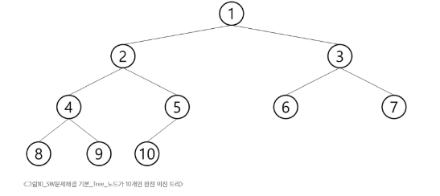
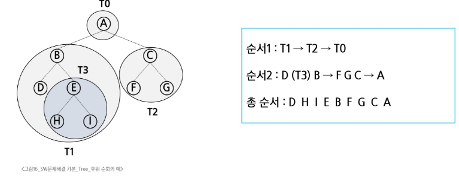

# 1. 트리 2회차
## 1.1 트리
- 트리의 개념
  - 비선형 구조
  - 원소들 간에 1:n 관계를 가지는 자료구조
  - 원소들 간에 계층관계를 가지는 계층형 자료구조
  - 상위 원소에서 하위 원소로 내려가면서 확장되는 트리 모양의 구조
- 트리의 정의
  - 한 개 이상의 노드로 이루어진 유한 집합이며, 다음 조건을 만족
    - 노드 중 최상위 노드를 루트라고 한다
    - 나머지 노드들은 n >= 0 개의 분리 집합 T1, ... , Tn으로 분리될 수 있다.
  - 이들 T1, ... , Tn은 각각 하나의 트리가 되며(재귀적 정의) subtree라 부른다. 

- 용어 정리
  - 노드(node) 트리의 원소
    - 트리 T의 노드 - A,B,C,D,E,F,G,H,I,J,K
  - 간선(edge) - 노드를 연결하는 선, 부모 노드와 자식 노드를 연결
  - 루트 노드(root node) - 트리의 시작 노드
  - 형제 노드(sibling node) - 같은 부모 노드의 자식 노드들
  - 조상 노드 - 간선을 따라 루트 노드까지 이르는 경로에 있는 모든 노드들
  - 서브 트리(sub tree) - 부모와 연결된 간선을 끊었을 떄 생성되는 트리
  - 자손 노드 - 서브 트리에 있는 하위 레벨의 노드들
  - 노드의 차수 - 노드에 연결된 자식 노드의 수
  - 트리의 차수 - 트리에 있는 노드의 차수 중 가장 큰 값
  - 단말 노드(leef node) - 차수가 0인 노드, 자식 노드가 없는 노드
  - 노드의 높이 - 루트에서 노드에 이르는 간선의 수, 노드의 레벨
  - 트리의 높이 - 트리에 있는 노드의 높이 중에서 가장 큰 값. 최대 레벨
## 1.2 이진 
- 이진 트리
  - 모든 노드들이 2개의 서브트리를 갖는 특별한 형태의 트리
  - 각 노드가 자식 노드를 최대 2개 까지만 가질 수 있는 트리
    - 왼쪽 자식 노드, 오른쪽 자식 노드
  - 이진 트리의 예  

- 이진 트리의 특성
  - 레벨 i에서의 노드의 최대 개수는 2^i 개
  - 높이가 h인 이진 트리가 가질 수 있는 노드의 최소 개수는 h + 1개, 최대 개수는 (2^h+1 -1)개
  - 아래 사진은 레벨 3짜리 트리. 
    - 최소 개수는 3 + 1 = 4개(팔 하나만 있는 트리)
    - 최대 개수는 2^3+1 -1 = 15개(꽉 찬 트리)


- 포화 이진 트리(Full Binary Tree)
  - 모든 레벨에 노드가 포화생태
  - 높이가 h일때 (2^h+1 -1)의 노드를 가지는 이진 트리
  - 루트를 1번으로 해서 (2^h+1 -1)까지 정해진 위치에 대한 노드 번호를 가짐(idx)


- 완전 이진 트리(Complete Binary Tree)
  - 높이가 h이고 노드 수가 n개일때, 포화 이진 트리의 노드번호 1번부터 n번까지 빈 자리가 없는 이진 트리


- 편향 이진 트리(Skewed Binary Tree)
  - 높이가 h에 대한 최소 개수의 노드를 가지면서 한쪽 방향의 자식 노드만을 가지는 이진 트리


## 1.3 순회
- 트리의 각 노드를 중복되지 않게 전부 방문하는 것.
- 순회(traversal)
  - 트리의 노드들을 체계적으로 방문하는 것
- 3가지의 기본적인 순회 방법
  - 전위순회(Preorder traversal):VLR
    - 부모 노드 -> 좌 -> 우
  - 중위 순회(inorder travarsal):LVR
    - 왼 -> 부모 -> 오른쪽
  - 후위순회(postorder traversal):LRV
    - 좌 -> 우 -> 부모


```python
def preorder_traversal(T):
  if T > 0:
    print(T, end " ")
    preorder_traversal(left[T])
    preorder_traversal(right[T])

def inorder_traversal(T):
  if T > 0:
    preorder_traversal(left[T])
    print(T, end " ")
    preorder_traversal(right[T])

def postorder_traversal(T):
  if T > 0:
    preorder_traversal(left[T])
    preorder_traversal(right[T])
    print(T, end " ")

if __name__ == "__main__":
  V = int(input())
  E = V - 1
  arr = list(map(int, input().split()))

  left = [0] * (V + 1)
  right = [0] * (V + 1)
  par = [0] * (V + 1)

  for i in range(E):
    p, c = arr[i*2], arr[i*2+1]
    par[c] = p
    if left[p] == 0:
      left[p] = c
    else:
      right[p] = c
  root = 1
  for i in range(1, V + 1):
    if par[i] == 0: # 부모노드가 없는 경우
      root = i
      break
```
- Preorder traversal (전위순회)
  - 수행 방법
    - 1. 현재 노드 n을 방문하여 처리한다
    - 2. 현재 노드 n의 왼쪽 서브트리로 이동한다
    - 3. 현재 노드 n의 오른쪽 서브트리로 이동한다.


- inorder traversal (전위순회)
  - 수행 방법
    - 1. 현재 노드 n의 왼쪽 서브트리로 이동한다
    - 2. 현재 노드 n을 방문하여 처리한다
    - 3. 현재 노드 n의 오른쪽 서브트리로 이동한다.


- postorder traversal (전위순회)
  - 수행 방법
    - 1. 현재 노드 n의 왼쪽 서브트리로 이동한다
    - 2. 현재 노드 n의 오른쪽 서브트리로 이동한다.
    - 3. 현재 노드 n을 방문하여 처리한다


## 1.4 이진 트리의 표현1
- 배열을 이용한 이진 트리의 표현
  - 이진 트리에 각 노드번호를 아래 그림과 같이 부여
  - 루트의 번호를 1로 함 부터 레벨 n에 있는 노드에 대해 왼쪽부터 2^n 부터 2^n+1 -1 까지 번호를 차례대로 부여
  - **포화 이진 트리, 완전 이진 트리에 적합**


- 노드 번호의 성질
  - 노드 번호가 i인 노드의 부모 노드 번호 -> i / 2
  - 노드 번호가 i인 노드의 왼쪽 자식 번호 -> 2 * i
  - 노드 번호가 i인 노드의 오른쪽 자식 번호 -> 2*i + 1
  - 레벨 n의 노드 시작 번호 -> 2^n


## 1.5 이진 트리의 표현2
- 부모 번호를 인덱스로 자식 번호를 저장
  - 4 <- 간선의 개수 N
  - 1 2 1 3 3 4 3 5 <- 부모 자식 순


- 배열을 이용한 이진 트리 표현의 단점
  - 편향 이진 트리의 경우, 사용하지 않는 배열 원소에 대한 메모리 공간 낭비 발생
  - 트리의 중간에 새로운 노드를 삽입하거나 기존의 노드를 삭제할 경우 배열의 크기 변경이 어려워 비효율적
- 연결 리스르틀 이용한 트리의 표현
  - 배열을 이용한 이진 트리의 표현의 단점을 보완
- 연결 자료구조를 활용한 이진 트리의 표현
  - 이진 트리의 모든 노드는 최대 2개의 자식 노드 데이터를 가지므로 일정한 구조의 단순 연결 리스트 노드를 사용
```python
class Node:
  def __init__(self, data):
    self.data = data
    self.top = None # 갱신하며 여기에 앞 뒤 객체(a = Node()로 생성한 것)을 매달아서 기록 
    self.bottom = None
```
- 수식 트리
  - 수식을 표현하는 이진 트리
  - 수식 이진 트리(Expression Binary Tree)라고 부르기도 함
  - 연산지는 루트 노드이거나 가지 노드
  - 피연산자는 모두 잎 노드
## 1.6 이진 탐색 트리
- BST Binary Search Tree(이진 탐색 트리)
  - Data들을 빠르게 검색할 수 있도록 체계적으로 저장해 두고 O(log n)의 빠른 속도로 값을 검색할 수 있게 하는 자료 구조
  - 빠르게 검색될 수 있도록 특정 규칙을 가지는 트리 형태로 값을 저장
- 리스트 vs BST\
  - BST는 리스트보다 더 빠른 삽입 / 삭제 / 탐색 이 가능하다
  - 리스트 성능
    - 삽입: On, 단 맨 끝은 O1
    - 삭제: On 단 맨 끝은 O1
    - 탐색 On
  - BST 성능
    - 삽입: 평균 O(logN)
    - 삭제: 평균 O(logN)
    - 탐색: 평균 O(logN)
- 이진 탐색 트리의 특징
  - 탐색 작업을 효율적으로 하기 위한 자료구조
  - 모든 원소는 서로 다른 유일한 키를 가진다
  - key(왼쪽 서브트리) < key(루트 노드) < key(오른쪽 서브트리)
  - 왼쪽 서브트리와 오른쪽 서브트리도 이진 탐색 트리다.
  - 중위 순회하면 오름차순으로 정렬된 값을 얻을 수 있다.


- 탐색연산
  - 루트에서 시작한다
  - 탐색할 키 값x를 루트 노드의 키 값과 비교한다
    - 키 값과 루트노드 값이 같으면 -> 탐색 성공
    - 키 값 보다 루트노드 값이 더 크면 -> 루트노드의 왼쪽에서 탐색
    - 키 값 보다 루트노드 값이 더 작으면 -> 루트노드의 오른쪽에서 탐색
  - 서브트리에 대해서 순환적으로 탐색 연산을 반복한다.


- 삽입연산
  - 먼저 탐색 연산을 수행
    - 삽입할 원소와 같은 원소가 트리에 있으면 삽입할 수 없음으로 같은 원소가 트리에 있는지 탐색해서 확인
    - 탐색 실패가 결정되는 위치가 삽입 위치
  - 탐색 실패한 위치에 원소를 삽입
    - 5를 삽입하는 예시


## 1.8 힙
- 힙(heap)
  - 완전 이진 트리에 있는 노드 중에서 키 값이 가장 큰 노드나 가장 작은 노드를 찾기 위해서 만든 자료구조
  - 최대 힙(max heap)
    - 키 값이 가장 큰 노드를 찾기 위한 완전 이진 트리
    - 부모노드의 키 값 > 자식 노드의 키 값
    - 루트 노드: 가장 키 값이 큰 노드
  - 최소 힙(min heap)
    - 키 값이 가장 작은 노드를 찾기 위한 완전 이진 트리
    - 부모노드의 키 값 < 자식 노드의 키 값
    - 루트 노드: 키 값이 가장 작은 노드
- 힙의 예시


- 힙이 아닌 이진 트리의 예


- 힙 연산의 삽입
  - 최대 이진 트리의 경우(루트노드 키 값이 가장 큰 경우)
  - 루트 노드에서부터 가장 오른쪽 빈 공간을 찾고 값을 넣는다
  - 값을 부모와 비교해서 부모보다 크면 부모와 자식의 위치를 변경한다
  - 루트에 도달하거나, 부모 자식 관계가 정상화 될 경우 멈춘다.


- 힙 연산의 삭제
  - 힙에서는 루트 노드의 원소만을 삭제할 수 있다.
  - 루트 노드의 원소를 삭제해서 반환한다
  - 힙의 종류에 따라 최대값 또는 최소값을 구할 수 있다.


- 힙을 이용한 우선순위 큐
  - 완전 이진 트리로 구현된 자료구조로서, 키 값이 가장 큰 노드나 가장 작은 노드를 찾기에 적합한 자료구조
  - 아래의 예는 최소 힙으로, 가장 작은 키 값을 가진 노드가 항상 루트에 위치함


  - 힙의 키를 우선순위로 활용하여 우선순위 큐를 구현
```python
def enq(n):
    global last, heap
    last += 1 #마지막 정점 추가
    heap[last] = n

    c = last
    p = c // 2 #완전 이진트리 자식 부모 연산방법. 
    # 부모가 있고, 부모 < 자식 일 경우, 부모와 자식을 교환
    while p > 0 and heap[p] < heap[c]: # p 가 0이 아니고(root가 아니고) 부모가 자식보다 작으면
        heap[p], heap[c] = heap[c], heap[p] # 부모 자식간 교환
        p = c // 2 # 부모 인덱스를 갱신함으로 계속 while 문이 돌아가면서 루트가 되건, 부모보다 작아지던 계속 반복하게 만듬. 

if __name__ =="__main__":
    heap = [0] * 100 # 1~99까지 대응
    last = 0
    enq(2)
    enq(5)
    enq(7)
    enq(3)
    enq(4)
    enq(6)
    print(heap)
# [0, 7, 4, 6, 2, 3, 5, 0, 0, 0, 0, 0, 0, 0, 0, 0, 0, ... , 0] 
```
# 1. 최소 신장 트리
- Spanning Tree
  - n 개의 정점을 포함하는 무향 그래프에서 n개의 정점과 n-1 개의 간선으로 구성된 트리
  - 그래프에 존재하는 신장 트리의 수
    - 정점의 개수와 비례해서 증가
- 최소 신장 트리
  - 가중치 그래프에서 신장 트리를 구성하는 간선들의 가중치 합이 최소인 신장 트리.
- 프림 알고리즘
  - 한 정점에 연결된 간선들 중 하나씩 선택하면서 최소 신장 트리를 만들어가나는 방식 
    - 임의의 정점을 하나 선택해서 시작
    - 선택한 정점들과 인접하는 정점들 중 최소 비용의 간선이 존재하는 정점을 선택
    - 모든 정점이 선택될 때 까지 두번째 과정 반복
      - 정점의 수 n개, 시작 정점을 제외한 n-1개의 정점을 선택
      - 선택된 정점들과 간선들은 하나의 트리를 구성함
  - 프림 알고리즘의 동작 원리
    - 두 종류의 상호 배타 집합 정보가 필요
      - 트리 정점들 - 선택된 정점들
      - 비트리 정점들 - 선택되지 않은 정점들
- 프림 알고리즘의 수도 코드
```python
def MST_PRIM(G, s): # G: 그래프, s: 시작 정점
  key = 10**9 # 최소 거리로 쓸 변수. 초기값으로 엄청 큰 값 줘서 처음 만나는 값 뭐든 갱신되도록
  pi = [None] * N # 최소신장트리에서 각 부모 정보를 저장할 리스트
  visited = [False] * N # 방문 배열
  key[s] = 0 # 시작 노드의 가중치를 0으로

  for _ in range(N):
    min_idx = -1
    min = 10**9
    for i in range(N):
      if not visited[i] and key[i] < min:
        min = key[i]
        min_idx = i
    visited[min_idx] = True
    for v val in G[min_idx]:
      if not visited[v] and val < key[v]:
        key[v] = val
        pi[v] = min_idx

"""
전체를 순회하면서 모든 정점을 다 따져보는 알고리즘
1번에서 갈 수 있는거 모두 확인해서 갱신하고, 이 중에 최선을 기록
그 최선으로 이동해 이동할 수 있는 모든 리스트를 확인하고, 이전 값중 바꿀 것, 새 값 넣을거 넣고 최소로 이동

순회를 염두에 둔 알고리즘 아님. 그냥 최소 비용트리
"""
```

## 2. 크루스칼 알고리즘
- 최소 가중치 간선을 하나씩 선택해서 최소 신장 트리를 찾는 알고리즘
  - n개의 정점을 포함하는 그래프에서 n-1개의 간선을 선택하는 방식
  - 간선을 선택해 나가는 과정에서 여러개의 트리들이 존재
- 방법
  - 가중치에 따라 오름차순으로 정렬
  - 가중치가 낮은 간선부터 선택하면서 트리 증가시킴
    - 사이클이 존재하면 다음으로 가중치가 낮은 간선 선택
    - n-1 남을때까지 반복
```python
def MST_KRUSKAL(G):
  mst = []
  for i in range(N):
    make_set(i)
  G.sort(key=lambda t:t[2])
  mst_cost = 0

  while len(mst) < N - 1:
    u, v, val = G.pop(0)
    if find_set(u) != find_set(v):
      union(u, v)
      mst_append((u, v))
      mst_cost += val


```
## 3. 다익스트라 알고리즘
- 시작 정점에서 거리가 최소인 정점부터 선택해 나가면서 최단 경로를 구하는 방식
- 탐욕 기법을 사용한 알고리즘으로 최소 신장 트리를 구하는 프림 알고리즘과 유사
- 시작 정점에서 끝 정점 까지의 최단 경로에 정점 x가 존재
- 최단 경로는 r(시작 정점) 에서 x(중간 정점)까지의 최단 경로와 x(중간 정점) 에서 t(끝 정점)까지의 최단 경로로 구성