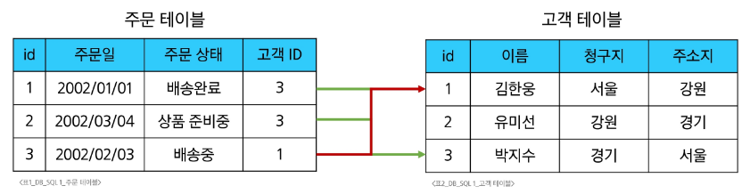
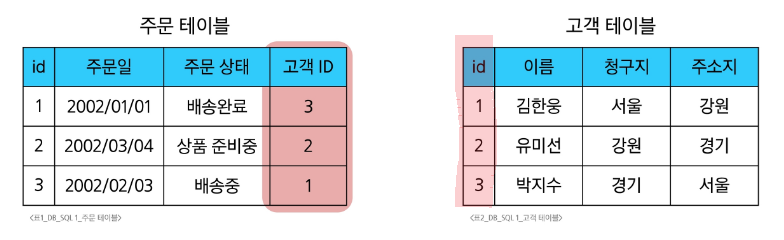
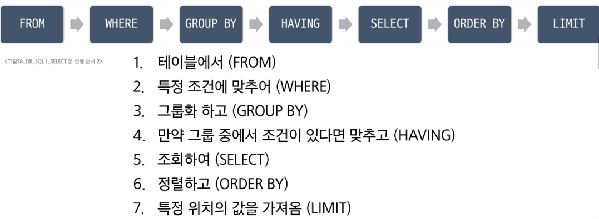

# 1. Database
- 데이터란?
  - 저장이나 처리를 위해 변환된 정보
- 데이터 처리 방법
  - 1. 파일(File)이용
    - 어디서나 쉽게 사용 가능
    - 구조적으로 관리 어려움
  - 2. Spreadsheet 이용
    - 테이블의 열과 행을 사용해 데이털르 구조적으로 관리 가능
    - 한계
      - 크기: 일반적으로 100만행 까지만
      - 보안: 단순히 파일이나 링크 소유 여부에 따른 단순한 접근 권한 제한 기능만 제공
      - 정확성
        - 강원 -> 강윈도 라면? 일일히 전체 다 수정
        - 여러 파일에 분산되어 있다면 더 큰 문제
- 데이터베이스의 역할
  - CRUD
    - Create 
    - Read
    - Update
    - Delete
# 2. Relational Database
- Relational Database란?
  - 관계형 데이터베이스: 데이터 간에 관계가 있는 데이터 항목들의 모음
  - 테이블, 행, 열의 정보를 구조화하는 방식
  - 서로 관련된 데이터 포인터를 저장하고 이에 대한 엑세스를 제공
- 관계
  - 여러 테이블 간의 논리적 연결
  - 관계로 할 수 있는 것
    - 이 관계로 인해 두 테이블을 사용하여 데이터를 다양한 형식으로 조회할 수 있음
      - 특정 날짜에 구매한 모든 고객
      - 지난 달에 배송일이 지연된 고객 등

- 관계형 데이터베이스의 예시
  - 다음과 같이 고객데이터가 테이블에 저장되어 있다고 가정
  - 고객 데이터 간 비교를 위해서는 어떤 값을 활용해야 할까?
    - 각 데이터에 고유한 식별값을 부여하기(PK)
    - 주문 정보에 고객의 고유한 식별 값을 저장하기(외래 키 Foreign Key)


- 관계형 데이터베이스 관련 키워드
  - 테이블(Relation): 데이터를 기록하는 곳
  - 필드(Field, Column, Attribute): 지정된 고유한 데이터 형식
  - 레코드(Record, Row, Tuple): 구체적인 데이터 값
  - 데이터베이스(Database, Schema): 테이블의 집합
  - Primary Key(기본키, PK): 각 레코드의 고유값, 관계형 DB에서 레코드의 식별자로 활용
  - Foreign Key(외래 키, FK): 테이블의 다른 필드 중 다른 테이블의 레코드를 식별할 수 있는 키. 다른 테입르의 기본 키를 참조. 관계를 만드는데 사용
## 2.1 RDBMS
- DBMS
  - 데이터베이스를 관리하는 소프트웨어 프로그램
  - 데이터 저장 및 관리를 용의하게 하는 시스템
  - 데이터베이스와 사용자 간의 인터페이스 역할
  - 사용자가 데이터 구성, 업데이트 모니터링, 백업, 복구 등을 할 수 있도록 도움
- RDBMS
  - 관계형 데이터베이스 관리 소프트웨어 프로그램
- RDBNS 서비스 종류
  - SQLite
  - MySQL
  - PostgreSQL
  - Oracle Database 등
- SQLite
  - 경량의 오픈소스 데이터베이스 관리 시스템
  - 설치 없이 가볍게 실행 가능해 모바일이나 소규모 프로그램에 적합
  - 컴퓨터나 모바일 기기에 내장되어 간단하고 효율적인 데이터 저장 관리 가능

- 데이터베이스 정리
  - Table은 데이터가 기록되는 곳
  - Table에는 행에서 고유하게 식별 가능한 기본키 라는 속성이 있으며 외래키를 사용하여 각 행에서 서로 다른 테이블 간의 관계를 만들 수 있음
  - 데이터는 기본 키 또는 외래 키를 통해 결합될 수 있는 여러 테이블에 걸쳐 구조화됨

# 3. SQL(Structure Query Language)
- 테이블 형태로 구조화 된 관계형 데이터베이스에 요청을 질의
```sql
SELECT column_name FROM table_name;
```
- 1. SQL 키워드는 대소문자를 구분하지 않음.
  - 그렇지만 명령어는 대문자로 작성하는걸 권장
- 2. SQL Statements의 끝에는 세미콜론 ';'가 필요
  - 세미콜론은 각 SQL Statements를 구분하는 방법(명령어의 마침표)
## 3.1 SQL Statements
- SQL을 구성하는 가장 기본적인 코드 블록
- SQL Statements의 예시
```sql
SELECT column_name FROM table_name;
```
- 수행 목적에 따른 SQL Statements 4가지 유형
  - DDL: 데이터 정의
  - DQL: 데이터 검색
  - DML: 데이터 조작
  - DCL: 데이터 제어

| 유형 | 역할 | SQL 키워드 |
| ---- |  ---- |  ---- |
| DDL(Data Definition Language) | 데이터의 기본 구조 및 형식 변경 | CREATE, DROP, ALTER |
| DQL(Data Query Language) | 데이터 검색 | SELECT |
| DML(Data Mainpulation Language) | 데이터 조작(추가, 삭제, 수정) | INSERT, UPDATE, DELETE |
| DCL(Data Control Language) | 데이터 및 작업에 대한 사용자 권한 제어 | COMMIT, ROLLBACK, GRANT, REVOKE |
# 4. Querying Data
## 4.1 DQL(Data Query Language)
- SELECT syntax
```sql
SELECT
  select_list
FROM
  table_name;
```
- SELECT 키워드 이후 데이터를 선택하려는 필드를 하나 이상 지정
- FROM 키워드 이후 데이터를 선택하려는 테이블의 이름을 지정

# 5. Sorting data
## 5.1 ORDER BY
```sql
SELECT
  select_list
FROM
  table_name;
ORDER BY
  column1 [ASC|DESC], 
  column2 [ASC|DESC], 
```
- FROM clause 뒤에 위치
- 하나 이상의 컬럼을 기준으로 결과를 오름차순(ASC, 기본값), 내림차순(DESC)로 정렬
# 6. Filtering data
- Clause
  - DISTINTIC
  - WHERE
  - LIMIT
- Operator
  - BETWEEN
  - IN
  - LIKE
  - Comprison
  - Logical
## 6.1 DISTINCT
```sql
SELECT DISTINCT
  select_list
FROM
  table_name;
```
- SELECT 바로 뒤에 작성
- SELECT DISTINCT 키워드 다음에 고유한 값을 선택하려는 하나 이상의 필드 지정
## 6.2 WHERE
```sql
SELECT
  select_list
FROM
  table_name
WHERE
  search__condition;
```
- FROM clause 뒤에 위치
- search_condition은 비교연산자 및 논리연산자(AND, OR, NOT)를 사용하는 구문이 됨
## 6.3 Operators
- Comparison Operators
  - 비교 연산자
  - =, >=, <=, !=
  - IS, LIKE, IN
  - BETWEEN...AND
- Logical Operators
  - 논리 연산자
  - AND(&&)
  - OR(||)
  - NOT(!)
- Wildcard Characters
  - %: 0개 이상의 문자열과 일치하는지 확인
  - _: 단일 문자와 일치하는지 확인
## 6.4 LIMIT
```sql
SELECT
  select_list
FROM
  table_name
LIMIT [offset, ] row_count;
```
- 하나 또는 두 개의 인자를 사용(0 또는 양의 정수 사용)
- row_count는 조회하는 최대 레코드 수를 지정
# 7. Grouping data
## 7.1 GROUP BY
```sql
SELECT
  c1, c2, ... , arrgeate_function(ci)
FROM
  table_name
GROUP BY
  c1, c2, ... , cn;
```
- FROM및 WHERE 절 뒤에 배치
- GROUP BY 절 뒤에 그룹화 할 필드 목록을 작성
- Aggregation Functions. 집계 함수
  - 값에 대한 계산을 수행하고 단일한 값을 반환하는 함수
    - SUM, AVG, MAX, MIN, COUNT
## 7.2 HAVING
- WHERE 과 HAVING 비교
- WHERE
  - 목적
    - 개별 행에 대한 조건을 지정하여 데이터를 필터링
  - 적용 시점
    - FROM과 JOIN등의 단계 이후, GROUP BY이전에 적용
 - 사용 예시
   - 특정 조건을 만족하는 행만을 대상으로 집계나 정렬 등의 작업을 수행할때 사용
- HAVING
   - 목적
      - GROUP BY에 의해 그룹화된 결과에 대해 조건을 지정하여 그룹을 필터링
   - 적용시점
      - 그룹핑 및 집계 함수 적용 후에 조건을 평가
   - 사용예
     - 그룹별 집계 결과에 조건을 걸어 특정 그룹만을 선택할 때 사용

# 8. 참고
## 8.1 Query
## 8.2 NULL 비교
## 8.3 SQL 표준