# 1. Database
- 데이터란?
  - 저장이나 처리를 위해 변환된 정보
- 데이터 처리 방법
  - 1. 파일(File)이용
    - 어디서나 쉽게 사용 가능
    - 구조적으로 관리 어려움
  - 2. Spreadsheet 이용
    - 테이블의 열과 행을 사용해 데이털르 구조적으로 관리 가능
    - 한계
      - 크기: 일반적으로 100만행 까지만
      - 보안: 단순히 파일이나 링크 소유 여부에 따른 단순한 접근 권한 제한 기능만 제공
      - 정확성
        - 강원 -> 강윈도 라면? 일일히 전체 다 수정
        - 여러 파일에 분산되어 있다면 더 큰 문제
- 데이터베이스의 역할
  - CRUD
    - Create 
    - Read
    - Update
    - Delete
# 2. Relational Database
- Relational Database란?
  - 관계형 데이터베이스: 데이터 간에 관계가 있는 데이터 항목들의 모음
  - 테이블, 행, 열의 정보를 구조화하는 방식
  - 서로 관련된 데이터 포인터를 저장하고 이에 대한 엑세스를 제공
- 관계
  - 여러 테이블 간의 논리적 연결
  - 관계로 할 수 있는 것
    - 이 관계로 인해 두 테이블을 사용하여 데이터를 다양한 형식으로 조회할 수 있음
      - 특정 날짜에 구매한 모든 고객
      - 지난 달에 배송일이 지연된 고객 등

- 관계형 데이터베이스의 예시
  - 다음과 같이 고객데이터가 테이블에 저장되어 있다고 가정
  - 고객 데이터 간 비교를 위해서는 어떤 값을 활용해야 할까?
    - 각 데이터에 고유한 식별값을 부여하기(PK)
    - 주문 정보에 고객의 고유한 식별 값을 저장하기(외래 키 Foreign Key)


- 관계형 데이터베이스 관련 키워드
  - 테이블(Relation): 데이터를 기록하는 곳
  - 필드(Field, Column, Attribute): 지정된 고유한 데이터 형식
  - 레코드(Record, Row, Tuple): 구체적인 데이터 값
  - 데이터베이스(Database, Schema): 테이블의 집합
  - Primary Key(기본키, PK): 각 레코드의 고유값, 관계형 DB에서 레코드의 식별자로 활용
  - Foreign Key(외래 키, FK): 테이블의 다른 필드 중 다른 테이블의 레코드를 식별할 수 있는 키. 다른 테입르의 기본 키를 참조. 관계를 만드는데 사용
## 2.1 RDBMS
- DBMS
  - 데이터베이스를 관리하는 소프트웨어 프로그램
  - 데이터 저장 및 관리를 용의하게 하는 시스템
  - 데이터베이스와 사용자 간의 인터페이스 역할
  - 사용자가 데이터 구성, 업데이트 모니터링, 백업, 복구 등을 할 수 있도록 도움
- RDBMS
  - 관계형 데이터베이스 관리 소프트웨어 프로그램
- RDBNS 서비스 종류
  - SQLite
  - MySQL
  - PostgreSQL
  - Oracle Database 등
- SQLite
  - 경량의 오픈소스 데이터베이스 관리 시스템
  - 설치 없이 가볍게 실행 가능해 모바일이나 소규모 프로그램에 적합
  - 컴퓨터나 모바일 기기에 내장되어 간단하고 효율적인 데이터 저장 관리 가능

- 데이터베이스 정리
  - Table은 데이터가 기록되는 곳
  - Table에는 행에서 고유하게 식별 가능한 기본키 라는 속성이 있으며 외래키를 사용하여 각 행에서 서로 다른 테이블 간의 관계를 만들 수 있음
  - 데이터는 기본 키 또는 외래 키를 통해 결합될 수 있는 여러 테이블에 걸쳐 구조화됨

# 3. SQL(Structure Query Language)
- 테이블 형태로 구조화 된 관계형 데이터베이스에 요청을 질의
```sql
SELECT column_name FROM table_name;
```
- 1. SQL 키워드는 대소문자를 구분하지 않음.
  - 그렇지만 명령어는 대문자로 작성하는걸 권장
- 2. SQL Statements의 끝에는 세미콜론 ';'가 필요
  - 세미콜론은 각 SQL Statements를 구분하는 방법(명령어의 마침표)
## 3.1 SQL Statements
- SQL을 구성하는 가장 기본적인 코드 블록
- SQL Statements의 예시
```sql
SELECT column_name FROM table_name;
```
- 수행 목적에 따른 SQL Statements 4가지 유형
  - DDL: 데이터 정의
  - DQL: 데이터 검색
  - DML: 데이터 조작
  - DCL: 데이터 제어

| 유형 | 역할 | SQL 키워드 |
| ---- |  ---- |  ---- |
| DDL(Data Definition Language) | 데이터의 기본 구조 및 형식 변경 | CREATE, DROP, ALTER |
| DQL(Data Query Language) | 데이터 검색 | SELECT |
| DML(Data Mainpulation Language) | 데이터 조작(추가, 삭제, 수정) | INSERT, UPDATE, DELETE |
| DCL(Data Control Language) | 데이터 및 작업에 대한 사용자 권한 제어 | COMMIT, ROLLBACK, GRANT, REVOKE |
# 4. Querying Data
## 4.1 DQL(Data Query Language)
- SELECT syntax
```sql
SELECT
  select_list
FROM
  table_name;
```
- SELECT 키워드 이후 데이터를 선택하려는 필드를 하나 이상 지정
- FROM 키워드 이후 데이터를 선택하려는 테이블의 이름을 지정

# 5. Sorting data
## 5.1 ORDER BY
```sql
SELECT
  select_list
FROM
  table_name;
ORDER BY
  column1 [ASC|DESC], 
  column2 [ASC|DESC], 
```
- FROM clause 뒤에 위치
- 하나 이상의 컬럼을 기준으로 결과를 오름차순(ASC, 기본값), 내림차순(DESC)로 정렬
# 6. Filtering data
- Clause
  - DISTINTIC
  - WHERE
  - LIMIT
- Operator
  - BETWEEN
  - IN
  - LIKE
  - Comprison
  - Logical
## 6.1 DISTINCT
```sql
SELECT DISTINCT
  select_list
FROM
  table_name;
```
- SELECT 바로 뒤에 작성
- SELECT DISTINCT 키워드 다음에 고유한 값을 선택하려는 하나 이상의 필드 지정
## 6.2 WHERE
```sql
SELECT
  select_list
FROM
  table_name
WHERE
  search__condition;
```
- FROM clause 뒤에 위치
- search_condition은 비교연산자 및 논리연산자(AND, OR, NOT)를 사용하는 구문이 됨
## 6.3 Operators
- Comparison Operators
  - 비교 연산자
  - =, >=, <=, !=
  - IS, LIKE, IN
  - BETWEEN...AND
- Logical Operators
  - 논리 연산자
  - AND(&&)
  - OR(||)
  - NOT(!)
- Wildcard Characters
  - %: 0개 이상의 문자열과 일치하는지 확인
  - _: 단일 문자와 일치하는지 확인
## 6.4 LIMIT
```sql
SELECT
  select_list
FROM
  table_name
LIMIT [offset, ] row_count;
```
- 하나 또는 두 개의 인자를 사용(0 또는 양의 정수 사용)
- row_count는 조회하는 최대 레코드 수를 지정
# 7. Grouping data
## 7.1 GROUP BY
```sql
SELECT
  c1, c2, ... , arrgeate_function(ci)
FROM
  table_name
GROUP BY
  c1, c2, ... , cn;
```
- FROM및 WHERE 절 뒤에 배치
- GROUP BY 절 뒤에 그룹화 할 필드 목록을 작성
- Aggregation Functions. 집계 함수
  - 값에 대한 계산을 수행하고 단일한 값을 반환하는 함수
    - SUM, AVG, MAX, MIN, COUNT
## 7.2 HAVING
- WHERE 과 HAVING 비교
- WHERE
  - 목적
    - 개별 행에 대한 조건을 지정하여 데이터를 필터링
  - 적용 시점
    - FROM과 JOIN등의 단계 이후, GROUP BY이전에 적용
 - 사용 예시
   - 특정 조건을 만족하는 행만을 대상으로 집계나 정렬 등의 작업을 수행할때 사용
- HAVING
   - 목적
      - GROUP BY에 의해 그룹화된 결과에 대해 조건을 지정하여 그룹을 필터링
   - 적용시점
      - 그룹핑 및 집계 함수 적용 후에 조건을 평가
   - 사용예
     - 그룹별 집계 결과에 조건을 걸어 특정 그룹만을 선택할 때 사용

# 8. 참고
## 8.1 Query
- 데이터베이스로부터 정보를 요청하는 것
- 일반적으로 SQL로 작성하는 코드를 쿼리문(SQL문)이라 함
## 8.2 NULL 비교
- SQL에서 NULL은 실제 값이 아니라 "값이 없음" 또는 "알 수 없음"을 의미
  - 때문에 일반적인 등호("=")로 NULL을 비교하면 의도한 대로 동작하지 않음
- SQL의 3값 논리
  - 1. TRUE
  - 2. FALSE
  - 3. UNKNOWN(알수없음)
  - 예를 들어 NULL = NULL 의 결과는 TRUE 가 아닌 UNKNOWN이 됨
  - 이는 두 NULL이 실제 어떤 값을 가지지 않기 때문
- 값의 부재와 불확실성
  - NULL은 값이 존재하지 않음을 나타냄으로 특정 값과 동일하다고 볼 수 있음
  - = 연산자를 쓰면 NULL은 어떤 값과도 비교할 수 없음으로 결과가 UNKNOWN이 되어 기대한 결과를 얻지 못함
- 명시적 비교: IS와 IS NOT
  - SQL 표준은 NULL 값을 비교할때 명시적으로 IS NULL 이나 IS NOT NULL 구문을 사용하도록 규정
  - WHERE column IS NULL은 해당 컬럼에 값이 없음을 정확하게 확인할 수 있도록 해줌
  - 반대로 WHERE column IS NOT NULL은 은 값이 존재하는 행을 찾음
- IS와 =비교
- =
  - 일반적인 값의 동등성(같음)을 비교할 때 사용
  - 제한 사항
    - 만약 비교하는 값 중 하나라도 NULL이면 결과는 UNKNOWN이 됨
    - 예를 들어 NULL = NULL 의 결과는 TRUE 가 아니라 UNKNOWN
    - SQL의 3값 논리(참, 거짓, 알 수 없음)체계 떄문에 이런 결과가 발생
```sql
SELECT * FROM employees
WHERE department = 'Salse';
```
- IS
  - NULL과 같은 특별한 값을 비교할 때 사용
  - 사용처
    - NULL 비교
    - Boolean 값 비교
```sql
SELECT * FROM employees
WHERE department IS NULL
AND is_active IS TRUE;
```

# 1. Managing Tables
## 1.1 Create a table
```sql
CREATE TABLE table_name (
  ExamId INTEGER PRIMARY KEY AUTOINCREMENT,
  LastName VARCHAR(50) NOT NULL,
  FirstName VARCHAR(50) NOT NULL
);
```
- 각 필드에 적용할 데이터 타입 작성
- 테이블 및 필드에 대한 제약조건(constraints) 작성

- SQL의 데이터 타입
  - NULL: 아무런 값도 포함하지 않음
  - INTEGER: 정수
  - REAL: 부동소수점
  - TEXT: 문자열
  - BLOB: 이미지, 동영상, 문서 등의 바이너리 데이터
- Constraints(제약 조건)
  - 테이블의 필드에 적용되는 규칙 또는 제한 사항
  - 데이터의 무결성을 유지하고 데이터베이스의 일관성을 보장
- 대표 제약 조건 3가지
  - PK(Primary Key)
    - 해당 필드를 기본 키로 지정
    - INTEGER 타입에만 지정 가능. INT, BIGINT 등과 같은 다른 정수 유형은 안됨.
  - NOT NULL
    - 기본값에 NULL 값을 허용하지 않음
  - FOREIGN KEY
    - 다른 테이블과의 외래 키 관계를 정의
  - AUTOINCREMENT 
    - 필드의 자동 증가를 나타내는 특수한 키워드
    - 주로 PK에 적용
    - INTEGER PRIMARY KEY AUTOINCREMENT 가 작성된 필드는 항상 새로운 레코드에 대해 이전 최대값보다 큰 값을 할당하게 됨
    - 삭제된 값은 무시. 재사용 할 수 없게 됨
      - 라 생각하지만 가능. 마지막 번호에 대해 별도 필드에 갱신해서 관리하는거라 이거 조작하면 예전 값 다시 사용할 수 있게 처리 가능
## 1.2 Modifying table fields
- ALTER TABLE
| 명령어 | 역할 |
| ---- | ---- |
| ALTER TABLE ADD COLUMN | 필드 추가 |
| ALTER TABLE RENAME COLUMN | 필드 이름 변경 |
| ALTER TABLE DROP COLUMN | 필드 삭제 |
| ALTER TABLE RENAME TO | 테이블 이름 변경 |

```SQL
-- ADD COLUMN
ALTER TABLE
  users 
ADD COLUMN
  Country VARCHAR(100) NOT NULL DEFAULT 'default value';

-- RENAME COLUMN
ALTER TABLE
  users
RENAME COLUMN
  Country TO Countrys;

-- DROP TABLE
ALTER TABLE
  users
DROP COLUMN
  Country;

-- RENAME TO
ALTER TABLE
  users
RENAME TO
  MyUsers;
```
## 1.3 Delete a table
```sql
DROP TABLE MyUsers;
```
# 2. Modifying Data
## 2.1 Insert Data
- 사전 준비
  - 생성하려는 테이블과 동일한 이름을 가진 테이블이 존재하는지 확인
  - 불필요한 테이블이라면 DROP TABLE 명령어로 테이블 삭제
  - 정상적으로 삭제되었는지 PRAGMA 활용하여 체크
```SQL
SELECT * FROM articles;
DROP TABLE articles;
PRAGMA table_info('articles');

-- INSERT INTO 실습
INSERT INTO articles
  (title, content, createAt)
VALUES
  ('hello', 'world', '2200-01-01');
```
## 2.2 Update Data
```sql
UPDATE articles
SET title = 'update_title'
WHERE id = 1;
```
## 2.3 Delete Data
```SQL
DELETE FROM articles
WHERE id = 1;
```
# 3. Multi table queries
- 관계의 필요성
  - 커뮤니티 페이지를 생각해보자. 유저 정보는 뭐가 필요할까?
  - 아이디, 제목, 글, 작성자, 권한 등 5개만 관리해본다고 해 보자
  - 이 때 이걸 하나의 테이블에서 관리하면 골치가 아프다. 뭐 하나 생길때마다 행이 추가되는거니까
  - 따라서 사용처에 따라 테이블을 구분하고 이를 묶어서 관리할 필요가 있다. 이걸 join 연산을 통해서 해 보자

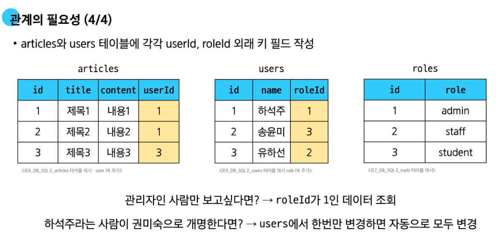
## 3.1 Join
- 작성자가 있는(존재하는 모든 회원)모든 게시글을 작성자 정보와 함께 조회해보자

```sql
SELECT * FROM articles
INNER JOIN users ON users.id = articles.userID;
```
- LEFT JOIN
  - 테이블 A와 B를 JOIN 한다 했을 때, FROM 절에 지정된 테이블의 전체, B테이블은 겹치는 부분만
```SQL
SELECT * FROM articles
LEFT JOIN users
ON articles.id = users.id;
```
# 4. 참고
## 4.1 타입 선호도
- 컬럼에 데이터 타입이 명시적으로 지정되지 않았거나 지원하지 않을 때 SQLite가 자동으로 데이터 타입을 추론하는 것
- 목적
  - 1. 유연한 데이터 타입 지원
    - 타입을 명시하지 않아도 데이터를 저장하고 조회 가능
    - 컬럼에 저장되는 값을 기반으로 데이터타입을 유추
  - 2. 간편한 데이터 처리
    - INTEGER type Affinity를 가진 열에 문자열 데이터를 저장해도 SQLite는 자동으로 숫자로 변환하여 처리
  - 3. SQL 호환성
    - 다른 데이터베이스 시스템과 호환성을 유지
## 4.2 NOT NULL
- 반드시 NOT NULL을 해야 할까?
  - 아님.
  - 대부분은 NOT NULL을 정의
  - 값이 없다는 표현을 테이블에 기록하는게 좋음. 0이나 빈 문자열 넣는게 속 편함
## 4.3 날짜와 시간
- SQLite에서는 날짜 및 시간 저장하기 위한 별도 데이터타입이 없음
- 대신 날짜 및 시간에 대한 함수를 사용해 표기 형식에 따라 TEXT, REAL, INTEGER값으로 저장.


# 1. Many to one relationships
## 1.1 모델 관계
- 관계(relationship)
  - 데이터베이스 내 여러 테이블 간의 논리적인 연결 관계를 나타냄
- 관계의 종류
  - 1:1 관계(One to One)관계
    - 한 테이블의 레코드는 다른 테이블의 한 레코드와 연결됨
    - 예시) 한 사람당 하나의 주민등록번호
  - N:1 관계(Many to one)관계
    - 여러 개의 레코드가 하나의 레코드와 연결됨
    - 예시) 여러 교육생(N)을 한 강사가 가르침
  - N:M 관계(Many to Many)관계
    - 여러 레코드가 여러 레코드와 상호 연결됨
    - 보통 중간 테이블(예: 수강신청)을 사용해 구현됨
    - 여러 학생(N)이 여러 과목(M)을 수강함
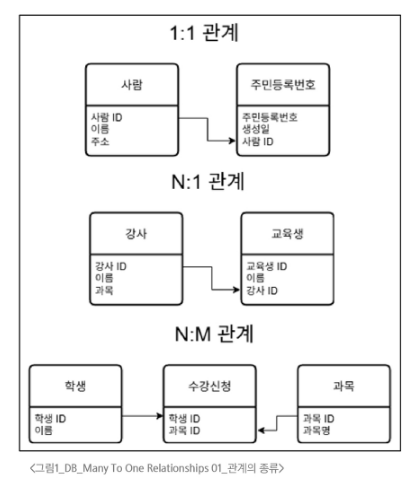
- 댓글과 게시글의 관계
  - Comment(N) : Article(1)
    - 하나의 게시글, 여러 댓글
  - 테이블 관계 설정
    - 관계 설정을 위한 Foreign Key(외래 키)를 N:1에서 1을 담당하는 테이블에 위치하면 안됨
    - Article Table에 Foreign Key 컬럼을 위치시키면 중복 데이터로 인해 낭비가 심함
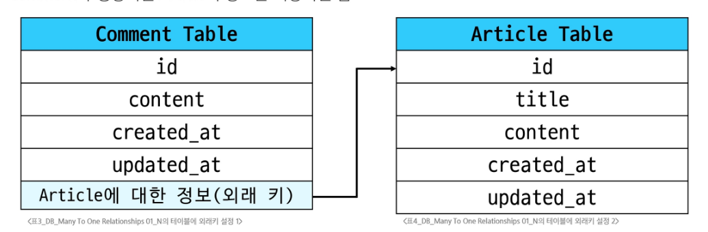
## 1.2 댓글 모델 정의
- 외래 키(Foreign Key(to, on_delete))
  - 한 모델(테이블)이 다른 모델(테이블)을 참조하는 관계를 설정하는 필드
    - N:1관계 표현할 때 사용
    - 데이터베이스에서 외래키로 구현됨
- ForeignKey(to, on_delete)
  - to 속성
    - 참조하는 모델 class 이름(N:1에서 N이 아닌 1의 class 정보)
  - on_delete 속성
    - 외래키가 참조하는 객체(1)이 사라졌을 때 외래 키를 가진 객체(N)을 어떻게 처리할지를 정의하는 설정(데이터 무결성)
- on_delete 속성 종류
  - CASCADE
    - 참조 된 객체(부모 객체)가 삭제될 때 이를 참조하는 모든 객체도 삭제되도록 지정
    - 예) 게시글이 삭제되면 해당 게시글의 모든 댓글을 삭제
  - PROTECT
    - 삭제하려는 부모 객체에 자식 객체가 존재한다면 해당 부모 객체를 삭제하지 못하도록 지정
    - 예) 게시글을 삭제할 때 해당 게시글에 댓글이 존재하면 게시글 삭제 못함
  - SET_NULL
    - 부모 객체가 삭제되면 해당 필드에 값이 NULL이 저장되도록 지정
    - 단, 해당 ForeignKey 필드 설정이 NOT NULL 이면 안됨
- 댓글 모델 정의하기
  - ForeignKey 클래스의 인스턴스 이름은 참조하는 모델 클래스 이름의 단수형으로 작성하는 것을 권장

```python
# articles/models.py

class Comment(model.Model):
  article = models.ForeignKey(Article, on_delete=models.CASCADE)
  content = models.CharField(max_length=200)
  create_at = models.DateTimeField(auto_now_add=True)
  update_at = models.DateTimeField(auto_now=True)
# 단일 객체를 참조함으로 단수형으로 해야 의미가 명확
```
- Migration 이후 댓글 테이블 확인
  - 만들어 지는 필드 이름 규칙
    - "작성한 외래 키 필드명" + "_" + "id"
  - 댓글 테이블의 article_id 외래 키 필드 확인
    - bigint(64비트 정수형)으로 설정됨 확인
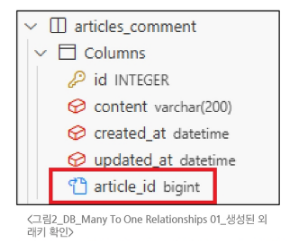
# 2. 관계 모델 참조
- 참조
  - 직접 대상의 정보를 저장하고 필요할 때 활용하는 것
- 특정 게시글(Article)의 댓글(Comment) 정보 조회하기
  - QuerySet API의 .all() 사용하기 x
    - 특정 Article의 Comment가 아닌 모든 댓글 정보를 가져오게 됨
  - .filter()사용해서 불러오기
```python
article = Article.objects.get(pk=1)
comments = Comment.objects.filter(article=article)
```
## 2.1 역참조
- 역참조
  - 누가 나를 참조하는지 거꾸로 조회 하는것
- 역참조 기본 구조
  - **article.comment_set.all()**
  - 모델인스턴스.역참조이름.QuerySetAPI
- 1. 모델 인스턴스(article)
  - models.py에 정의된 모델 클래스로 생성된 실제 데이터를 의미
    - article.title 과 같이 속성에 접근 가능하며 속성을 수정할 수 있음.
  - 역참조에서는 참조 가능한 필드가 없는 모델 클래스의 인스턴스를 사용하면 됨
    - Article(1) : Comment(N) => Article에 참조 필드가 없어서 Article의 인스턴스를 사용
- 2. related manager(역참조 이름)
  - related manager 라고 불리며 N:1 혹은 N:M 관계에서 역참조 시에 사용하는 매니저를 의미
  - object 매니저를 통해 QuerySet API를 사용했던 것 처럼 related manager를 통해 QuerySet API를 사용할 수 있게 됨
- 3. QuerySet API
  - 데이터를 가져오기 위한 쿼리 결과 집합을 만드는 인터페이스
  - SQL 쿼리를 직접 쓰지 않고도 DB를 사용할 수 있음.
- related manger(역참조 이름) 이름 규칙
  - 모델 클래스명 + _set 이 기본 값이며 Django에서 자동으로 생성해줌
  - 관계를 직접 정의하지 않은 모델에서 연결된 객체들을 조회할 수 있게 함
  - 특정 댓글의 게시글 참조(Comment -> article)
    - comment.article
  - 특정 게시글의 댓글 목록 역참조(Article -> Comment)
    - article.comment_set.all()
# 3. 댓글 구현
## 3.1 댓글 CREATE
- 사용자로부터 댓글 데이터를 입력받기 위한 CommentForm 정의
```python
# articles/forms.py

from .models import ARticle, Comment

class CommentForm(form.ModelForm):
  class Meta:
    model = Comment
    fields = "__all__"
```
- 댓글이 작성되는 곳은 게시글 상세 페이지 하단.
- detail view 함수에서 CommentForm을 detail 페이지에서 사용할 수 있도록 context로 전달
```python
# article/views.py
def detail(request, pk):
  article = Article.objects.get(pk=pk)
  comment_form = CommentForm()
  context = {
    'article':article,
    'comment_form':comment_form,
  }
  return render(request, 'articles/detail.html', context)
```
- 댓글이 작성되는 detail페이지 하단에 commentForm 을 사용하여 렌더링
```html
<!--articles/detail.html-->

<form action="#" method="POST">
  
  {{ comment_form }}
  <input type="submit">
</form>
```
- Comment 클래스의 외래 키 필드 article 또한 데이터 입력이 필요한 필드이기 때문에 출력되는 것
- 하지만 외래 키 필드는 사용자로부터 입력 받는 값이 아닌 view 함수 내에서 다른 방법으로 전달받아 저장되어야 함.
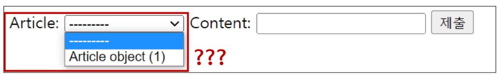

- CommentForm의 출력 필드 조정하여 외래키가 출력되지 않도록 해야함
```python
articles/forms.py
from .models import Article, Comment

class CommentForm(form.ModelForm):
  class Meta:
    model = Comment
    fields = ('context', ) # 실제 출력되는걸 context 외엔 없게 처리. 마지막 콤마는 필수
```
- 그럼 외래 키는 어디서 받아와야 하나?
  - detail 페이지의 URL에 게시글 정보가 존재
  - path('<int/>pk>/', views.detail, name='detail')
- 댓글의 외래 키 데이터에 필요한 정보가 바로 게시글의 pk값
- 댓글 저장 로직은 detail함수가 아닌 개별 함수로 작성
  - 댓글 저장은 게시글 상세보기와 전혀 다른 기능(단일 책임 원칙)
  - 댓글 저장 시 게시글 pk정보를  URL로 전달하여 사용
```html
<form action="" method="POST">
  
  {{comment_form}}
  <input type="submit">
</form>
```
```python
# articles/urls.py
app_name = 'article'
urlpatterns = [
  path('<int:pk>/comments/>', views.comments_create, name="comments_create")
]
```
- 댓글 만드는 comments_create 함수는 POST 작성만 진행
  - 댓글 작성 form을 출력하는 GET 동작은 이미 detail에 들어가있음
```python
def comments_create(request, pk):
  article = Article.objects.get(pk=pk)
  comment_form = CommentForm(request.POST)
  if comment_form.is_valid():
    comment_form.save()
    return redirect('articles:detail', article.pk)
  context = {
    'article':article,
    'comment_form':comment_form
  }
  return render(request, 'articles/detail.html', context)
```
- save 메서드의 commit 인자
  - save(commit=False)
- 기본적으로 commit 속성은 True 가 기본 값
  - 설정 값이 True인 경우 인스턴스를 생성하고 반환한 다음 DB에도 저장 요청을 보냄
- commit이 False인 경우 DB에 저장 요청을 보내지 않고 인스턴스만 반환
- 댓글을 저장할 때 바로 DB에 저장 요청을 보내는 것이 아닌 게시글 정보를 추가한 후 저장 요청을 보내도록 로직을 구성하면 게시글 정보와 함께 댓글을 저장할 수 있게 됨

```python
# articles/views.py
def comments_create(request, pk):
  article = Article.objects.get(pk=pk)
  comment_form = CommentForm(request.POST)
  if comment_form.is_valid():
    comment = comment_form.save(commit=False)
    comment.article = article
    comment.save()
    return redirect('articles:detail', article.pk)
  context = {
    'article':article,
    'comment_form':comment_form
  }
  return render(request, 'articles/detail.html', context)

```
## 3.2 댓글 READ
- 댓글이 보이는 위치는 게시글 상세 페이지 하단
  - detail view 함수에서 전체 댓글 데이터를 조회해서 detail.html로 전달하여 댓글 데이터 조회
```python
def detail(request, pk):
  article = Article.objects.get(pk=pk)
  comment_form = CommentForm()
  comment = article.comment_set.all() # 역참조로 댓글 목록 가져오기
  context = {
    'article':article,
    'comment_form': comment_form,
    'comments':comments,
  }
  return render(request, 'arcitles/detail.html', context)
```
## 3.3 댓글 DELETE
- 개별 댓글마다 삭제할 수 있도록 기능을 추가
- 어떤 댓글을 삭제해야 하는지 삭제 대상 정보를 전달하기 위해 variable routing을 이용
```python
# articles/urls.py

app_name = 'articles'
urlpatterns = [
  path('<int:article_pk>/comments/<int:comment_pk>/delete.', views.comment_delete, name='comment_delete')
]
```
- 댓글 삭제 view 함수 정의
```python
# articles/views.py

def comment_delete(request, article_pk, comment_pk):
  comment = Comment.objects.get(pk=comment_pk)
  comment.delete()
  return redirect('articles:detail', article_pk)
```

# 4. 참고
## 4.1 데이터 무결성
- 데이터 무결성이란?
  - 데이터베이스에 저장된 데이터의 정확성, 일관성, 유효성을 유지하는 것
  - 데이터베이스에 저장된 데이터 값의 정확성을 보장하는 것
  - 중요성
    - 데이터의 신뢰성 확보
    - 시스템 안정성
    - 보안 강화
## 4.2 admin site 댓글 등록
- 작성된 comment 모델에 대해 Admin site에서 관리할 수 있도록 아래와 같이 등록
```python
# articles/admin.py
from .models import Article, Comment

admin.site.register(Article)
admin.site.register(Comment)

```

# 1. Article & User
## 1.1 모델 관계 설정
- User 외래 키 정의

```python
# articles/models.py
from django.conf import settings
# User 모델을 직접 import 하지 않는다. 
# Article 클래스 생성 시점이 User클래스 선언 시점보다 빠르면 참조할 User 모델을 못 찾을 수 있음. 
# 따라서 설정 끝난 값인 settings에 선언된 내용을 가져오는 것이 좋다.

class Article(models.Model):
  user = models.ForeignKey(settings.AUTH_USER_MODEL, on_delete=models.CASCADE)
  title = models.CharField(max_length=10)
  content = models.TextField()
  created_at = models.DateTimeField(auto_now_add=True)
  update_at = models.DateTimeField(auto_add=True)
```
- User 모델을 참조하는 2가지 방법
  - settings.AUTH_USER_MODEL
    - settings.py에서 정의한 AUTH_USER_MODEL 설정 값을 가져옴
    - 반환 값: accounts.User(문자열 타입으로 리턴)
    - models.py 에서 User 모델을 참조할 때 주로 사용
  - get_user_model()
    - 현재 settings.py에 정의되어 활성화 된 User모델을 가져옴
    - 반환 값: User.Object(객체)
    - models.py를 제외한 다른 거의 모든 위치에서 사용
- Migration
  - 기존에 테이블이 있는 상황에서 필드를 추가하려고 하기 때문에 발생하는 과정
  - 기본적으로 모든 필드에는 NOT NULL 제약조건이 들어감. 데이터 없이 새로운 필드를 추가할 수 없음
  - 경고창에서 1을 누르고 진행하면 값을 직접 입력하게 됨.
## 1.2 게시글 CREATE
- 새 게시글 작성시 ArticleForm 출력 변화 확인
  - 새롭게 추가된 ForeignKey 필드인 User가 보여야 함.
- User모델에 대한 사용자 입력 창이 나오지만 사용자가 입력해선 안됨
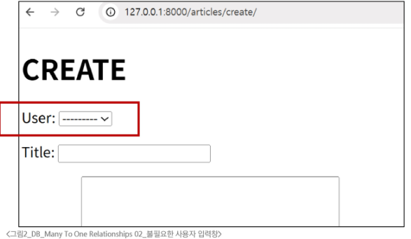
- 기존 ArticleForm에서 사용자가 입력할 수 있는 필드를 변경
  - 글 작성자는 선택 못하게, 사용자는 제목과 내용만 입력하도록 수정
```python
# aritcles/forms.py
class ArticleForm(forms.ModelForm):
  class Meta:
    model = Article
    fields = ('title', 'content', )# 마지막 쉼표 유의.
```
- 게시글 작성 시 작성자 정보가 함께 저장될 수 있도록 save의 commit 옵션 활용
  - 게시글 작성자는 현재 글을 작성하는 로그인 된 사용자 정보를 저장
```python
# articles/views.py

@login_required
def create(request):
  if request.method == "POST":
    form = ArticleForm(request.POST)
    if form.is_vaild():
      new_article = form.save(commit=False)
      new_article.user = request.user
      new_article.save()
      return redirect('articles:detail', article.pk)
    else:
      ...
```
## 1.3 게시글 READ
- index 페이지에 게시글 작성자 정보 출력하도록 수정
```html
<!--articles/index.html-->

<p>작성자: {{ article.user }}</p>
<p>글 번호: {{ article.pk }}</p>
<a href="">
  <p>글 제목: {{ article.title }}</p>
</a>
<p> 글 내용: {{ article.content }}</p>
<hr>

```
## 1.4 게시글 UPDATE
- 게시글 UPDATE 구현
```python
@login_required
def update(request, pk):
  article = Article.objects.get(pk=pk)
  if request.user == article.user:
    if request.method == "POST":
      form = ArticleForm(request.POST, instance=article)
      if form.is_valid():
        form.save()
        return redirect('articles:detail', article.pk)
      else:
        form = ArticleForm(instance=article)
    else:
      return redirect('article:index')
    context = {
      'article':article,
      'form':form,
    }
    return render(request, 'articles/update.html', context)
```
## 1.5 게시글 DELETE
- 삭제를 요청하려는 사람과 게시글 작성자를 비교해 본인만 삭제 가능하게 처리
```python
# articles/views.py

@login_required 
def delete(request, pk):
  article = Article.object.get(pk=pk)
  if request.user == article.user:
    article.delete()
  return redirect('articles:index')
```
# 2. Comment & User
# 2.1 모델 관계 설정
- User는 여러 개의 댓글을 작성
- Comment는 한 명의 작성자가 작성
- Comment 모델 클래스에 User 필드를 참조하도록 외래 키(Foreign Key) 설정
```python
# articles/models.py

class Comment(models.Model):
  article = models.ForeignKey(Article, on_delete=models.CASCADE)
  user = models.ForeignKey(settings.AUTH_USER_MODEL, on_delete=models.CASCADE)
  content = models.CharField(max_length=200)
  created_at = models.DateTimeField(auto_now_add=True)
  update_at = models.DateTimeField(auto_add=True)
```
# 2.2 댓글 CREATE
- 댓글 작성 시 작성자 정보가 함께 저장될 수 있도록 작성
```python
# articles/views.py

def comment_create(request, pk):
  article = Article.objects.get(pk=pk)
  comment_form = CommentForm(request.POST)
  if comment_form.is_vaild():
    comment = comment_form.save(commit=False)
    comment.article = article
    comment.user = request.user
    comment.save()
    return redirect('articles:detail', article.pk)
```
# 3. View Decorators
- View 함수의 동작을 수정하거나 추가 가능을 제공하는데 사용되는 Python 데코레이터
  - 사전 체크리스트 처럼 동작해 사용자 접근을 보다 안전하고 체계적으로 관리 가능
  - view decorator는 뷰 함수 위에 붙여서 작동, 코드 흐름을 방해하지 않고 깔끔하게 조건을 설정 가능
  - 자주 쓰이는 것: 로그인 여부, 권한 검사 HTTP 요청 방식 제한
- View decorators 종류
  - Allowed HTTP method
    - 뷰가 허용하는 http 요청 방식(GET, POST등)을 제한
  - Conditional view processing
    - 클라이언트가 보낸 조건을 확인한 후, 조건에 따라 응답을 처리
  - GZip compression
    - 서버에서 응답 데이터를 압축
  - 이 외 다수 공식문서 확인 필요
## 3.1 Allowed HTTP methods
- 특정 HTTP method로만 View 함수에 접근할 수 있도록 제한하는 데코레이터
  - 웹 요청은 GET, POST 등 다양한 요청 방식을 사용하며 각 요청은 고유 목적이 있음
  - 요청 방식을 제한하면 보안이 강화되고 코드의 역할도 명확하게 분리됨
  - 해당 데코레이터를 사용하면 View 로직을 보호하면서 사용자에게도 올바른 인터페이스를 제공가능
- 주요 Allowed HTTP method
  - require_http_methods(["METHOD1","METHOD2", ...])
    - 지정된 HTTP method 만 허용
  - require_safe()
    - GET과 HEAD method만 허용
  - require_POST()
    - POST method 만 허용
  - 허용되지 않은 method로 요청하는 경우 405(method not Allowd) 오류 반환

- require_http_methods(requset_method_list)
  - 지정된 HTTP method만 허용
  - 인자는 list, 해당 list요소는 요청이 허용될 HTTP method 를 문자열(대문자)로 작성
  - list 에 작성된 method 이외의 method로 요청하면 HttpResponseNotAllowed(405)를 반환
```python
from django.views.decorators.http import require_http_methods
@ require_http_methods(['GET', 'POST'])
def func(request):
  pass
```

- require_safe()
  - GET과 HEAD method만 허용
  - GET과 HEAD는 서버 상태를 바꾸지 않조 조회만 수행하기 때문. 
  - HEAD는 브라우저가 리소스 없이 메타데이터 정보만 조회할때 주로 사용
  - require_GET 보다 더 포괄적이며 표준 HTTP 클라이언트와 호환성이 높음
```python
from django.views.decorators.http import require_safe
@require_safe
def func(request):
  pass
```

- require_POST()
  - POST만 허용
```python
from django.views.decorators.http import require_POSt
@require_POST
def func(request):
  pass
```

# 4. ERD
- 데이터베이스 구조를 시각적으로 표현하는 도구
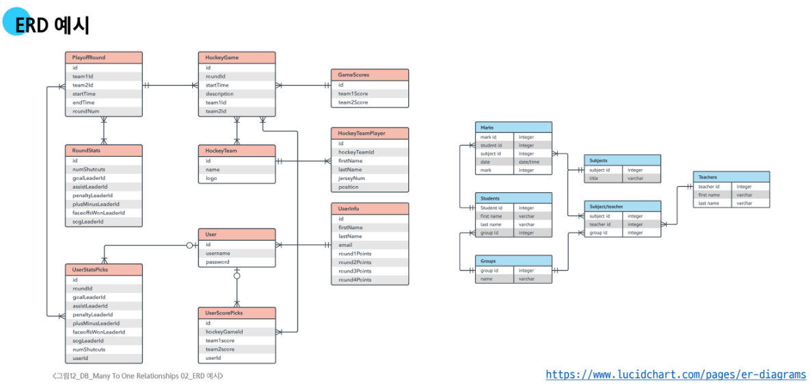
## 4.1 ERD 구성 요소
- Entity
  - 데이터베이스에 저장되는 객체나 개념
    - 데이터베이스에서 주로 테이블로 표현됨
  - ex) 게시글, 댓글, 회원
- Attribute
  - 엔티티가 가지는 고유한 데이터 항목
    - 테이블의 컬럼으로 표현됨
  - ex) 게시글 엔티티의 제목, 내용, 작성일자, 생성일자
- Relationship
  - 엔티티 간의 연관성을 나타냄
    - 테이블 간의 연결된 선으로 표현
  - ex) 게시글을 '작성'한 회원, 게시글에 '달린' 댓글
- 개체와 속성 표현 방법
  - 개체: 회원(User)
  - 속성: 회원번호(id), 이름(name), 주소(address) 등
    - 개체가 지닌 속성 및 속성의 데이터 타입
| name | type | 
| --- | ---- |
| id | integer |
| name | varchar |
| address | varchar | 

- Cardinality 
- 한 엔티티와 다른 엔티티 간의 수적 관계를 나타내는 표현
  - 1대1(one-to-one)
    - 한 엔티티의 레코드가 다른 엔티티의 하나의 레코드와만 연결되는 관계
    - 한 사람은 하나의 여권. 여권도 1명에게 하나만
  - N:1
    - 여러 레코드가 하나의 엔티티와 연결되며 반대 방햐에서는 하나만 연결되는 관계
    - ex) 여러 명의 '학생'이 하나의 '학교'
  - N:M
    - 양쪽 모두 여러 레코드와 연결되는 관계 
    - 학생은 여러 과목을 수강 가능, 과목도 여러 학생이 수강
- Cardinality 표현
  - 선의 끝 부분에 표시되며 일반적으로 숫자나 기호로 표현
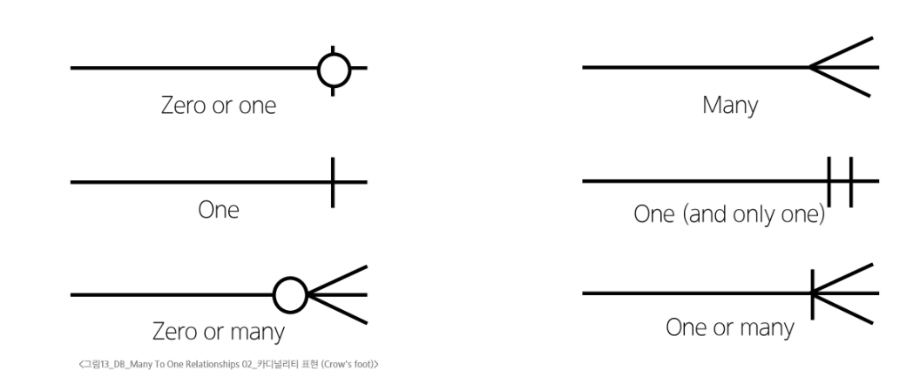
- Cardinality 적용
  - 회원은 여러 댓글을 작성한다
  - 각 댓글은 하나의 회원만 존재한다
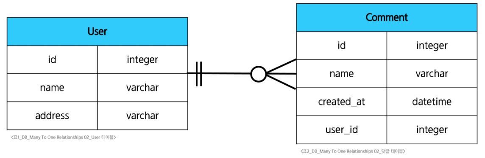

- ERD의 중요성
  - 데이터베이스 설계의 핵심 도구
    - 엔티티(테이블), 속성(컬럼) 관계를 명확히 정의함으로서 논리적 데이터 구조를 시각적으로 표현함
    - 복잡한 비즈니스 로직을 단순화하고 직관적인 다이어그램으로 정리됨
    - 중복 데이터를 제거하고, 효율적인 저장 구조를 만들 수 있음
  - 시각적 모델링으로 효과적인 의사소통 지원
    - 개발자, 기획자, 디자이너 등 다양한 직군이 ERD를 활용해 협업할 수 있음
    - 요구사항 분석 단계에서 누락된 기능이나 관계를 빠르게 파악 가능
    - 비전문가에게도 쉽게 시스템 구조를 설명할 수 있음(진짜? 설명해봤냐? 화나네)
  - 실제 시스템 개발 전 데이터 구조 최적화에 중요
    - 사전에 데이터 흐름과 연관 관계를 명확히 분석함으로 불필요한 관계나 비효율적인 설계를 방지
    - 시스템 개발 전에 ERD를 작성함으로써, 이후 DB 구축 단계에서 중대한 구조적 오류를 줄이는데 효과적
    - 변경이나 유지보수시에도 ERD를 기반으로 안정적으로 수정할 수 있음
# 5. 참고
## 5.1 추가 기능 구현
- 인증된 사용자만 댓글 작성 및 삭제
```python
# articles/views.py
@login_required
def comments_create(request, pk):
  pass

@login_required
def comments_delete(request, article_pk, comment_pk):
  pass
```

# 1. Many to many relationships
- 한 테이블의 0개 이상의 레코드가 다른 테이블의 0개 이상의 레코드와 관련된 경우
- M:N 관계의 역할과 필요성 이해하기
  - 병원 진료 시스템 모델 관계 를 직접 만들어 보기
    - 환자와 의사 2개의 모델을 사용하여 모델 구조 구상
  - 기존의 N:1 구조로 환자와 의사 테이블을 구성했을 때 어떤 관계가 있는지 확인
  - N:M 관계는 어떻게 데이터베이스에서 관리하는지 확인
## 1.1 N:1의 한계
- 의사와 환자 간 모델 관계 설정
  - 한 명의 의사에게 여러 환자가 예약할 수 있도록 models 클래스 정의
    - patient(환자) 모델에 Doctor 모델을 참조하도록 정의
  - Migration 까지 진행하여 데이터베이스에 적용
```python
# hospitals/models.py

class Doctor(models.Model):
  name = models.TextField()
  def __str__(self):
    return f'{self.pk}번 의사 {self.name}'
class Patient(models.Model):
  doctor = models.ForeignKey(Doctor, on_delete=models.CASCADE)
  name = models.TextField()
  def __str__(self):
    return f'{self.pk}번 환자 {self.name}'
```
- 이 모델에서 1번 환자가 2명의 의사에게 진료를 받고자 한다면, 환자 테이블에 1번 환자가 중복으로 입력됨
- 환자가 진료받을 의사 정보를 동시에 저장 시도하면 에러가 발생함
- 동일한 환자지만 다른 의사에게도 진료 받기 위해 새로운 예약 데이터를 만들어야 하며, 동일한 환자 정보를 또 작성하여 저장하게 됨
  - 데이터의 중복이 발생하면 나중에 환자 정보가 변경된다면 모든 예약 정보를 하나하나 찾아서 다 고쳐야함. 실수로 하나라도 누락하면 데이터의 일관성이 때짐
- 외래 키 컬럼에 '1,2'형태로 저장하는 것은 DB타입 문제로 불능
  - 제 1 정규형을 지켜야함(테이블의 모든 칸에 더 이상 쪼갤 수 없는 하나의 값만 넣어야 한다는 규칙)
- 의사의 정보도 외래 키로 참조하고, 환자의 정보도 외래 키로 참조하는 별개의 테이블을 만든다면 위 문제 해결 가능
  - 예약 테이블을 따로 만들자
## 1.2 중개 모델
- 다대다 관계에서 두 모델을 연결하는 역할을 하는, 특별한 기능을 가진 모델
  - 의사와 환자가 예약이라는 관계로 연결될 떄 단순히 '의사 A와 환자 B가 연결되었다'는 사실 외에 언제 예약했는지, 예약 상태가 어떤지 같은 정보를 함께 저장하는 모델
  - 중개 모델을 사용한다면 Doctor모델이나 Patient 모델에 없는, 예약 행위 자체에 대한 상세한 정보를 담을 수 있어 복잡한 현실 세계의 관계를 더욱 정교하게 표현할 수 있음
- 예약 모델 생성
  - 환자 모델의 외래 키를 삭제하고 별도의 예약 모델을 새로 생성
  - 예약 모델은 의사와 환자에 각각 N:1 관계를 가짐
```python
# Hospitals/models.py
# 외래 키 삭제
class Patient(models.Model):
  name = models.TextField()
  def __str__(self):
    return f"{self.pk}번 환자 {self.name}"

class Reservation(models.Model):
  doctor = models.ForeignKey(Doctor, on_delete=models.CASCADE)
  patient = models.ForeignKey(Patient, on_delete=models.CASCADE)
  def __str__(self):
    return f'{self.doctor_id}번 의사의 {self.patient_id} 번 환자'
```
## 1.3 ManyToManyField
- M:N 관계 설정 모델 필드
  - 이 필드 사용하면 Django는 자동으로 중간 테이블(중계 모델)을 생성하여 각 모델 간 관계를 관리
  - 모델 클래스 내부에 필드로 정의, 어느 모델에 정의해도 관계는 동일하게 유지
- ManyToManyField 조장
  - .add() 메서드
    - 중개 테이블에 새로운 데이터를 추가할 때 사용
    - 인자로 연결할 대상 모델의 인스턴스를 넣어서 사용
  - .remove()메서드
    - 중개 테이블에 있는 데이터를 삭제할 때 사용
    - 인자로 전달한 인스턴스를 중개 테이블에서 제거하며, 대상 객체 자체는 삭제되지 않음
```python
#.add()
# 단일 인스턴스 추가
patient.doctors.add(doctor1)
# 복수 인스턴스 추가
patient.doctors.add(doctor1, doctor2)

# .remove()
patient.doctors.remove(doctor1)
patient.doctors.remove(doctor1,doctor2)
```
- 환자 모델에 ManyToManyField 작성
  - 의사 모델에 작성해도 노상관. 참조/역참조 관계만 잘 기억할 것
  - 환자 모델은 의사 모델을 참조하며, 의사 모델은 역참조를 통해 환자 모델에 접근
```python
# hospitals/models.py

class Patient(models.Model):
  # ManyToManyField 작성
  doctors = models.ManyToManyField(Doctor)
  name = models.TextField()

# Reservation Class 는 주석 처리
# ManyToMany 쓰면 알아서 테이블 만들어줌
```
- 기본 ManyToManyField 의 한계
  - 기본 ManyToManyField 로 생성된 예약 중계 테이블은 의사와 환자의 왜래 키 정보만 저장하고 있음
  - 만약 중개 테이블에 병의 증상, 예약 일정, 방문 횟수에 대한 추가 정보가 필요한 경우, 기본 테이블을 그대로 쓸 순 없음
  - 추가 정보를 저장하기 위해서는 사용자가 직접 중개 테이블을 정의해야 함
    - 사용자가 직접 중개 테이블을 만들면 .add(), .remove()에 메서드를 사용할 수 없음
  - ManyToManyField에 through 속성을 통해 사용자가 작성한 중개 테이블을 등록하면 추가 정보 저장 및 .add(), .remove() 메서드를 그대로 활용할 수 있음
## 1.4 'through' argument
- 중개 테이블에 추가 데이터를 사용해 M:N관계를 형성하려는 경우에 사용
- Reservation Class 재작성 및 through 설정
  - 이제는 예약 정보에 증상과 예약일 이라는 추가 필드 만듬
```python
class Patient(models.Model):
  doctors = models.ManyToManyField(Doctor, through="Reservation")
  name = models.TextField()
  def __str__(self):
    return f'{self.pk}번 환자 {self.name}'


class Reservation(models.Model):
  doctor = models.ForeignKey(Doctor, on_delete=models.CASCADE)
  patient = models.ForeignKey(Patient, on_delete=models.CASCADE)
  symptom = models.TextField()
  reservation_at = models.DateTimeField(auto_now_add=True)

  def __str__(self):
    return f'{self.doctor.pk}번 의사의 {self.patient.pk}번 환자'
```
- M:N 관계 주요 사항 정리
  - M:N 관계로 맺어진 두 테이블에는 물리적인 변화가 없음
  - ManyToManyField 는 중개 테이블을 자동으로 생성
  - ManyToManyField는 M:N관게를 맺는 두 모델 어디에 위치해도 상관 없음
    - 대신 필드 작성 위치에 따라 참조와 역참조 방향을 주의할 것
  - N:1은 완전한 종속 관계였지만, N:M은 종속적인 관계가 아니며 의사에게 진찰받는 환자, 환자를 진찰하는 의사 이렇게 2개 형태 표현 가능
# 2. ManyToManyField
- M:N 관계 설정 시 사용하는 모델 필드. 어드 모델에서든 관련 객체에 접근할 수 있는 양방향 관계. 동일한 관계는 한 번만 저장되며 중복되지 않음
- 대표 인자 3가지
  - related_name
    - 역참조 이름을 변경할 때 설정하는 인자
  - symmetrical
    - 관계 설정 시 대칭에 대한 설정을 하는 인자
  - through
    - 직접 생성한 중개 테이블을 등록하는 인자
- related_name argument
  - 역참조시 사용하는 manager name을 변경
    - 기본값인 '역참조모델명_set'을 다른 이름으로 변경할 떄 사용형
```python
class Patient(models.Model):
  doctors = models.ManyToManyField(Doctor, related_name='patients')
  name = models.TextField()
```
- symmetrical argument
  - 관계 설정 시 대칭 유무 설정
  - ManyToManyField가 동일한 모델을 가리키는 정의에서만 사용
  - 기본 값:True
  - source 모델:관계를 시작하는 모델
  - target 모델: 관계의 대상이 되는 모델
  - symmetrical 값이 True인 경우
    - source모델의 인스턴스가 target 모델의 인스턴스를 참조하면 자동으로 target모델 인스턴스도 source모델 인스턴스를 자동으로 참조하도록 함(대칭)
    - 즉, 내가 당신의 친구라면 자동으로 당신도 내 친구가 됨
  - symmetrical 값이 False인 경우
    - True와 반대(대칭되지 않음)
```python
# 예시
class Person(models.Model):
  friends = models.ManyToManyField('self')
```
- through argument
  - 사용하고자 하는 중개 모델을 지정
  - 일반적으로 추가 데이터를 M:N 관계와 연결하려는 경우 활용
```python
class Patient(models.Model):
  doctors = models.ManyToManyField(Doctor, through='Reservation')
  name = models.TextField()
class Reservation(models.Model):
  doctor = models.ForeignKey(Doctor, on_delete=models.CASCADE)
  patient = models.ForeignKey(Patient, on_delete=models.CASCADE)
  symptom = models.TextField()
  reservation_at = models.DateTimeField(auto_now_add=True)
```

# 3. 좋아요 기능 구현
## 3.1 모델 관계 설정
- Many to Many Relationships
  - 한 테이블의 0개 이상의 레코드가 다른 테이블의 0개 이상의 레코드와 관련된 경우
  - 양쪽 모두에서 N:1 관계를 가짐
- 좋아요 기능의 모델 관계 설정
  - Article(M) - User(N)
    - 게시글은 좋아요가 없을 수도 있고, 여러 개 존재할 수 있음
    - 사용자도 게시글에 좋아요를 한 번도 누르지 않았을 수 있고, 여러 개의 게시글에 좋아요를 누를 수 있음
  - Article 클래스에 ManyToManyField 작성
    - 필드 명은 직관적, 복수형
```python
# articles/models.py
class Article(models.Model):
  user = models.ForeignKey(settings.AUTH_USER_MODEL, on_delete=models.CASCADE)
  like_users = models.ManyToManyField(settings.AUTH_USER_MODEL)
  title = models.TextField(max_length=100)
  content = models.TextField()
  create_at = models.DateTimeField(auto_now_add=True)
  update_at = models.DateTimeField(auto_now=True)
```
- 이러면 충돌이 난다 왜?  
  - user, like_users 둘 다 settings.AUTH_USER_MODEL을 참조하면서 article_set이란 이름으로 각자 역참조 하는데 이게 충돌남. 내용은 다른데 이름이 같게 설정이 됨
  - 두 관계 중 related_name 설정을 해서 이 충돌을 피해줘야 하는데 일반적으로 ManyToManyField 쪽에 설정하는걸 권장
    - 1. 소유 관계 기본값 유지  
      - ForeignKey(1:N) 관계는 보통 소유나 소속의 의미를 가짐. 게시글의 소유자는 유저
      - Django의 기본 역참조 이름인 article_set은 User가 소유한 Article 집합이란 매우 직관적인 의미 해석 가능
      - 이처럼 가장 중요하고 대표적인 관계의 기본값을 유지하는 것이 코드의 예측가능성을 높임
    - 2. 행위 관계의 명시적 표현
      - ManyToMantField(M:N)관계는 보통 '참여'나 '행위'의 의미를 가짐. 
      - 이 관계에 related_name=like_articles 처럼 행위의 의미가 드러나는 구체적인 이름을 가지면 코드 가독성이 올라감
  - 충돌 해결하기
    - user.article_set.all()
      - 이 유저가 작성한 모든 글(소유 관계. 기본)
    - user.like_articles.all()
      - 이 유저가 좋아요 누른 모든 글(행위 관계, 명시적)
    - 핵심적인 소유 관계는 기본값, 부가적인 행위 관계에 구체적인 이름을 붙여주는 것으로 설계
```python
class Article(models.Model):
  ...
  like_users = models.ManyToManyField(settings.AUTH_USER_MODEL, related_name='like_articles')
  ...
```
- User - Article 간 사용 가능한 전체 related manger
  - article.user
    - 게시글을 작성한 유저 - N:1
  - user.article_set
    - 유저가 작성한 게시글(역참조) - N:1
  - article.like_users
    - 게시글을 좋아요 한 유저 M:N
  - user.like_articles
    - 유저가 좋아요 한 게시글(역참조) - M:N
## 3.2 기능 구현
- 좋아요 기능 담당할 URL 등록
  - 어떤 게시글에 좋아요가 눌린건지 볼 수 있도록 게시글의 PK정보를 variable routing으로 추가
```python
# articles/urls.py

app_name = 'articles'
urlpatterns = [
  ... ,
  path('<int:article_pk>likes/', views.likes, name='likes'),
]

# articles/views.py
@login_required
def likes(request, article_pk):
  article = Article.objects.get(pk=article_pk)
  if request.user in article.like_user.all():
    article.like_users.remove(request, user)
  else:
    article.like_users.add(request.user)
  return redirect('articles:index')

```

# 1. 팔로우 기능 구현
## 1.1 프로필 페이지
- 각 회원의 개인 프로필 페이지에 팔로우 기능을 구현하기 위해 프로필 페이지를 먼저 구현하기
- 프로필 페이지에 해당 사용자의 추가 정보를 같이 볼 수 있게 내용 추가
  - 해당 사용자가 작성한 게시글 목록
  - 해당 사용자가 작성한 댓글 목록
  - 해당 사용자가 좋아요 누른 게시글 목록
- 프로필 페이지 구현
  - 프로필 페이지로 접근하기 위한 URL 주소 작성
    - 프로필 페이지는 사용자와 관련되 기능이기 때문에 accounts 앱의 urls.py에 추가
    - 로그인 한 유저 뿐 아니라 다른 사람들도 방문 가능
    - 사용자의 username을 variable routing을 활용해 정보 전달이 필요
```python
# accounts/urls.py

app_name = 'accounts'
urlpattern = [
  path('profile/<username>/', views.profile, name='profile')
]
```
  - view 함수 작성
    - URL로 전달되는 username을 이용하여 사용자 정보를 조회하고 이를 templatedmfh wjsekf
    - 유저 모델은 직접 import 하지 않고 get_user_model()함수 사용
```python
# accounts/views.py
from django.contrib.auth import get_user_model

def profile(request, username):
  User = get_user_model()
  person = User_objects.get(username=username)
  context = {
    'person':person
  }
  return render(request, 'accounts/profile.html', context)
```
  - 프로필 페이지의 세부 내용을 작성(html은 생략)
## 1.2 모델 관계 설정
- User(M) <-> User(N)
  - 팔로우는 유저와 유저의 관계를 나타냄
    - 회원은 여러명 팔로우 할 수 있고, 한명도 안할수 있음
    - 회원은 여러명의 팔로워를 가질 수도, 없을 수도 있음
  - 커스텀한 User 모델 클래스에 ManyToManyField를 사용하여 팔로우 필드를 추가
    - User 모델과 관계를 맺는 것이기 때문에 settings.AUTH_USER_MODEL을 사용해도 괜찮지만 자기 자신과의 관계기 때문에 self로 표현 가능
    - 팔로우 기능은 단방향의 관계기 때문에 반드시 symmetrical 속성을 False로 설정
    - 참조 필드는 following 필드로 내가 팔로우하는 사람들을 의미
    - 역참조 필드는 user_set을 사용해도 괜찮지만 명확한 설정을 위해 related_name을 이용하여 followers로 변경
```python
# accounts/models.py
class User(AbstractUser):
  followings = models.ManyToManyField('self', symmetrical=False, related_name='followers')
```
## 1.3 기능 구현
- 팔로우를 위한 url 추가
  - 어느 사용자를 팔로우하는지 상대 사용자에 대한 정보를 variable routing을 활용해 전달
```python
# accounts/urls.py

app_name = 'accounts'
urlpattern = [
  path('<int:user_pk>/follow/', views.follow, name='follow')
]
```
- 팔로우 기능 구현
  - 중개 테이블에 이미 내 정보가 있으면 제거(팔로우 해제)
  - 없으면 추가
```python
# accounts/views.py
@login_required
def follow(reqeust, user_pk):
  User = get_user_model()
  person = User.objects.get(pk=user_pk)
  if person != request.user:
    if request.user in person.followers.all():
      person.followers.remove(request.user)
    else:
      person.followers.add(request.user)
  return redirect('accounts:profile', person.username)
```
- 이후 html은 적당히 구현
# 2. Fixtures
- Django 개발 시 데이터베이스 초기화 및 공유를 위해 사용되는 파일 형식
- Fixtures 사용 목적
  - 초기 데이터 세팅
    - 웹 서비스가 처음 시작될 때 필요한 기본 데이터(기본 권한 그룹, 상품 카테고리 등)을 미리 세팅 가능
  - 테스트 샘플 데이터 준비
    - 테스트시 항상 동일하고 예측 가능한 테스트 환경 구축, 테스트 신뢰성, 반복 가능성
  - 협업 시 동일한 데이터 환경 맞추기
    - 팀원들이 각자 개발한 환경 설정시 모두 동일한 초기 데이터나 특정 텍스트 데이터셋을 쉽게 공유하고 적용
    - 개발 환경간 일관성 유지 협업 도움
- 초기 데이터의 필요성
  - 협업 유저 A,B가 있다.
    - 1. A가 먼저 프로젝트를 작업 후 push
      - .gitignore때문에 DB는 없이 업로드
    - 2. B가 원격 저장소에서 pull
      - 결과적으로 DB없는걸 가져옴
  - 이처럼 프로젝트 앱을 처음 설정할 때 동일하게 준비된 데이터로 DB를 미리 채우는게 필요하다.
  - fixtures를 사용해 초기 데이터를 제공(initial data)
## 2.1 dumpdata
- 설명
  - DB에서 데이터를 내보낼 때 사용하는 명령어
  - 주로 json 파일 형태로 추출
  - 특정 테이블의 데이터만 추출도 가능
```bash
$ python manage.py dumpdata [앱이름.모델이름] [옵션] > 추출파일명.json
```
- 기본 명령어 설명
  - 앱 이름만 지정
    - 해당 앱의 모든 모델에 대한 데이터를 추출
  - 앱이름.모델이름
    - 특정 모델의 데이터만
  - 앱 혹은 모델명을 지정하지 않은 경우
    - 프로젝트 전체의 모델 데이터를 추출
  - --format 옵션을 통해 json, yaml등의 형식 지정 가능
- 사용 예시
```bash
$ python manage.py dumpdata --indent 4 articles.article > articles.json
```
  - articles 앱의 Article 모델 데이터를 추출
    - '--indent 4'는 들여쓰기를 4칸 한다는 옵션
  - 명령어 실행 후 프로젝트 폴더에 articles.json파일이 생성됨
  - articles.json 파일에는 Article 모델의 모든 데이터가 JSON으로 작성되어 있음
  - fixtures파일명은 자유롭게 작성 가능
- dumpdata 정리
  - 명령어 사용 시 프로젝트, 혹은 지정한 모델에 대한 데이터를 json형태로 추출 가능
  - 이렇게 생성된 데이터 파일은 추후 다른 환경에서 loaddata로 불러와 상태 재현 가능
## 2.2 loaddata
- 설명
  - DB에서 데이터를 불러올 때 사용
  - 내보내기 형태로 저장된 JSON파일을 읽어와 DB에 저장
- 기본 명령어
```bash
$ python manage.py loaddata 파일경로
```
- Fixtures 파일의 기본 경로
  - app_name/fixtures/
- Django는 설치된 모든 app의 디렉토리에서 fixtures폴더 이후의 모든 경로로 fixtures 파일을 찾아 load진행
- 주의사항
  - 실행 전 해당 모델에 대한 마이그레이션(DB정의)가 끝나있어야 함
  - 같은 pk를 가진 데이터가 이미 있는 경우 중복 에러 발생
    - 데이터 지우거나 새로운 Fixture 파일 필요
- 정리
  - loaddata 명렁어로 dumpdata로 추출한 fixture 파일을 불러와 개발 환경 준비나 협업 시 매우 유영
  - 마이그레이션 상태 먼저 확인 -> 인코딩 문제 등을 사전에 해결하면 매끄럽게 데이터 복원 가능
# 3. improve query
- 같은 결과를 얻기 위해 db측에 보내는 쿼리 개수를 점차 줄여 조회하기
- N+1 problem을 해결 가능
- N+1 Problem
  - 1개의 쿼리로 데이터를 가져왔어도 관련 데이터를 추가로 가져오기 위해 추가 쿼리가 N개 더 필요한 상황
## 3.1 annotate
- Django Annotate
  - SQL의 GROUP BY를 사용
    - 각 행별로 계산된 필드를 추가함
  - 쿼리셋의 각 객체에 계산된 필드를 추가
    - 기존 필드에 새로운 필드를 추가하여 계산된 값을 넣어 반환
  - 집계함수(Count, Sum, Avg, Max, Min)과 자주 사용
- annotate 예시
```python
Book.objects.annotate(num_authors=Count('authors'))
```
  - 의미
    - 결과 객체에 'num_authors'라는 새로운 필드를 추가
    - 이 필드는 각 책과 연관된 저자의 수를 계산
  - 결과
    - 결과에는 기존 필드와 함께 num_authors필드를 가지게 됨
    - book.num_authors로 해당 책의 저자 수에 접근 가능
- 기존의 N+1 Problem 상황
  - 전체 게시글 쿼리 1개와 각 게시글 댓글 개수 확인을 위한 쿼리가 10개씩 생성
  - 각 게시글 댓글 수를 계산할 떄 매번 db에게 쿼리를 보내 댓글 데이터를 받아오고 있음
```html
<!-- index.html-->
 <p>댓글수: {{articles.comment_set.count}}</p>
```
- 문제 해결
  - 게시글을 조회하며 댓글 수를 집계함수로 가져오기
    - annotated의 집계 함수 사용해 새로운 필드에 댓글수를 추가해 반환하도록
```python
# articles/views.py

def index(request):
  articles = Article.objects.annotate(comment_count=Count('comment')).order_by('-pk')
```
## 3.2 select_related
- ForeignKey 또는 OneToOne 관계에서 사용되는 Django ORM 메서드
- ForeignKey, OneToOne 관계에서 내부적으로 INNER JOINd을 사용하여 관련 객체를 한 번에 불러옴
- 단일 쿼리로 관련 객체를 함께 가져와 성능을 향상
```python
Book.objects.select_related('publisher')
```
- 의미
  - book 모델과 연관된 Publisher 모델의 데이터를 가져옴
  - ForeignKey 관계인 publisher를 JOIN하여 단일 쿼리만으로 데이터를 조회
- 결과
  - Book 객체를 조회할 때 연관된 Publisher 정보도 함께 로드
  - book.publisher.name 과 같은 접근을 추가적인 데이터베이스 쿼리 없이도 가능
- N+1 Problem 상황
  - 문제 원인
    - 게시글의 작성자를 확인하기 위해 추가로 데이터베이스에 요청하고 있음
    - 같은 작성자가 작성한 여러 개의 게시글들도 각각 사용자 정보를 조회하기 위해 동일하게 쿼리를 요청하여 중복 쿼리가 발생중
    - 해당 요청도 많은 사용자가 동시에 사용하면 중복 쿼리로 인해 서버 성능이 저하됨
```python
# articles/views.py
def index(request):
  articles = Article.objects.select_related('user').order_py('-pk')
  context = {
    'articles':article
  }
  return render(request, 'articles/index.html', context)
```
## 3.3 prefetch_related
- SQL이 아닌 Python을 사용한 join을 진행
  - 관련 객체들을 미리 가져와 메모리에 저장해 성능 향상
- M:N 또는 N:1 역참조 관계에서 사용
  - ManyToManyField나 역참조 관계에 대해 별도의 쿼리를 실행
- perfetch_related 예시
```python
Book.objects.perfetch_related('authors')
```
- 의미
  - Book과 Author는 ManyToMany 관계로 가정
  - Book 모델과 연관된 모든 Author 모델의 데이터를 미리 가져옴
  - Django가 별도의 쿼리로 Author 데이터를 가져와 관계를 설정
- 결과
  - Book 객체들을 조회한 후, 연관된 모든 Author 정보가 미리 로드됨
  - for author in book.authors.all() 과 같은 반복이 추가적인 DB쿼리 없이 실행
- N+1 Problem 상황 확인
  - 게시글마다 댓글이 존재, 댓글 정보를 확인하기 위해 추가적인 데이터베이스 요청이 발생
  - 게시글 수에 따라 쿼리 수가 증가하게 됨
```html
<!-- index.html -->

<p> 제목: {{article.title }} </p>

{{comment.content}}

```
- 문제 해결
  - 게시글을 조회하면서 참조된 댓글까지 한번에 조회하기
```python
# articles/views.py

def index(request):
  article = Article.objects.perfetch_related('comment_set').order_by('-pk')
  context = {
    'articles':article
  }
  return render(request, 'articles/index.html', context)
```
## 3.4 select_related & perfetch_related\
- 문제 원인
  - 게시글 + 각 게시글의 댓글 목록 + 댓글 작성자를 단계적 평가
  - 게시글 목록을 가져올 때 해당 게시글의 댓글 목록을 가져오기 위해 데이터베이스에 쿼리 요청
  -  이 때 댓글의 작성자를 확인하기 위해 댓글마다 사용자 정보도 db쿼리 요청
```html
<!-- index.html-->
 
 
 
 
```
- 문제 해결
  - prefetch_related를 활용해 게시글을 조회할 때 같이 참조된 댓글까지 조회하도록 수정
```python
# articles/views.py

def index(request):
  # 1단계 해결 댓글 세트도 일단 같이 가져오기
  articles = Article.objects.perfetch_related('comment_set'.order_by('-pk'))
  # 2단계 select_related를 활용해 댓글 작성자 정보도 join으로 가져오고 prefetch를 써서 같이 조회해서 사용하도록 수정
  article = Article.objects.perfetch_related(Prefetch('comment_set', queryset=Comment.object.select_related('user')).order_by('-pk'))
  ...
```

# 4. 참고
## 4.1 exists method
- QuerySet에 결과가 하나 이상 존재하는지 확인 메서드
  - 결과가 포함되어 있으면 True, 아니면 False
- 데이터베이스에 최소한의 쿼리만 실행해 효율적
- 전체 QuerySet을 평가하지 않고 결과 존재 여부만 확인
  - 해당 데이터를 불러오지 않고 DB수준에서 빠르게 확인
  - 대량의 QuerySet에 있는 특정 객체 검색에 유용
- 적용 예시
  - 좋아요
```python
# articles/views.py
@login_required
def likes(request, article_pk):
  article = Article.objects.get(pk=article_pk)
  if article.like_users.filter(pk=request.user.pk).exists():
    article.like_users.remove(request.user)
  else:
    article.like_users.add(request.user)

```
## 4.2 한꺼번에 dump 하기
## 4.3 loaddata 인코딩 에러


# 1. REST API
## 1.1 API
- 두 소프트웨어가 서로 통신 할 수 있게 한느 메커니즘
  - 클라이언트 서버처럼 서로 다른 프로그램에서 요청과 응답을 받을 수 있게 만든 체계
  - 하나의 프로그램이 다른 프로그램에게 정보를 보내거나 요청할 때 서로 이해할 수 있는 공통된 규칙과 형식이 필요. 이게 API
- Web API
  - 웹 서버 또는 웹 브라우저를 위한 API
  - 현대 웹 개발은 하나부터 열까지 직접 개발하기 보단 Open API를 활용
  - 대표적인 Third Party Open API
    - youtube, google map, naver papago, kakao map 등
## 1.2 REST API
- Representational State Transfer
- API Server를 개발하기 위한 일종의 소프트웨어 설계 방법론
- RESTful API
  - 자원을 정의하고, 자원에 대한 주소를 지정하는 전반적인 방법을 서술
- REST에서 자원을 정의하고 주소를 지정하는 방법
  - 자원의 식별: URL
  - 자원의 행위 HTTP Method
  - 자원의 표현 JSON데이터(궁극저긍로 표현되는 데이터 결과물)
## 1.3 자원의 식별
- URL의 정의
- URI
  - Uniform Resource Identifier(통합 식별자)
  - 인터넷에서 리소스를 식별하는 문자열
  - 가장 일반적인 URI는 웹 주소로 알려진 URL
- URL
  - Uniform Resource Locator(통합 자원 위치)
  - 웹에서 주어진 리소스의 주소
  - 네트워크 상에 리소스가 어디 있는지를 알려주기 위한 약속
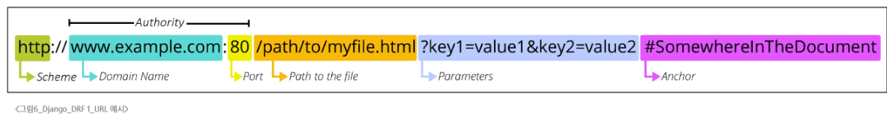
- Schema(or Protocol) **http**
  - 브라우저가 리소스를 요청하는데 사용해야 하는 규약
  - URL의 첫 부분은 브라우저가 어떤 규약을 사용하는지를 나타냄
  - 기본적으로 웹은 HTTP(S)를 요구
    - 메일을 열기 위한 mailto:, 파일을 전송하기 위한 ftp 등 다른 프로토콜도 존재
- Domain Name **www.example.com**
  - 요청 중인 웹 서버를 나타냄
  - 어떤 웹 서버가 요구되는지를 가리킴. ip주소를 사용하는것도 가능하지만 사람이 외우기 어려움으로 Domain Name을 주로 사용
- Port 80
  - 웹 서버의 리소스에 접근하는데 사용되는 기술적인 문(Gate)
  - HTTP 프로토콜의 표준 포트
    - HTTP:80
    - HTTPS: 443
    - 표준 포트는 생략해도 됨
- Path (path/to/myfile.html)
  - 웹 리소스의 경로
  - 초기에는 실제 파일 위치한 물리적 위치를 나타냈지만 요즘은 추상화함
- Parameters **?key1=value1&key2=value2**
  - 웹 서버에서 제공하는 추가 데이터
  - '&' 기호로 구분되는 key-value 쌍 목록
  - 서버는 리소스를 응답하기 전에 이러한 파라미터를 사용해 추가 작업을 수행할 수 있음
- Anchor **#SomewhereInTheDocument**
  - 일종의 북마크. 브라우저에 해당 지점에 있는 콘텐츠를 표시
  - #(fragment identifier, 부분 식별자) 이후 부분은 서버에 전송되지 않음
  - https:\\docs.djangoproject.com/en/4.2/intro/install/#quick-intall-guide 요청에서
    - #quick-install-guide는 서버에 전달되지 않고 브라우저에 해당 지점으로 이동하 수 있도록 함
## 1.4 자원의 행위
- HTTP Request Methods
  - 리소스에 대한 행뤼 수행하고자 하는 동작을 정의
- HTTP Request Methods 종류
  - GET
    - 서버에 리소스 표현을 요청
    - GET을 사용하는 요청은 데이터만 검색해야 함
  - POST
    - 데이터를 지정된 리소스에 제출
    - 서버의 상태를 변경
  - PUT
    - 요청한 주소의 리소스를 수정
  - DELETE
    - 지정한 리소스를 삭제
- HTTP response status codes
  - 특정 HTTP 요청이 성공적으로 완료되었는지 여부를 나타냄
    - 클라이언트가 서버에 요청을 보내면 서버는 요청이 성공했는지 실패했는지 숫자로 알려줌. 클라이언트는 이 코드를 보고 어떤 일이 일어났는지 판단 가능
- HTTP response status codes
  - Informational responses(100-199)
    - 요청을 계속 진행중이라는 중간 응답
  - Successful responses(200-299)
    - 요청이 정상적으로 처리되었음을 의미
  - Redirection messages(300-399)
    - 요청한 리소스가 다른 위치로 옮겨졌을때 사용
  - Client error responses(400-499)
    - 클라이언트 요청에 문제가 있을때 반환
  - Server error responses(500-599)
    - 서버 내부의 문제로 요청을 처리하지 못함
## 1.5 자원의 표현
- 그동안 서버가 응답했던 것
  - 지금까지 Django 서버는 페이지(html)만 응답하고 있었음
  - 하지만 서버가 응답할 수 있는 것은 페이지 뿐 아니라 다양한 데이터 타입 응답 가능
  - REST API는 이 중에서도 JSON 타입으로 응답하는 것을 권장
- 응답 데이터 타입의 ㅇ변화
  - 페이지(html)만을 응답하는 서버
    - 사용자가 웹 브라우저를 통해 요청하면 서버는 템플릿을 렌더링한 html을 반환
  - 이제는 json을 응답하는 REST API서버로 변환
    - 서버는 HTML 페이지를 만들지 않고 JSON 데이터만 응답하는 방식으로 동작
    - HTML 대신 JSON만 전달함으로 응답 용량이 줄고 처리 속도가 빨라짐
  - Django는 더 이상 Template 부분에 대한 역할을 담당하지 않음
  - Front-end 와 Back-end가 분리되어 구성됨
## 1.6 JSON 데이터 응답
- python으로 json 데이터 처리하기
  - 준비된 python-request-sample.py 확인
```python
import request
from pprint import pprint

response = requests.get('http://127.0.0.1:8000/api/v1/articles/')
# json을 python 타입을 ㅕ변환
result = response.json()
print(type(result))
pprint(result)
pprint(result[0])
pprint(result[0].get('title'))
# response 날리는 코드. 이후 실행하면 터미널에 데이터 찍힘
```
# 2. DRF with Single Model
## 2.1 Django REST Framework
- Django REST Framework
  - 장고에서 RESTful API 서버를 쉽게 구축할 수 있도록 도와주는 오픈소스 라이브러리
## 2.2 Serializer
- 직렬화
  - 여러 시스템에서 활용하기 위해 데이터 구조나 객체 상태를 재구성할 수 있는 포맷으로 변환하는 과정
  - 데이터 구조나 객체 상태를 나중에 재구성할 수 있는 포맷으로 변환하는 과정
  - 어디서든 읽고, 사용할 수 있게 만드는 공통 언어로의 번역
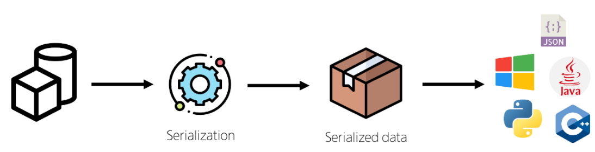
- Serializer 
  - Serialization을 진행하여 Serialized data를 반환해주는 클래스
- ModelSerializer
  - Django 모델과 연결된 Serializer 클래스
    - 일반 Serializer와 달리 사용자 입력 데이터를 받아 자동으로 모델 필드에 맞추어 Serialization을 진행
- ModelSerializer class 사용 예시
  - Article 모델을 토대로 직렬화를 수행하는 ArticleSerializer 정의
  - 게시글 데이터 목록 제공
```python
# articles/serializer.py
from rest_framework import serializers
from .models import Article

class ArticleSerializer(serializers.ModelSErializer):
  class Meta:
    model = Article
    fields = '__all__'
```
# 3. CRUD with ModelSerializer
- URL과 HTTP requests methods 설계
| | GET | POST | PUT | DELETE |
| ---- |  ---- |  ---- |  ---- | 
| articles/ | 전체 글 조회 | 글 작성 | 전체 글 수정 | 전체 글 삭제 |
| articles/1/ | 1번 글 조회 |. | 1번 글 수정 | 1번 글 삭제 | 
## 3.1 GET method 조회
- GET-List
  - 게시글 데이터 목록 조회하기
  - 게시글 데이터 목록을 제공하는 ArticleListSerializerr 정의
```python
# articles/serializers.py
from rest_framework import serializers
from .models import Article

class ArticleListSerializer(serializers.ModelSerializer):
  class Meta:
    model = Article
    fields = ('id', 'title', 'content',)
```
```python
# url 및 view 함수 작성
# articles/views.py
from rest_framework.response import Response
from rest_framework.decorators import api_view
from .models import Article
from .serializers import ArticleListSerializer

@api_view(['GET'])
def article_list(request):
  articles = Article.objects.all()
  serializer = ArticleListSerializer(articles, many=True)
  return Response(serializer.data)
```
```python
# articles/urls.py

urlpatterns = [
  path('articles/', views.article_list)
]
```
- ModelSerialuzer의 인자 및 속성
  - many 옵션
    - Serialize 대상이 QuerySet인 경우 입력
```python
serializer = ArticleListSerializer(articles, many=True)
```
  - many 옵션을 지정하지 않으면 단일 객체로 철
- data 속성
  - Serialized Data 객체에서 실제 데이터를 추출
```python
return Response(serializer.data)
```
- 과거 view 함수와 응답 데이터 비교
  - 똑같은 데이터를 과거 HTML에 출력되도록 페이지와 함게 응답했던 VIEW함수
```python
# 기존 CSR 코드
def index(request):
  articles = Article.objects.all()
  context = {
    'articles':articles,
  }
  return render(request, 'articles/index.html', context)
```
```python
@api_view(['GET'])
def article_list(request):
  articles = Article.objects.all()
  serializer = ArticleListSErializer(articles, many=True)
  return Response(serializer.data)
```
- 'api_view' decorator
  - DRF view 함수에서는 필수로 작성, view 함수를 실행하기 전 HTTP 메서드를 확인
  - 허용하도록 지시한 메서드에 대해서만 올바르게 답변하며 목록에 추가되지 않은 다른 메서드 요청에 대해선 405 Method Not Allowed로 응답
  - DRF view 함수가 응답해야 하는 HTTP 메서드 목록 작성
- GET-Detail
  - 단일 게시글 데이터 조회하기
```python
# articles/serializers.py
from rest_framework import serializers
from .models import Article

class ArticleSerializer(serializers.ModelSErializer):
  class Meta:
    model = Article
    fields = '__all__'
```
```python
# url 및 view 함수 작성
# articles/urls.py
urlpatterns = [
  path('articles/<int:article_pk>/', views.article_detail)
]
```
```python
# articles/articles.py
from .serializers import ArticleListSerializer, ARticleSerializer

@api_view(['GET'])
def article_detail(request, article_pk):
  article = Article.objects.get(pk=article_pk)
  serializer = ArticleSerializer(article)
  return Response(serializer,data)
```
## 3.1 POST method 생성
- 게시글 데이터 생성하기
  - 1. 데이터 생성이 성공했으면 201 Created 응답
  - 2. 데이터 생성 실패사 400 Bad Request 응답
```python
# articles/views.py
@api_view(['GET', 'POST'])
def article_list(request):
  if request.method == 'GET':
    articles = Article.objects.all()
    serializer = ArticleListSerializer(articles, many=True)
    return Response(serializer.data)
  
  elif request.method =="POST":
    serializer = ArticleSerializer(data=request.data)
    if serializer.is_vaild():
      serializer.save()
      return Response(serializer.data, status=status.HTTP_201_CREATED)
    return Response(serializer.errors, status=status.HTTP_400_BAD_REQUEST)
```
## 3.1 DELETE method 수정
- 게시글 데이터 삭제하기
  - 요청에 대한 데이터 삭제가 성공했다면 204 NO Content 응답
```python
# articles/views.py
@api_view(['GET', 'DELETE'])
def article_detail(request, article_pk):
  article = Article.objects.get(pk=article_pk)
  if request.method == "GET":
    serializer = ArticleSerializer(article)
    return Response(serializer.data)
  elif request.method == "POST":
    article.delete()
    return Response(status=status.HTTP_204_NO_CONTENT)
```
- DELETE 응답 시 Response 구성 방식
  - Response()는 기본적으로 data 인자를 필요로 하지 않음
  - 아무런 데이터도 넘기지 않을 경우 응답 상태 코드만으로 결과를 전달
    - 첫 번째 인자를 비운 상태로 두번째 인자에 값을 전달할 수 없음으로 키워드 인자형태로 값을 전달
- DELETE 응답 시 데이터를 반환하는 방법
  - 일반적으로 DELETE 요청은 204 No Content로 본문 없이 응답하는것이 RESTful 한 설계 방식
  - 하지만 특정 상황에서는 삭제된 객체정보를 함께 반환해야 할 수 있음
    - 클라이언트에서 삭제 대상 데이터를 확인하거나 ui에서 알림 메시지로 활용하는 경우
- DELETE 처리 후, 추가 응답 데이터 변환
  - 게시글 데이터를 삭제하고 삭제된 게시글 정보 반환하기
    - 추가적인 데이터를 제공함으료 200 OK 응답
  - 1. 반환할 데이터를 정의 
    - delete() 실행 시, 해당 객체는 데이터베이스에서 삭제됨
    - 그러므로 필요한 값은 삭제 전에 미리 변수로 지정해두고
    - 삭제 이후에는 변수만 사용하는 것이 더 안정적
  - 2. Response의 첫 번째 인자로 전달

```python
# articles/views.py
@api_view(['GET', 'DELETE'])
def article_detail(request, article_pk):
  article = Article.objects.get(pk=article_pk)
  ...
  elif requset.method == 'DELETE':
    pk = article.pk
    title = article.title
    article.delete()
    data = {
      'message': f'{pk}번 게시글 {title}을 삭제했읍니다'
    }
    return Response(data, status=status.HTTP_200_OK)
```
## 3.1 PUT method 수정
- 게시글 데이터 수정하기
  - 요청에 대한 데이터 수정이 성공했을 때 200OK 응답
```python
# articles/views.py

@api_view(['GET', 'DELETE', 'PUT'])
def article_detail(request, article_pk):
  ...
  elif request.method =="PUT":
    serializer =ArticleSerializer(article, data=request.data)
    if serializer.is_valid(raise_exception=True):
      serializer.save()
      return Response(serializer.data)
    return Response(serializer.error, status=status.HTTP_400_BAD_REQUEST)
```
- 'partial' argument
  - 부분 업데이트를 허용하기 위한 인자
  - partial 인자의 기본값은 False
  - partial 인자를 False로 설정하면 게시글의 title만 수정하려고 하더라도 content와 같은 다른 필수 필드들도 함께 전송해야 함
  - 이는 serializer가 기본적으로 모든 필수 필드에 대한 값이 전달되었는지 확인하기 때문
  - 따라서 일부 필드만 수정하고 싶다면 partial=True 로 설정해 일부 필드만 전달되도록 허용해야 함
- PATCH메서드 - 일부 필드만 수정하기
  - PATCH는 리소스의 전체가 아닌 일부만 수정할 때 사용하는 HTTP메서드
  - Django REST Framework에서는 partial=True 설정을 통해 부분 수정을 구현
    - 게시글의 title만 바꾸고 싶을 때 전체 필드를 다 보낼 필요 없이 해당 필드만 전송하면 됨
```python
# articles/views.py
@api_view(['GET', 'DELETE', 'PATCH'])
def article_detail(request, article_pk):
  ...
  elif request.method == "PATCH":
    serializer = ArticleSerializer(article, data=request.data, partial=True)
    if serializer.is_valid(raise_exception=True):
      serializer.save()
      return Response(serializer.data)
    return Response(serializer.errors, status=status.HTTP_400_BAD_REQEUST)
```
- PUT VS PATCH
| 항목 | PUT | PATCH |
| ---- | ---- | ---- |
| 수정 대상 | 전체 리소스 | 리소스의 일부 필드 |
| 요청 데이터 요구 | 모든 필수 필드 포함 | 수정할 필드만 포함 가능 |
| 사용 목적 | 전체 덮어쓰기(교체) | 부분 수정(일부 필드만 갱신) |
| DRF 설정 | 기본 (partial=False) | 반드시 partial=True 필요 |

# 4. 참고
## 4.1 raise_exception
- is_valid()의 선택 인자
- 유효성 검사를 통과 못하면 ValidationError 예외를 발생시킴
- DRF에서 제공하는 기본 예외 처리기에 의해 자동으로 처리. 기본적으로 HTTP 400 응답을 반환


# 1. DRF with N:1 Relation
- URL 및 HTTP request method 구성

| URL | GET | POST | PUT | DELETE |
| --- | --- | --- | --- | --- |
| comments/ | 단일 목록 조회 | | | |
| comments/1/ | 단일 댓글 조회 | | 단일 댓글 수정 | 단일 댓글 삭제 |
| articles/1/comments/ | 댓글 생성 | | | |
## 1.1 GET Method
- GET-List
  - 댓글 목록 조회를 위한 CommentSerializer 정의
```python
# articles/serializers.py
from .models import Article, Comment

class CommentSerializer(serializers.ModelSerializer):
  class Meta:
    model = Article
    fields = '__all__'
```
```python
# url 작성
# articles/urls.py
urlpatterns = [
  path('comments/', views.comment_list),
]
```
```python
# view 함수 작성
# articles/views.py
from .models import Article, Comment
from .serializers import ArticleListSerializer, ArticleSerializer, CommentSerializer

@api_view(['GET'])
def comment_list(request):
  comments = Comment.objects.all()
  serializer = CommentSerializer(comments, many=True)
  return Response(serializer.data)
```
- GET-Detail
  - 단일 댓글 조회를 위한 url 및 view 함수 작성
```python
# articles/urls.py
urlpattenrs = [
  path('comments/<int:comment_pk>/', views.comment_detail),
]
```
```python
# articles/views.py
@api_view(['GET'])
def comment_detail(request, comment_pk):
  comment = Comment.objects.get(pk=comment_pk)
  serializer = CommentSerializer(comment)
  return Response(serializer.data)
```
## 1.2 POST Method
- POST
  - 단일 댓글 생성을 위한 url 및 view 함수 작성
```python
# articles/urls.py
urlpatterns = [
  path('articles/<int:article_pk>/comments/', views.comment_create),
]
```
```python
# articles/views.py
@api_view(['POST'])
def comment_create(request, article_pk):
  article = Article.objects.get(pk=article_pk)
  serializer = CommentSerializer(data=request.data)
  if serializer.is_valid(raise_exception=True):
    serializer.save()
    return Response(serializer.data, status=status.HTTP_201_CREATED)
```
```python
# serializer 인스턴스의 save()메서드는 특정 Serializer 인스턴스를 저장하는 과정에서 추가 데이터를 받을 수 있음
# articles/views.py

@api_view(['POST'])
def comment_create(request, article_pk):
  article = Article.objects.get(pk=article_pk)
  serializer = CommentSerializer(data=request.pk)
  if serializer.is_valid():
    serializer.save(article=article) # 여기가 추가된 부분 시리얼라이즈 모델이 바라보는 모델의 아티클에 값을 넣어줄 수 있음 이걸로 1:N관계
    return Response(serializer.data, status=status.HTTP_201_CREATED)
```
- 이렇게 해 두고 실행하면? 400에러 발생
  - CommentSerializer 에서 외래키에 해당하는 article field또한 사용자로부터 입력 받도록 설정되어 있음. 때문에 서버에선 누락되었다고 판단
  - 유효성 검사 항목에서 제외할 필요가 있음. 어차피 이 호출할때 가져온 article 값으로 연결해야 함. 굳이 사용자에게 몇번 글에 댓글을 달아주세요! 값을 받을 필요가 없음
  - 따라서 유효성 검사 항목에서 article field 를 읽기 전용 필드로 수정
```python
# articles/serializers.py
class CommentSerializer(serializers.ModelSerializer):
  class Meta:
    model = Comment
    fields = '__all__'
    read_only_fields = ('article',)
```
## 1.3 읽기 전용 필드
- 서버가 조회 요처에 대한 응답시만 값을 표기하는 필드
  - read_only_fields 는 클라이언트가 입력해서 안되는 필드를 응답 전용 필드로 지정할 때 사용
  - view에서는 값을 직접 주입할 필드는 반드시 read_only_fields로 지정
- 읽기 전용 필드의 사용 목적
  - 클라이언트 측에서 직접 수정하면 안되는 경우
  - 서버 로직에 의해 자동 생성/관리되는 값 활용
  - 입력받지 않지만 정보를 추가 제공해야 하는 경우
  - 새로운 필드 값(추가 계산, 가공)을 만들어 제공해야 하는 경우

- 읽기 전용 필드 특징 및 주의사항
  - 유효성 검사 항목에서 제외됨
    - 읽기 전용 필드는 클라이언트가 보내는 요청 데이터에서 고려되지 않음.
    - 클라이언트가 해당 필드에 값을 넣어 보내도 무시함
  - 생성/수정 요청 모두에서 적용 가능
    - 읽기 전용 필드라 해서 생성(POST)단계에서만 무의미한건 아님
    - 수정(PUT) 요청에서도 해당 필드는 여전히 클라이언트 입력을 받지 않음. 응답 시에만 노출
## 1.4 DELETE & PUT method
- 단일 댓글 삭제 및 수정을 위한 view 함수 작성
```python
# articles/views.py
@api_view(['GET', 'PUT', 'DELETE'])
def comment_detail(request, comment_pk):
  comment = Comment.objects.get(pk=comment_pk)
  if request.method == "POST":
    serializer = CommentSerializer(comment)
    return Response(serializer.data)
  elif request.method == "PUT":
    serializer = CommentSerializer(comment, data=request.data)
    if serializer.is_valid(raise_exception=True):
      serializer.save()
      return Response(serializer.data)
  elif request.method == "DELETE":
    comment.delete()
    return Response(status=stauts.HTTP_204_NO_CONTENT)
```

## 1.5 응답 데이터 재구성
- 댓글 목록 조회 시 게시글 번호만 제공이 아닌 게시글의 제목까지 제공하기
  - Comment 모델은 Article을 참조하고 있음
    - Comment가 article과 N:1 관계를 맺고 있고, Django는 기본적으로 이 숫자(id)를 통해 숫자 값만 응답에 포함
```python
# articles/models.py
class Comment(models.Model):
  article = models.ForeginKey(Article, on_delete=models.CASCADE)
```
  - CommentSerializer는 Comment의 정보를 가지고 있음
    - comment모델이 Article을 참조하고 있어 그 정보를 id로 field에 제동할 수 있는 것
```python
# articles/serializers.py
class CommentSerializer(serializers.ModelSerializer):
  class Meta:
    model = Comment
```
  - Serialzer는 DRF에서 응답 구조를 결정하는 주체
    - serializer를 통해 어떤 필드를 포함할지 직접 지정하여 사용하고 있음
    - fields = ('id', 'title', 'content',)
    - 또 특정 필드를 어떤 형식으로 보여줄지도 지정하여 사용할 수 있음
    - article 필드가 id 가 아닌 게시글의 제목을 보여주도록 지정하는것도 가능
  - 하지만 CommentSerializer는 Comment의 정보만 가지고 있을 뿐 Article에 대한 정보는 없음
    - article의 정보를 포함하고 있고 그 중 title 정보를 반환하는 Serializer를 별도 정의 필요
  - ArticleTitleSerializer는 어디에 정의해야할까?
    - CommentSerializer에서만 사용할 용도라면 굳이 독립적으로 선언할 필요 없음
    - 코드 응집도를 높이고, 명확한 범위를 지정하기 위해 CommentSerializer 내부에 정의
  - CommentSerializer 안에 ArticleTitleSerializer 를 추가해 재정의
```python
# articles/serializers.py

class CommentSerializer(serializer.ModelSerializer):
  class ArticleTitleSerializer(serializer.ModelSerializer):
    class Meta:
      model = Article
      fields = ('title',)
  article = ArticleTitleSerializer(read_only=True)
  class Meta:
    model = Comment
    fields = '__all__'
```
## 1.6 읽기 전용 필드 주의사항
- 특정 필드를 재정의 혹은 추가한 경우 read_only_fields는 동작하지 않음
- 이런 경우에 새로운 필드에 read_only 키워드 인자로 작성해야 함

```python
# articles/serializers.py
class CommentSerializer(serializer.ModelSerializer):
  class ArticleTitleSerializer(serializer.ModelSerializer):
    class Meta:
      model = Article
      fields = ('title',)
  article = ArticleTitleSerializer(read_only=True)
  class Meta:
    model = Comment
    fields = '__all__'
    # read_only_fields = ('article',) 이게 안된다는거.
```
- read_only_fields 속성과 read_only 인자
  - read_only_fields
    - 기존 외래 키 필드 값을 그대로 응답 데이터에 제공하기 위해 지정하는 경우
  - read_only
    - 기존 외래 키 필드 값의 결과를 다른 값으로 덮어쓴는 경우
    - 새로운 응답 데이터 값을 제공하는 경우
# 2. 역참조 데이터 구성
- Article -> Comment 간 역참조 관계를 활용한 JSON 데이터 재구성
  - 1. 단일 게시글 조회 시 해당 게시글에 작성된 댓글 목록도 함께 붙여서 응답
  - 2. 단일 게시글 조회 시 해당 게시글에 작성된 **댓글수** 도 함께 붙여서 응답
## 2.1 단일 게시글 + 댓글 목록
- Nested relationships(역참조 매니저) 활용
  - 모델 관계 상으로 참조하는 대상(N)은 참조되는 대상(1)의 표현에도 포함되거나 중첩될 수 있음
  - Comment가 Article에 대한 정보를 article field를 사용하여 표현하였듯 Article은 자신을 참조하고 있는 comment들에 대한 정보를 역참조 매니저를 통해 표현하는것이 가능

```python
class ArticleSerializer(serializers.ModelSerializer):
  class CommentDetailSerializer(serializers.ModelSerializer):
    class Meta:
      model = Comment
      fields = ('id', 'content',)
  comment_set = CommentDetailSerializer(many=True, read_only=True)

  class Meta:
    model = Article
    fields = '__all__'
```
## 2.2 단일 게시글 + 댓글 개수
- 기본적으로 게시글(article)을 조회하면 참조중인 댓글 수는 알 수 없음
  - comment모델과의 관계는 Article.comment_set으로 연결되지만 댓글의 수를 저장하는 필드(Article)모델에서 별도 정의한 적 없기 때문
  - 따라서 직접 계산해서 응답에 포함시켜야 함
- View 로직 개선 annotate 사용
  - view에서 Article 객체를 조회할 때 annotate를 활용해 num_of_comments 필드를 추가
  - annotate는 Django ORM함수. SQL집계 함수를 활용해 쿼리 단계에서 데이터 가공 수행
- view에서 Article 객체를 조회할 때 annotate 활용해 num_of_comments 필드를 추가
```python
# articles/views.py
@api_view(['GET', 'DELETE', 'PUT'])
def article_detail(request, article_pk):
  article = Article.objects.annotate(num_of_comments=Count('comment)')).get(pk=article_pk)
```
- annotate 사용해 추가한 주석 필드를 serializer에 추가하려면?
  - fields = '__all__' 에선 annotate된 필드가 포함되지 않음
  - annotate는 실제 모델 필드를 만들지 않음. 임시 필드 추가 기능
- SerializerMethodField 를 사용해 해결
  - SerializerMethodField는 읽기 전용 필드를 커스터마이징 하는데 사용
  - 이 필드를 선언한 뒤 get_<필드명> 메서드를 정의하면 해당 메서드의 반환 값이 직렬화 결과에 포함됨
```python
# articles/serializers.py
class ArticleSerializer(serializers.ModelSerializer):
  num_of_comments = serializers.SerializerMethodField()
  class Meta:
    ...
  def get_num_of_comments(self, obj):
    # 여기서 obj는 Serializer가 처리하는 Article 인스턴스
    # view에서 annotate 한 필드를 그대로 사용 가능
    return obj.num_of_comments
```
- 이제 serializer.data 호출하면 get_num_of_comments 메서드를 실행해 num_of_comments 값이 자동으로 응답할 데이터 필드에 포함되어 제공됨
- 추가적으로 view에서 data를 딕셔너리로 변환하거나 수정할 필요 없이 serializer.data를 바로 반환해도 JSON응답에 num_of_comments 값이 반영됨
## 2.3 SerializerMethodField
- Serializer에서 추가적인 데이터 가공을 하고 싶을 때 사용
- 동작 원리
  - SerializerMethodField를 Serializer 클래스 내에서 필드로 선언하면 DRF는 get_<필드명>이라는 이름을 가진 메서드를 자동으로 찾음
  - 예를 들어 full_name = serializers.SerializerMethodField()라고 선언하면 DRF는 get_full_nam(self,obj)를 찾아 해당 값을 직렬화 결과에 넣어줌
  - obj는 현재 직렬화중인 모델 인스턴스이며 이 메서드에서 obj의 속성이나 annotate된 필드를 통해 새 값을 만들 수 있음.
- 주의사항
  - 읽기전용. 생성, 수정시에는 사용되지 않음
  - get_메서드는 반드시 (self, obj)형태로 정의. 
- SerializerMethodField 사용 목적
  - 유연성
    - 다양한 계산 로직을 쉽게 추가 가능
  - 가독성
    - 데이터 변환 과정을 Serializer 내부에 메서드로 명확히 분리
  - 유지보수성
    - view나 model에 비해 Serializer측 로직 변경이 용이
  - 일관성
    - view에서 별도로 data 수정 없이 직렬화되어 결과를 제어
## 2.4 역참조 데이터 구성 참고
- 만약 역참조 매니저명을 변경했다면 Serializer에서도 변경해야 함

# 3. API 문서화
## 3.1 OpenAPI Specification
- RESTful API를 설명하고 시각화하는 표준화 된 방법
  - API에 대한 세부사항을 기술할 수 있는 공식 표준
- 표준화된 방법
  - Swagger, Redoc
    - OAS기반 API에 대한 문서를 생성하는 데 도움을 주는 오픈소스 프레임워크
## 3.2 문서화 활용
- drf-spectacular 라이브러리
  - DRF를 위한 OpenAPI 3.0 구조 생성을 도와주는 라이브러리
  - 설치 및 등록
  - pip install drf-spectacular
- 관련 코드 설정(OpenAPI 구조 자동 생성 코드)
```python
# settings.py
REST_FRAMEWORK = {
  # YOUR SETTINGS
  'DEFAULT_SCHEMA_CLASS': 'drf_spectacular.openapi.AutoSchema',
}
```
- swagger, redoc 페이지 제공을 위한 url 작성
```python
# drf/urls.py
from drf_spectacular.views import SpectacularAPIView, SepctacularRedocView, SpectacularSwaggerView

urlpatterns = [
  path('api/schema/swagger-ui/',SpectacularSwaggerView.as_view(url_name='schema'), name='swagger-ui'),
  path('api/schema/redoc/', SepctacularRedocView.as_view(url_name='schema'), name='redoc'),
]
```
- 설계 우선 접근법
  - OAS의 핵심 이점
  - API를 먼저 설계하고 명세를 작성한 후 이를 기반으로 코드를 구현하는 방식
  - API의 일관성을 유지하고, API 사용자는 더 쉽게 API를 이해하고 사용할 수 있음
  - 또한 OAS를 사용하면 API가 어떻게 작동하는지를 시각적으로 보여주는 문서를 생성할 수 있으며 이는 API를 이해하고 테스트하는데 매우 유용
  - 이런 목적으로 사용되는 도구가 Swagger-UI 또는 ReDoc

# 4. 참고
## 4.1 올바르게 404 응답하기
- Django shortcuts functions
  - render(), redirect(), get_object_or_404(), get_list_or_404()
- get_object_or_404()
  - 모델 manager objects에서 get()을 호출하지만 해당 객체가 없을 땐 DoseNotExist예외 대신 http404를 raise함
  - 적용 예시
```python
# articles/views.py
# 기존 방식. 조회 대상이 없으면 500 에러(서버측 에러) 출력
article = Article.ojects.get(pk=article_pk)
comment = Comment.objects.get(comment_pk=comment_pk)

# get_object_or_404() 적용

from django.shortcuts import get_object_or_404

article = get_object_or_404(Article, pk=article_pk)
article = get_object_or_404(
  Article.objects.annotate(num_of_comment=Count('comment')),
  pk = article_pk
)
comment =get_object_or_404(Comment, pk=comment_pk)
```

- get_list_or_404()
  - 모델 manager objects에서 filter()의 결과를 반환하고 없으면 404
    - filter랑 get의 차이. filter는 QuerySet임(게으른 시행, 다수객체). get은 단일 인스턴스
```python
# 기존
article = Article.objects.all()
comment = Article.objects.all()
# 조회 목록 대상이 없어도 200 ok가 반환됨.

변경
from django.shortcuts import get_list_or_404

article = get_list_or_404()
comment = get_list_or_404()
```
- 이거 써야 하는 이유
  - get_object_or_404()사용하지 않는 경우
    - 결과가 없으면 서버에 오류가 발생해 요청 수행 불가(500)에러가 떠서 오해 발생
  - get_list_or_404() 사용하지 않는 경우
    - 조건에 맞는 데이터가 하나도 없는데 빈 리스트를 반환해서 요청이 올바르지 않은 건지, 진짜 값이 없는건지 알 수 없음
    - 404를 날리면 해당하는 데이터가 없다는 명확한 의도를 리턴 해 줄 수 있음
## 4.2 View와 Serializer의 역할
- view나 queryset 로직에는 비즈니스 로직(데이터 가공 annotate, 필터링) 을 처리
- serializer 는 그 결과물을 직렬화 하는 역할에 집중하는게 일반적인 권장사항
- 복잡한 query 나 로직은 view 함수에서 진행
  - 여러 모델을 조인하거나 복잡한 집계가 필요하면 view에서 처리
    - 필요한 경우 view에서 select_reated()나 perfetch_related()를 사용해 query를 최적화
## 4.3 DRF 학습 이유
- 이거 왜 배움?
  - 백엔드/프론트 분리 경험
    - 기존 Django는 서버사이드랜더링
    - 근데 요즘은 하이브리드임. 클라이언트 사이드 랜더링 경험도 필요
  - 표준화된 api 구축 역량 확보
    - dfr를 통해 restful 한 api를 만들어보고 관리하는걸 학습
    - 