# 1. 데이터 모델링의 이해
## 1.1 데이터 모델링의 이해
### 1.1.1 데이터 모델의 이해
- 모델링
  - 현실 세계의 정보를 약속된 표기법을 활용하여 데이터베이스의 구조로 표현하는 과정
  - 특징: 단순화, 추상화, 명확화
  - 유의사항: 유연성, 유일성, 일관성
  - 관점: 데이터 관점, 프로세스 관점, 데이터와 프로세스의 상관 관점(CRUD분석 기반)
- 데이터베이스의 모델링 단계
  - 개념 -> 논리 -> 물리
    - 개넘적 모델링: 현실 세계에 대한 인식을 추상적 개념으로 표현 ERD를 작성
    - 논리적 모델링: 논리적 자료구조로 변환하며 정규화를 활용, 재사용성이 높음
    - 물리적 모델링: 물리적 구조의 데이터로 변환
    - 물리적 모델링으로 갈 수록 높은 수준의 구치화(낮은 수준의 추상화)레벨을 가짐
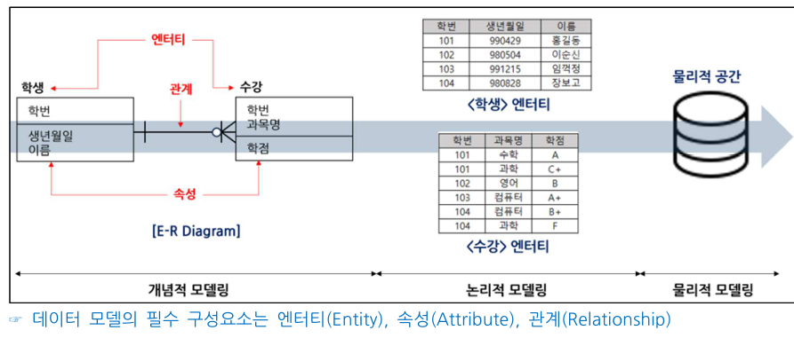

- ERD
  - 피터 첸에 의해 ER표기 기법이 고안(IE표기법, Baker 표기법 등)
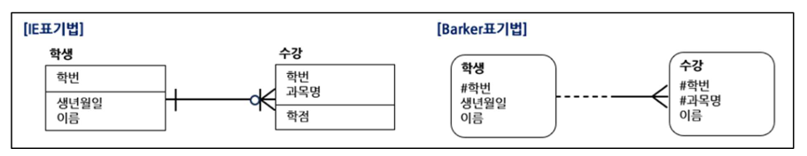
- ERD 작성 순서
  - 엔터티 도출 -> 배치 -> 관계 설정 -> 관계명 기술 -> 관계 차수 기술 -> 필수/선택사양 기술
- ANSI-SPARC 스키마 구조
  - 스키마의 3계층
    - 1. 외부스키마(서브스키마, 사용자 뷰)
      - 사용자 입장, 여러 개의 외부스키마 존재
    - 2. 개념스키마(전체적인 뷰)
      - 전체적인 논리 구조. DB관리자에 의해 구성
    - 3. 내부스키마(저장스키마)
      - 물리적 저장장치 입장에서의 구조
  - 독립성
    - 논리적 독립성
      - 개념 스키마 변경 시 외부 스키마 영향 없음
    - 물리적 독립성
      - 내부 스키마 변경 시 개념/외부 영향 없음
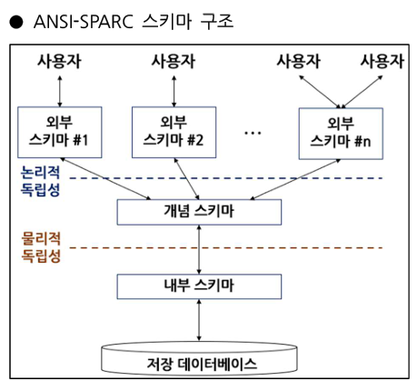
### 1.1.2 엔터티
- 현실 세계에 존재하며, 명확하게 구분 가능한 객체(학생, 과목, 수강/고객, 상품, 주문)
- 특징: 업무에서 필요 요구, 유일한 식별자를 보유, 인스턴스가 2개 이상인 집합, 2개 이상의 속성을 보유, 다른 엔터티와 관계 필수
- 명명법: 협업에서 사용하는 용여, 약어 사용 지양, 단수 명사, 중복 없음, 의미 명확
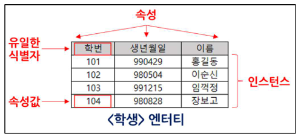
- 엔터티의 분류
  - 유무형에 따른 분류
    - 유형 엔터티: 물리적 형태가 없는 존재(학생, 책, 고객)
    - 개념 엔터티: 형태는 없지만 개념적으로 구분(과목, 학사, 부서)
    - 사건 엔터티: 특정 시점에 발생한 사건(수강, 주문, 예약)
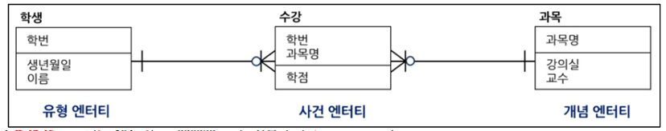
  - 발생 시점에 따른 분류
    - 기본 엔터티: 다른 엔터티에 영향을 받지 않고 독립적으로 존재(학생, 과목, 고객, 직원)
    - 중심 엔터티: 기본 엔터티와 행위 엔터티를 연결(수강신청, 주문)
    - 행위 엔터티: 두 개 이상의 엔터티를 상속받아 생성되는 행위(수강내역, 주문내역)
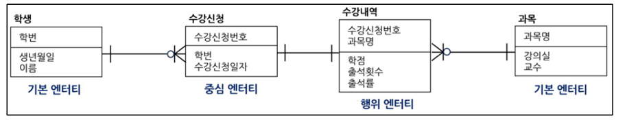
### 1.1.3 속성
- 더 이상 분리되지 않는 최소의 데이터 단위(원자성)
  - 특징: 엔터티는 속성의 집합, 1개의 속성은 1개의 속성 값, 주식별자에게 함수적 종속, 업무에서 관리되는 정보
    - 함수적 종속: A속성에 의해 B가 유일하게 결정됨(A -> B)
  - 명명법: 업무에 사용하는 명칭 사용, 서술식 표현 금지, 약어 사용 지양, 유일성(중복X)
- 속성의 분류
  - 1. 특성에 따른 분류
    - 기본 속성: 본래 가지고 있는 속성(이름, 학번, 고객ID)
    - 설계 속성: 필요로 인하여 도출된 속성(주문번호, 일련번호)
    - 파생 속성: 변형되어 만들어진 속성으로 계산된 값들이 해당(합계, 평균)
  - 2. 분해 가능 여부에 따른 분류
    - 단일 속성: 하나의 의미로 구성(이름, 학번)
    - 복합 속성: 여러 개의 하위 속성으로 나눌 수 있음(주소 -> 시/도, 도로명, 건물번호)
    - 다중값 속성: 여러 값을 가질 수 있으며, 별도 테이블로 분리 관리(전화번호, 이메일, 취미)
  - 3. 구성방식에 따른 분류
    - 기본키(PK, Primary Key): 인스턴스를 유일하게 구별 가능하게 하는 속성
    - 외래키(FK, Foreign Key): 다른 엔터티의 관계로 연결된 속성
    - 일반속성: 나머지
    - 자식 엔터티는 부모의 기본키를 외래키로 포함
- 도메인
  - 속성이 가질 수 있는 데이터타입과 크기에 대한 제안사항을 정의(데이터 무결성을 보장)
- 예시: 성별, 나이, 학번 등
### 1.1.4 관계
- 엔터티와 엔터티간의 논리적 연관성
  - 존재적 관계: 다른 엔터티가 존재해야만 존재할 수 있는 관계(사원, 부서)
  - 행위적 관계: 행동, 동작, 사건에 의해 발생하는 관계(학생-수강한다 -> 수강)
  - ERD에서는 존재적 관계와 행위적 관계를 구분하지 않으나 UML에서는 구분
- 관계의 구성
  - 관계명(Membership): 관계의 이름
  - 차수(Cardinality): 엔터티간의 참여자수를 표현(1:1, 1:N, N:M)
  - 선택사양(Optionality): 엔터티가 관계에 항상 참여하는지(O: 선택적 참여)
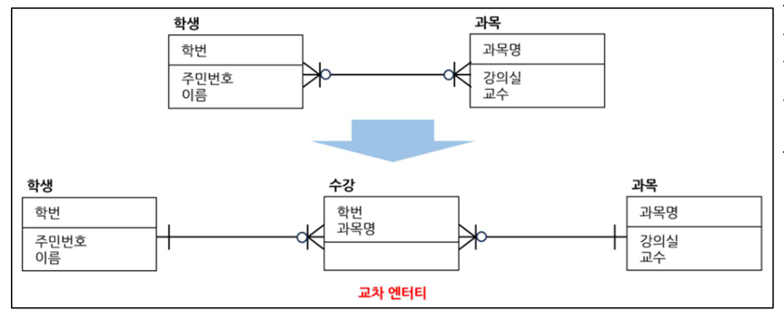
- 교차 엔터티
  - M:N의 관계를 표현하기 위해 생성된 엔터티(관계형 DB는 M:N 관계의 표현 불가)
### 1.1.5 식별자
- 인스턴스를 유일하게 구분할 수 있는 속성 또는 속성의 집합
- 식별자의 분류
  - 1. 대표성 여부에 따른 분류
    - 주식별자(기본키, PK): 대표성, 유일성, 최소성, 불변성, 존재성(NOT NULL)을 만족
    - 보조식별자(AK): 대표성을 가지지 못함
  - 2. 스스로 생성 여부에 따른 분류
    - 내부식별자: 엔터태 내부에서 스스로 생성
    - 외부식별자(FK): 다른 엔터티로부터 받아오는 식별자
  - 3. 속성의 수에 따른 분류
    - 단일식별자: 하나의 속성으로 구성된 식별자
    - 복합식별자: 둘 이상의 속성으로 구성된 식별자
  - 4. 대체 여부에 따른 분류
    - 본질식별자: 프로세스 상에서 현실로 존재하는 식별자
    - 인조식별자: 인위적으로 생성한 식별자
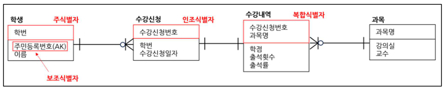

- 식별자 관계, 비식별자 관계
  - 1. 식별자 관계(강한 연결 관계)
    - 부모 엔터티로부터 받은 식별자를 자식 엔터티의 주식별자로 이용하며 Null 이 있으면 안됨
    - 부모 엔터티와 자식엔터티가 같은 생명주기를 가짐
  - 2. 비식별자 관계(약한 연결 관계)
    - 부모 엔터티로부터 받은 속성을 일반 속성으로 사용하는 경우
    - 부모 엔터티와 자식 엔터티가 서로 다른 생명주기를 가짐
    - 식별자는 부모와 자식간의 상호작용이 의무이나, 비식별자는 선택사항
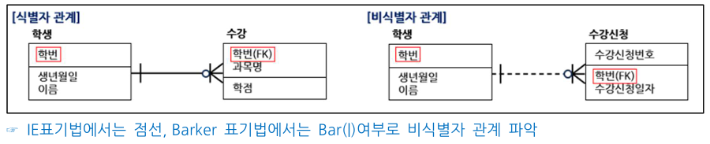
- 키
  - 후보키(Candidate Key): 유일성과 최소성을 만족하는 속성 또는 속성들의 조합
  - 기본키(Primary Key): 후보키 중에서 대표성을 가지는 주 키(Main Key), 개체무결성
  - 대체키(Alternate Key): 기본키를 제외한 나머지 후보키
  - 슈퍼키(Super Key): 유일성은 만족하지만 최소성은 만족시키지 못하는 키
  - 외래키(Foregin Key): 다른 테이블의 기본키를 참조하는 키, 참조무결성
  - 개체무결성: null 값이나 중복 값 저장 불가
  - 참조무결성: 참조할 수 없는 외래키 값을 가질 수 없음
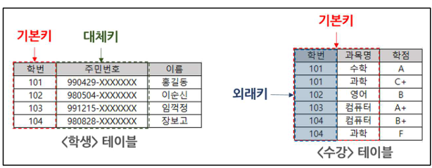

## 1.2 데이터 모델과 SQL
### 1.2.1 정규화
- 데이터베이스의 이상현상을 방지하기 위해 데이터 중복을 최소화하여 테이블을 분리하는 방법
  - 엔터티 = 테이블 = 릴레이션
- 이상현상(Anomaly)
  - 삽입이상: 데이터 삽입 시, 의도하지 않은 값들도 삽입되는 현상
  - 삭제이상: 데이터 삭제 시, 의도하지 않은 값들도 삭제되는 현상
  - 갱신이상: 일부 데이터만 갱신되어 모순이 발생하는 현상
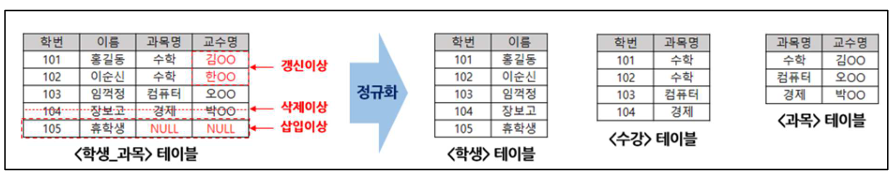
- 함수적 종속
  - A속성에 의해 B가 유일하게 결정됨(A->B)
    - A를 결정자, B를 종속자라 함
  - 완전 함수적 종속: 종속자가 기본키의 모든 속성에 종속적인 경우
  - 부분 함수적 종속: 종속자가 기본키의 일부 속성에 종속적인 경우
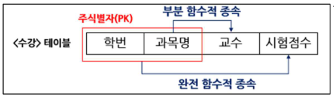
- 정규화 단계
  - 제 1 정규화 -> 2 -> 3 -> BCNF -> 4 -> 5
  - 1~3까지만 시험 자주 나옴
    - 제1정규화: 도메인이 원자값으로만 구성
    - 제2정규화: 부분적 함수 종속을 제거해 완전 함수 종속을 만족
    - 제3정규화: 이행 함수 종속 관계를 제거
    - BCNK: 결정자가 모두 후보키가 되도록 분해
    - 제4정규화: 다치 종속의 제거
    - 제5정규화: 조인 종속성을 이용
    - 두부이겨다줘 도부이결다조
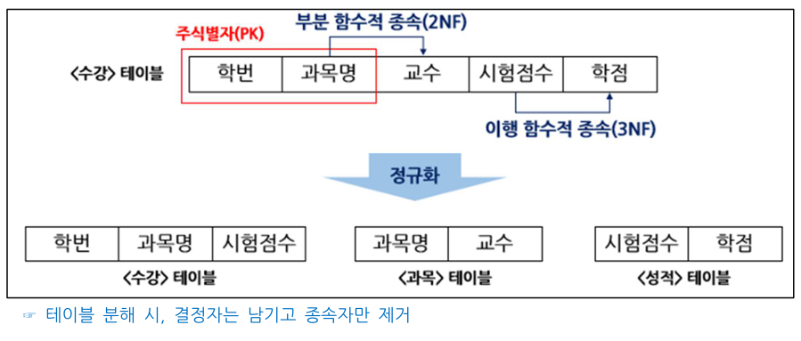
### 1.2.2 관계와 조인의 이해
- Join
  - 서로 관계가 있는 테이블을 sql로 연결해 데이터를 조회하는 방법
  - 정규화로 분해가 된 테이블은 조인 성능이 낮아질 수 있음(반정규화 수행)
- 계층형 데이터 모델
  - 같은 테이블을 참조하여 두 개의 테이블을 조인하는 관계, 계층형 질의 혹은 셀프 조인 활용
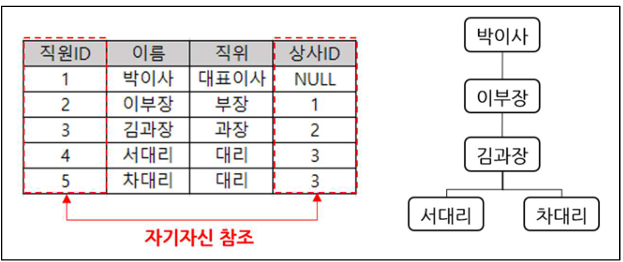
- 상호배타적 관계
  - 두 테이블 중 하나의 테이블만 상속될 수 있는 관계
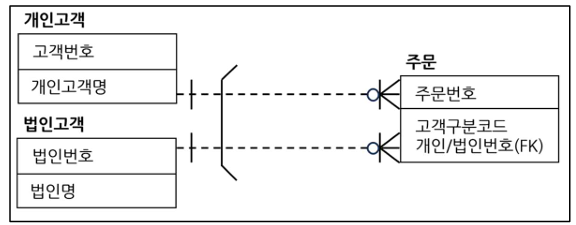
### 1.2.3 모델이 표현하는 트랜잭션의 이해
- 트랜잭션
  - 데이터베이스에서의 하나의 논리적인 작업단위
    - commit: 트랜잭션이 성공적으로 끝났음을 알리고 데이터베이스에 저장
    - Rollback: 트랜잭션 중 오류가 발생하여 이전 상태로 되돌림
- 트랜잭션의 4대 특성(ACID)
  - 1. 원자성(Atomicity): 수행되거나 전혀 수행되지 않아야 함(All or Nothing)
  - 2. 일관성(Consistency): 트랜잭션 실행 전후로 오류가 없어야 함
  - 3. 고립성(Isolation): 트랜잭션끼리 서로 간섭하면 안됨
  - 4. 지속성(Durablitiy): 수행된 결과는 영구저장
- 트랜잭션의 격리 수준에 따른 문제점
  - Dirty Read: 아직 실행이 완료되지 않은 데이터를 읽는 경우
  - Non-Repeatable Read: 같은 쿼리를 두 번 수행했을 때 결과가 달라지는 현상
  - Phantom Read: 같은 쿼리를 두 번 수행했을 때, 행의 개수가 바뀌는 현상
- Null 속성의 이해
  
  - 
### 1.2.4 Null 속성의 이해
- Null의 개념
  - 미 정의된 값, 0이나 빈칸과는 다른 개념(비교, 연산 불가. 집계함수에서 제외)
### 1.2.5 본질식별자 vs 인조식별자
- 본질식별자: 프로세스상 현실로 존재하는 식별자
- 인조식별자: 인위적으로 생성한 식별자
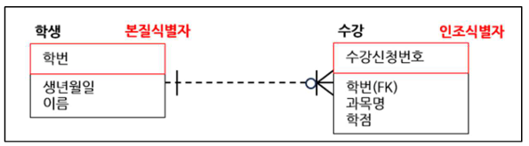
- 인조식별자의 장단점
  - 장점: 추가적 연산 없이 실제 비즈니스와 무관하계 설계 가능. 개발 및 유지보수 용의
  - 단점: 불필요한 인덱스, 데이터 중복 가능성

# 2. SQL 기본 및 활용
## 2.1 SQL 기본
### 2.1.1 관계형 데이터베이스의 개요
- DBMS(DataBase Management System)
  - DBMS: 데이터베이스를 관리 및 접근하기 위한 환경을 제공하는 시스템
  - RDBMS: Relational DBMS, 관계형 DBMS
    - 데이터를 테이블 형태로 저장하고 테이블간 관계를 활용하여 관리하는 데이터베이스
    - IBM, 1970, 에드가 F.커드가 처음 제안
    - Oracle, SQL Server, MySQL, PostgreSQL
- SQL(Structured Query Language)
  - RDBMS에서 데이터를 생성, 조회, 수정, 삭제하기 위한 표준 언어
  - 데이터 정의어(DDL): 테이블 생성, 변경, 삭제
    - CREATE, ALTER, DROP, RENAME, TRUNCATE
  - 데이터 조작어(DML): 데이터 조회, 삽입, 수정, 삭제
    - SELECT, INSERT, UPDATE, DELETE
    - SELECT를 데이터 조회어(DQL)로 구분하기도 함
  - 데이터 제어어(DCL): 권한 관리
    - GRANT, REVOKE
  - 트랜잭션 제어어(TCL): 트랜잭션을 제어
    - COMMIT, ROLLBACK, SAVEPOINT
### 2.1.2 SELECT 문
- 데이터베이스에서 데이터를 조회할 때 사용하는 가장 기본적인 명령어
  - SELECT, FROM, WHERE, GROUP BY, HAVING, ORDER BY
### 2.1.3 함수
- 입력(INPUT)에 대한 특정 연산을 수행 후, 결과를 반환하는걸 약속된 코드 블록
  - 단일행 함수: Input 1-> Output 1
  - 다중행 함수: input N -> Output 1
- 문자함수
| 함수형 | 설명 | 사례 |
| ---- | ---- | ---- |
| LOWER(문자형) | 문자형을 소문자로 변환 | LOWER('David') = 'david' |
| UPPER(문자형) | 문자형을 대문자로 변환 | UPPER('david') = 'DAVID' |
| SUBSTR(문자형, 시작위치, 문자열 길이) | 시작 위치에서 문자열의 길이만큼 반환 | SUBSTR('Hi David', 1, 2) = 'Hi' |
| TRIM(문자형, 삭제문자열) | 왼쪽과 오른쪽의 공백 또는 지정문자 제거 | TRIM(' Hello World ') = 'Hello World' | 

- 숫자함수
| 함수형 | 설명 | 사례 |
| ---- | ---- | ---- |
| ROUND(숫자, 자릿수) | 자릿수 아래에서 반올림 | ROUND(15.58, 1 =) = 15.6 |
| TRUNC(숫자, 자릿수) | 자릿수 아래를 버림 | TRUNC(15.58, 1) = 15.5 |
| FLOOR(숫자) | 작거나 같은 최대 정수 | FLOOR(3.58) = 3 |
| CEIL(숫자) | 크거나 같은 최소 정수 | CEIL(3.58) = 4 |
- 변환함수
| 함수형 | 설명 | 사례 |
| ---- | ---- | ---- |
| TO_NUMBER(문자형) | 문자형을 숫자로 변환 | TO_NUMBER('2025') = 2025 |
| TO_CHAR(숫자/날짜형, 형식) | 형식에 맞는 문자형으로 | TO_CHAR(1234.12, '9999.99') = '1,234.12' |
| TO_DATE(문자형, 형식) | 문자형을 날짜로 변환 | TO_DATE('2025-03-05', 'YYYY-MM-DD') = 2025-03-05 |

### 2.1.4 WHERE 절
### 2.1.5 GROUP BY, HAVING 절
### 2.1.6 ORDER BY 절
### 2.1.7 조인
### 2.1.8 표준 조인

## 2.2 SQL 활용
### 2.2.1 서브쿼리
### 2.2.2 집합 연산자
### 2.2.3 그룹 함수
### 2.2.4 윈도우 함수
### 2.2.5 TOP N 쿼리
### 2.2.6 계층형 질의와 셀프 조인
### 2.2.7 PIVOT 절과 UNPIVOT 절
### 2.2.8 정규 표현식

## 2.3 관리 구문
### 2.3.1 DML
### 2.3.2 TCL
### 2.3.3 DDL
### 2.3.4 DCL