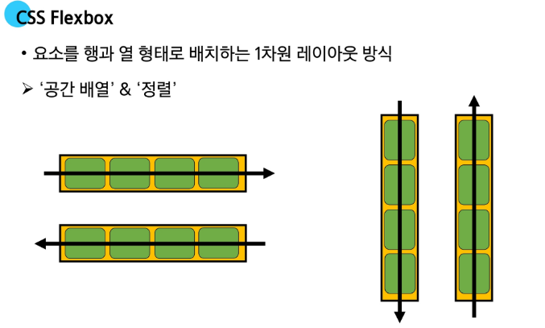
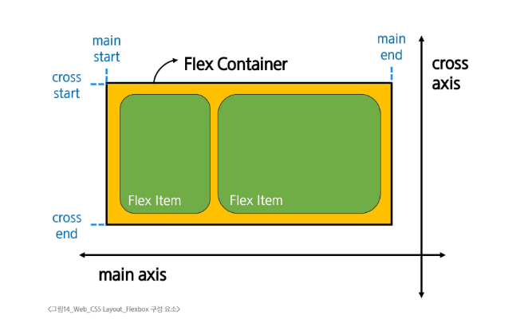

# 0. 웹 구조화
- WWW World Wide Web
- Web: site, application 등을 통해 사용자들이 정보를 검색하고 상호작용하는 기술
- Web Site: 인터넷에서 여러 개의 Web Page가 모인 것으로 사용자들에게 정보나 서비스를 제공함
## 0.1 Web의 구성 요소
- Structure -> HTML
- Styling -> CSS
- Behavior -> Javascript

# 1. HTML
- HyperText Markup Language
  - 웹 페이지의 의미와 구조를 정의하는 언어
## 1.1 HTML의 구조
```html
<!DOCTYPE html>
<html lang="en"> <!-- 언어설정. 다만 랜더링 할때 참고하는 건 아님.
     검색엔진 등에서 이걸로 필터링 거는 거-->
<head> <!-- head 부분에 페이지 제목이나 기본 설정 등을 담당함. -->
    <meta charset="UTF-8"> <!-- 인코딩 언어. 이거 보고 브라우저가 랜더링-->
    <meta name="viewport" content="width=device-width, initial-scale=1.0">
    <title>Document</title>
</head>
<body>
    <p>Lego</p>
    <!-- 하이퍼링크 태그. href 가 기본 변수임. -->
    <a href="https:\\edu.ssafy.com">Test</a>
    <!-- src가 로컬 이미지를 바라볼수도, 링크 형태로 첨부할지 선택 가능
     alt는 이미지 깨졌을 때 대체할 텍스트를 출력해주는거.
     접근성에서 시각장애인 모드 켜면 읽어주는 내용이 alt -->
    
    
</body>
</html>
```
- HTML element(요소)
  - 하나의 요소는 **여는 태그와 닫는 태그**, 그 안의 **내용**으로 구성
  - 닫는 태그는 태그 이름 앞에 슬래시가 포함
```HTML
<p>My cat is very grumpy</p>

```
- HTML Attributes(속성)
  - 사용자가 원하는 기준에 맞도록 요소를 설정하거나 다양한 방식으로 요소의 동작을 조절하기 위한 값
  - 목적
    - 나타내고 싶지 않지만, 추가적인 기능, 내용을 담고 싶을때 사용
    - css에서 스타일 적용을 위해 해당 요소를 선택하기 위한 값으로 활용
  - 작성 규칙
    - 1. 속성은 요소 이름과 속성 사이에 공백이 있어야 함
    - 2. 하나 이상의 속성들이 있는 경우엔 속성 사이에 공백으로 구분함
    - 3. 속상 값은 열고 닫는 따옴표로 감싸야 함.
```HTML
<p class="editor-note">cat is very grumpy</p>
```
## 1.2 Text Structure


# 2. CSS
## 2.1 CSS를 HTML에 적용하는 방법
- HTML 요소 안에 style 속성 값으로 작성
```HTML
<h1 style="color: blue; background-color: yello;">HELLO WORLD<h1>
```
- internel 스타일 시트
- head 태그 안에 style 태그에 작성
```HTML
<head>
<style>
h1 {
    color: red;
    background-color: green;
}
</style>
</head>
```
- 외부 EXTERNAL 스타일 시트
  - 별도 CSS 파일 생성 후 HTML LINK 태그를 사용해 불러오기
  - 스타일 적용 순서는 인라인 > 내부 > 외부 순. 
  - 인라인 스타일은 유지보수 어려워서 잘 안씀 테스트 할 때나 사용.
```HTML
<head>
    <link rel="styleshee", href="style.css"> 
</head>
```
## 2.2 CSS 구문
- 선택자(Selector)
  - 누구를 꾸밀 지 지정하는 부분
- 선언(Declaration)
  - 어떻게 꾸밀지에 대한 한 줄의 명령
  - 속성과 값이 한 쌍으로 이루어지며 세미콜론으로 끝남.
- 속성(Property)
  - 바꾸고 싶은 스타일의 종류를 나타냄
- 값(Value)
  - 속성에 적용할 구체적은 설정을 나타냄.
```HTML
h1 { <!-- h1이 선택자 Selector-->
    color: red; <!-- 이 줄이 선언 Declaration-->
    font-size: 30px;
    <!-- font-size 가 Property, 30px가 Value-->
}
```
## 2.3 CSS Selectors
- HTML 요소를 선택하여 스타일을 적용할 수 있도록 하는 선택자. 위 스크립트에서 h1
- CSS Selectos 종류
  - 기본 선택자
    - 전체 * 선택자
    - 요소 tag 선택자
    - 클래스 class 선택자
    - 아이디 id 선택자
    - 속성 attr 선택자
  - 결합자(Combinattors)
    - 자손 결합자 " " (Space)
    - 자식 결합자 >
```HTML
* { <!-- 전체 선택자 -->
    color: Blue;
}

h1 { <!-- 요소 선택자 -->
    color: orange;
}

```

## 2.4 명시도 Specificity
- 결과적으로 요소에 적용할 css 선언을 결정하기 위한 알고리즘
  - css selector 에 가중치를 계산하여 어떤 스타일을 적용할 지 결정
  - 동일한 요소를 가리키는 2개 이상의 css 규칙이 있을 경우, 가장 높은 명시도를 가진 selector를 선택
- css Cascading Style Sheet
  - 계단식, 가중치가 없다면 마지막에 선언된 것을 가지고 랜더링함.
  - 근데 실제로 가중치가 없다(동일하게 충돌나는건 없음)
```HTML
h1 {
    color:red;
}
h1 {
    color: green;
}
<!-- 여기선 명시도로 싸우는거 아님. 그냥 아랫꺼가 이겨서 초록색 출력 -->
<!-- 문제 2 -->
 .make-red {
    color : red;
 }
 h1 {
    color: red;
 }
 <!-- 명시도 싸움이라 class 로 선언된 .make-red가 이김.-->
```
- 명시도 순서
  - 1. Importance (나중에 배움)
    - !important
  - 2. inline 스타일
  - 3. 선택자
    - id 선택자 > 클래스 선택자 > 요소 선택자
  - 4. 소스 코드 선언 순서
근데 실제로 섞어서 코딩하면 큰일남
- !important 는 명시도를 박살내는 키워드인지라 안쓰는걸 권장
- 대부분은 class로 사용. id도 잘 안쓸꺼. 
  - 재사용성이 높고, 일관성이 좋음
  - 명시도 생각을 안하는게 좋음.
  - 대부분의 기본적인 스타일 가이드는 class를 쓰고, id를 섞어서 일부 사용함. 
## 2.5 CSS 상속
- 상속은 기본적으로 재사용성을 높임.
- 상속 되는 속성
  - TEXT 관련 요소 font, color, text-align, opacity, visibility 등
- 불가능한 속성
  - Box model 관련 속성 
  - position 관련 요소

## 2.6 CSS Box model
- CSS는 웹 페이지의 모든 요소를 감싸는 사각형 상자 모델
- 요소의 크기, 배치, 간격을 결정하는 규칙. 
- 모든 페이지는 결국 네모난 영역을 통해서 구성하게 됨. 원이 있다? 네모 깎아서 만든거
### Box 의 구성 요소
    margin -> border -> padding -> content
    여백 테두리 안쪽 여백 내용으로 구성

# 3. CSS BOX MODEL
## 3.1 display 속성(박스의 화면 배치 방식)
- 박스 타입
  - 박스 타입에 따라 페이지에서의 배치 흐름 및 다른 박스와 관련하여 동작하는 방식이 달라짐.
- 박스 타입의 종류
  - Block 타입
  - Inline 타입
- Block 타입
  - 블록 타입은 하나의 독립된 덩어리처럼 동작하는 요소
  - 항상 새로운 행으로 나뉨(한 줄 전체를 차지. 100%)
  - width, height, margin, padding 속성을 모두 사용 가능
  - width 속성을 지정하지 않으면 박스는 inline 방향으로 사용 가능한 공간을 모두 차지함
    - 상위 컨테이너 너비 100%로 차우는 것.
  - 대표적인 block 타입 태그
    - h1~6, p, div, ul, li
- block 타입의 대표 div
  - 다른 html요소들을 그룹하왕뎌 레이아웃을 구성하거나 스타일링을 적용할 수 있음
  - 헤더 푸터 사이드바 등 웹 페이지의 다양한 섹션을 구조화하는데 가장 많이 쓰이는 요소
```html
.index {
  disply: block;
}
<div class="container">
  <h1>제목<h1>
  <p>단락 내용입니다.</p>
</div>
<div>
  <p>콘턴츠</p>
</div>
```
- inline타입
  - 문장 안에 단어처럼 흐름에 따라 자연스럽게 배치되는 요소
  - 줄 바꿈이 일어나지 않음 (콘텐츠 크기만큼만 영역을 차지)
  - width와 height 속성을 사용할 수 없음.
  - 수직 방향(상하)
    - padding, margin, border가 적용되지만 다른 요소들을 밀어 낼 수 없음.
  - 수평 방향(좌우)
    - padding, margin, border 가 적용되어 다른 요소들을 밀어낼 수 있음.
  - 대표적인 inline 타입 태그
    - a, img, span, strong
- inline 타입의 대표 span
  - 자체적으로 시각적 변화 없음
    - 스타일을 적용하기 전 까지는 특별한 변화 없음
  - 텍스트 일부 조작
    - 문장 내 특정 단어나 구문에만 스타일을 적용할 때 유용
  - 블록 요소처럼 줄 바꿈을 일으키지 않음으로 문서의 구조에 큰 변화를 주지 않음.

box랑 inline 정리하면, box에서 div는 블럭 단위로 잡아서 컨트롤 하는거고
라인 단위로 잡으려면 span 으로 처리 한다. 

```html
.index {
  display:inline;
}
<p>이 문장에서 <span style="color: blue;"> 파란색</span> 단어만 색상이 다릅니다.</p>
<p> 이 단어는 <span class=highlignt-text">강조</span> 되었습니다.</p>
<p>이것은 <span id="changeText">클릭</span>하면 변경됩니다.</p>
```
## 3.2 Normal flow
- 일반적인 흐름 또는 레이아웃을 변경하지 않은 경우 웹 페이지 요소가 배치되는 방식
  - word 문서를 예시로 들면, 엔터를 눌러 문단을 나누는 것이 block 요소의 배치 방식
  - 엔터를 누르지 않고 계속 타이핑 하는 것이 inline 요소의 배치 방식  
  - 

## 3.3 기타 display 속성
- inline-block
  - inline 과 block 의 특징을 모두 가진 특별한 display 속성값
  - width 와 height 속성 모두 사용 가능
  - padding, margin 및 border로 인해 다른 요소가 상자에서 밀려남
  - 주로 가로로 정렬된 네브바나 여러개의 버튼, 이미지 갤러리처럼 수평으로 나열하면서 각 항목의 크기를 직접 제어하고 싶을 때 매우 유용하게 사용
직접 사용은 .box{} 처럼 style 에서 블록 단위로 묶은 상태에서, display 속성에다 inline-block 인자를 던지면 해당 블록에 묶인 요소들을 line 취급하게 해줌.
- none
  - 요소를 화면에 표시하지 않고, 공간에도 부여 안함
  - 후보 요소. display 속성에서 none을 주면 안보임. 나중에 동적웹 개발이나 js에서 동작시켜서 표시하면 됨,
- flex는 나중에
# 4. CSS position
- CSS Layout
  - 각 요소들의 위치와 크기를 조정하여 웹 페이지의 디자인을 결정하는 것
  - 요소들을 상하좌우로 정렬하고, 간격을 맞추고, 전체적은 페이지의 뼈대를 구성
  - 핵심 속성: display(block, inline, flex, grid)
- CSS Position
  - 요소를 다른 Normal Flow 에서 제거해 **다른 위치**로 배치하는 것
  - 다른 요소 위에 올리기, 화면의 특정 위치에 고정하기 등
  - 핵심 속성: position(static, relative, absolute, flxed, sticky)
- Position 이동 방향
  - 네 가지 방향 속성(상하좌우) 를 이용해 요소의 위치를 조정할 수 있음.
  - 겹치는 요소의 쌓이는 순서를 조절할 수 있음.
  - z축이 있음. 레이어 단위로 겹쳐서 표현하는게 가능함. 
## 4.1 position 유형
- Position의 유형
  - static
    - 요소를 Normal Flow 에 따라 배치
    - top, right, bottom, left 속성이 적용되지 않음
    - 따로 포지션 안넣으면 기본이 이거
    - 따라서 div로 묶인 요소들 중에서
```html
.static {
  position: static;
  background-color: lightcoral;
}

```
  - relative
    - 요소를 normal flow 에 따라 배치
    - 자신의 원래 위치를 기준으로 이동(static위치)
    - top, right, bottom, left 속성으로 위치를 조정
    - 다른 요소의 레이아웃에 영향을 주지 않음(요소가 차지하는 공간은 static일때와 같음)
```html
.relative {
  position: relaticve
}

```
  - absolute
    - 절대위치
    - 요소를 Normal Flow에서 제거해 별도로 관리
    - 가장 가까운 relative 부모 요소를 기준으로 이동
      - 만족하는 부모 요소가 없으면 body 태그 기준으로 이동
      - 왜 이게 필요하냐? 절대위치라며
        - 부모도 다른 곳으로 이동할 수 있기 때문.
        - 부모에 종속된 자식의 위치를 절대위치로 조정해서 따라다니게 할 수 있음. 
        - 네이버에서 카드섹션 이미지 위에 유료 태그 같은것들은 여기 쓸 수 있음.
        - 이런식으로 써 먹으려는 관점. 
    - top, right, bottom, left 속성으로 위치를 조정
    - 문서에서 요소가 차지하는 공간이 없어짐. 앱솔루트를 넣으면 얘가 따로 레이어로 분리되어 돌아다님. 
  - fixed
    - 요소를 Normal Flow에서 제거
    - 현재 화면영역(viewpoint) 을 기준으로 이동
    - 스크롤해도 항상 화면 같은 위치
    - top, botton, 등으로 위치를 조정
    - 문서에서 요소가 차지하는 공간이 없어짐.
  - sticky
    - relative와 fixed 특징을 합친 속성
    - 스크롤 위치가 임계점에 도달하기 전에는 relative처럼 동작
    - 스크롤 위치가 임계점에 도달하면 fixed 처럼 동작
    - 다음 sticky 요소가 나오면 이전 sticy 요소 자리를 대체
## 4.2 z-index
- 요소의 쌓인 순서를 정의하는 속성
  - 정수값을 사용하고, 정수 값이 크면 위로 감. 
  - 스태틱은 적용 안됨.
  - 기본 값은 Auto
  - 부모의 z-idx를 같이 올라가게 됨.
  - 같은 부모 내에서면 z-idx를 비교하고, 값이 같으면 html 문서 순서대로 쌓임
  - 부모의 z-idx 가 낮으면 자식의 z-idx 가 아무리 높아도 부모보다 위로 올라갈 수 없음. 

# 5. CSS Flexbox
- 박스 표시(Display)타입
- 1. Outer display 타입
  - block 타입
  - inline 타입
- 2. inner display 타입
  - 박스 내부의 요소들이 어떻게 배치될지를 결정
  - CSS Flexbox(속성:flex)
- CSS Flexbox 
  - 요소를 행과 열 형태로 배치하는 1차원 레이아웃 방식
  - 박스들을 한 단위로 묶고, 해당 박스들이 어떻게 정렬될지 규칙을 결정해서 박스들을 배치
  - 행과 열 단위 정렬

## 5.1 Flexbox 구성 요소
- main axis
  - 가로축, 왼쪽 -> 오른쪽
- cross axis
  - 세로축, 위 -> 아래
- flex container(얘가 부모)
  - 태그달 대상
- flex item
  - 움직일 대상

## 5.2 Flexbox 속성
- Flex container 관련 속성
  - display
  - flex-direction
  - flex-wrap
  - justifi-content
  - align-items
  - align-content
- Flex item 속성
  - align-self
  - flex-grow
  - flex-basis
  - order
## 5.3 Flex-wrap 응용